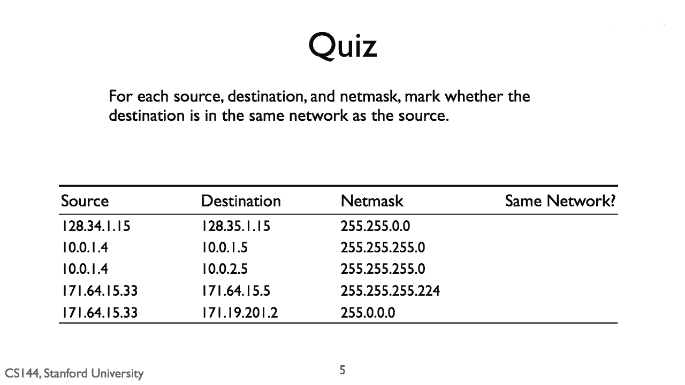

# 课程 P14：IPv4 地址详解 🧩

在本节课中，我们将学习 IPv4 地址的核心概念，包括其结构、子网掩码的作用以及如何通过简单的计算来确定网络地址和主机地址。我们将通过一个具体的测验示例来巩固这些知识。

---

## 概述

IPv4 地址是互联网中设备通信的基础标识。理解其构成和子网划分原理，对于网络配置和故障排查至关重要。本节我们将解析一个具体的地址与掩码组合，并计算出其网络地址。

## IPv4 地址结构

一个 IPv4 地址由 32 位二进制数组成，通常以点分十进制表示，例如 `192.168.1.1`。它主要包含两部分：
*   **网络部分**：标识设备所属的网络。
*   **主机部分**：标识网络中的特定设备。

区分这两部分的关键是**子网掩码**。

## 子网掩码的作用

子网掩码同样是一个 32 位的数字，其作用是“掩盖”掉 IP 地址中的主机部分，从而显露出网络地址。掩码中连续的“1”对应 IP 地址的网络位，“0”对应主机位。

计算网络地址的公式是：
**网络地址 = IP地址 AND 子网掩码**

以下是理解该计算的关键步骤列表：

1.  **将地址转换为二进制**：首先把 IP 地址和子网掩码都转换成二进制形式。
2.  **执行按位与（AND）运算**：对每一位进行逻辑与操作（1 AND 1 = 1， 其他情况均为 0）。
3.  **转换回十进制**：将得到的二进制结果转换回点分十进制格式，即为网络地址。

## 测验示例解析

现在，我们来看一个具体的测验。题目给出了源/目的 IP 地址和子网掩码，要求我们进行标记或计算。

这张图展示了一个测验的初始界面，其中包含了需要分析的 IP 地址和子网掩码。

这张图很可能展示了测验的后续步骤或答案，例如通过上述“按位与”运算，得出了该 IP 地址对应的具体网络地址。

---

## 总结

本节课中，我们一起学习了 IPv4 地址的基本结构，明确了网络部分与主机部分的区别。我们掌握了子网掩码的核心作用——用于计算网络地址，并熟悉了“**IP地址 AND 子网掩码**”这一关键公式及其计算步骤。通过实际的测验示例，我们巩固了如何将理论应用于实践，从而确定任何给定 IP 地址所在的网络。