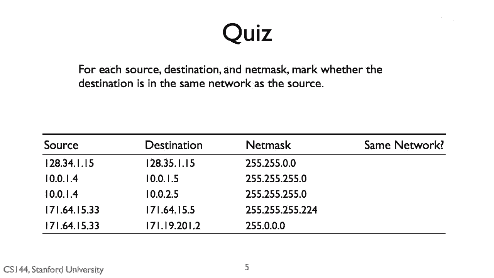
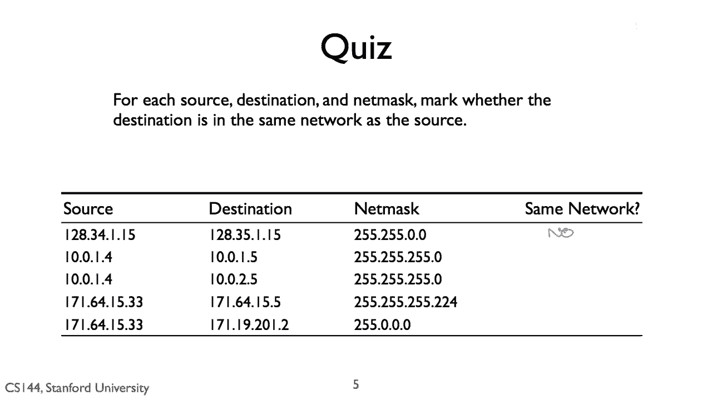
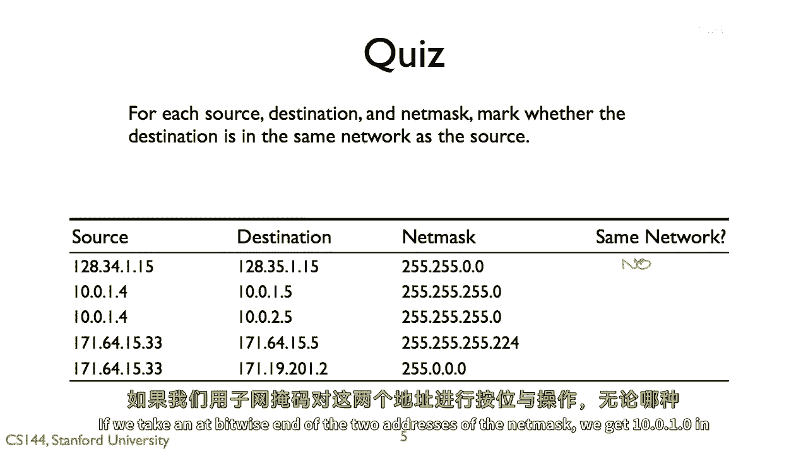
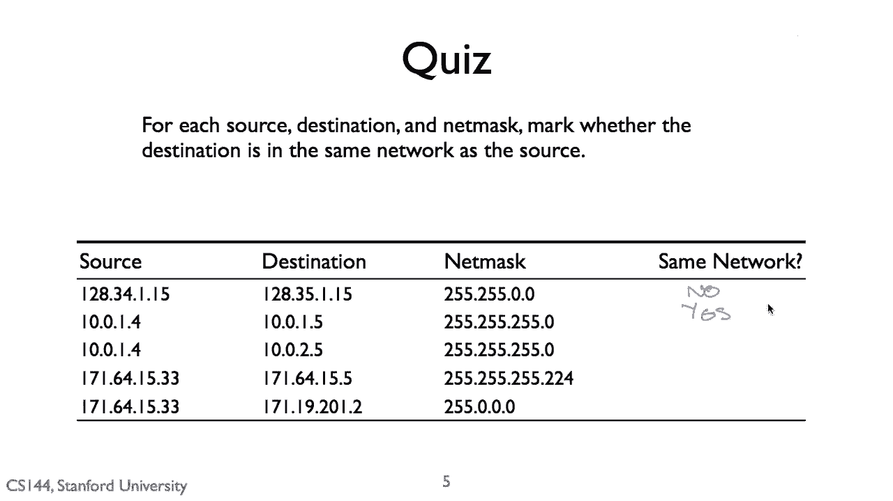
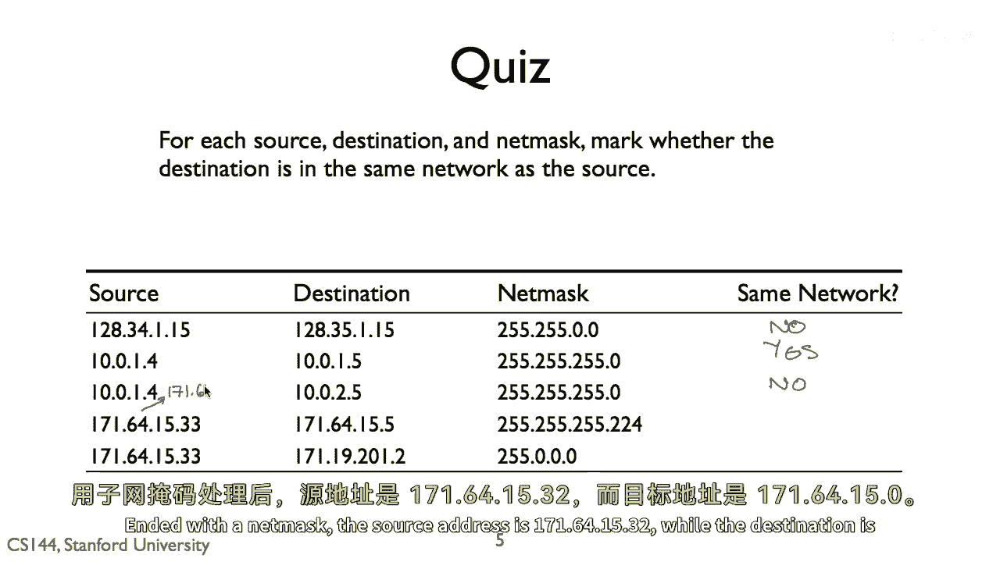

# P15：p14 1-9c  IPv4 addresses - 加加zero - BV1qotgeXE8D

让我们一起查看答案，第一行的答案是否，他们在不同的网络上。

两个地址在第二个八位上有所不同，三四 versus 三五，如果你取两个地址的位端与网掩码进行二进制运算。

我们得到一零二八三四零零零。

和一零二八三五零零零，这些不是相同的，第二行的答案是否。

他们在同一个网络上，如果我们取两个地址的位端与网掩码进行二进制运算。

我们得到一零点零点一点零，在两种情况下。

第三条行的答案是否，他们不在同一个网络上，因为他们在第三个八位上有所不同。

源在网络一零点零点一点零，目的在网络一零点零点二点零。

第四行的答案是否。

他们不在同一个网络上，并且使用网掩码，源地址是一七一六四点一五点三二点零。

目地址是一七一六四点一五点零。

最后一行的答案是否，他们在第一个字节上匹配。

两者都是一七一点零点零点零。