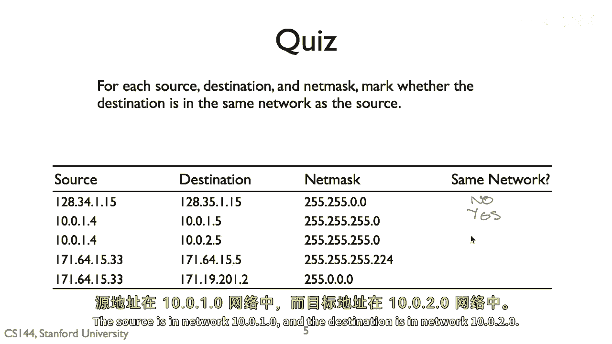

# 课程 P15：IPv4地址判断练习解析 🧩

在本节课中，我们将学习如何判断两个IPv4地址是否属于同一个网络。我们将通过分析一个具体的练习题，来掌握使用子网掩码进行“按位与”运算的核心方法。

---

上一节我们介绍了判断网络归属的基本概念，本节中我们来看看如何应用这些概念解决具体问题。

## 问题一解析

第一组地址是 `102.134.0.1` 和 `102.135.0.1`，子网掩码为 `255.255.0.0`。

两个地址在第二个八位组（即点分十进制中的第二段）不同，分别是134和135。将每个地址与子网掩码进行二进制“按位与”运算，可以计算出它们的网络地址。

以下是计算过程的核心公式：
`网络地址 = IP地址 & 子网掩码`

对于 `102.134.0.1`：
`102.134.0.1 & 255.255.0.0 = 102.134.0.0`

对于 `102.135.0.1`：
`102.135.0.1 & 255.255.0.0 = 102.135.0.0`

得到的网络地址 `102.134.0.0` 和 `102.135.0.0` 并不相同。

**结论：否，它们在不同的网络上。**

---

## 问题二解析

上一问题展示了如何判断不同网络，现在我们来分析一个属于同一网络的例子。

第二组地址是 `10.0.1.1` 和 `10.0.1.2`，子网掩码为 `255.255.255.0`。

同样，我们将两个地址分别与子网掩码进行“按位与”运算。

对于 `10.0.1.1`：
`10.0.1.1 & 255.255.255.0 = 10.0.1.0`

对于 `10.0.1.2`：
`10.0.1.2 & 255.255.255.0 = 10.0.1.0`

两种情况下，计算得到的网络地址都是 `10.0.1.0`。

**结论：是，它们在同一个网络上。**

---

## 问题三解析

接下来我们看一个因第三个八位组不同而导致网络不同的情况。

第三组地址是 `10.0.1.1`（源）和 `10.0.2.1`（目的），子网掩码为 `255.255.255.0`。

计算网络地址：
- 源地址 `10.0.1.1` 的网络地址为 `10.0.1.0`
- 目的地址 `10.0.2.1` 的网络地址为 `10.0.2.0`

**结论：否，它们不在同一个网络上。源地址在网络 `10.0.1.0`，目的地址在网络 `10.0.2.0`。**

---

## 问题四解析

现在我们来分析一个使用不同子网掩码的例子。

第四组地址是 `171.64.15.32`（源）和 `171.64.15.64`（目的），子网掩码为 `255.255.255.192`。

计算网络地址：
- 源地址 `171.64.15.32` 的网络地址为 `171.64.15.0`
- 目的地址 `171.64.15.64` 的网络地址为 `171.64.15.64`

**结论：否，它们不在同一个网络上。**

---

## 问题五解析

最后，我们来看一个地址部分匹配但网络不同的情况。

第五组地址是 `171.64.15.32` 和 `171.65.14.33`，子网掩码为 `255.255.0.0`。

计算网络地址：
- 第一个地址的网络地址为 `171.64.0.0`
- 第二个地址的网络地址为 `171.65.0.0`

虽然两个地址的第一个八位组（171）相同，但计算出的完整网络地址并不相同。

**结论：否，它们不在同一个网络上。**

---

## 课程总结 📝

本节课中我们一起学习了判断两个IPv4地址是否属于同一网络的方法。核心步骤是：**将IP地址与子网掩码进行“按位与”运算，比较得到的网络地址是否完全相同**。

我们通过五个练习题巩固了这一方法：
1.  第二段不同导致网络不同。
2.  主机位不同，网络地址相同。
3.  第三段不同导致网络不同。
4.  使用更精细的子网掩码划分出不同子网。
5.  仅部分字段匹配不足以判定为同一网络。

掌握这一技能是理解IP网络通信和子网划分的基础。