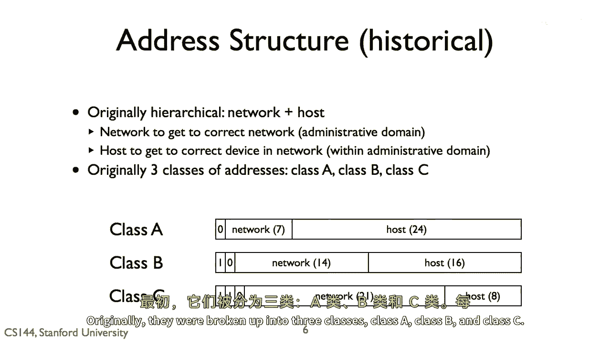
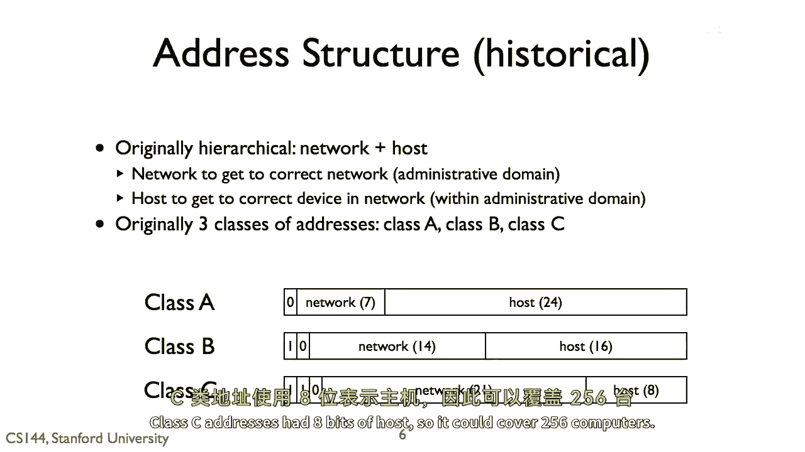
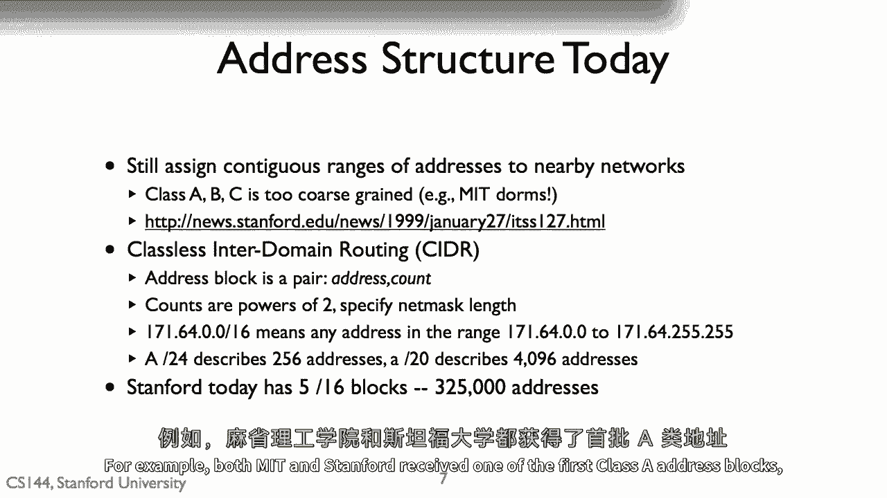
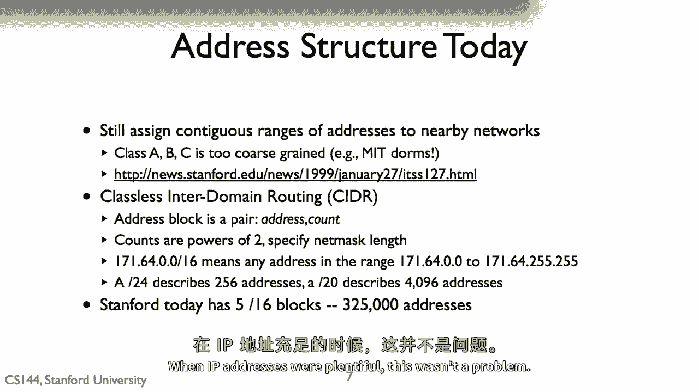
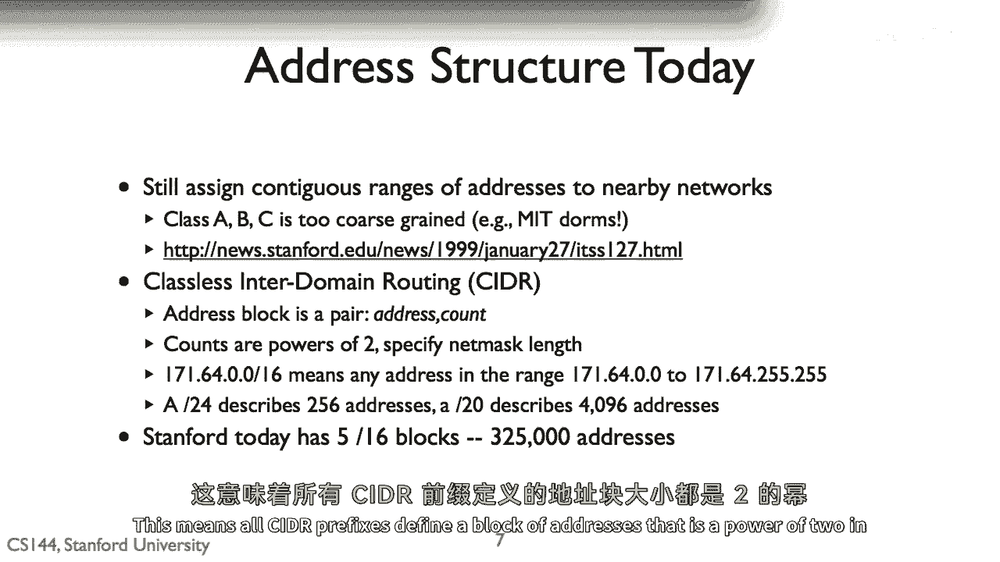
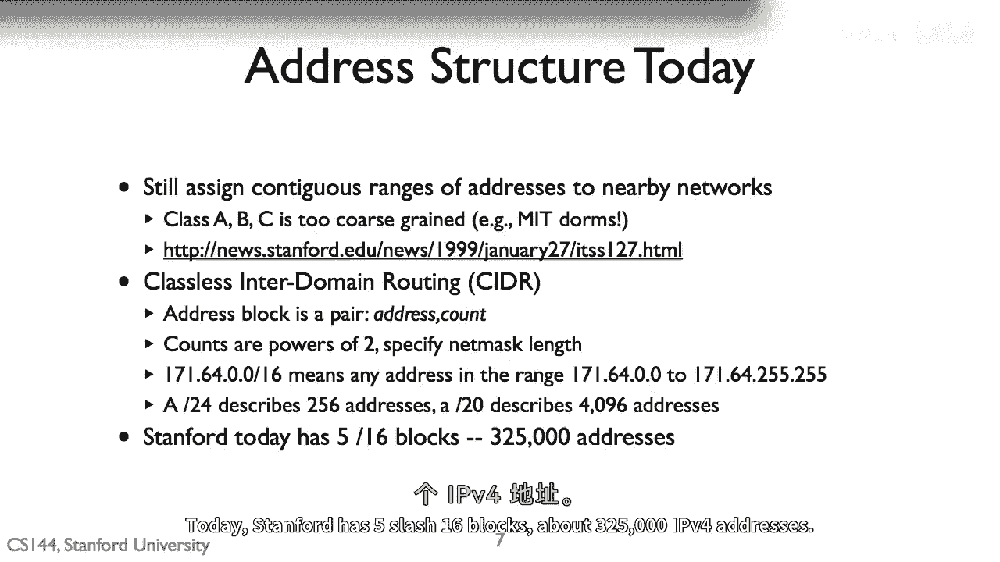
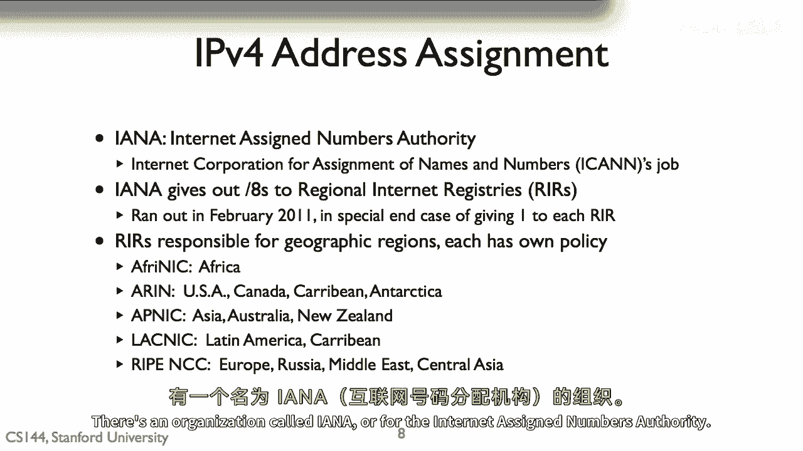
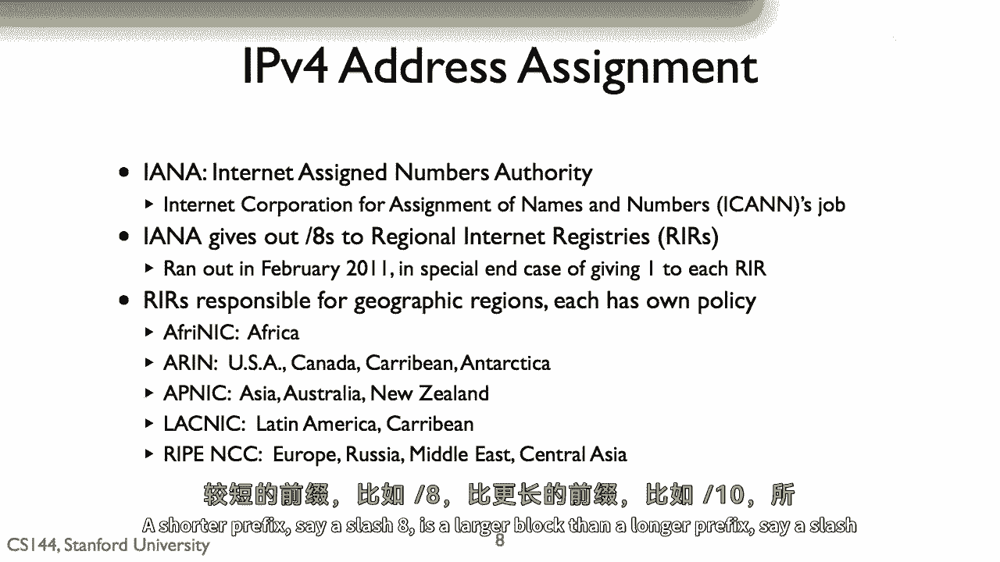

# P16：p15 1-9d  IPv4 addresses - 加加zero - BV1qotgeXE8D

所以原本的IP地址被分配为，它们被分成了三个类。

类A，类B和类C，每个类将IP地址分成两部分，网络和主机，地址的网络部分表示一个管理域，例如，mit bbn或斯坦福大学，地址的主机部分，在该网络上的哪个设备，类A地址，如何带零，网络部分有七位。

可以表示128个网络，和24位的主机，所以类I可以覆盖1600万台计算机，类B地址有16位的主机，所以可以覆盖65，536台计算机，535，536台计算机，类C地址有8位的主机。

所以我们可以很好地覆盖256台计算机，类A、B和C是简单的，我们很快发现它们不够灵活，例如，无论是mit还是斯坦福，都收到了第一个类A地址之一。

有一段时间，它们分配了超过4000万地址的块，mit将为其宿舍分配相当于类B的地址，最多为几百人分配65，536个地址，当IP地址丰富时，这不是一个问题。

但随着其使用增加，我们需要更好的分配政策，有用的提示，在1999年，斯坦福放弃了其类A块，而mit至今仍拥有它，P，V。

四个地址通过被称为CIDR或类less inter domain routing的东西结构化，而不是只有长度为8的前缀，16和24位，CIDR允许前缀的任何位数。

这意味着所有CIDR前缀都定义一个地址块。

那就是一个2的幂次方的大小，当我们谈论CIDR地址时，我们指的是它的网掩码像这样，例如，我们谈论一个16，我们意味着一个长度为16的网掩码，这个CIDR块描述了2的16个地址或60，545个地址。

五万五千，五百三十六地址，当我们谈论一个20时，我们制作了一个长度为二十的网状面具，这个苹果酒块描述了从二到十二个地址，或四万九千六百个地址，苹果酒块是地址的结构方式，今天被地址和管理。

斯坦福有五分之十六的块，大约三百二十五万个块的块。

P，V，四个地址，那么我如何，P，V，分配和管理了四个地址，有一个叫做ayanna的组织，或者是为互联网分配号码的权威机构。

最终的权威是，我可以代表互联网名称和号码分配公司，我可以将工作委派给ana diana，这就给了八，向被称为rir的区域互联网注册中心描述十六百万个地址，每个大陆都有自己的rir，美国的r是aaron。

或西太平洋的r是apnik，这些各有自己的政策，对于它们如何将色调分解为较小的地址块，并将它们分配给需要它们的方，你可能在新闻中读到我们耗尽了，ip地址，这不是真的，今天有很多未被使用的地址。

发生的事情是我已经发完了可以分配的八个地址，在其章程中达到了一个特殊的结束案例，当他只剩下最后五个时，八栋楼，我给每个rar发了一个地址，现在，2012年的地址管理和分配由rs负责，约翰·彼得森。

当时他是互联网架构董事会的成员，在斯坦福大学进行了一次关于政治的演讲，"这引发的经济和技术复杂性"，"这门课程不需要这个演讲材料"，但我强烈推荐它，"你应该能在网站上找到这个"，"所以。

你现在已经看到了'i'的结构。"，"P" 的中文翻译是 "P"。"V"的中文翻译是"维"。"四个地址"，"它们如何分配"，并且，有多少个主机会做出他们的首次跳转路由决策。

那就是是否将数据包发送到本地节点，或者是发送到由 cider 块管理的网关路由器地址，其大小由前缀长度定义，一个更短的前缀，比如一个斜杠八是一个比较长的前缀更大的块。

