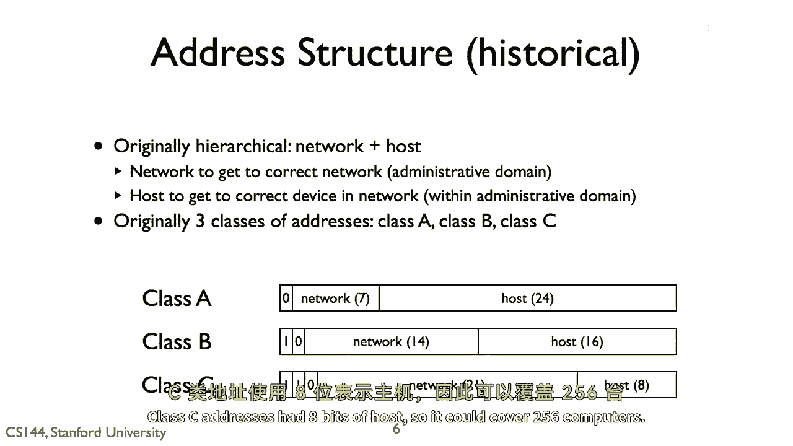
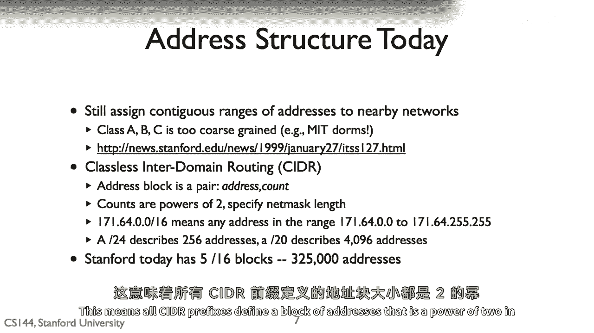
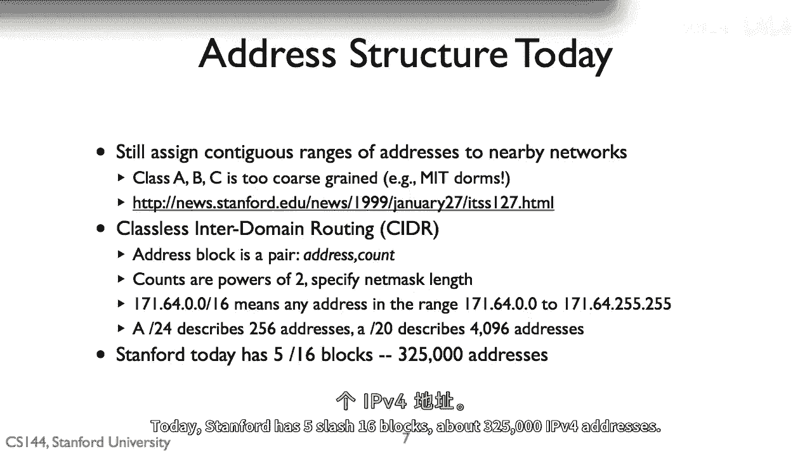
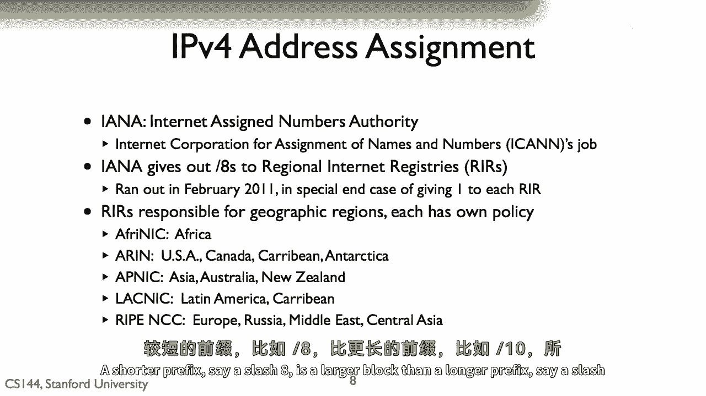

# 课程 P16：IPv4 地址详解 🌐

在本节课中，我们将要学习 IPv4 地址的分类、结构以及它们是如何演变成今天所使用的 CIDR 格式的。我们还会了解地址的分配机制。

---

## 原始的 IPv4 地址分类

最初的 IP 地址被分成了三个类别：**A类**、**B类**和**C类**。每个类别都将 IP 地址分成两部分：**网络部分**和**主机部分**。

*   **网络部分**：表示一个管理域，例如 MIT、BBN 或斯坦福大学。
*   **主机部分**：表示该网络上的具体设备。

以下是各类地址的具体划分：

*   **A类地址**：网络部分有 7 位，可以表示 128 个网络。主机部分有 24 位，因此一个 A 类网络可以容纳约 1600 万台计算机。
    *   **公式**：`2^7 = 128` 个网络，`2^24 = 16,777,216` 台主机。
*   **B类地址**：网络部分有 14 位，主机部分有 16 位。因此一个 B 类网络可以容纳 65,536 台计算机。
    *   **公式**：`2^16 = 65,536` 台主机。
*   **C类地址**：网络部分有 21 位，主机部分有 8 位。因此一个 C 类网络可以容纳 256 台计算机。
    *   **公式**：`2^8 = 256` 台主机。

---

## 分类地址的局限性

上一节我们介绍了 A、B、C 三类地址的简单划分。本节中我们来看看这种分类方式在实践中遇到的问题。

A、B、C 类的划分方式虽然简单，但很快被发现不够灵活。例如，无论是 MIT 还是斯坦福大学，都曾获得最早的 A 类地址之一。这意味着它们各自被分配了超过 1600 万个地址的地址块。

而 MIT 可能为其宿舍分配一个相当于 B 类的地址块，为几百人分配了 65,536 个地址。在 IP 地址资源丰富的早期，这不是问题。但随着互联网的普及和使用量激增，我们需要更精细、更高效的地址分配策略。

> **有用的提示**：在 1999 年，斯坦福大学交还了其 A 类地址块，而 MIT 至今仍保留着它。

---

## CIDR：无类别域间路由

为了解决分类地址的僵化问题，IPv4 地址通过 **CIDR（无类别域间路由）** 进行了重新结构化。

与之前只有固定的 8位、16位 或 24位 网络前缀不同，CIDR 允许使用**任意长度**的前缀。这意味着所有 CIDR 前缀都定义了一个地址块，其大小是 2 的幂次方。

当我们谈论 CIDR 地址时，我们使用“斜线记法”来表示其网络掩码，例如 `/16` 或 `/20`。

以下是 CIDR 地址块的示例：

*   **一个 `/16` 的 CIDR 块**：表示网络前缀长度为 16 位。这个块描述了 `2^(32-16) = 2^16 = 65,536` 个地址。
*   **一个 `/20` 的 CIDR 块**：表示网络前缀长度为 20 位。这个块描述了 `2^(32-20) = 2^12 = 4,096` 个地址。

CIDR 块是当今地址被结构化和管理的标准方式。例如，斯坦福大学拥有一个 `/16` 的地址块，大约包含 65,536 个地址。

---

## IPv4 地址的分配与管理

那么，IPv4 地址是如何分配和管理的呢？这由一个名为 **IANA（互联网号码分配局）** 的组织负责，它是互联网名称与数字地址分配机构（ICANN）的一部分。

IANA 将工作委托给**区域互联网注册管理机构（RIR）**。每个大洲都有自己的 RIR，例如：
*   美洲的 RIR 是 **ARIN**。
*   亚太地区的 RIR 是 **APNIC**。

这些 RIR 有各自的政策，负责将大的地址块分解为更小的块，并分配给需要它们的组织。

你可能在新闻中读到“我们耗尽了 IPv4 地址”。这并不完全准确。今天仍有很多未使用的地址。实际情况是，IANA 在 2011 年将其 IPv4 地址池中最后可分配的 `/8` 地址块分配给了各个 RIR。自那以后，地址的管理和分配责任就转移到了 RIR 层面。

> **扩展阅读**：关于地址耗尽引发的经济和技术复杂性，约翰·彼得森（时任互联网架构委员会成员）在斯坦福大学进行过一次精彩演讲。本课程不要求掌握这部分材料，但强烈推荐。你应该能在相关网站上找到这个演讲。

---

## 总结与路由决策

本节课中我们一起学习了 IPv4 地址的结构、从分类到 CIDR 的演变，以及它们如何被分配。

最后，主机如何做出其首次路由跳转决策呢？那就是判断一个数据包是应该发送到本地网络节点，还是应该发送到由 **CIDR 块** 定义的网关路由器。地址块的大小由前缀长度定义：**前缀越短（如 `/8`），地址块越大；前缀越长（如 `/24`），地址块越小**。