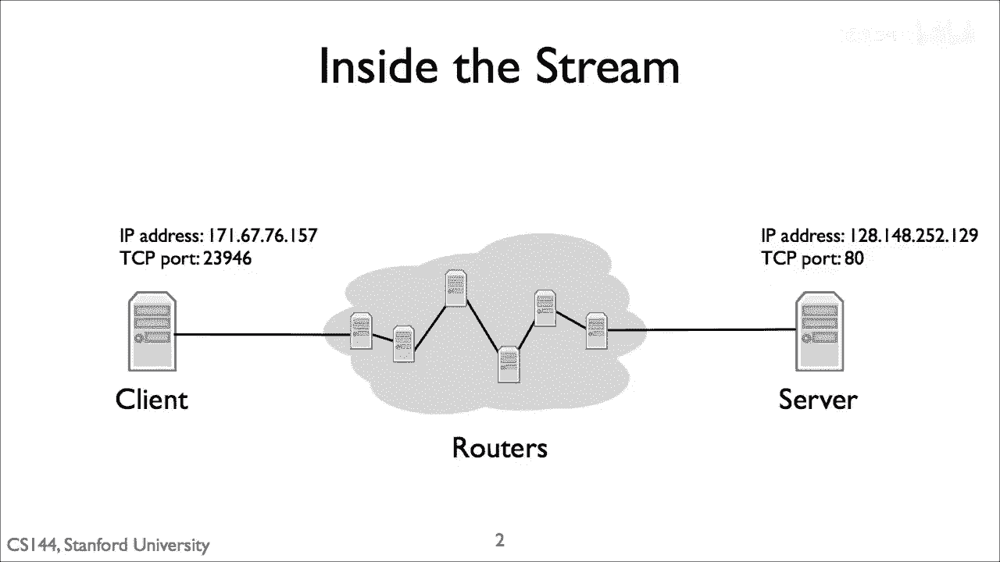
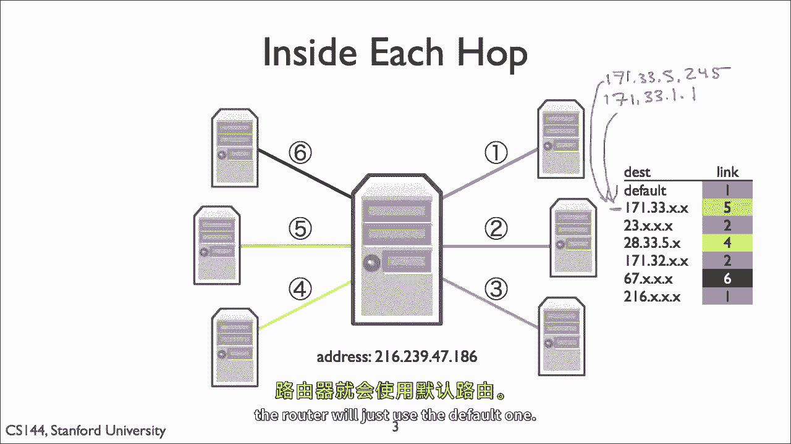
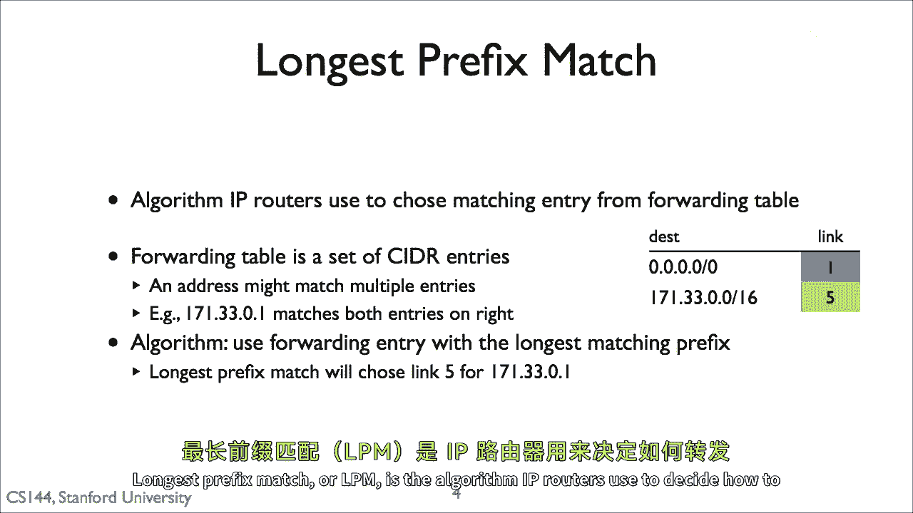
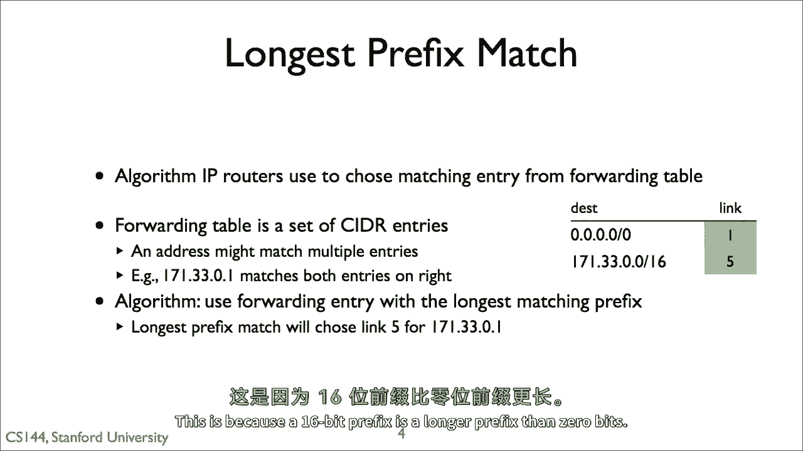
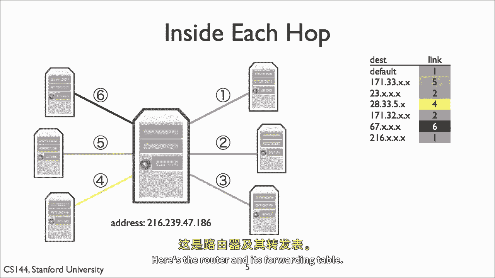
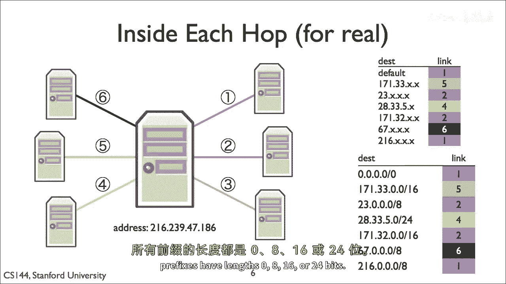

# P17：p16 1-10a Longest prefix match (LPM) - 加加zero - BV1qotgeXE8D

互联网路由器可以有许多链接，因此，他们有许多选择包向前送的方向，用于接收包，用于选择将包发送到哪个链接，以便在网络上传输，今天的路由器通常使用一种称为最长前缀匹配的算法，例如。

一个客户端想要向端口八十的服务器打开TCP连接，Web服务器的典型端口，用于设置连接和传输数据的包，在客户端和服务器之间需要经过多个跳转，在每个数据包的跳转中，路由器决定将数据包转发到哪个链路。

路由器如何做出这个决定。

它通过被称为转发表的东西来实现，如图右所示，转发表由一组部分IP地址组成，X's表示地址是部分的，X's代表通配符，例如，第二个条目读作一七一三三三，X X意味着任何IP地址的第一个字节是一七一。

并且第二个字节是三三，这一行，例如，包含一百七十一，三，三，五，二，四五，以及一百七十一三，311，当数据包到达时，路由器检查哪个转发表最适合，匹配数据包，并根据转发表中的条目。

将数据包转发到与该条目相关联的最佳链路上，我的意思是最具体的，默认路由实际上是所有通配符，它匹配任何IP地址，如果当数据包到达时，没有比默认路由更具体的路由，路由器将仅使用最长前缀匹配的默认路由。

或者lpm是算法，IP路由器用于决定如何分配数据包。

每个路由器都有一个转发表，转发表中的条目有两部分，一个描述地址块的 cidr 条目，以及对于匹配该 cidr 条目的包的下一个跳转地址，一个地址可能属于多个 cidr 条目，例如，在这个右侧的路由表中。

有兩個條目，默认路由的一个，其前缀长度为零，一个为171733316，默认情况下，所有包都将匹配顶部条目并越过链接一，但是，包目的地地址的前十六位或两个八位匹配171，333。

路由器将将其发送越过链接五，这是因为十六位前缀比零位前缀更长。

它更具体，所以让我们回到早期的例子，我们在哪里应该一个转发表，其中x表示通配符，这里是路由器和其转发表。

如果我们将这个转发表表示为cider条目，它看起来像这样，因为在这个简单例子中，所有的前缀都是以字节为单位的，所有的前缀长度都为零。

八，十六。