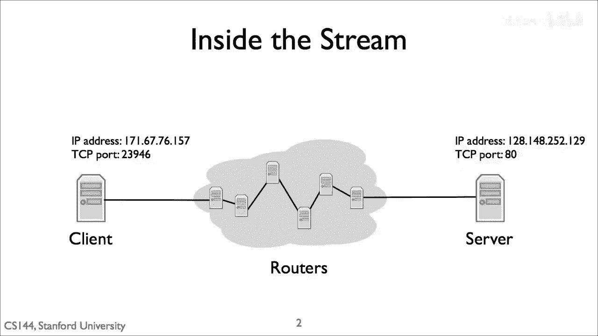
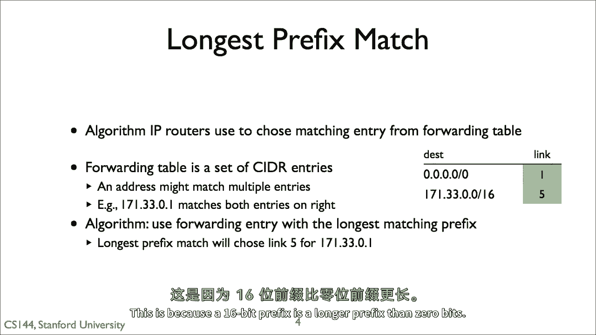
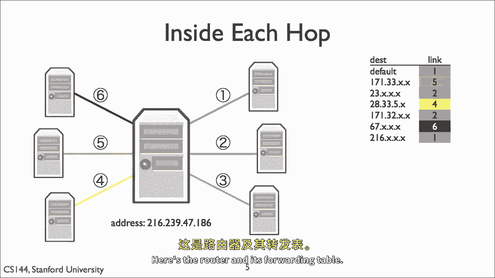
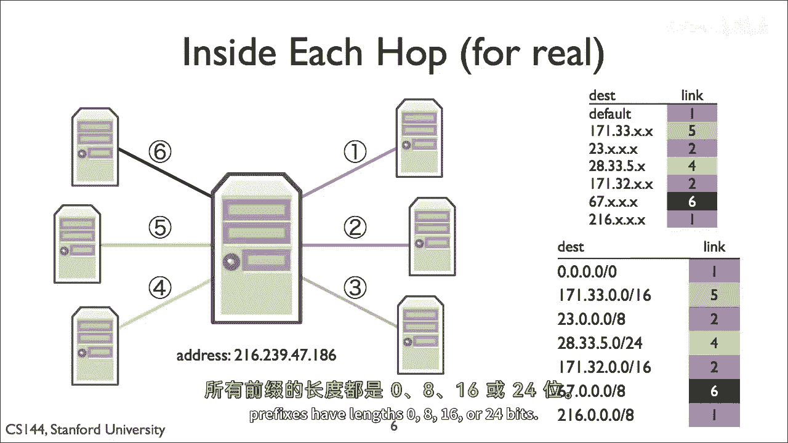

# 课程P17：最长前缀匹配 (LPM) 🧭

在本节课中，我们将学习互联网路由器如何决定数据包的转发方向。核心内容是**最长前缀匹配**算法，这是现代路由器做出转发决策的基础。

---


## 路由器转发决策概述 🌐

互联网路由器通常连接多条链路，因此需要为接收到的数据包选择一条链路进行转发。这个过程发生在数据包从源到目的地的每一跳中。

上一节我们介绍了路由器转发的基本场景，本节中我们来看看路由器具体如何做出这个决定。



## 转发表的作用 📋

路由器通过查询一个称为**转发表**的数据结构来做出转发决策。转发表由一系列条目组成，每个条目包含一个部分IP地址（即一个网络前缀）和一个对应的输出链路。

以下是转发表条目的一个示例：

*   第一条目：`171.33.xx.xx` -> 链路5
*   第二条目：`xx.xx.xx.xx` -> 链路1 (默认路由)

在条目中，`x` 代表通配符。例如，`171.33.xx.xx` 意味着IP地址的前两个字节（16位）必须是 `171.33`，后两个字节可以是任意值。

当数据包到达时，路由器会检查其目的IP地址，并找出转发表中**最匹配**（即最具体）的条目，然后将数据包转发到该条目关联的链路上。

## 理解最长前缀匹配 (LPM) 🔍

最长前缀匹配，或称LPM，是IP路由器用于决定数据包转发路径的核心算法。


每个路由器的转发表条目通常包含两部分：
1.  一个描述地址块的CIDR条目（例如 `171.33.0.0/16`）。
2.  对于匹配该CIDR条目的数据包的**下一跳**地址。

一个IP地址可能同时匹配转发表中的多个条目。例如，考虑右侧的转发表：


*   条目A: `0.0.0.0/0` -> 链路1 (默认路由)
*   条目B: `171.33.0.0/16` -> 链路5

目的地为 `171.33.5.245` 的数据包会同时匹配条目A（0位前缀）和条目B（16位前缀）。根据LPM规则，路由器会选择**前缀更长**的条目B，因为它更具体，并将数据包通过链路5转发。

其核心逻辑可以用以下伪代码描述：
```python
def longest_prefix_match(packet_dest_ip, forwarding_table):
    best_match = None
    for entry in forwarding_table:
        if packet_dest_ip in entry.network_prefix:
            if best_match is None or entry.prefix_len > best_match.prefix_len:
                best_match = entry
    return best_match.output_link
```

## 示例解析 📝

让我们回到课程开始时那个使用通配符`x`的转发表例子。



如果我们将该转发表表示为标准的CIDR条目，它将如下所示。在这个简单例子中，所有前缀长度都是8位的倍数（即按字节对齐）。

以下是CIDR格式的转发表：

*   `171.33.xx.xx` 变为 `171.33.0.0/16`
*   `xx.xx.xx.xx` 变为 `0.0.0.0/0` (默认路由)



通过这种表示，LPM的原则就更加清晰了：对于任何前往 `171.33.x.x` 网络的数据包，`/16` 的前缀比 `/0` 的默认路由前缀更长、更精确，因此会被优先选用。

---



## 总结 📚

本节课中我们一起学习了路由器转发决策的关键——**最长前缀匹配 (LPM)** 算法。我们了解到路由器通过查询**转发表**，并选择与数据包目的IP地址匹配的、**前缀长度最长**的条目来决定转发路径。这条规则确保了数据包总能被导向最具体的、最精确的路由路径。理解LPM是理解互联网路由基础的重要一步。