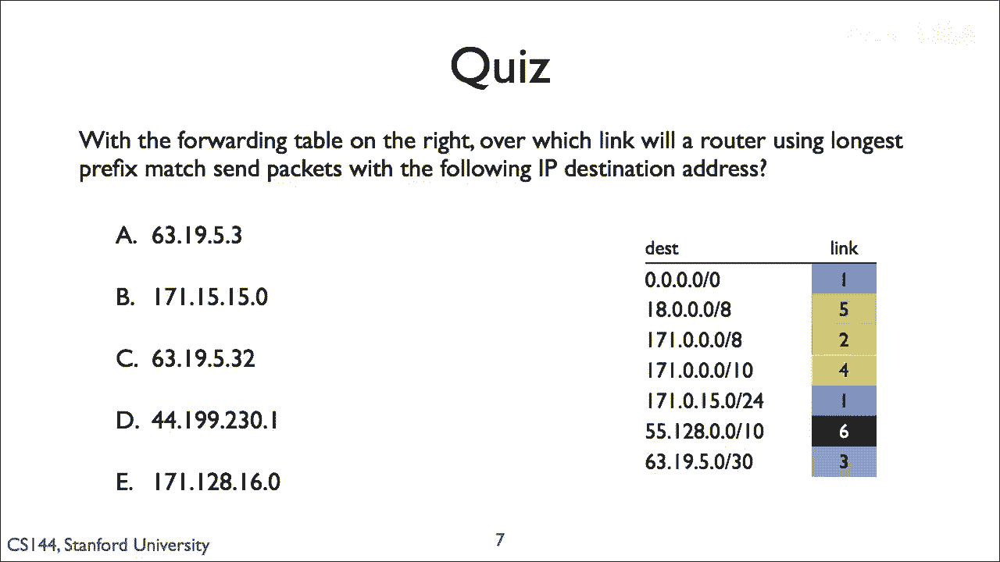

# 计算机网络课程 P18：最长前缀匹配 (LPM) 🧩

在本节课中，我们将要学习路由器转发数据包时使用的一种关键技术——**最长前缀匹配**。我们将了解其工作原理，并通过一个具体例子来掌握如何应用它。

---

上一节我们介绍了路由表的基本概念。本节中我们来看看路由器如何根据目标IP地址，在路由表中找到最合适的转发路径。

路由器在转发数据包时，会查看数据包的目标IP地址，并将其与路由表中的条目进行比对。路由表中的条目通常包含一个**网络前缀**（或称为子网地址）和一个对应的**输出接口**。路由器需要找到与目标IP地址匹配的条目，并将数据包从该条目指定的接口发送出去。

当存在多个匹配的条目时，路由器遵循一个核心原则：**选择具有最长匹配前缀的条目**。这就是“最长前缀匹配”。

---



## 核心概念与规则

最长前缀匹配的规则可以总结为以下步骤：

1.  将数据包的目标IP地址与路由表中每个条目的网络前缀进行比较。
2.  找出所有网络前缀是目标IP地址前缀的条目（即匹配的条目）。
3.  从所有匹配的条目中，**选择网络前缀最长的那个条目**。
4.  按照该条目指示的接口转发数据包。

以下是判断一个前缀是否匹配的简单方法：
```
如果（目标IP地址 & 子网掩码） == 网络前缀，则匹配。
```
其中 `&` 表示按位与运算。

---

## 实例解析

现在，我们通过一个具体例子来应用上述规则。假设路由器中有以下转发表（路由表）：

| 目标网络（前缀） | 接口 |
| :--------------- | :--- |
| 10.1.1.0/24      | A    |
| 10.1.0.0/16      | B    |
| 10.0.0.0/8       | C    |
| 0.0.0.0/0        | D    |

> **注意**：`/24`、`/16`、`/8` 表示子网掩码中“1”的位数，分别对应掩码 `255.255.255.0`、`255.255.0.0`、`255.0.0.0`。`0.0.0.0/0` 是默认路由，匹配任何地址。

**问题**：一个目标地址为 `10.1.1.1` 的数据包到达，路由器应通过哪个接口转发？


让我们一步步分析：

1.  **列出所有匹配的条目**：
    *   与 `10.1.1.0/24` 比较：`10.1.1.1` 的前24位（`10.1.1`）与该前缀一致，**匹配**。
    *   与 `10.1.0.0/16` 比较：`10.1.1.1` 的前16位（`10.1`）与该前缀一致，**匹配**。
    *   与 `10.0.0.0/8` 比较：`10.1.1.1` 的前8位（`10`）与该前缀一致，**匹配**。
    *   与 `0.0.0.0/0` 比较：匹配任何地址，**匹配**。

2.  **应用最长前缀匹配规则**：
    在以上四个匹配的条目中，我们需要比较它们前缀的长度。
    *   `10.1.1.0/24` 的前缀长度是 **24** 位。
    *   `10.1.0.0/16` 的前缀长度是 **16** 位。
    *   `10.0.0.0/8` 的前缀长度是 **8** 位。
    *   `0.0.0.0/0` 的前缀长度是 **0** 位。

    其中，**前缀长度最长的是 24 位**，对应的条目是 `10.1.1.0/24`。

3.  **得出结论**：
    因此，路由器将选择 `10.1.1.0/24` 这条路由，并通过其指定的接口 **A** 转发该数据包。

---

本节课中我们一起学习了**最长前缀匹配**的原理和应用。我们了解到，当路由表中有多个条目与目标IP地址匹配时，路由器会选择**网络前缀最长**的那一条，因为这代表了最精确、最具体的路由路径。通过实例练习，我们掌握了从匹配的条目中筛选出最长前缀的具体步骤。这是确保互联网数据包能够高效、准确送达目的地的关键机制之一。