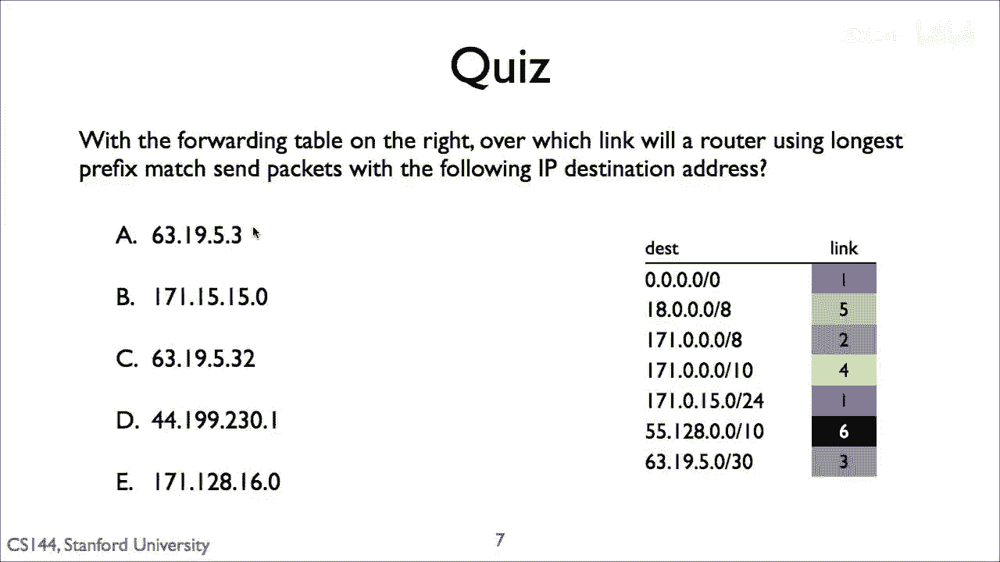
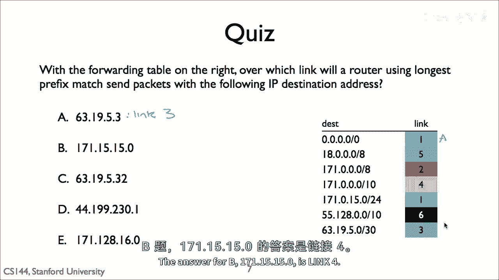
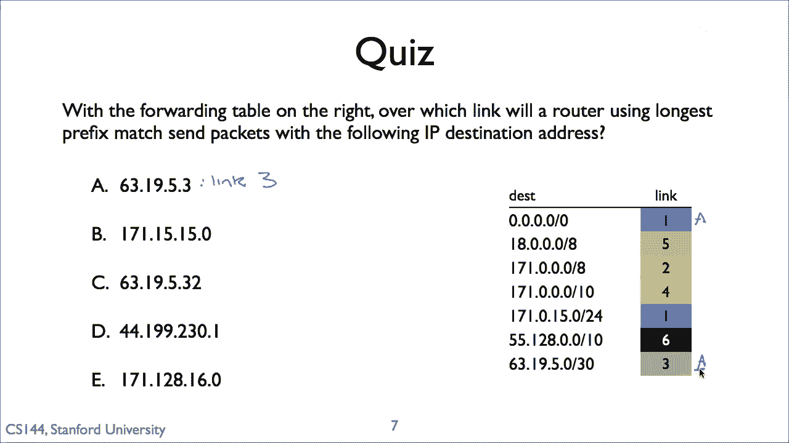
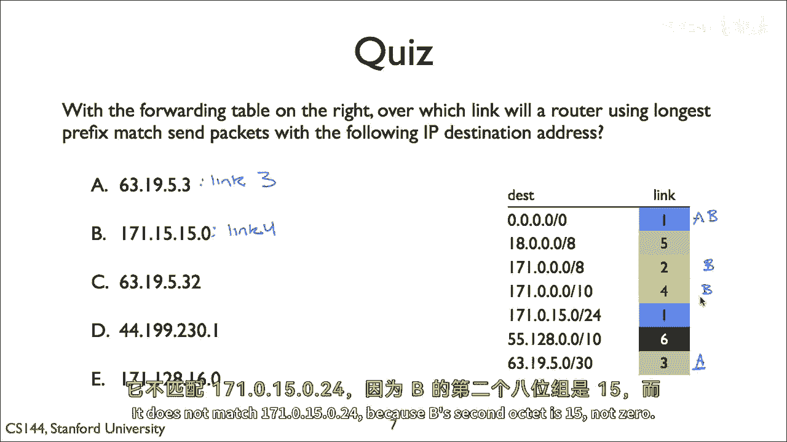
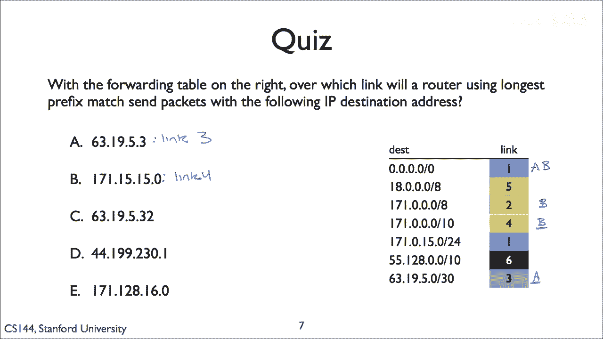
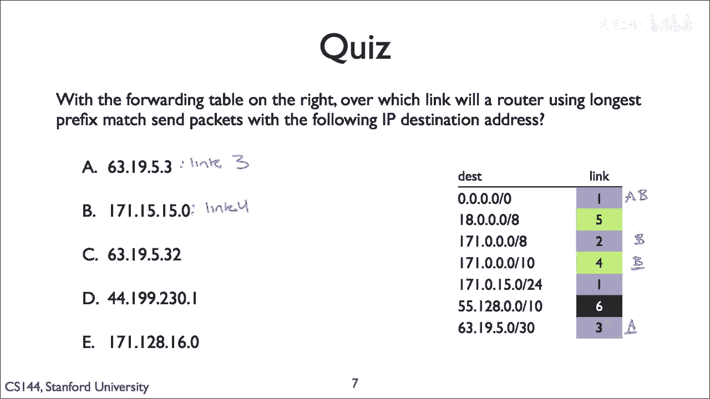
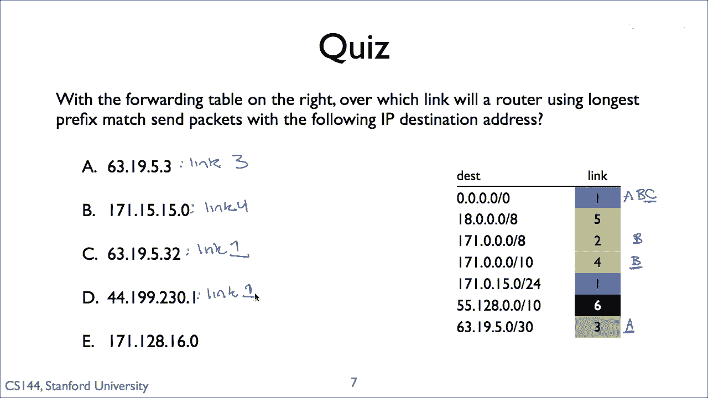
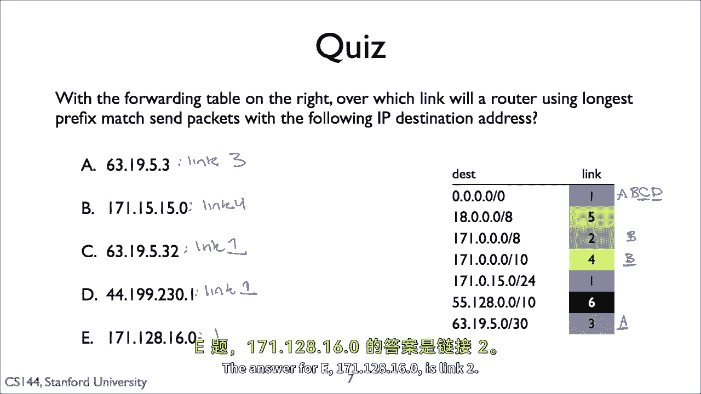
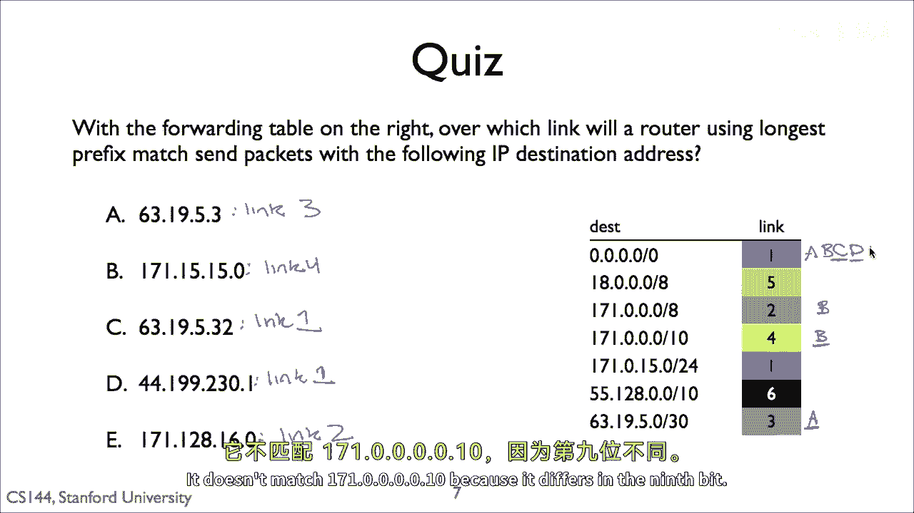
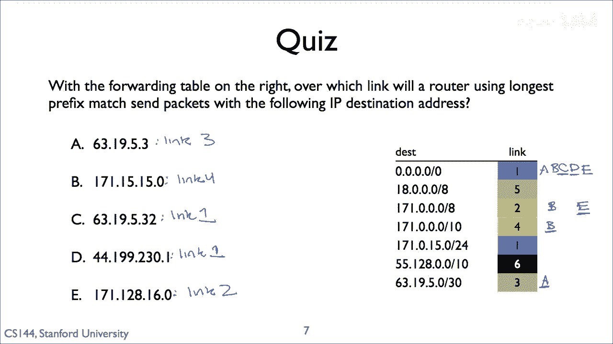

# 计算机网络课程 P19：最长前缀匹配 (LPM) 详解 🧩



在本节课中，我们将学习路由器转发数据包时的一个核心决策过程——**最长前缀匹配**。我们将通过具体的例子，理解路由器如何从多个可能的路由条目中，为给定的目标IP地址选择最精确的下一跳路径。

---


## 概述 📋

当路由器收到一个需要转发的数据包时，它会检查数据包的目标IP地址，并将其与路由表中的条目进行比对。路由表中的条目通常由**网络前缀**（如 `63.195.0.0/16`）和对应的**出接口**组成。如果目标地址同时匹配多个前缀，路由器将遵循 **“最长前缀匹配”** 原则，即选择**前缀长度最长**的那个条目进行转发。这是因为更长的前缀意味着更具体的网络范围，路由决策也就更精确。



上一节我们介绍了路由表的基本结构，本节中我们来看看最长前缀匹配原则是如何具体应用的。

---



## 案例分析 🔍

假设我们有一个包含以下条目的路由表：


1.  默认路由：`0.0.0.0/0` -> 链接 1
2.  前缀 A：`63.195.0.0/16` -> 链接 2
3.  前缀 B：`63.195.3.0/30` -> 链接 3
4.  前缀 C：`171.0.0.0/10` -> 链接 4
5.  前缀 D：`171.0.0.0/24` -> （不匹配当前任何目标地址）

现在，我们将为不同的目标IP地址确定其转发路径。


### 案例一：目标地址 `63.195.3.2`

这个地址匹配两个前缀：默认路由 (`0.0.0.0/0`) 和前缀 B (`63.195.3.0/30`)。



*   默认路由的前缀长度是 **0位**。
*   前缀 B (`63.195.3.0/30`) 的前缀长度是 **30位**。


**最长前缀匹配原则**：选择前缀长度更长的条目。
因此，`63.195.3.0/30`（30位）比默认路由（0位）更长，路由器会选择**链接3**。

**核心逻辑可以用伪代码表示**：
```python
if destination_ip matches 63.195.3.0/30:
    use link 3
elif destination_ip matches 63.195.0.0/16:
    use link 2
else:
    use default route (link 1)
```



---

### 案例二：目标地址 `171.55.0.0`



这个地址匹配三个条目：默认路由、前缀 C (`171.0.0.0/10`) 和前缀 D (`171.0.0.0/24`)。我们需要逐一检查：

1.  **匹配默认路由** (`0.0.0.0/0`)：总是匹配。
2.  **匹配前缀 C** (`171.0.0.0/10`)：地址 `171.55.0.0` 的前10位与 `171.0.0.0` 的前10位相同，因此匹配。
3.  **不匹配前缀 D** (`171.0.0.0/24`)：地址 `171.55.0.0` 的第二个八位组是 `55`，而前缀 D 要求第二个八位组是 `0`，因此不匹配。


在匹配的条目中（默认路由和前綴 C），前缀 C 的长度为 **10位**，比默认路由的 **0位** 更长。
所以，根据最长前缀匹配原则，路由器会将数据包发送到**链接4**。

---


### 案例三：目标地址 `63.195.32.0`

这个地址的匹配情况如下：


*   **匹配默认路由**：总是匹配。
*   **不匹配前缀 A** (`63.195.0.0/16`)：虽然前16位 (`63.195`) 相同，但前缀 A 定义的是一个 `/16` 的网络。地址 `63.195.32.0` 的第三个八位组是 `32`，而前缀 `63.195.0.0/16` 包含从 `63.195.0.0` 到 `63.195.255.255` 的所有地址，因此**它是匹配的**。这里原描述有误，实际上它匹配前缀A。
*   **不匹配前缀 B** (`63.195.3.0/30`)：前30位不同，不匹配。

因此，匹配的条目是默认路由和前缀 A (`63.195.0.0/16`)。前缀 A 的长度为 **16位**，比默认路由更长。
所以，路由器会选择**链接2**。



---

### 案例四：目标地址 `44.99.23.1` 与 `171.1.28.160`



对于这两个地址，我们快速应用上述原则：



*   **`44.99.23.1`**：它只匹配默认路由 (`0.0.0.0/0`)，因此答案是**链接1**。
*   **`171.1.28.160`**：它匹配默认路由和前綴 C (`171.0.0.0/10`)。
    *   它**不匹配**前缀 D (`171.0.0.0/24`)，因为其第二个八位组是 `1` 而不是 `0`。
    *   在匹配的条目中，前缀 C (`171.0.0.0/10`) 是更长的前缀（10位 > 0位）。
    *   因此，路由器会选择**链接4**。

---

## 总结 🎯



本节课中我们一起学习了**最长前缀匹配 (LPM)** 这一路由器核心转发规则。关键要点如下：


*   **核心原则**：当目标IP地址匹配路由表中多个条目时，路由器选择**网络前缀长度最长**的条目进行转发。
*   **原因**：更长的前缀代表更小的、更具体的网络范围，能提供更精确的路由。
*   **决策流程**：路由器从匹配的条目中，简单比较其**前缀长度**（即 `/` 后面的数字），数字最大的即为最终选择。

理解最长前缀匹配，是掌握IP路由和数据包转发机制的基础。