# 计算机网络课程 P2：应用程序的一天 🌐

在本节课中，我们将学习网络应用程序如何工作。我们将探讨网络连接的基本模型，并分析三个现代应用程序（万维网、BitTorrent 和 Skype）如何利用这种连接来实现各自的功能。理解这些基础概念是学习更复杂网络原理的第一步。

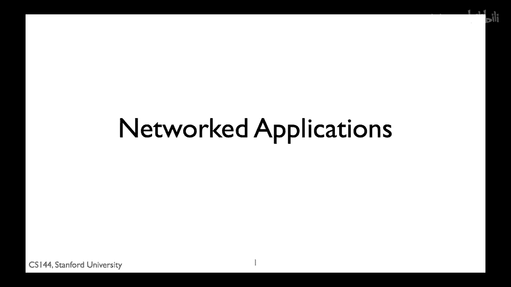

---

## 网络应用程序的力量 💪

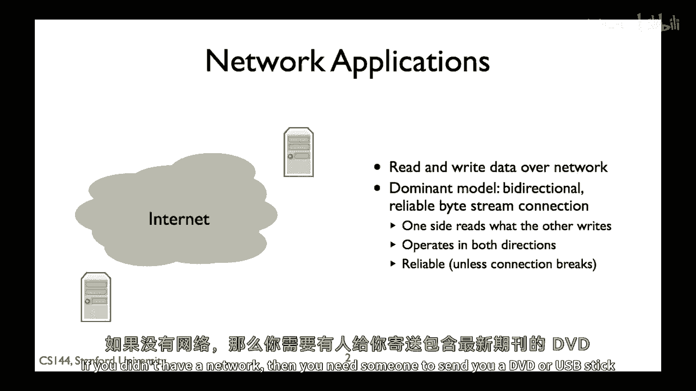

网络应用程序的力量在于，你可以有多台计算机，每台都有自己的私人数据，每台可能由不同的人拥有和控制，交换信息。与您的本地应用程序不同，这些应用程序只能访问位于本地系统的数据。网络应用程序可以跨越世界交换数据。

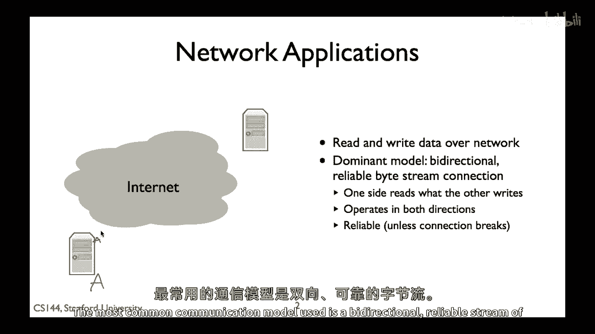

例如，想象使用Web浏览器阅读杂志。服务器由出版商运行，具有其中包含所有杂志文章，并且可能还包括过去的所有期数。随着文章的更正或添加，你可以立即看到更新的版本和新的内容。整个文章目录可能太大，无法下载，所以你可以按需加载。如果没有网络，那么你需要某人发送DVD或USB，只关注最新的一期。

## 基本通信模型：可靠的双向字节流 🔄

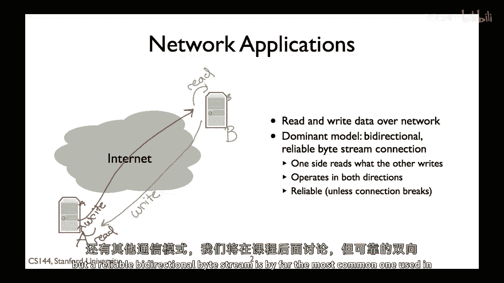

所以基本模型是您有两个计算机，每个运行本地程序，并且这两个程序通过网络通信。最常用的通信模型是**双向可靠的字节流**。

程序A运行在计算机A上可以写入数据，这些数据通过网络发送，这样程序B运行在计算机B上就可以读取它。同样，程序B可以写入数据，程序A可以读取。还有其他的通信模式，我们在课程中稍后会讨论。但双向可靠的字节流是网络今天最常用的模式之一。

让我们走一遍看看这个是什么。计算机B在右边正在等待其他计算机连接到它。计算机A在左边想要与B通信。例如，尽管在这里被绘制为服务器，它也可以是运行Web浏览器的移动电话。A和B现在设置连接。

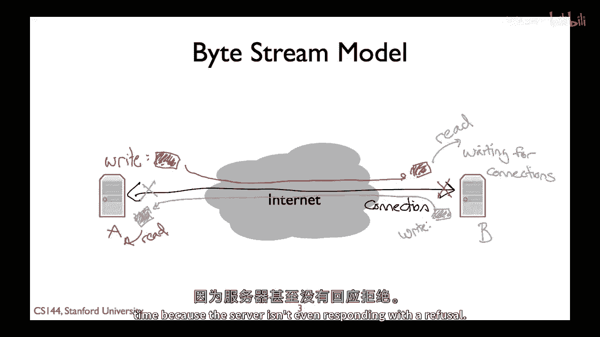

当A向连接写入数据时，这个数据通过网络传输，并且B可以以类似的方式读取它。如果B向连接写入数据，那个数据也会通过网络传输，并且A可以读取它。任何一方都可以关闭连接。例如，当Web浏览器从Web服务器请求完数据时，它可以关闭连接。同样，如果服务器想要，它也可以关闭连接。如果你在网页浏览器中见过错误消息，说连接重置由对端，这就是什么意思。当网页浏览器没有预期时，网页服务器关闭了连接。当然，服务器也可以拒绝连接。你可能见过连接拒绝的消息，或者让浏览器等待很长时间，因为服务器甚至没有以拒绝的形式回应。

---

## 应用示例一：万维网 🌍

现在我们已经看到了网络应用程序基本通信的方式，让我们来看看我们的第一个例子：万维网。万维网使用被称为HTTP的东西，它代表超文本传输协议。当你在浏览器中看到 `http://`，那意味着它正在使用HTTP进行通信。我们将更深入地研究HTTP的细节稍后，在课程中。我们现在将覆盖的应用程序，我只是会在HTTP中提供一个非常高级别的概述。

客户端打开与服务器的连接并向其发送命令。最常见的命令是 `GET`，它请求一个页面。HTTP被设计为一种以文档为中心的方式，使程序能够通信。

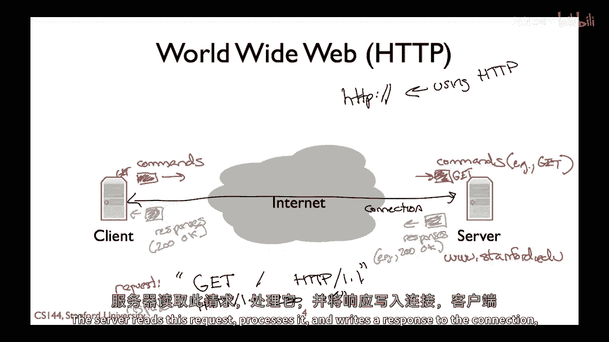

例如，如果我输入 `http://www.stanford.edu` 在浏览器中，浏览器连接到服务器 `www.stanford.edu`，并向网站的根页面发送 `GET` 请求。服务器接收请求，检查其是否有效，用户可以访问该页面并发送响应。响应与其相关的数字代码相关联。例如，如果服务器对 `GET` 发送 `200 OK` 响应，这意味着请求被接受。其余响应包含文档数据。在 `www.stanford.edu` 网页的示例中，一个 `200 OK` 的反应将包括描述主要斯坦福页面的超文本。

其他要求类型如 `PUT`、`DELETE`，以及其他要求响应如 `400`，这意味着可能有一个坏请求，可能是格式错误。因为HTTP是文档中心的，客户端请求命名一个文件。HTTP全部使用ASCII文本，它是人类可读的。

例如，获取斯坦福请求的开始看起来像这样：
```
GET / HTTP/1.1
Host: www.stanford.edu
```
对成功请求的回应开始看起来像这样：
```
HTTP/1.1 200 OK
Content-Type: text/html
...
```

基本模型很简单的客户端，客户端通过写入连接发送请求，服务器读取此请求，处理它，并在连接中写入响应。然后，客户端阅读这些。

---

## 应用示例二：BitTorrent 🌊

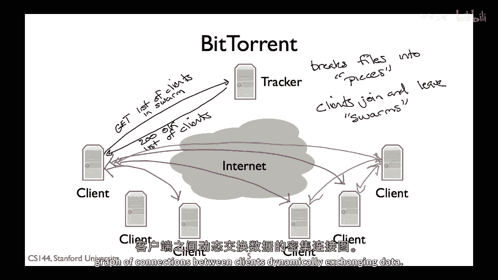

让我们看第二个应用：BitTorrent。BitTorrent是一个程序，允许人们分享和交换大文件。与Web不同，在BitTorrent中，客户端从不同的服务器请求文档。客户端从其他客户端请求文档，以便单个客户端可以从许多其他客户端并行请求。

BitTorrent将文件分解为数据块，称为片段。当客户端从其他客户端下载完整的片段时，它会告诉其他客户端它已经有了那个片段，所以它们可以下载到这些协作的客户端集合中。这些集合被称为蜂群。所以我们讨论一个客户端加入或离开蜂群。

BitTorrent使用与世界 wide web相同的机制：一个可靠的双向字节流。但它以稍微更复杂的方式使用它。

以下是BitTorrent下载文件的基本步骤：
1.  当客户端想要下载一个文件时，它首先必须找到被称为种子文件的东西。通常你通过世界 wide web找到这个，并使用HTTP下载它。
2.  种子文件描述了你想要下载的数据文件的一些信息，也告诉BitTorrent关于那个种子的跟踪器的信息。跟踪器是一个节点，它跟踪那个种子，因此加入种子的蜂群成员的客户端被称为什么。
3.  你的客户通过HTTP再次联系跟踪器，以请求其他客户端的列表。
4.  你的客户打开对这些其他客户端的一些连接，并开始请求文件的片段。这些客户端反过来也可以自己请求片段。
5.  此外，当一个新的客户加入蜂群时，跟踪器可能会告诉这个新的客户连接到你的客户。

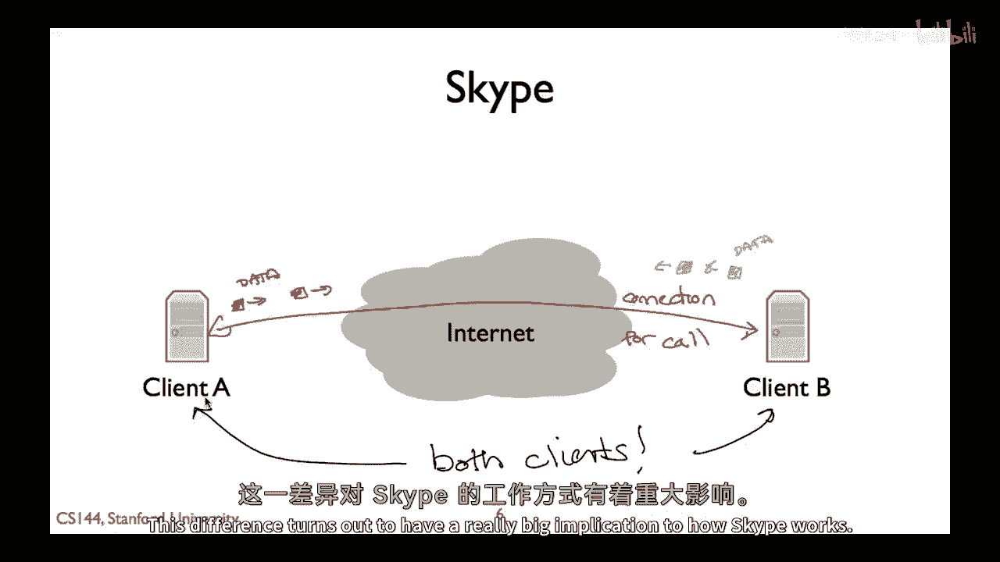

因此，而不是一个客户端和服务器之间的单个连接，您有一个客户端之间的密集连接图，动态交换数据。

---

## 应用示例三：Skype 📞

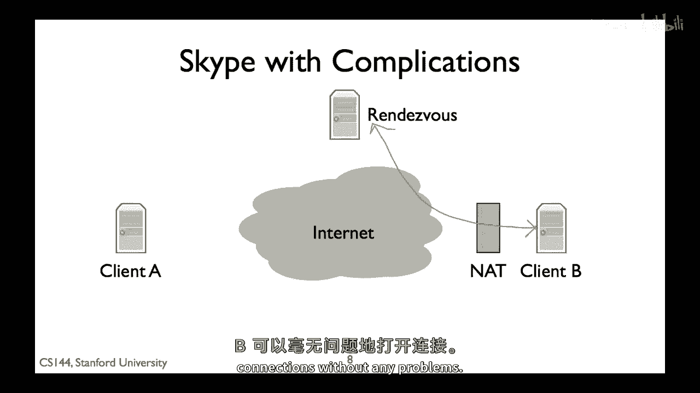

让我们看看Skype，流行的语音、聊天和视频服务。Skype的专有系统，在2008年没有关于其内部工作方式的官方文档。哥伦比亚的一些研究人员主要通过查看，以及Skype客户端发送消息的时间和地点。消息被加密，尽管他们在2011年无法查看内部。但是，一个主题的灌木丛消失了，反向工程了协议并发布了开源代码，所以现在我们对协议在最简单模式下的工作有了更好的理解。

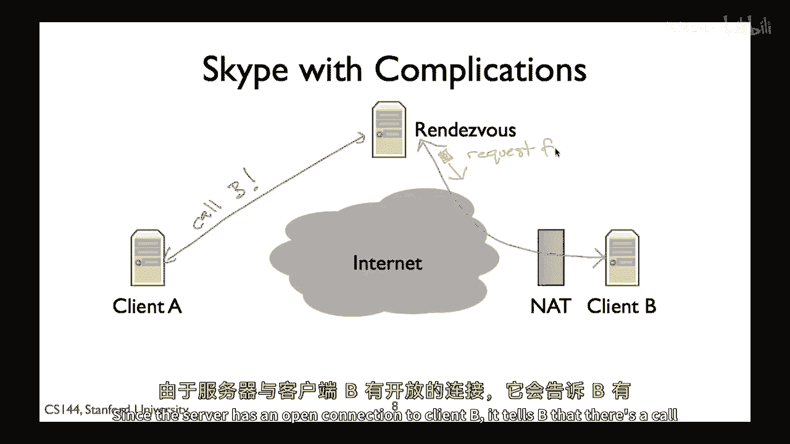

当你想要呼叫某人在Skype时，它是一个简单的客户端服务器交换，有点像HTTP。作为呼叫者，你打开与接收者的连接。如果接收者接受你的呼叫，你开始交换语音、视频或聊天数据。但是，与网页不同，在Skype的情况下，你没有客户端和服务器，你只有两个客户端。因此，而不是让个人电脑从专门的服务器请求东西，你有两个个人电脑在互相请求数据。这一差异最终对Skype的工作方式产生了极大的影响。

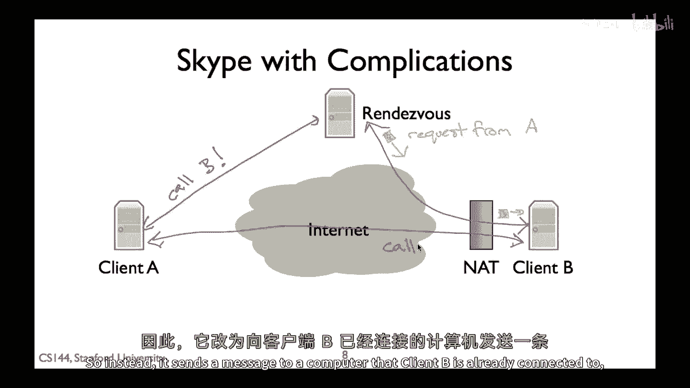

困难来自于一个叫做NAT或网络地址转换的东西。NAT今天处处可见。一个小型家庭无线路由器是一个应用。当手机连接到互联网时，它被一个应用保护。我们将在课程的后期详细讨论他们。但是，你现在只需要知道，如果你位于NAT后面，那么你就可以向外部互联网建立连接。但是，互联网上的其他节点很难轻易地向你建立连接。

在这个例子中，这意味着客户端B可以自由地向其他节点建立连接。但是，其他节点很难向客户端B建立连接。这就是这个红色绿色渐变的含义。来自绿色侧的连接工作正常，但是，来自红色侧的连接却不行。

所以，这里的复杂性在于，如果客户端A想要呼叫客户端B，它无法建立连接。它无法通过Skype，需要绕过这个问题。它这样做，使用被称为会晤服务器的东西。当你登录Skype，你的客户打开连接到控制服务器网络的连接。在这种情况下，客户端B打开连接到会晤服务器的连接。这工作得很好，因为服务器不在NAT后面，因此客户端B可以打开连接没有任何问题。

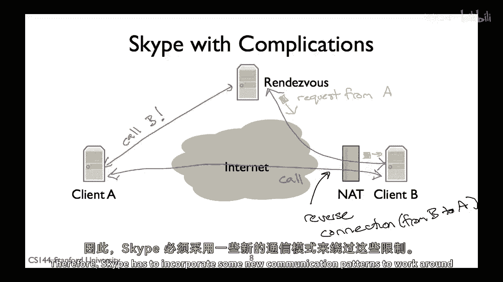

当客户端A呼叫客户端B，它向约会服务器发送消息。由于服务器已与客户端B建立开放连接，它告诉B有呼叫请求。在客户端B上弹出一个呼叫对话。如果客户端B接受呼叫，然后它为客户端A打开连接。客户端A正在尝试为客户端B打开连接，但由于B在网络后面，它不能。相反，它向连接客户端B的计算机发送消息，然后要求客户端B为客户端A打开连接。由于客户端A不在网络后面，这个连接可以正常打开。这个被称为反向连接，因为它逆转了启动连接的预期方向。客户端A正在尝试连接客户端B，但相反，客户端B为客户端A打开连接。

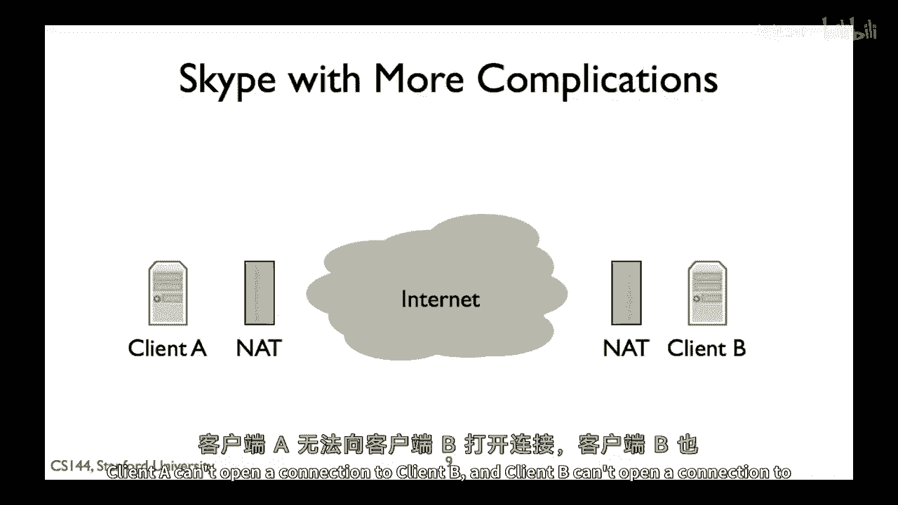

这在Skype中发生，因为Skype客户端通常是个人机器。公共可访问的Web服务器通常不在NAT后面。由于您想要服务器被互联网上的每个人都访问，将其放在NAT后面是一个坏主意。因此，连接到Web服务器的过程很容易。个人电脑，然而，它们通常因为安全和其他原因而在后面。因此，Skype必须集成一些新的通信模式来绕过它们。

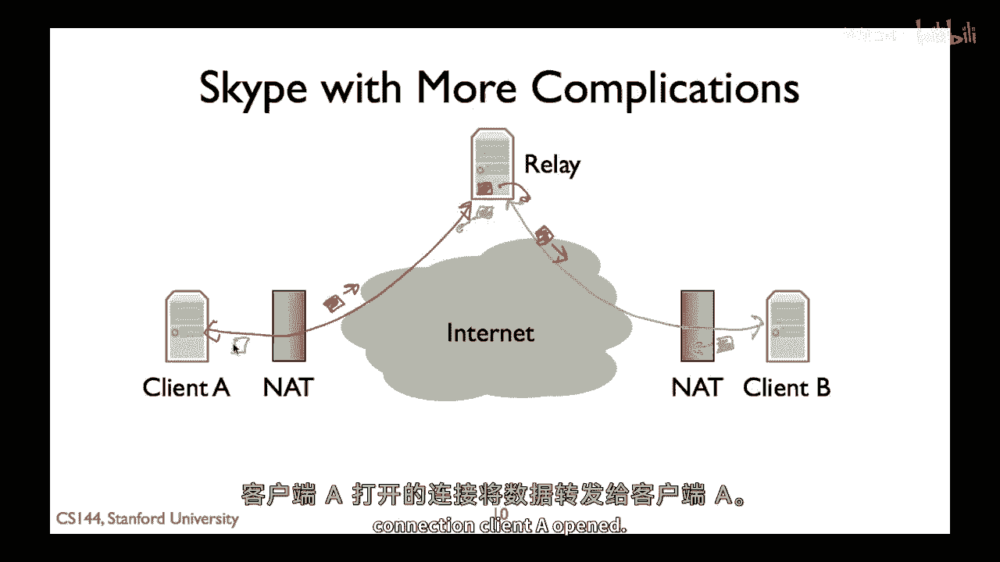

所以，如果两个客户端都在后面，我们不能反转连接。客户端A无法连接到客户端B，并且客户端B无法连接到客户端A。为了处理这个案例，Skype引入了一种第二种类型的服务器叫做中继站。中继站不能在NAT后面。如果两个客户端都在后面，然后他们通过中继站进行通信。他们都为中继站打开连接。当客户端A发送数据时，中继站通过客户端B打开的连接将其转发给B。当客户端B发送数据时，中继站将数据转发给客户端A。

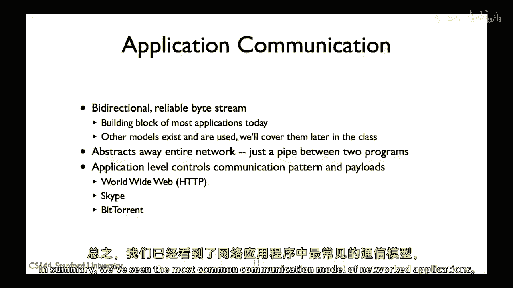

---

## 总结 📝

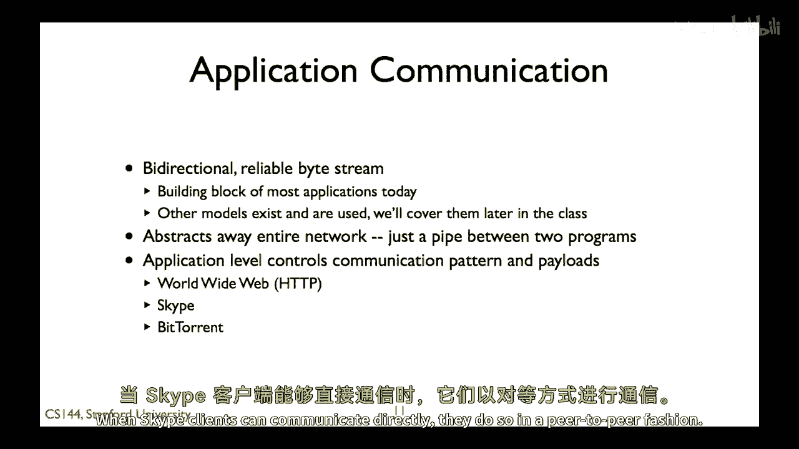

本节课中我们一起学习了网络应用程序的基础。我们看到了网络应用中最常见的通信模型之一：**可靠的双向字节流**。这允许在两台不同计算机上运行的程序交换数据。它抽象掉了整个网络到一个简单的读写关系。

尽管这是一个非常简单的通信模型，但它可以用于非常创新和复杂的方式。我们看了三个例子：世界 wide web、BitTorrent和Skype。

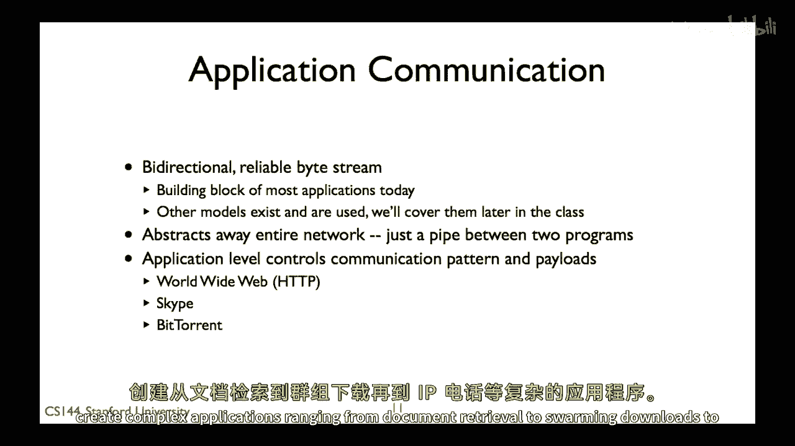

*   **世界 wide web** 是一个客户端服务器模型。客户端打开与服务器的连接并请求文档，服务器响应文档。
*   **BitTorrent** 是一种点对点模型。其中一群客户端相互建立连接并交换数据片段，形成密集的网络连接。
*   **Skype** 是两者的混合体。当Skype客户端可以直接通信时，它们以点对点的方式进行通信。但有时客户端无法直接建立连接，因此，他们会通过会晤服务器或中继服务器进行通信。

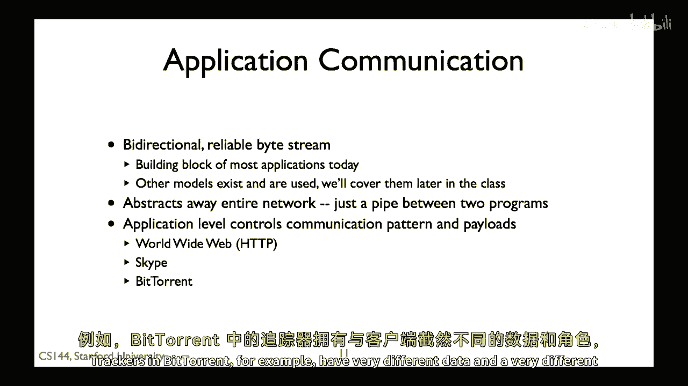

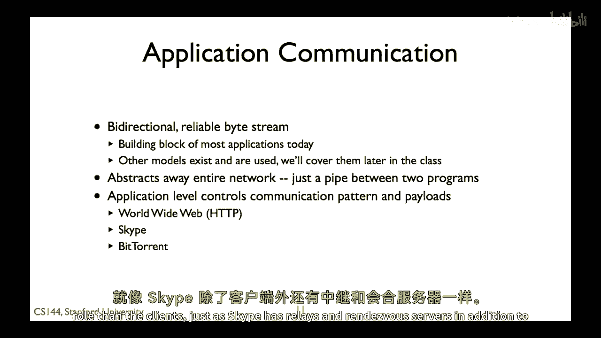

你可以看到，看似非常简单的抽象——双向可靠的字节流——可以在许多有趣的方式中使用。通过改变程序如何建立连接以及不同程序做什么，我们可以创建从文档检索到蜂群下载到IP电话的复杂应用。在BitTorrent中，IP电话跟踪者的角色与客户端有很大的不同，例如，它们拥有不同的数据和角色。