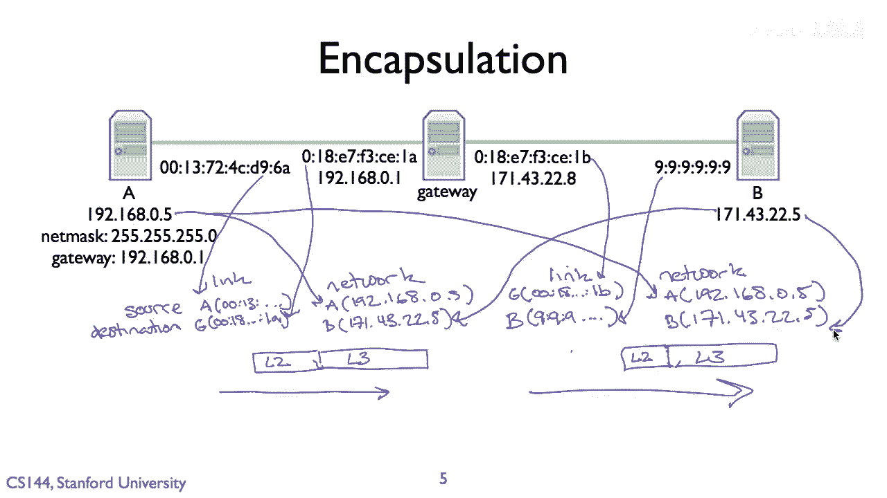
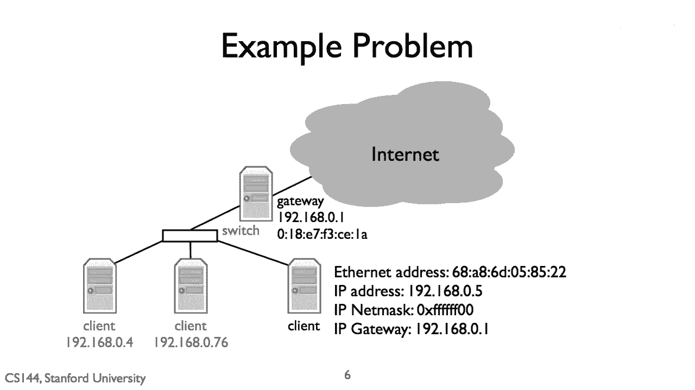
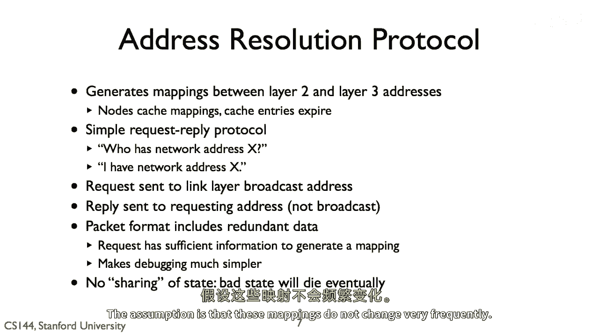
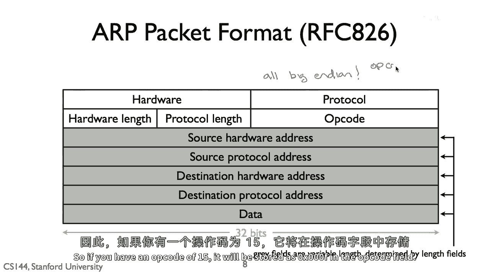
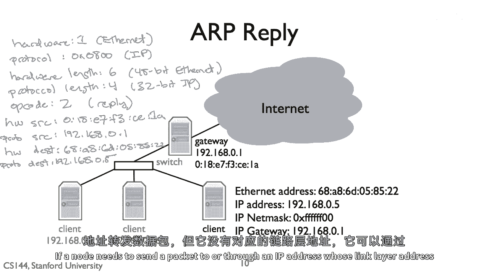

# P20：p19 1-11 Address Resolution Protocol (ARP) - 加加zero - BV1qotgeXE8D

地址解析协议（arp）是网络层发现链路地址的机制，与网络地址相关联，它直接连接到，换句话说，它是设备获取答案的方式，我有一个目的地地址是此地址的ip包。

我应该将包发送到哪个链路地址，arp是必要的，因为每个协议层都有其自己的名称和地址，ip地址是网络层地址，它描述一个主机，网络层的唯一目的地，链路地址，相比之下，描述特定的网络卡。

一个在链路层发送和接收帧的唯一设备，以太网，例如，有四个八位地址，每当你购买以太网卡时，它已经被预先配置为一个唯一的以太网地址，所以虽然ip地址说这个主机，以太网地址，说这个以太网卡。

通常，四个八位以太网地址被写成冒号，由六个十六进制八位数字分隔的集合，例如，零：一三：四：七二：二：四，一三：四：七九：二：四：四，四：七：零：二：四：四，四：七：零：二：四：五，二：四：四：七：零：

九，二：四：四：七：九：九，九：九：九：九：九：九，就像目的地b一样，一件事可能会让人感到困惑的是，虽然这些链路层和网络层地址在协议层分配和管理上是完全解耦的，从协议层的角度来看，它们可能不是，例如。

一个主机通常具有多个ip地址，一个为其每个接口，因为它涉及到网掩码的概念，例如，看看这个假设性的设置，其中b是网关，中间的网关只有一个ip地址，一九二点一点一，它需要，因为网掩码的概念，例如。

看看这个假设性的设置，其中b是网关，中间的网关只有一个ip地址，一九二点一点一，六十八点零点一，它具有2张网络卡，一张连接到目的地，一七一四三二二，五，一张连接到左侧的源，一九二点一，六十八点零点五。

现在网关地址是一九二点一，六十八点零点一，实际上只能处于这些网络中的一个，左侧的网络，源网络a，为了一九二点一需要的网掩码，六十八点一，要与一七一在同一网络中，四，三，二，二，五等于一，二，八点，零。

点，零，点零，或者只是网掩码的一比特，它不能是所有IP地址，第一个比特是一的地址，都在一七一的同一网络中，四，三，二，二，五，一，九十，二，点，一，六十，八点零点五，例如，需要通过网关到达，所以。

我们经常看到设置像这样，网关路由器有多个接口，每个都有他们自己的链路层地址来识别卡，并且每个也都有自己的网络层地址来识别网络中的主机，那个卡是网关的一部分，左侧的接口有IP地址一九二点一六十八点零点一。

零点一，正确的接口有IP地址171。4，三，228，链路层和网络层地址逻辑上解耦的事实，但在实践中在某些方面耦合，在某种程度上是一种历史遗迹，互联网开始时，有很多链路层，我想要能够在所有这些上面运行。

这些链路层不会突然开始使用IP地址，而是使用他们自己的地址方案，此外，结果发现，在许多情况下，拥有一个单独的链路层地址非常有价值，例如，当我在斯坦福的网络中注册一台电脑时，我已经注册了它的链路层地址。

这是网络卡的地址，这意味着什么，在实际应用中，假设，左边的节点a想要向右边的节点b发送一个包，它将生成一个源地址为119的ip ip包，两点，一六八点零到五点，目的地地址一七一点，四十三，二十二点五。

节点a检查目的地地址是否在同一网络，网掩码告诉它，目的地地址不在同一网络二五五，二五五二五五，这意味着节点a需要发送包通过网关，或一九二点，一六八点，零点一用来做这件事。

它发送一个网络层目的地址为171423225的包，但链路层目的地址是网关的链路层地址，所以包有一个网络网络层目的地址1714，3225和链路层目的地址018e7f3ce1a，网络层源是192。168。

0。5，链路层源是0，13，724cd96a，所以我们有一个从a到b的ip包，封装在从源到左网关接口的链路层帧中，当包到达网关时，网关查找下一个跳点，决定它是节点B，并将IP包放入到发往B的链路层帧中。

所以从A到B的第二个IP包在一个链路层帧中，从右网关接口到B。

所以这里我们遇到了问题，ARP解决了，我的客户知道它需要发送一个通过具有IP地址一的网关的包，192。168。1，六十八点零一用于此，然而，它需要关联一个一九二点一的链路层地址，六十八点零。

它如何获取这个地址，我们需要某种方式能够映射一层，三个网络层地址到其对应的链路层二层地址，我们使用名为arp或地址解析协议的协议来完成此操作。

arp是一个简单的请求回复协议，每个节点都保持一个映射缓存，从其网络上的ip地址到链路层地址，如果一个节点需要向IP地址发送数据包，它没有该IP地址的映射，发送网络地址为x的请求者，网络地址为x的节点。

网络地址响应，说的我的网络地址是x，响应包括在接收响应时接收层的地址，请求者可以生成映射并发送数据包，以便每个节点都能听到请求，一个节点向链路层广播地址发送请求，网络中的每个节点都将听到数据包，此外。

ARP的结构使其包含冗余数据，请求包含网络和请求者的链路层地址，那样，当节点听到请求时，因为它是广播，他们可以在他们的缓存中插入或刷新映射，节点仅对针对自己的要求做出响应。

这意味着假设没有人在生成数据包时出错，"你只能通过以下方式为另一个节点生成映射"，"是对节点发送包的响应"，"如果另一个节点崩溃或断开连接"，"其状态不可避免地将离开网络"，当所有缓存映射都过期时。

"这使得调试和故障排除变得更加容易"，"那么，这些动态发现的映射将持续多久？"，这取决于设备，"mac os ten的一些版本"，例如，保留它们大约二十分钟，一些思科设备使用四小时的超时时间。

这些映射的假设是它们不会改变得很频繁。

这就是arp包的实际外观，它具有十个字段，硬件字段表示，这个请求或响应的链路层是什么，协议字段表示，这个请求或响应的网络协议是什么，链路字段表示，指定链路层和网络层地址的长度是多少。

操作码指定包是请求还是响应，四个地址字段是用于请求和指定映射的，记住所有这些字段都存储在网络顺序或大端序中，所以，如果你有一个操作码为十五。

你将被存储为零 x 零，零零 f 在操作码字段中，所以，让我们说，我们的客户端想要通过其网关将包发送到更广泛的互联网，但它没有网关的以太网地址，ARP请求将指定硬件是以太网，这是值一，协议是ip。

值为零x零八零零，硬件地址长度为六，协议长度为四，操作码将为请求，值为一，源硬件字段将为请求者的以太网地址六十八八，八，六十零五，八十二，八十五，二二，源协议字段是请求者，IP地址一九二点一六八点零五。

目标语言硬件地址可以设置为任何，这是这个包试图发现的目标语言地址，它是地址，客户端正在寻找对一九二一六八零一的映射，客户端在以太网上发送这个帧，网络中的所有节点都收到它。

并刷新发送者与目标语言地址之间的映射，链路层地址六十八a八六零五，八五二二，并且其网络层地址为192。168。0。5，点1。60。8。0。5，或者它插入一个映射，如果它还没有一个。

客户端将生成arp请求，如果链路层的源地址是其地址，68a8，605，8222，目的地链路层地址是广播地址，FFFFFFFFFF，网关看到请求是为其IP地址的，因此生成与请求类似的回复。

回复将指定硬件是以太网，这是值一，协议IP是值零x零八零零，硬件地址长度是六，协议长度是四，操作码将是回复的值是二，它们是p源硬件字段将是以太网地址零一八e七f三。

Ce a one one a sorry，源协议字段是答案一，九十二点一六八点零一点零，目标语言硬件地址是请求的源语言硬件地址六八八六零五，八五二二。

目标语言协议地址是请求的源语言协议地址一九二一六八零五，这是一个开放问题，你发送什么链路层地址，对原始arp规范的响应，指出应该将该消息发送到请求者的链路层地址，因此为单播，今天，广播它很常见，然而。

因为这样做，它可以更积极地替换缓存条目，如果映射需要更改，节点也可以发送被称为随意arp包的消息，以请求不存在的映射，以便在网络上自我广告，所以我们看到了，为了路由数据包。

一个人需要能够将网络层地址映射到链路层地址，地址解析协议或arp通过简单的请求回复交换提供此服务，如果一个节点需要发送一个包到，或通过IP地址，其链路层地址未知的。

