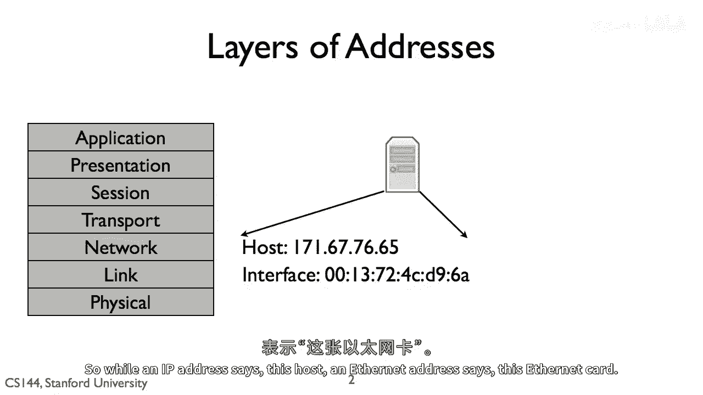
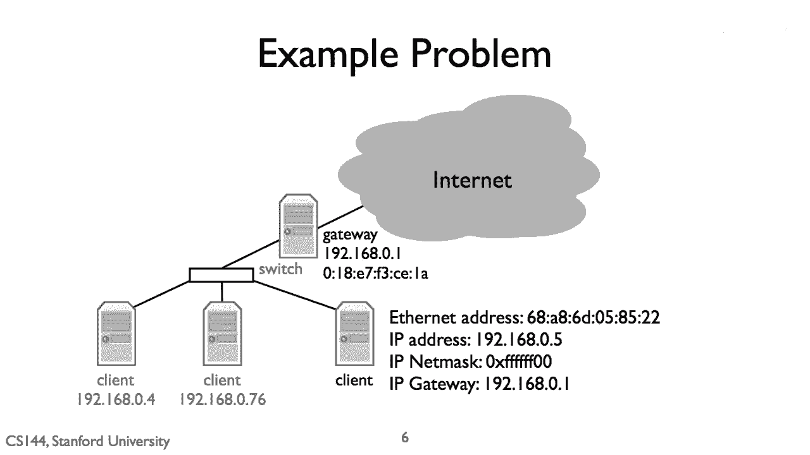
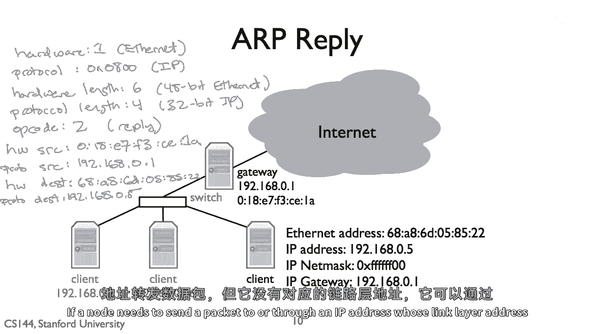

# 网络协议基础 P20：地址解析协议 (ARP) 🔍


在本节课中，我们将要学习**地址解析协议（ARP）**。ARP是网络层用于发现链路层地址的机制。它解决了设备在发送IP数据包时，如何确定目标链路层地址的问题。

## 协议层与地址



上一节我们介绍了网络分层的基本概念，本节中我们来看看不同协议层地址的区别。

每个协议层都有其自己的名称和地址。IP地址是网络层地址，它描述一个主机在网络层中的唯一目的地。相比之下，链路层地址描述特定的网络接口卡（NIC），它是一个在链路层发送和接收帧的唯一设备。

例如，以太网地址是一个48位（6字节）的地址，通常写作由冒号分隔的六个十六进制数，如 `00:13:04:72:02:04`。当你购买以太网卡时，它已经被预先配置了一个唯一的以太网地址。

所以，IP地址标识“这台主机”，而以太网地址标识“这张以太网卡”。

## 地址的耦合与解耦

虽然链路层和网络层地址在协议层的分配和管理上是完全解耦的，但在实际应用中，它们并非毫无关联。

一个主机通常具有多个IP地址，每个接口一个。这涉及到子网掩码的概念。例如，在一个典型的网络设置中，网关路由器有多个接口，每个接口都有自己的链路层地址（标识网卡）和网络层地址（标识该接口在网络中的位置）。

左侧接口的IP地址可能是 `192.168.0.1`，右侧接口的IP地址可能是 `171.43.228.1`。这种逻辑上解耦但在实践中耦合的情况，部分是由于历史原因：互联网需要能在各种已有的链路层技术上运行。

## ARP解决的问题

现在，我们来看看ARP具体要解决什么问题。

假设节点A（IP: `192.168.0.5`）想要发送一个IP数据包给节点B（IP: `171.43.228.5`）。A检查目标地址，发现B不在同一子网内（通过子网掩码 `255.255.255.0` 判断）。因此，A需要将数据包发送给网关（IP: `192.168.0.1`）。

于是，A构造的IP包：
*   **网络层目标地址**：`171.43.228.5` (B)
*   **网络层源地址**：`192.168.0.5` (A)


但是，为了在链路上传输，这个IP包必须封装在一个链路层帧中。A需要知道网关 `192.168.0.1` 对应的**链路层地址**（如MAC地址），才能正确填写帧头。



**ARP就是为了解决这个“如何将网络层IP地址映射到链路层MAC地址”的问题而设计的。**

## ARP协议工作原理

ARP是一个简单的请求-回复协议。每个节点都维护一个ARP缓存，用于存储IP地址到MAC地址的映射。

以下是ARP的基本工作流程：

1.  **检查缓存**：当节点需要向某个IP地址发送数据时，首先检查自己的ARP缓存中是否有该IP的映射。
2.  **发送ARP请求**：如果缓存中没有映射，节点会构造一个**ARP请求**包。这个包的主要内容是：“谁的IP地址是 `X.X.X.X`？请告诉 `Y.Y.Y.Y`（我的IP）”。
3.  **广播请求**：节点将这个ARP请求包封装在链路层帧中，**目的MAC地址设置为广播地址**（如 `FF:FF:FF:FF:FF:FF`）。这样，同一局域网内的所有设备都会收到这个请求。
4.  **处理请求**：所有收到广播的节点都会查看请求中的“目标IP地址”字段。如果与自己的IP不匹配，则忽略该请求，但可以顺便将发送者的IP和MAC地址记录到自己的ARP缓存中（这是一种优化）。
5.  **发送ARP回复**：只有IP地址匹配的节点（即被询问的节点）会构造一个**ARP回复**包。包的内容是：“我的IP地址是 `X.X.X.X`，我的MAC地址是 `AA:BB:CC:DD:EE:FF`”。
6.  **单播回复**：该节点将这个回复包**单播**发送给请求者（使用请求包中提供的请求者MAC地址）。
7.  **更新缓存并发送数据**：请求者收到回复后，将IP到MAC的映射存入自己的ARP缓存。随后，它就可以使用这个MAC地址来封装链路层帧，并发送之前等待的数据包。


ARP缓存中的条目不是永久有效的，它们有一个生存时间（TTL），超时后会被删除。这确保了当网络设备更换或地址变更时，映射信息能够更新。

## ARP数据包格式


为了更好地理解ARP，我们来看看ARP数据包的格式。一个ARP包包含以下字段：

*   **硬件类型**：指明链路层类型，如以太网（值为1）。
*   **协议类型**：指明要映射的网络层协议地址类型，如IP（值为 `0x0800`）。
*   **硬件地址长度**：指明MAC地址的长度（单位：字节），以太网为6。
*   **协议地址长度**：指明网络层地址的长度（单位：字节），IPv4为4。
*   **操作码**：指明是ARP请求（1）还是ARP回复（2）。
*   **发送方MAC地址**：发送者的链路层地址。
*   **发送方IP地址**：发送者的网络层地址。
*   **目标MAC地址**：在请求中，此字段通常填充为0；在回复中，是请求者的MAC地址。
*   **目标IP地址**：要查询或回复的IP地址。

所有字段都按**网络字节序（大端序）**存储。

**示例：ARP请求包关键字段**
```plaintext
操作码: 1 (请求)
发送方MAC: 68:A8:60:58:52:22
发送方IP: 192.168.0.5
目标MAC: 00:00:00:00:00:00 (填充0)
目标IP: 192.168.0.1
```

**示例：ARP回复包关键字段**
```plaintext
操作码: 2 (回复)
发送方MAC: 01:8E:7F:3C:E1:1A
发送方IP: 192.168.0.1
目标MAC: 68:A8:60:58:52:22
目标IP: 192.168.0.5
```

## 总结

本节课中我们一起学习了**地址解析协议（ARP）**。

我们了解到，为了在不同网络层之间传递数据，需要将网络层的IP地址映射到链路层的MAC地址。ARP通过一个简单的**广播请求、单播回复**的机制，动态地发现和维护这种映射关系。每个设备维护的**ARP缓存**提高了效率，避免了每次通信都要进行ARP查询。



ARP是局域网通信的基础协议，它使得IP数据包能够被正确地封装在链路层帧中，从而到达下一跳设备或最终目的地。