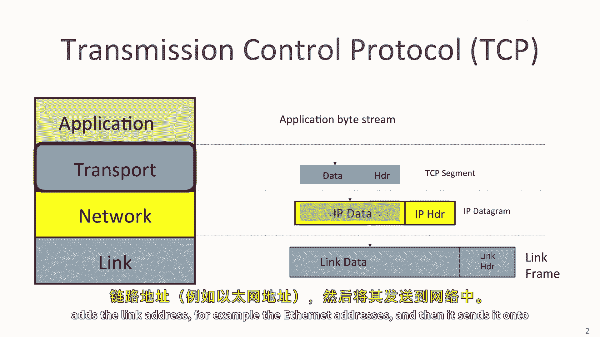
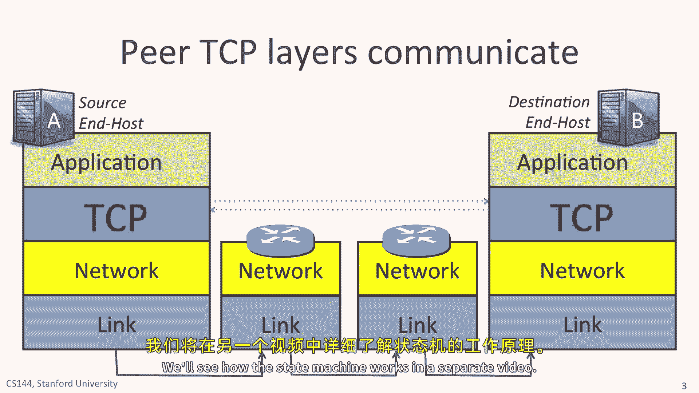
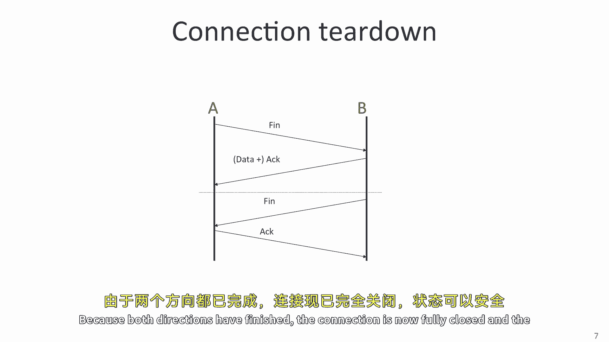
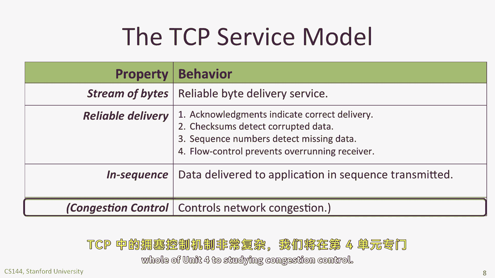
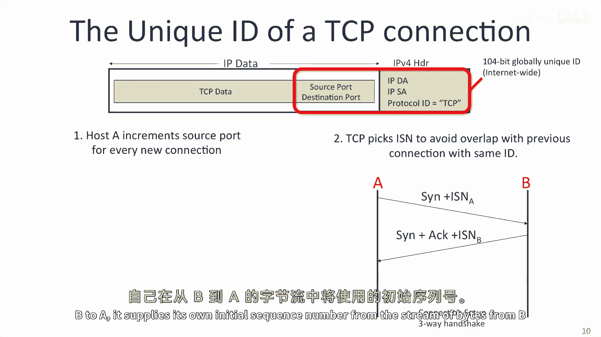
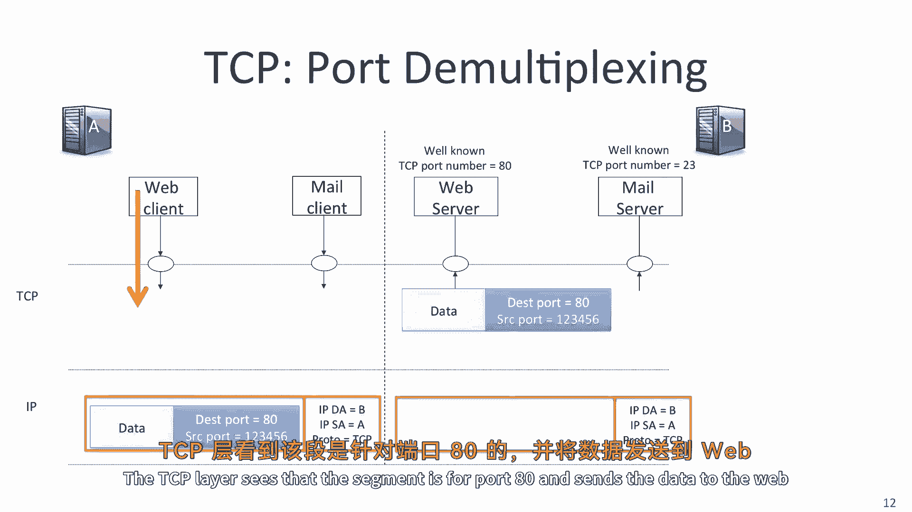
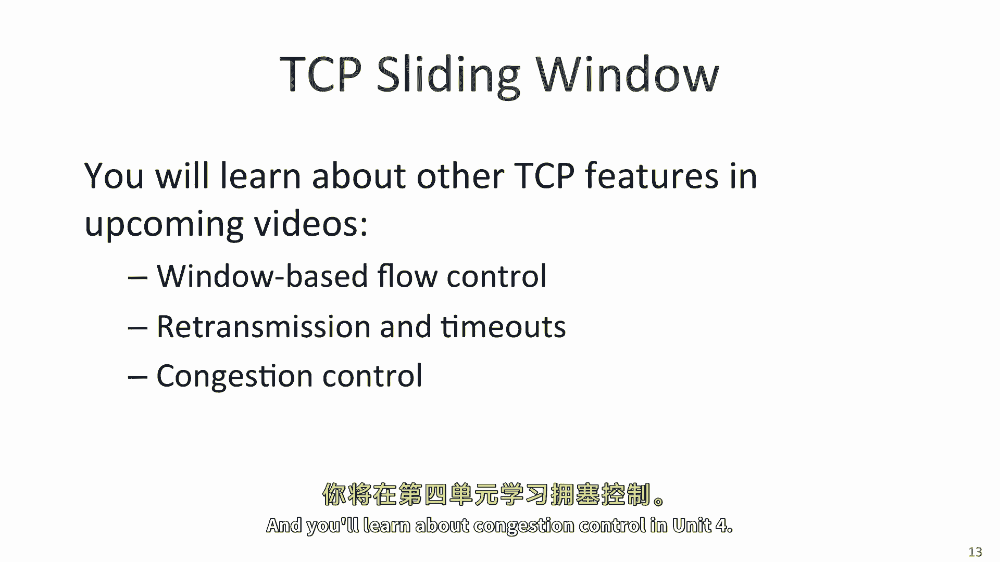
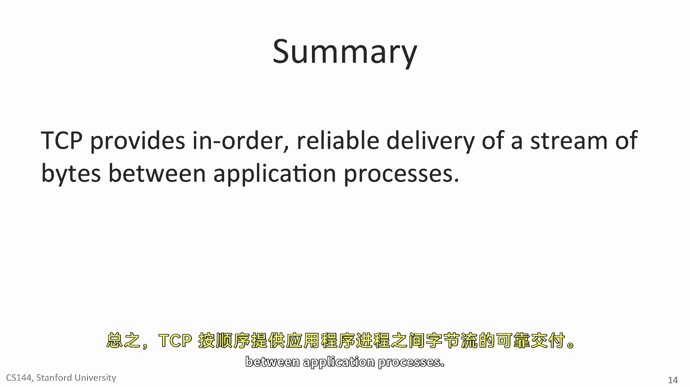

# P23：p22 2-1 TCP service model - 加加zero - BV1qotgeXE8D

在这个视频中，你将学习TCP，传输控制协议，它是所有互联网应用中超过九十五 percent使用的，TCP几乎普遍使用因为它提供了可靠的端到端服务，几乎所有应用都想要的双向字节流服务。

TCP是传输层的一个例子，当一个应用使用TCP时，它，将一些字节交给它以前交付给另一端的，TCP将这些字节放入TCP段，然后从那里获取，TCP将段交给IP层，IP层将其封装成一个IP数据包。

添加IP地址，数据包依次交给链路层，链路层构建链路帧，添加链路地址，例如。

以太网地址，然后它将其发送到线缆，当两个应用程序使用tcp时，它们在两端的tcp对端之间建立双向通信通道，首先，tcp从a到b建立通信通道，然后它从b到a建立通道。

我们在连接的两端都称为这种双向通信为连接，tcp保持一个状态机来跟踪连接的状态如何，我们将在单独的视频中看到状态机的工作方式。

tcp连接使用a和b主机之间的三手握手建立，首先，a主机向b主机发送消息，指示a主机的tcp层想要建立与b主机的连接，与b主机的tcp层建立连接，这个消息被称为sin消息yn。

yn是synchronize的缩写，因为a主机也一并发送它将用于在字节流中识别字节的基数，如果它发送零，那么数字将从零开始，如果它发送一千，那么他们将从一千开始，B回复我们称为的罪加行为b信号一个行为。

因为b承认了a的请求，并同意从a到b建立通信，b层的tcp也向a发送一个sin，以指示b层的tcp想要建立连接，与a层的tcp，它发送一个数字二，指示反向字节流的起始数字，最后a回复一个行为。

以指示它接受反向方向的通信请求，连接在两方都已经设置完毕，他们现在准备好向彼此发送数据，主机向其他主机发送数据，相互发送数据，仿佛来自连续的字节数据流，假设时间从左到右增加。

并且与a旁边的字节流代表a想要发送到b的字节数据，字节流可能在提前存在，例如，他们从描述静态网页的html文件中读取数据，或者可能是实时生成的流，例如，无论哪种方式，来自视频摄像头的数据。

tcp将其视为字节流，a应用程序的数据被传递给b应用程序，a和b的tcp层一起工作，以确保字节流的正确传递，以便于b应用程序，字节流由tcp段传递，a将字节流放入tcp段，交给ip层，后者将其传递给b。

b的tcp层提取字节以重新创建字节流，并将其传递给b应用程序，在实际应用中，tcp段可能需要多次传输，在段在传输过程中丢失的情况，或者如果a没有收到确认，tcp段可能只有一字节，例如。

如果你在ssh会话中输入字符，每个字符一次发送，而不是等待整个段填满，这在我们有大量数据要发送时并不效率，所以我们可以填满tcp段，直到最大ip数据包大小，当a和b完成向彼此发送数据后。

他们需要关闭连接，我们说他们拆除连接，这意味着他们告诉对方他们正在关闭连接，并且双方都可以清理与状态机相关的状态，a主机的tcp层可以通过发送fin消息来关闭连接，这是finish的缩写。

b主机确认a不再有数据要发送，并停止寻找来自a的新数据，这关闭了从a到b的数据流，但b可能仍然有新数据要发送给a，并且还不准备好关闭从b到a的通道，所以b发送到a的消息，携带的动作。

也可以携带b发送到a的新深度数据，B可以持续向A发送新数据，直到它需要为止，稍后，B向A发送完数据后，然后向A发送自己的FIN来告诉它们可以关闭连接，主机A通过发送一个动作来回应，确认连接现在已经关闭。

因为两个方向都已经完成，连接现在已经完全关闭，状态可以安全地删除。

以下是TCP提供的服务的总结表，前三个是服务，TCP提供给应用程序，正如我们刚刚看到的，它提供了一个在两个应用程序之间可靠的字节流，Tcp使用四个机制来使通信可靠，换句话说。

为了确保当tcp层接收到数据时，数据能被正确地交付，它会向发送者发送一个确认，让它知道数据到达正确，校验和检测损坏的数据，tcp头部携带一个覆盖头部和段内数据的校验和，校验和在那里是为了检测。

如果段在途中被损坏，例如，由于电线上的微小错误或路由器内部的内存故障，序列号检测数据丢失，每个段的头部在字节流中都携带序列号，例如，段的第一个字节，例如，如果双方同意序列号从一千开始。

那么第一个段将具有序列号一千，如果段携带五百字节的数据，那么下一个段将携带序列号一千，五百，如果一个段被丢失，那么序列号将会错误，TCP层知道有一些数据丢失了，它可能后来会出现，也许它走了更长的路。

或者它可能丢失了，在这种情况下，发送者需要重新发送数据，流量控制防止接收器溢出，如果主机a比主机b快得多，然后，主机a有可能完全压倒主机a，B通过发送如此之快的数据，使主机b无法跟上。

TCP防止这种情况发生，使用我们称为TCP流量控制的东西，接收者持续告诉发送者它是否可以继续发送，它告诉发送者它的缓冲区中有多少空间可以接受新数据，如果主机b落后，空间下降，可能全部下降到零。

当它有更多的空间，它告诉a并可以发送更多的数据，TCP将数据以正确的顺序交付给应用程序，换句话说，无论从应用程序到TCP的hostA的数据以何种顺序交付。

它在hostB从TCP到应用程序发送时都是以相同的顺序，如果分段到达顺序错误，TCP层使用序列号将它们重新排序为正确的顺序，最后，TCP通过控制拥塞为整个网络提供服务，TCP。

尝试将网络容量均匀地分配给所有TCP连接，使用网络，TCP的拥塞控制机制非常复杂，并将整个第四单元 dedicated 用来研究拥塞控制。

TCP分段头比IP和以太网头长且更复杂，例如，IP和以太网头，这是因为TCP连接是可靠的，为了使通信可靠，连接的两端需要交换更多的信息，以便他们知道哪些字节已经到达，哪些在连接状态中缺失。

以下是TCP头中最重要的字段摘要，你不需要记住头的布局，但如果你需要参考，你应该学习每个字段做什么，我推荐查阅维基百科或科里奥伊和罗斯教科书，目的地端口告诉TCP层应将字节交付给哪个应用程序，在另一端。

当新连接开始时，应用程序告诉TCP打开与哪个服务连接，例如，如果TCP携带Web数据，它使用端口80，这是TCP的端口号，你将在后来学习更多关于端口号的信息，但如果你感兴趣。

你可以在IANA网站上查找已知端口号，那就是在网站上搜索'iana port numbers'，你将找到数千个为不同已知服务定义的端口号，例如，当我们连接到SSH服务器时。

我们使用目的地端口22用于SMTP，简单邮件传输协议，我们使用端口23使用已知端口号，让我们在hostB中识别应用程序，它应该与，源端口告诉TCP层的另一端，它应该使用哪个端口再次发送数据。

在我们的例子中，当hostB回复hostA时，它应该将hostA的源端口号放在目的地端口字段中，以便hostA的TCP层可以将数据交付给正确的应用程序，当新的应用程序，当新的连接，启动连接的发起者。

在我们的情况下，主机A生成一个唯一的源端口号，以区别于任何其他连接，从主机A到主机B，指向相同的服务，序列号指示在字节流中第一个字节的位置，在TCP数据字段中，例如，如果初始序列号是一千。

并且这是第一个段，那么序列号就是一千，确认序列号告诉其他端我们期待下一个字节的位置，它还说，我们已经成功地接收到了直到这个字节号之前的每一字节，所以，例如，如果确认序列号是七百五十一。

这意味着我们已经收到了包括字节七百五十在内的所有字节，注意，每个分段都有对双方方向的序列号，这样，tcp p在数据分段上回传确认，在相反的方向上，十六位的校验和是对整个头部和数据的计算。

并帮助接收者检测损坏的数据，例如，电线上的位错误或路由器中的故障内存，你将在后续的视频中学习更多关于错误检测和校验和的信息，头部长度字段，最左边的那个告诉我们TCP头部有多长，TCP选项字段是可选的。

它们携带额外的新头部字段，这些字段是在TCP标准创建后被想到和添加的，TCP标准创建后，头部长度字段告诉我们选项字段有多少个，通常没有，最后，用于传递信息的旗帜有很多，从连接的一端到另一端。

动作旗帜告诉我们确认序列号是有效的，我们正在确认所有到这个点的数据，罪旗告诉我们我们在发送一个同步，这是三次握手的一部分，用于设置连接，并入旗信号关闭连接的一端，最后。

Psh标志告诉我们TCP层的另一端，在到达时立即交付数据，而不是等待更多的数据，这对于发送短段非常有用，携带时间敏感的数据，如键盘敲击，我们不想让TCP层等待积累许多键盘敲击。

在将它们交付给应用程序之前，TCP连接由五个信息唯一标识，在TCP和IP头部，源IP地址和目的地IP地址唯一标识终端点，TCP协议ID告诉我们连接是TCP。

TCP源端口和目的地端口共同标识端主机上的应用进程在任何瞬间，所有五个字段互联网上唯一标识TCP连接，现在唯一ID只持有，如果一些事情首先保持，我们需要确保主机a，连接的发起者选择一个唯一的源端口ID。

我们需要确保它不会意外地选择它已经使用的源端口号，与主机b上的同一服务建立另一个连接时，主机a使用简单方法最小化机会，它为每个新连接增加源端口号，字段是十六位的，所以需要六十四 k个新连接才能使新字段。

字段环绕，也存在一个非常小的危险，如果主机a突然为主机b创建许多新连接，它可能仍然环绕并尝试创建两个具有相同全球ID的连接，如果这种情况发生，来自一个连接的字节可能会与来自另一个连接的字节混淆。

这可能发生，例如，如果TCP分段在某种方式在网络上存活了很长时间，被困在路由器缓冲区中，或循环在临时环路中以减少混淆的机会，TCP连接以随机的初始序列号初始化，以引用字节流中的字节。

虽然不完全 foolproof，但它确实减少了当主机a向主机b发起连接时混淆的机会，它包括它将在从a到b的字节流中使用的初始序列号，当b回复时，并从b到a发起连接时，它提供自己的序列号。

来自从b到a的字节流的初始序列号。

所以，总结序列号如何工作，从a到b的段的序列号包括第一个字节的序列号，偏移初始序列号，从b返回到a的段的确认序列号，告诉我们b期待下一个字节的偏移量，基于a的初始序列号，让我们总结TCP端口号如何工作。

想象主机b在右边提供的两个服务，一个Web服务器和一个邮件服务器，当Web客户端，例如，一个Chrome浏览器在主机a想要请求b上的Web服务器页面时，它发送数据给TCP。

我们假设TCP已经与b建立了连接，所以现在它只需要发送数据，它创建了一个段，并使用目的地端口八十告诉b，它正在请求数据被发送到Web服务器，主机为b使用本地生成的源端口号，当发送数据和确认消息时。

像往常一样，tcp段被封装在一个ip数据包中并发送以被，ip和tcp头部携带tcp连接的唯一id，在整个互联网上，当ip数据包到达b时，tcp段被移除，tcp层看到该段是为端口八十的。

并将数据发送到web服务器，tcp滑动窗口，你将在即将到来的视频中学习其他tcp特性，你将学习基于窗口的流量控制，以阻止我们压倒接收者，你将学习传输和超时，以及实现它的不同机制。

并在第四单元学习拥塞控制。

所以总的来说。

