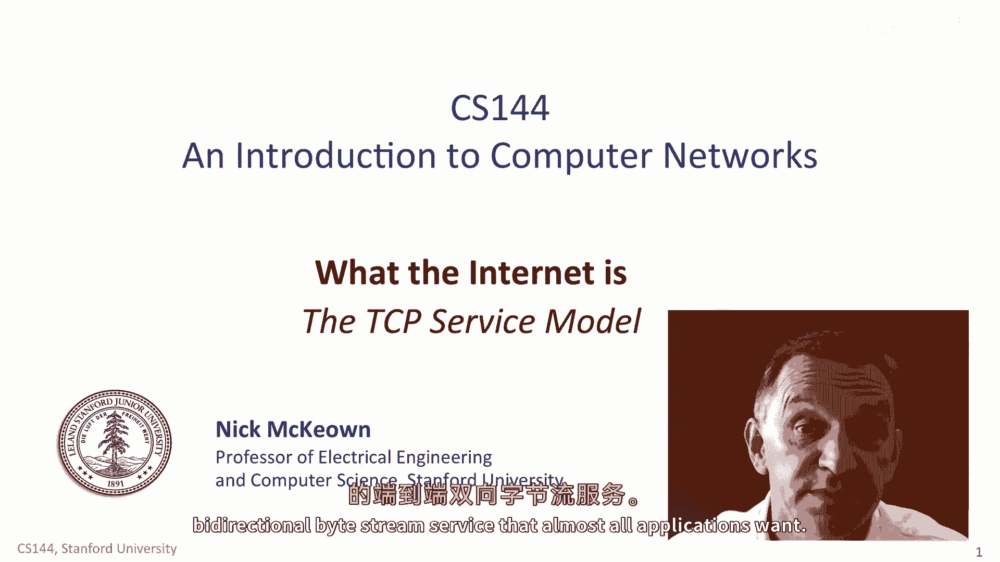
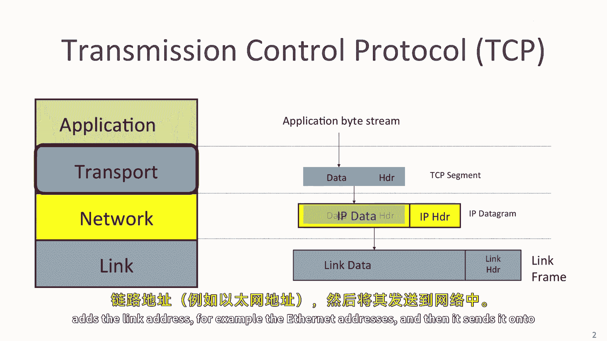
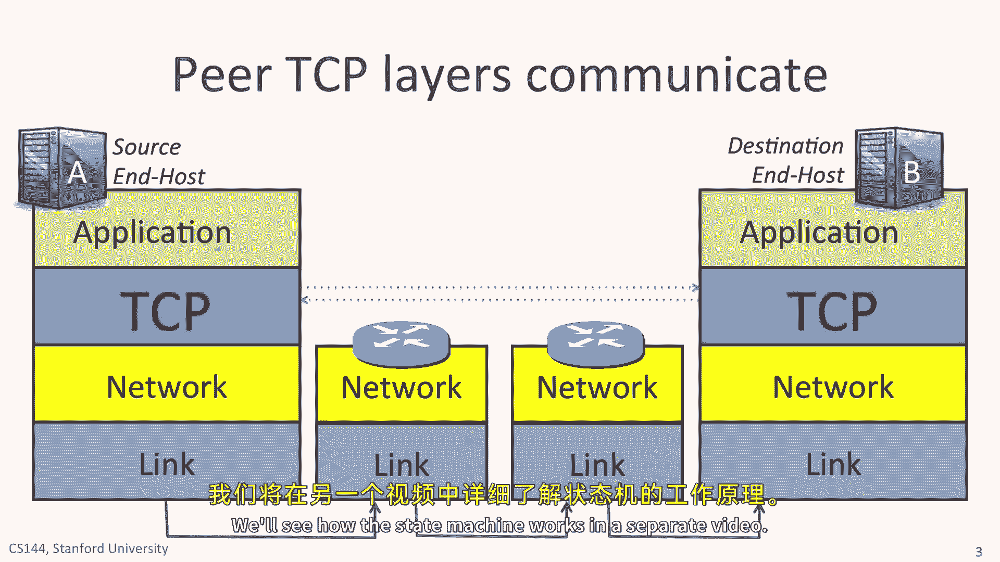
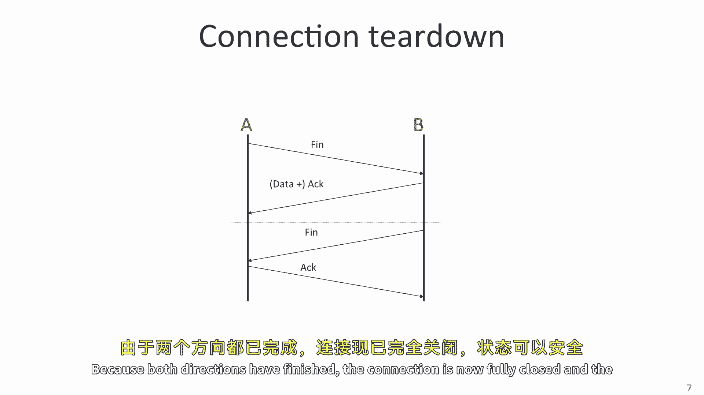
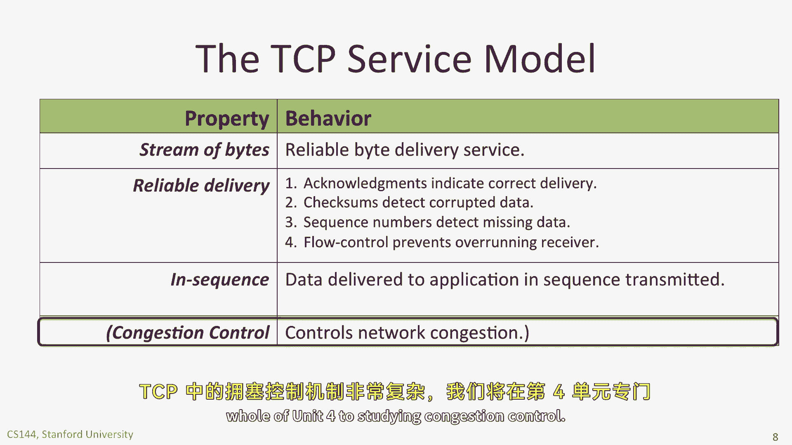
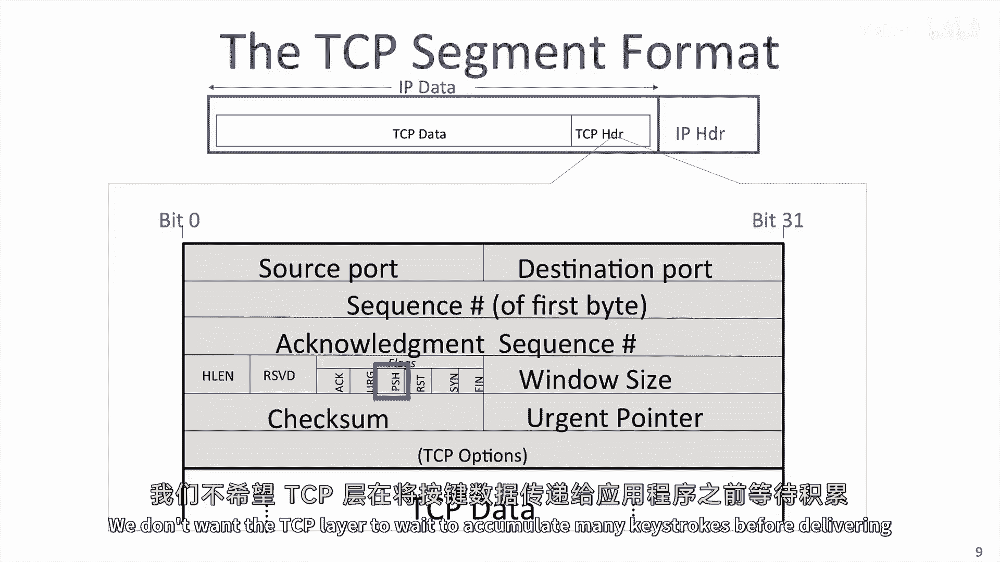
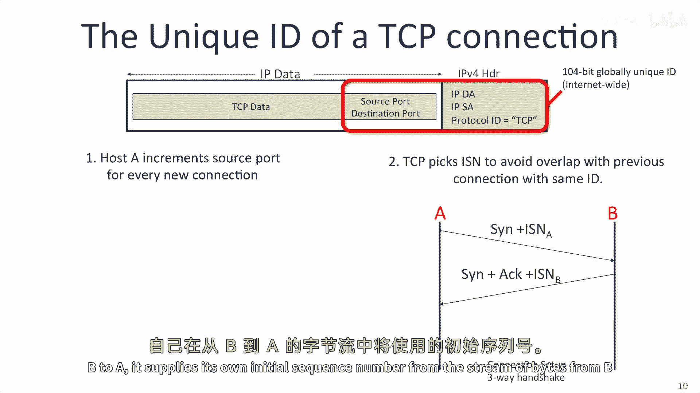
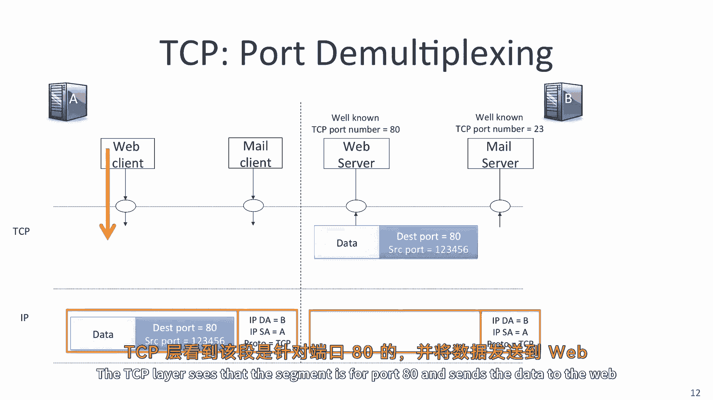
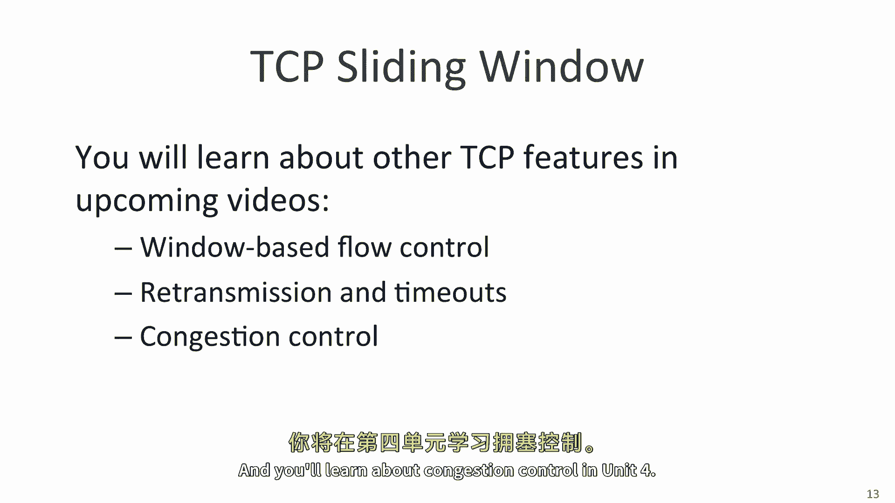
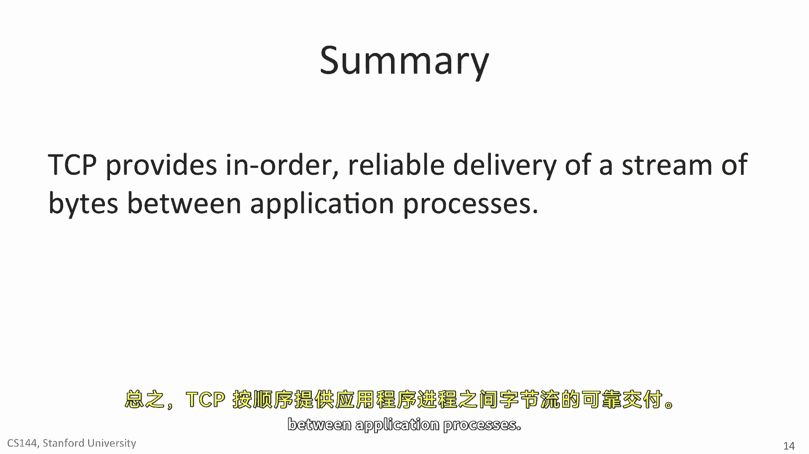

# 计算机网络课程 P23：TCP 服务模型详解 🧩



在本节课中，我们将要学习传输控制协议（TCP）的核心服务模型。TCP是互联网上超过95%应用所使用的传输层协议，因为它为应用程序提供了可靠的、双向的字节流通信服务。



---



## TCP 概述与角色

TCP是传输层协议的一个典型例子。当一个应用程序使用TCP时，它会将数据字节交给TCP层。TCP层将这些字节封装成**TCP段**，然后交给下层的IP协议处理。

IP层将TCP段封装成**IP数据包**，添加IP地址。接着，数据包被交给链路层，链路层构建**链路帧**（例如以太网帧），添加链路地址（如MAC地址），最后通过物理介质（如网线）发送出去。

当两个应用程序使用TCP通信时，它们会在两端建立一个双向的通信通道，我们称之为**TCP连接**。TCP通过一个**状态机**来跟踪和管理连接的状态。

---

## TCP 连接的建立与拆除

### 三次握手建立连接

TCP连接通过**三次握手**过程建立，以确保双方都准备好通信。

1.  **SYN**：主机A向主机B发送一个SYN（同步）报文，表示希望建立连接，并告知A方字节流的初始序列号（例如从1000开始）。
2.  **SYN-ACK**：主机B回复一个SYN-ACK报文。ACK部分确认收到了A的SYN请求，SYN部分表示B也希望建立反向连接，并告知B方字节流的初始序列号。
3.  **ACK**：主机A最后发送一个ACK报文，确认B的SYN请求。至此，双向连接建立完成。



**公式表示握手过程**：
```
A -> B: SYN (Seq=A_ISN)
B -> A: SYN-ACK (Ack=A_ISN+1, Seq=B_ISN)
A -> B: ACK (Ack=B_ISN+1)
```

### 数据传输

连接建立后，应用程序可以将数据视为连续的**字节流**交给TCP。TCP负责将字节流分割成段，确保其可靠、有序地送达对端。即使网络状况不佳，TCP也能通过重传等机制保证数据正确到达。

### 四次挥手拆除连接

当通信结束时，需要通过**四次挥手**来优雅地关闭连接。

1.  **FIN**：主机A发送FIN（结束）报文，表示A没有更多数据要发送了。
2.  **ACK**：主机B回复ACK，确认A的FIN请求。此时，A到B的数据流关闭，但B到A的通道仍可传输数据。
3.  **FIN**：当主机B也没有数据要发送时，它向A发送自己的FIN报文。
4.  **ACK**：主机A回复最后的ACK，确认B的FIN。连接完全关闭，双方释放资源。



---

## TCP 提供的核心服务

上一节我们介绍了连接的生命周期，本节中我们来看看TCP具体为应用程序提供了哪些关键服务。以下是TCP服务与实现机制的总结：

*   **可靠的字节流交付**：确保数据按顺序、无差错地从一端送达另一端。
*   **按序交付**：即使网络导致数据包乱序到达，TCP也能根据序列号重新排序后交给应用。

为了实现可靠性，TCP采用了以下四种核心机制：

1.  **确认与重传**：接收方收到数据后，会发送**确认（ACK）**。发送方在一定时间内未收到ACK，则会**重传**数据。
2.  **校验和**：每个TCP头部都包含一个**校验和**，用于检测数据在传输过程中是否损坏。
    ```c
    // 校验和计算覆盖TCP头部和数据
    checksum = calculate_checksum(tcp_header, data);
    ```
3.  **序列号**：每个字节在流中都有唯一序列号，用于**检测数据丢失、重复和乱序**。
    ```c
    // 假设初始序列号(ISN)为1000，段携带500字节
    segment1.seq = 1000; // 第一个字节序号
    segment2.seq = 1500; // 下一个段的起始序号
    ```
4.  **流量控制**：接收方通过**通告窗口大小**来告知发送方自己还能接收多少数据，防止发送过快导致接收方缓冲区溢出。

此外，TCP还为整个网络提供**拥塞控制**服务，通过动态调整发送速率来避免网络过载，公平地共享网络带宽。

---

## TCP 报文段头部详解



TCP头部比IP和以太网头部更复杂，因为它需要携带更多信息来管理可靠的连接。你不需要记住所有细节，但应了解关键字段的作用。

以下是TCP头部中最重要的字段摘要：

*   **源端口与目的端口**：各16位。**目的端口**标识接收主机上的目标应用程序（如Web服务常用80端口）。**源端口**由发起连接的主机随机选择，用于标识本地的发送进程。两者共同在多任务环境中区分不同连接。
*   **序列号**：32位。指出本报文段所发送数据的第一个字节在**整个字节流中的序号**。
*   **确认号**：32位。期望收到对方**下一个报文段的第一个数据字节的序号**。同时表示该序号之前的所有数据已正确接收。
*   **头部长度**：4位。指示TCP头部有多少个32位字（即长度），因为头部有可变的**选项**字段。
*   **标志位**：共6位，用于控制连接状态。
    *   `ACK`：确认号字段有效。
    *   `SYN`：用于发起连接，同步序列号。
    *   `FIN`：用于释放连接。
    *   `PSH`：提示接收方应立即将数据交付给上层应用，而不是缓存。
*   **窗口大小**：16位。用于流量控制，指示从确认号开始，接收方还能接收的字节数。
*   **校验和**：16位。用于校验头部和数据部分，确保完整性。

一个TCP连接在互联网上由五个要素**唯一标识**，称为**五元组**：
```
(源IP地址, 源端口, 目的IP地址, 目的端口, 传输层协议(TCP))
```



---

## 总结

本节课中我们一起学习了TCP服务模型的核心内容。

我们首先了解了TCP在协议栈中的角色，以及它如何通过**三次握手**建立可靠连接，并通过**四次挥手**拆除连接。接着，我们深入探讨了TCP为应用程序提供的**可靠字节流**和**按序交付**服务，并分析了实现这些服务的四大机制：**确认与重传、校验和、序列号以及流量控制**。此外，TCP还通过**拥塞控制**服务于整个网络的健康。



最后，我们解析了TCP报文段头部的关键字段，如**端口号、序列号、确认号和标志位**，并理解了如何用**五元组**在全球唯一标识一个TCP连接。





掌握TCP的基本服务模型是理解现代网络通信的基石，在接下来的课程中，我们将继续学习TCP更高级的特性，如滑动窗口和拥塞控制算法。