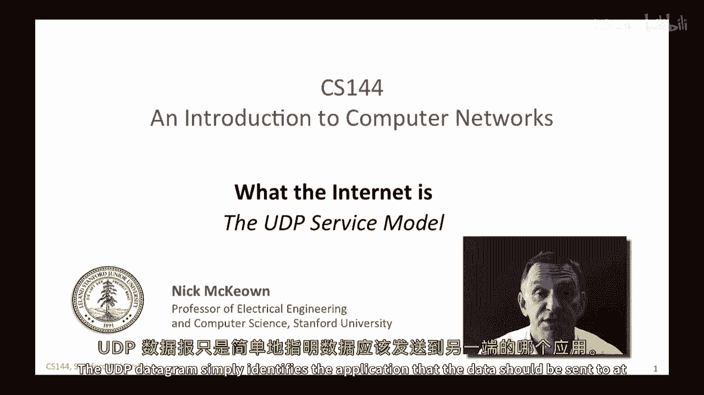
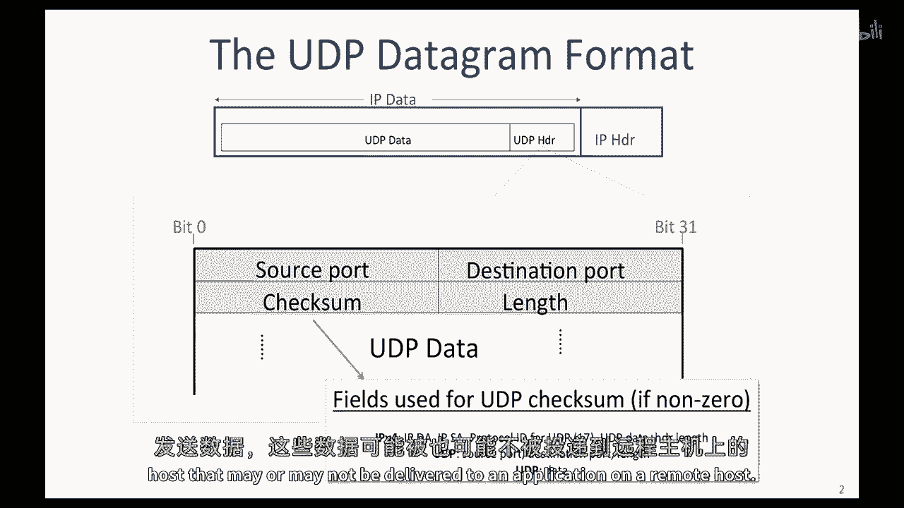
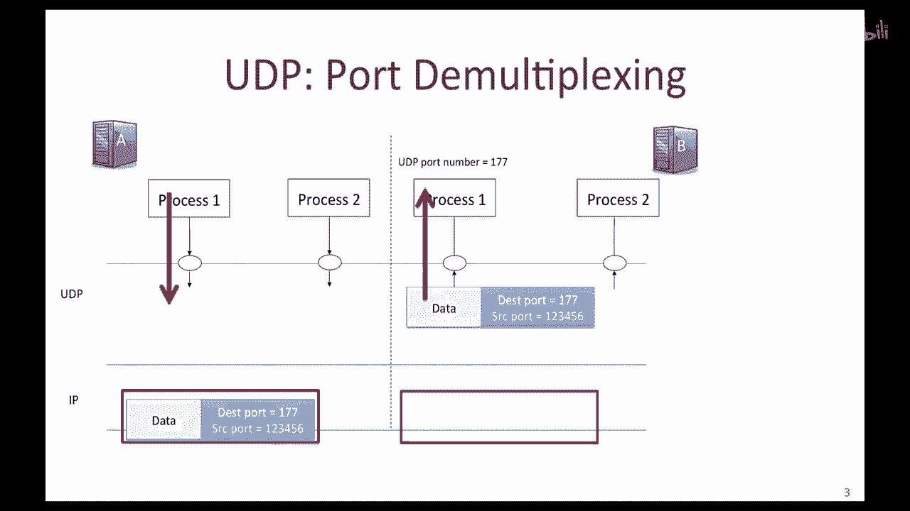
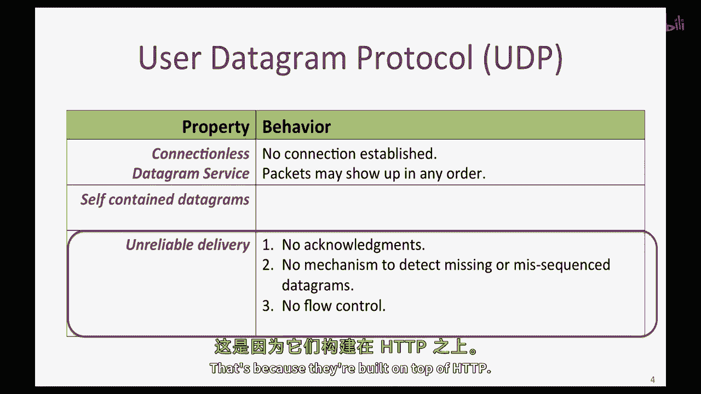
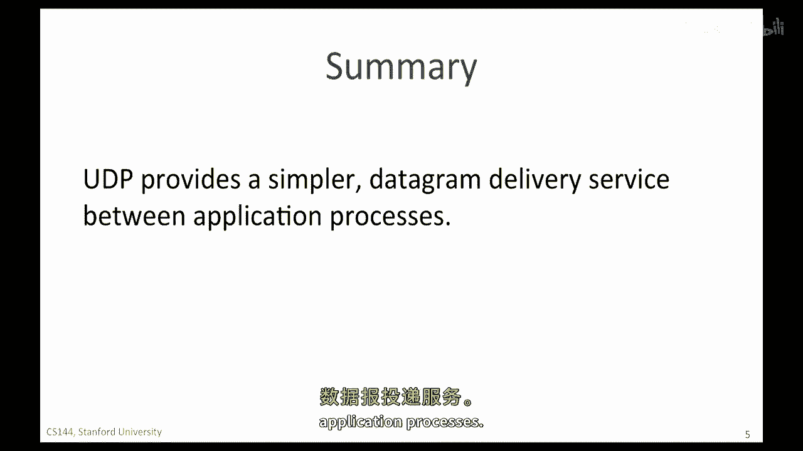

# 计算机网络课程 P24：UDP服务模型详解 🧩

在本节课中，我们将学习传输层的第二个重要协议——用户数据报协议（UDP）。我们将了解UDP的简单服务模型、其报文结构、工作原理以及它适用的应用场景。

---

## 概述

UDP（用户数据报协议）由那些不需要TCP所提供的保证交付服务的应用程序使用。这些应用程序可能以私有方式处理重传，或者根本不需要可靠的交付。UDP比TCP简单得多，它主要完成一项核心任务：将应用程序数据封装成UDP数据报，然后交给网络层进行传输。

---

## UDP的简单性

上一节我们提到了UDP的定位，本节中我们来看看它为何如此简单。UDP数据包仅标识出数据应该发送到的目标应用程序。

在传输过程中，UDP数据报被封装在IP数据包的数据字段中。UDP提供的服务非常简单，这从其头部字段数量极少就能看出来。与拥有超过十个头部字段的TCP不同，UDP头部只有四个字段。

---

## UDP头部字段解析

以下是UDP头部的四个核心字段及其作用：

*   **源端口**：指示数据来自哪个应用程序。如果远端需要回复，它将使用此端口号作为目的端口，以便数据能正确返回到源主机上的对应应用。
*   **目的端口**：指示数据应该交付给目标主机上的哪个应用程序。UDP中的端口号在功能上与TCP相同，用于将传入的数据包定向到正确的应用程序进程。
*   **长度**：这是一个16位字段，指定整个UDP数据报（头部+数据）的长度，单位为字节。其值必须至少为8字节，因为这是UDP头部本身的固定长度。
    *   **公式**：`UDP总长度 = 8字节（头部） + 数据长度`
*   **校验和**：用于检测UDP数据报在传输过程中是否出错。当使用IPv4时，UDP校验和是可选的。如果发送方不计算校验和，则该字段填充为全零。如果使用，校验和的计算范围不仅包括UDP头部和数据，实际上还包含了IP头部的一部分信息（源IP地址、目的IP地址和协议号）。
    *   **代码示意（计算范围）**：`校验和计算数据 = 伪IP头部（源IP、目的IP、协议号） + UDP头部 + UDP数据`

你可能会疑惑，为什么UDP校验和要包含IP头部的一部分信息？这难道不违反网络分层原则吗？确实如此。这样做的合理性在于，它允许UDP层检测那些被错误路由、发送到错误目的地的数据包。

总的来说，UDP头部小巧，因为它为应用程序提供的服务非常简单：它提供了一种简单的消息传递机制，用于从一台主机的应用程序发送数据，而远程主机上的应用程序可能收到，也可能收不到这些数据。

---

## UDP的工作方式：多路复用与分用

UDP端口的工作方式与TCP端口相同。我们可以通过一个例子来理解其多路复用与分用过程：

假设主机A上的进程1（使用端口177）想要发送数据给主机B上的进程1。进程1将数据放入一个新的UDP数据包，并将目的端口设置为177。主机A会添加自己的源端口号，以便任何回复都能被正确送回。然后，该UDP数据包被封装进IP数据包，发送至主机B。主机B收到后，移除IP封装，根据UDP头中的目的端口号177，将数据定向交付给进程1。

因此，我们可以将UDP看作一种简单的多路复用/分用机制。它将来自主机A上不同进程的数据复用到一个输出流中，并在主机B端将到达的UDP数据包流分用，交付给正确的目标进程。事实上，有些人将UDP戏称为“用户分路协议”，这本质上概括了UDP的核心功能。

---

## UDP服务模型的三大属性

总结UDP的服务模型，它具有以下三个核心属性：

1.  **无连接的数据报服务**：通信前无需建立连接，所有必要信息都包含在单个数据报中。这也意味着数据包可能以任何顺序到达。
2.  **不可靠的交付服务**：UDP不向发送方发送确认（ACK），不提供数据是否到达的反馈，也没有检测丢失数据包的机制。如果数据包在途中丢失，UDP不会通知应用程序，也不会要求源端重传。
3.  **无拥塞控制**：UDP本身不包含调节发送速率的拥塞控制机制。

UDP的服务听起来非常像IP层提供的服务。这是因为UDP在IP服务的基础上，仅仅增加了一个简单的封装以及将数据定向到正确应用程序的能力（即端口机制）。

---

## 为什么需要UDP？—— 应用场景

既然UDP如此简单，甚至不可靠，我们为什么还需要它？UDP被用于那些不需要或不想要可靠交付服务的应用程序。以下是其主要应用场景：

*   **简单的请求-响应应用**：
    *   **DNS（域名系统）**：用于将主机名转换为IP地址。查询和响应通常完全包含在一个UDP数据包内。无需建立连接，轻量且快速。如果请求失败（超时），应用层会直接重发查询。
    *   **DHCP（动态主机配置协议）**：出于类似原因使用UDP。
    *   **NTP（网络时间协议）**：也是基于请求-响应模式。

*   **有特殊自定义需求的实时应用**：
    *   一些应用程序使用UDP，是因为它们对重传、拥塞控制和顺序交付有特殊需求，希望自己在应用层实现这些逻辑。例如，早期的**网络文件系统（NFS）** 就在UDP之上构建了自己的重传机制。
    *   一些**实时流媒体音频和视频服务**也曾使用UDP，以降低延迟并避免TCP重传和拥塞控制带来的抖动。不过，如今大多数基于HTTP的流媒体已转向使用TCP。

---

## 总结

本节课中，我们一起学习了用户数据报协议（UDP）。我们了解到UDP是一种极其简单的传输层协议，它提供无连接、不可靠的数据报交付服务。其核心功能是通过端口号实现应用进程间的多路复用与分用。UDP的简洁性使其非常适合简单的请求-响应应用（如DNS、DHCP）以及那些需要在应用层自定义可靠性或实时性策略的场景。

