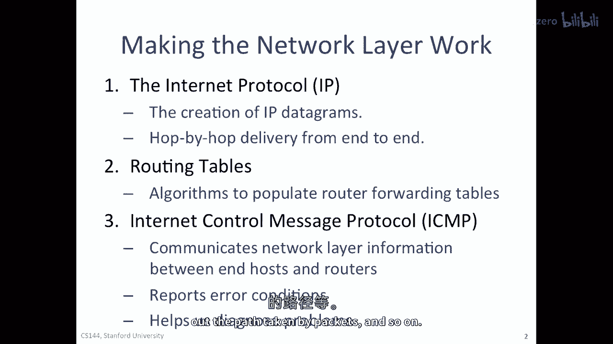
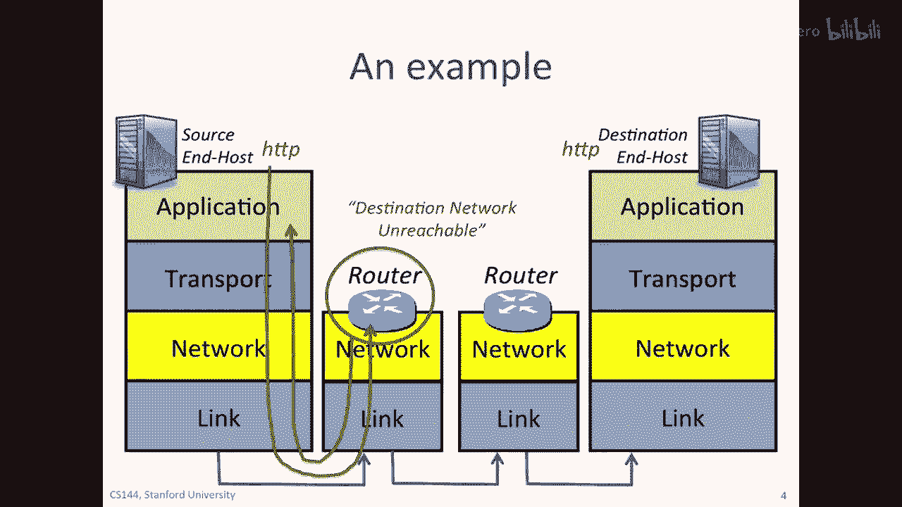

# 课程 P25：ICMP 服务模型 🛠️

在本节课中，我们将学习互联网控制报文协议（ICMP）的服务模型。ICMP 是网络层的一个重要辅助工具，用于报告错误和诊断网络问题。虽然 IP 协议本身不保证数据包的可靠交付，但 ICMP 提供了关键的反馈机制，帮助我们了解网络状况。




上一节我们介绍了互联网协议（IP）和路由表，它们是网络层数据转发的基础。本节中，我们来看看 ICMP 如何帮助端主机和路由器之间通信网络层信息，从而诊断问题并报告错误。

## ICMP 概述与工作原理

ICMP 运行在网络层之上，严格来说属于传输层协议。当终端主机或路由器需要报告错误时，它会将相关信息放入 ICMP 报文的有效载荷中，然后将其封装在 IP 数据报中发送出去。



以下是 ICMP 报文生成的基本过程：
1.  当路由器或主机需要发送 ICMP 错误报告时，它会截取触发该报告的原始 IP 数据包的**头部**。
2.  同时，它还会截取该原始 IP 数据包有效载荷的**前 8 个字节**。
3.  这些信息（原始 IP 头 + 前 8 字节数据）被放入一个新的 ICMP 报文中。
4.  该 ICMP 报文被封装在一个新的 IP 数据包中，其源地址是报告者（路由器），目的地址是原始数据包的发送者。

这个过程可以用以下伪代码描述：
```python
# 当路由器R需要发送ICMP错误报告时
def generate_icmp_error(original_packet):
    icmp_payload = original_packet.header + original_packet.data[:8]  # 原始IP头 + 前8字节数据
    icmp_message = ICMP(type=ERROR_TYPE, code=ERROR_CODE, payload=icmp_payload)
    new_ip_packet = IP(src=R, dst=original_packet.src, data=icmp_message)
    send(new_ip_packet)
```

## 常见的 ICMP 消息类型

ICMP 定义了多种消息类型来报告不同的网络状况。以下是六个最常用的消息类型示例，你无需记忆具体编号，但需要了解其含义：

*   **目的地不可达 (Type 3)**：当路由器无法将数据包送达最终网络或主机时发送。
    *   **代码 0: 网络不可达**：路由器在转发表中找不到目标网络。
    *   **代码 1: 主机不可达**：数据包到达了目标网络，但最后一个路由器找不到目标主机。
    *   **代码 3: 端口不可达**：数据包到达了目标主机，但主机上没有应用程序在监听目标端口。


*   **回显请求/应答 (Type 8/Type 0)**：用于 `ping` 工具，测试主机之间的连通性。
    *   **Type 8, Code 0**: 回显请求。
    *   **Type 0, Code 0**: 回显应答。


*   **超时 (Type 11, Code 0)**：当 IP 数据包的生存时间（TTL）字段减为 0 时，路由器会丢弃该包并发送此消息。这是 `traceroute` 工具的核心机制。

## 实用工具：Ping 与 Traceroute

ICMP 最常见的应用体现在两个网络诊断工具上：`ping` 和 `traceroute`。


### Ping：测试连通性 🎯

`ping` 命令用于测试与另一台主机的连通性和响应时间。其工作原理非常简单：
1.  源主机（A）向目标主机（B）发送一个 **ICMP 回显请求** 报文。
2.  如果网络通畅且 B 在线，B 在收到请求后会回复一个 **ICMP 回显应答** 报文。
3.  A 通过计算发送请求和收到应答的时间差，得到往返延迟。

你可以在命令行中尝试：
```
ping www.example.com
```

### Traceroute：追踪路径 🗺️

`traceroute` 命令用于发现数据包从源主机到目标主机所经过的路径（路由器），并测量到每一跳的延迟。它巧妙地利用了 IP 数据包的 **TTL 字段** 和 ICMP 的 **超时** 消息。

以下是 `traceroute` 的工作步骤：
1.  首先，源主机发送一个 UDP 数据包（或 ICMP 回显请求），并将其 IP 头中的 **TTL 设置为 1**。
2.  第一个路由器收到后，将 TTL 减为 0，于是丢弃该包，并向源主机发送一个 **ICMP 超时** 报告。源主机由此得知第一个路由器的地址和到它的往返时间。
3.  接着，源主机发送 TTL=2 的数据包。该包到达第一个路由器后 TTL 减为 1，被转发到第二个路由器。第二个路由器将其 TTL 减为 0 后丢弃，并发送 ICMP 超时报告。源主机得知第二个路由器。
4.  此过程重复，每次 TTL 加 1，直到数据包到达目标主机。
5.  当数据包到达目标主机时，`traceroute` 通常会使用一个目标主机上未开放的**高端口号**。目标主机因此会回复一个 **ICMP 端口不可达** 消息，这标志着追踪完成。

你可以在命令行中尝试：
```
traceroute www.example.com
```

## 总结


本节课中我们一起学习了 ICMP 服务模型。ICMP 作为 IP 协议的辅助协议，在网络层之上运行，为核心的网络层功能提供错误报告和诊断支持。我们了解了其基本工作原理，认识了常见的消息类型，并深入剖析了 `ping` 和 `traceroute` 这两个依赖 ICMP 的经典网络工具是如何工作的。掌握 ICMP 有助于我们更好地理解和排查网络问题。