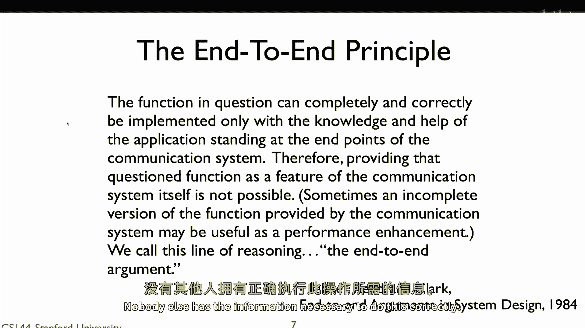

# P26：p25 2-4 End to End Principle - 加加zero - BV1qotgeXE8D

端到端原则在互联网的设计中占据了一个非常特殊的位置，这是因为它实际上指的是两个不同的原则，第一个涉及到正确性，如果你在设计你的网络系统时不遵循端到端原则。

那么 chances are 它有一个底部并且可能传输数据错误，第二个，我们称之为强大的端到端原则，比第一个更广泛和通用。

所以假设我们要从一个计算机传输文件到另一个计算机，我们的应用程序在a和b之间打开一个连接，它从计算机a读取文件并将其写入tcp连接，B从socket中读取数据并将其写入计算机b的文件中，在这种情况下。

网络做得非常少，它只是向前转发a到b的包，a和b设置了连接，并且应用程序读取和写入数据。

为什么网络不做更多，结果，有很多事情它可以做来使文件传输更快，网络可以自动在a和b之间压缩包，如果文件是纯英文文本，这可能将传输大小减少十倍，网络可以重新格式化或改进请求，假设A想要传输两个文件。

网络可以看到这个并合并两个传输为一个请求，或者它可以是已经在另一个计算机上存储的ace文件，C比A离B更近，更快，网络可以从C而不是A传输文件，或者网络可以自动添加安全，加密数据，以便坏人可以阅读文件。

如果网络为我们这样做，那么我们就不必担心这个问题，在我们的应用中，网络可能添加移动性支持，使得通过网络的计算机能够自动更新路由，并且数据包继续流向它，有了这种支持，甚至可能迁移网络连接。

比如将我们手机上的skype视频流迁移到我们的笔记本电脑上，结果发现网络有很多事情可以做来改善我们的应用，并使设计它更容易，但总的来说，它为什么不。

原因在于端到端原则，端到端原则由saltzer首次描述。

里德和克拉克在1984年的一篇论文中，稍后在课程中你将遇到大卫·克拉克。

当他做客讲座时，他们描述的端到端原则在这里展示。

在 question 的函数可以完全和正确地实现。

只有通知其他应用站在通信系统两端的知识和帮助。

因此，将该问题功能作为通信的特性是不可能的。

有时，通信系统提供的函数不完整版本，可能有助于性能提升。

我们称这种推理方式为端到端论证。

换句话说，网络可能能做很多事情来帮助。

但它只能这样做帮助，如果系统要正常工作，那么端点需要负责确保它这样做。

没有人有其他需要的信息来做这件事正确。

网络可以帮助你，但你不能依赖它。

例如，如果你想确保你的应用程序是安全的，你需要在应用程序中实现端到端的安全。

网络可能会添加额外的安全，但端到端的安全只能由应用程序本身正确地完成。

所以将安全作为网络的特性。

以便应用程序不必担心它是不可能的。

让我们回到我们关于在两台计算机之间传输文件的例子，"这就是这个问题"，"与带领苏打水的其他人一起"，克拉克和赖德将制定从开始到结束的论点，"你想要确保文件完整无损地到达"。

"文件数据将在源和目的地之间的多台计算机中传递"，"所以来自源文件的文件通过计算机c"，到达目的地前，D和E，"从源A到C，C到D，D到E，E到目的地的每个链接都有错误检测功能。"。

"如果在传输过程中一个数据包被损坏"，"然后，接收者可以检测到这个并拒绝这个包"，发送者将确定包没有成功到达，例如，通过tcp确认并重新发送它，现在，可以说看，我知道包在任何链路上都不会被腐蚀。

因为我有我的检查，因为它在任何链路上都不会被腐蚀，所以它完全不会被腐蚀，因此如果它成功地到达目的地，没有腐败，文件已经成功到达，这就是麻省理工学院的一些程序员所做的，由于网络提供了错误检测。

他们假设它将检测所有问题，这个假设证明是错误的，因为这个错误，开发者最终失去了大量的源代码，这就是发生了什么，传输路径上的一台计算机，假设，计算机d的内存有故障，以至于有时候一些位会被翻转。

你将收到数据包，检查它们并发现它们正确。

然后它将它们移动到主内存，在这个时候它们将被腐蚀，d将然后转发数据包，但由于链路错误检测发生，从链路的角度来看，包看起来正常，并且将通过每个检查，链路，错误检测是为了传输中的错误设计，不是存储中的错误。

唯一确保文件正确到达的方法是进行端到端的检查，当源发送文件时，它包括一些错误检测信息，当目的地重新组装文件时，它检查文件是否完整没有任何错误，这是确保正确推导出的唯一方法，网络可以帮忙。

但它不能对正确性负责，以另一个具体的例子来说，想想tcp，tcp提供了一个可靠的字节流服务，但可靠性并不完美，有概率tcp将一些坏数据传递给你，例如，因为你的tcp栈中有一个bug。

或者某些错误在某处悄然出现，所以虽然这种情况非常 unlikely，TCP可能会给你发送被腐蚀的数据，但它可能会，因此，你需要对数据进行端到端的检查，它发送，所以如果你通过TCP传输一个文件。

对到达成功的数据进行端到端的检查，BitTorrent，是否这样做，例如，它使用TCP传输块，每个块完成后，它使用哈希检查是否成功到达。

所以让我们回到tcp和可靠性，如果你想实现端到端的可靠数据传输，那么你需要一种像tcp这样的端到端可靠协议，但如果你深入理解端到端的论点，你必须有端到端的功能以确保正确性。

网络可以包括一个特性的不完整版本作为性能增强，今天的无线链路层就提供了这种性能增强，有线链路层除非你的线缆连接器坏了，否则非常可靠，但是，无线的并不适合很多原因，所以，虽然通常九十九点。

九九九 percent 的包在有线链路上发送成功到达下一个跳点，无线链路有时可能更像五十 percent 或八十 percent，结果，tcp 在可靠性低的情况下工作不好，所以。

无线链路层通过在链路层重传来提高可靠性，当你的笔记本电脑向接入点发送包时，如果接入点接收到包，它立即，只有几微秒后，发送链路层确认来告诉你的笔记本电脑包成功接收，如果笔记本电脑没有收到链路层确认。

它会重传它这样做几次，使用这些链路层确认可以提高差的链接，可以说只有八十 percent 的可靠性到九十九 percent 或更高，这让 tcp 工作得更好，tcp 将正常工作。

它将可靠地传输数据没有链路层的帮助，但是，链路层的帮助极大地提高了 tcp 的性能，所以，这就是工作正确的天线原理，它必须从头到尾完成，你可以在中间做一些事情来帮助我们性能改进，但如果你不依赖从头到尾。

那么总有一天它会破裂。

有一个版本的从头到尾原则。

在 ietf 请求为评论号一九五八中描述，互联网的架构原则，我们称之为强大的从头到尾原则，它说，网络的工作是传输数据包，尽可能高效和灵活地，其他所有东西都应该在边缘完成，这个从头到尾原则比第一个更强。

第一个说，你必须在边缘实现一些从头到尾的功能，但是说你也可以在中间实现它以改进性能，这个原则说不在中间实现，只在边缘实现，强原则的 reasoning 是灵活性和简单性。

如果网络实现了一个功能来尝试帮助端点，那么它是在假设端点做什么。

例如，当无线链路层使用重传来提高可靠性时。

以便 tcp 更好工作，它假设增加的重传延迟是值得的，可靠性的，这不总是真的，除了 tcp 之外，还有其他协议可靠性并不重要，可能更愿意发送一个新不同的数据包而不是重传旧的一个，但由于链路层的集成。

提高了可靠性，这些其他协议被束缚在它中，这既可以成为创新和进步的障碍，也确实如此，随着层的增加，开始添加优化，假设上面的层和下面的层做了什么，在wi fi的情况下，重新设计层的难度越来越大。

它是一层链接层，假设网络和传输层表现出某种行为，如果你发明了一种新的传输或网络层，它很可能假设wi fi的行为，以便能够良好地工作，这样，网络设计变得僵化和硬化，在长期设计和网络进化方面，真的很难改变。

端到端的强大论点极其有价值。

在短期设计和性能方面，存在张力，网络工程师和运营商往往不遵循它，因此，随着时间的推移，网络性能越来越好。

