# 课程 P26：端到端原则详解 🧩

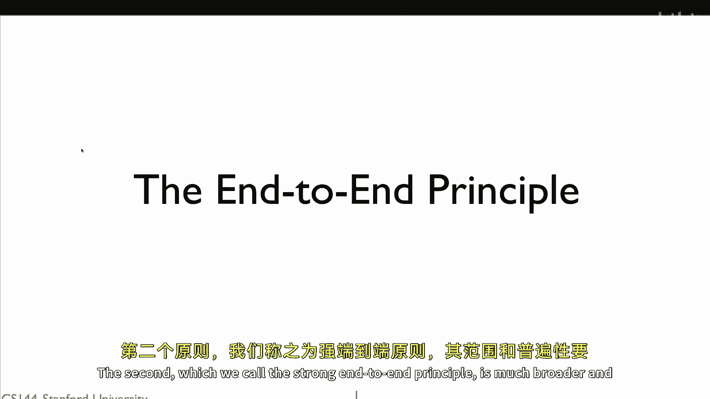

在本节课中，我们将学习互联网架构中的一个核心设计理念——端到端原则。我们将探讨其两种不同的表述，理解其背后的逻辑，并通过具体例子说明它如何影响网络协议与应用的设计。

端到端原则在互联网设计中占据特殊位置，因为它实际上指代两个不同的原则。第一个原则涉及正确性：如果在设计网络系统时不遵循端到端原则，那么系统很可能存在缺陷并可能传输错误数据。第二个原则被称为“强端到端原则”，它比第一个更广泛和通用。

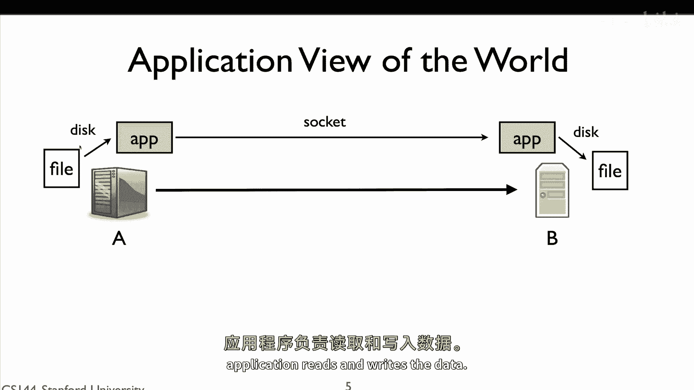

## 一个简单的文件传输例子 📁

上一节我们介绍了端到端原则的基本概念，本节中我们通过一个具体的文件传输例子来理解网络的角色。

假设我们需要将文件从计算机A传输到计算机B。应用程序在A和B之间建立一个连接，它从计算机A读取文件并将其写入TCP连接。计算机B则从套接字中读取数据并将其写入本地文件。在这个过程中，网络本身做得非常少，它仅仅是将数据包从A转发到B。A和B负责建立连接，应用程序负责读取和写入数据。

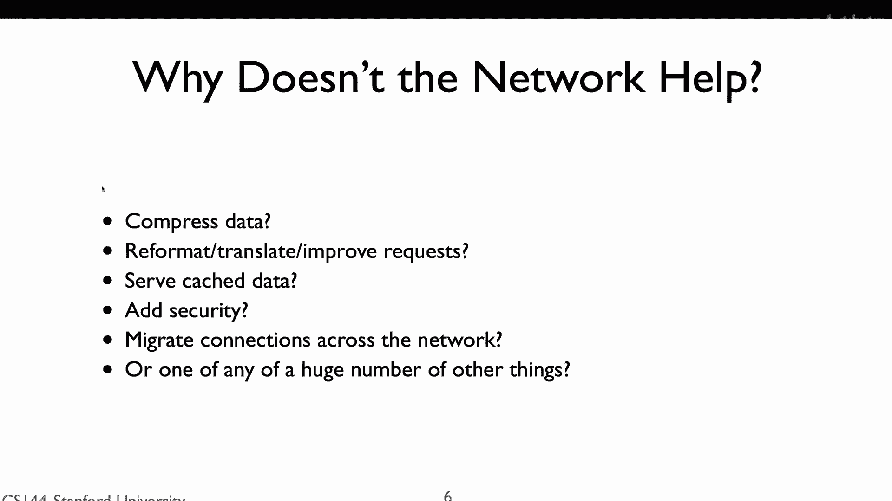

那么，为什么网络不多做一些工作来帮助提升性能呢？实际上，网络可以做很多事情来使文件传输更快、更便捷。

以下是网络可以提供的几种“帮助”：
*   网络可以自动压缩A和B之间的数据包。如果文件是纯英文文本，这可能会将传输大小减少十倍。
*   网络可以重新格式化或合并请求。假设A想要传输两个文件，网络可以将其合并为一个传输请求。
*   网络可以进行缓存。如果文件已经存储在离B更近的计算机C上，网络可以从C而不是A传输文件。
*   网络可以自动添加安全性，例如加密数据，以防止被恶意方读取。
*   网络可以添加移动性支持，使得设备在网络中移动时，数据包能继续正确路由。

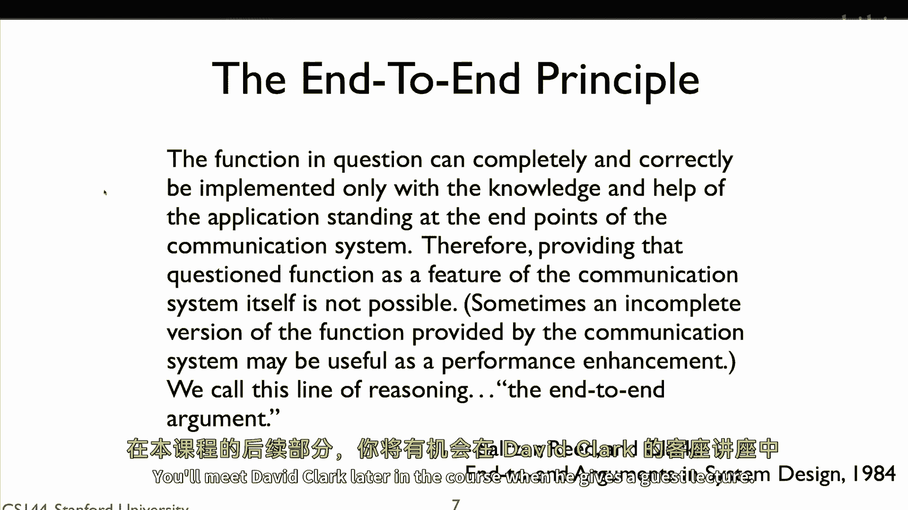

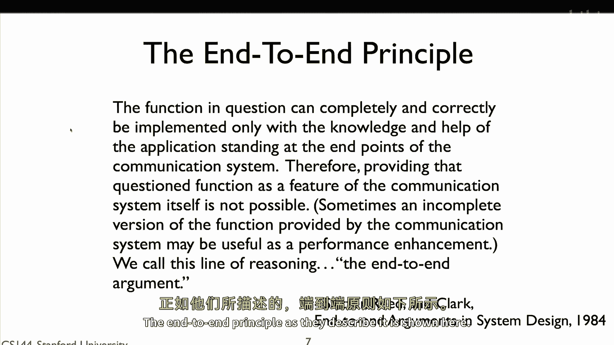

如果网络为我们实现了这些功能，我们的应用程序就无需再关心这些问题。但总体而言，网络为什么不这样做呢？

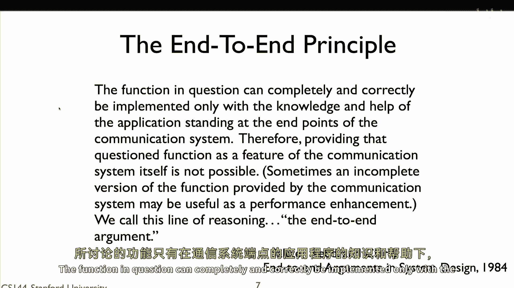

## 端到端原则的核心论点 🎯

上一节我们看到了网络可能提供的诸多“帮助”，本节中我们来看看反对在网络内部实现这些功能的核心理由——端到端原则。

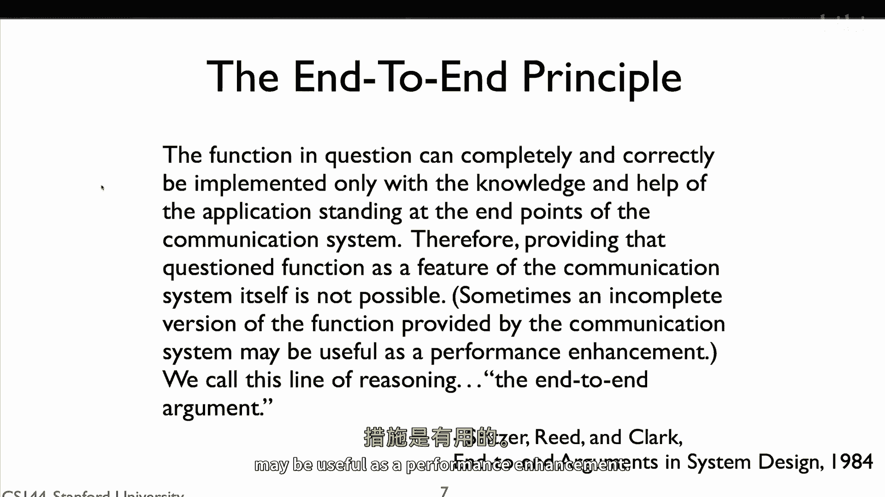

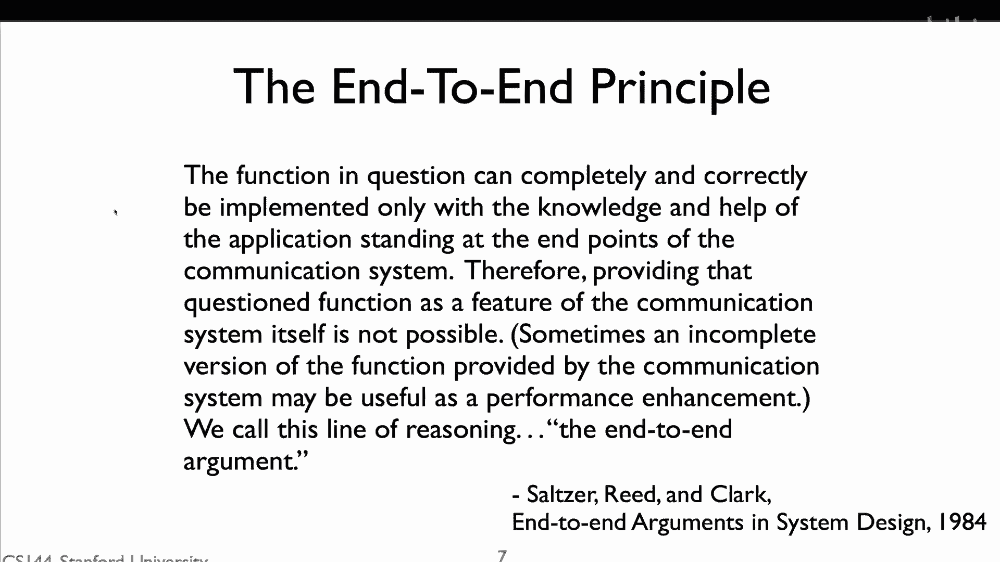

原因在于端到端原则。该原则由Saltzer、Reed和Clark在1984年的一篇论文中首次描述。他们阐述的端到端原则如下：

> 只有在通信系统端点的应用的知识和帮助下，才能完全和正确地实现某项功能。因此，将该功能作为通信系统本身的特性来提供是不可能的（有时，通信系统提供的该功能的不完整版本可能有助于提升性能）。

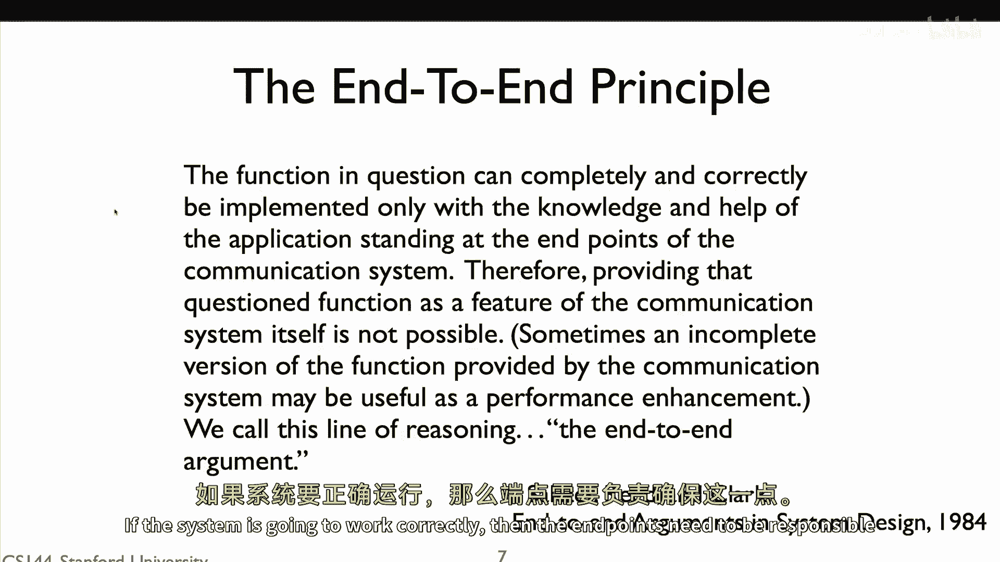

我们称这种推理方式为端到端论证。换句话说，网络或许能做很多事情来提供帮助，但它只能提供辅助。如果系统要正常工作，那么端点需要负责确保功能的正确实现，因为只有端点拥有完成此事所必需的全部信息。网络可以帮助你，但你不能依赖它。

例如，如果你想确保应用程序是安全的，你需要在应用程序内部实现端到端的安全。网络可能会添加额外的安全措施，但端到端的安全只能由应用程序本身来正确完成。因此，将安全作为网络的特性，以便应用程序不必担心它，是不可能的。

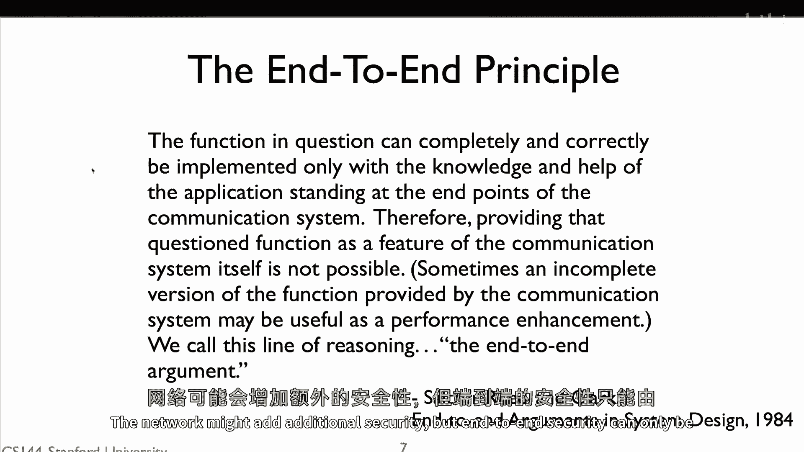

## 通过实例深入理解 🔍

上一节我们介绍了端到端原则的正式定义，本节我们通过几个具体实例来加深理解。

让我们回到在两台计算机之间传输文件的例子。Clark和Reed在阐述端到端论点时指出：“你想要确保文件完整无损地到达”。文件数据将在源和目的地之间的多台计算机中传递。从源A到目的地B的路径可能经过计算机C、D、E。从A到C、C到D、D到E、E到B的每一段链路都有错误检测功能。如果在传输过程中一个数据包被损坏，接收方可以检测到并拒绝这个包，发送方将通过TCP确认等机制发现包未成功到达并重新发送。

现在，有人可能会说：既然链路层有错误检测，数据包在任何链路上都不会被损坏，那么它完全不会被损坏。因此，如果它成功到达目的地，文件就已经成功传输。麻省理工学院的一些程序员正是这样想的，由于网络提供了错误检测，他们假设网络将检测所有问题。这个假设被证明是错误的，由于这个错误，开发者最终丢失了大量源代码。

发生了什么？传输路径上的一台计算机（假设是计算机D）的内存发生了故障，以至于有时候一些比特位会被翻转。D会接收到数据包，检查它们并认为它们正确，然后将其移入主内存。就在这个过程中，数据被损坏了。D随后会转发数据包，但由于链路错误检测机制，从链路的角度看，数据包看起来正常，并且能通过每一次检查。链路错误检测是为传输中的错误设计的，而不是为存储中的错误设计的。

确保文件正确到达的唯一方法是进行端到端的检查。当源端发送文件时，它包含一些错误检测信息（如校验和或哈希）。当目的地重新组装文件时，它检查文件是否完整且无错误。这是确保正确性的唯一可靠方法。网络可以提供帮助，但它不能对正确性负责。

再举一个具体例子：想想TCP。TCP提供了一个可靠的字节流服务，但这种可靠性并非完美无缺。存在一种极小的可能性，TCP会将一些错误数据传递给你，例如因为TCP协议栈中存在bug，或者某个错误悄然出现。所以，虽然这种情况极不可能发生，但TCP确实可能传递被损坏的数据。因此，你需要对传输的数据进行端到端的检查。例如，BitTorrent在通过TCP传输文件块后，会使用哈希值来检查每个块是否成功且正确地到达。

## 性能增强与正确性保障 ⚖️

上一节我们强调了端到端检查对正确性的必要性，本节我们看看网络如何在遵守该原则的前提下提升性能。

让我们回到TCP和可靠性的问题。如果你想实现端到端的可靠数据传输，那么你需要一种像TCP这样的端到端可靠协议。但根据对端到端论点的深入理解，你必须通过端到端的功能来确保正确性。网络可以包含某个功能的“不完整版本”作为性能增强。

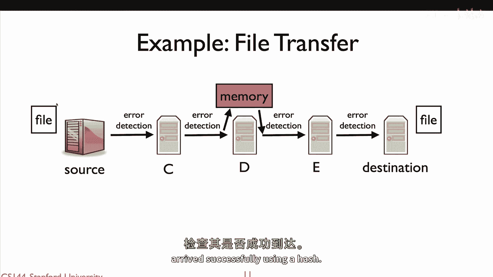

今天的无线链路层就提供了这种性能增强。有线链路层非常可靠（除非线缆或连接器损坏），但无线链路由于多种原因可靠性较低。通常，99.999%的有线链路数据包能成功到达下一跳，而无线链路的成功率可能只有50%或80%。结果，TCP在低可靠性链路上工作得不好。

因此，无线链路层通过在链路层进行重传来提高可靠性。当你的笔记本电脑向接入点发送数据包时，如果接入点成功接收，它会立即（几微秒后）发送一个链路层确认。如果笔记本电脑没有收到这个确认，它会重传数据包。这样做几次可以将链路的可靠性从80%提高到99%或更高，从而让TCP工作得更好。TCP本身将正常工作，它能在没有链路层帮助的情况下可靠传输数据，但链路层的帮助极大地提升了TCP的性能。

这就是端到端原则的正确应用方式：确保正确性的功能必须端到端地完成。你可以在中间节点做一些事情来帮助提升性能，但如果你不依赖端到端的机制来保证正确性，那么总有一天系统会出问题。

## 强端到端原则 💪

上一节我们讨论了网络作为性能增强者的角色，本节我们介绍一个更严格的原则变体。

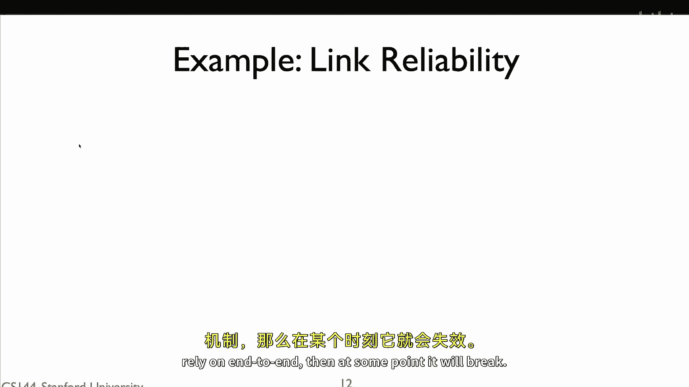

存在一个版本的端到端原则，在IETF的RFC 1958（《互联网的架构原则》）中被描述，我们称之为“强端到端原则”。它指出：**网络的工作是尽可能高效、灵活地传输数据包，其他所有功能都应该在网络的边缘（即端点）完成**。

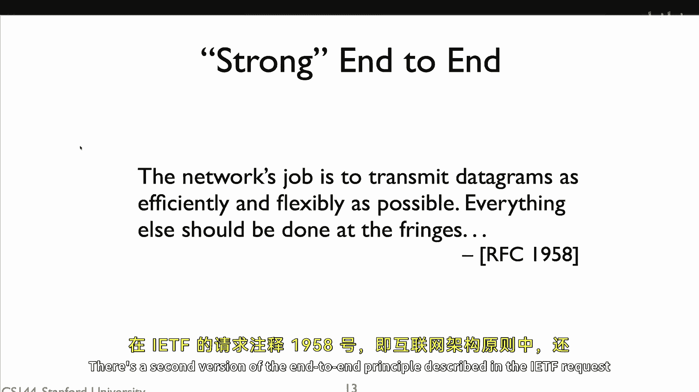

这个强端到端原则比第一个更强。第一个原则说，你必须在边缘实现端到端的功能，但也可以在网络中间实现它以改进性能。而这个强原则说，不应该在中间实现，只应在边缘实现。

强原则的推理基于灵活性和简单性。如果网络实现了一个功能来尝试帮助端点，那么它是在对端点的行为做出假设。例如，当无线链路层使用重传来提高可靠性以便TCP更好工作时，它假设增加的重传延迟对于提升可靠性是值得的。但这并不总是正确的。除了TCP，还有其他协议可能并不那么看重可靠性，它们可能更愿意发送一个新的、不同的数据包，而不是重传旧的。但由于链路层内置了提高可靠性的机制，这些其他协议也被迫接受它，这成为了创新和进步的障碍。

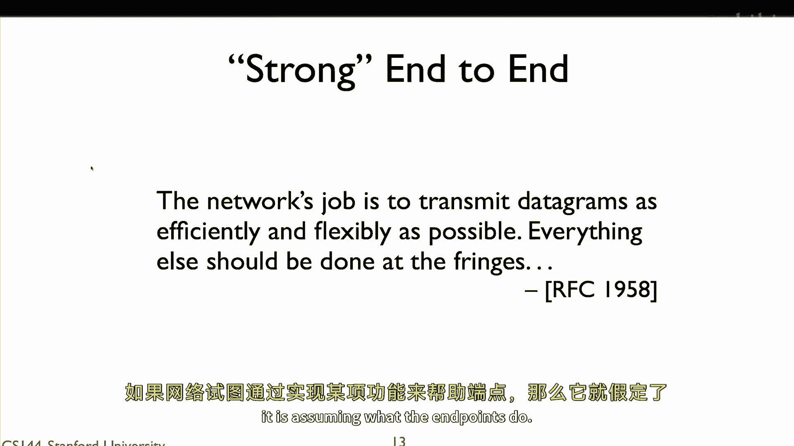

随着网络层级的增加，各层开始添加优化，并假设其上层和下层的行为。在Wi-Fi的情况下，重新设计链路层变得越来越困难，因为它假设了网络层和传输层的某种行为。如果你发明了一种新的传输层或网络层协议，它很可能需要适应Wi-Fi的行为才能良好工作。这样，网络设计变得僵化和固化，从长期设计和网络演进的角度看，真的很难改变。

因此，强端到端论点在长期网络设计和演进方面极具价值。但在短期设计和性能优化方面，存在一种张力。网络工程师和运营商往往不遵循它，因此，随着时间的推移，网络性能虽然越来越好，但架构的灵活性可能受到损害。

## 总结 📝

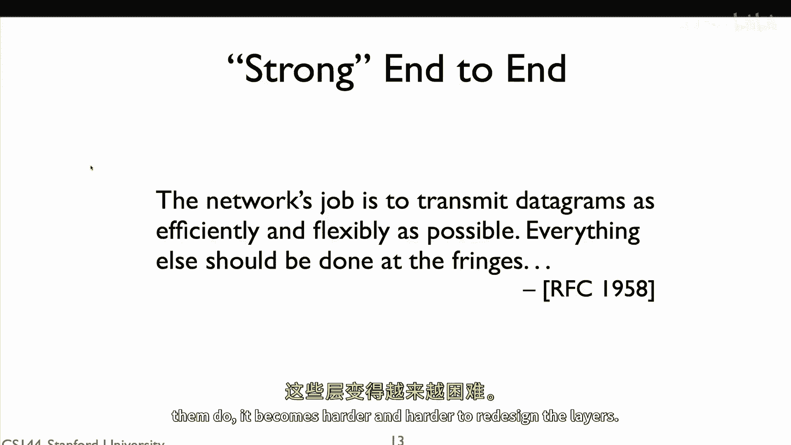

本节课中，我们一起学习了互联网架构中的核心设计思想——端到端原则。我们首先了解到它包含两个层面：一是关于正确性的基本原则，指出确保功能正确实现的职责必须在通信端点；二是更强的原则，主张所有高级功能都应仅在网络边缘实现。

我们通过文件传输的例子，理解了网络为何应保持简单（仅负责转发数据包），而将复杂功能（如可靠性保障、安全性）留给端点应用。我们深入探讨了端到端检查的必要性，例如通过哈希校验确保文件完整，并区分了网络为提升性能（如无线链路层重传）而提供的“不完整”帮助与端点必须负责的“完整”正确性保障之间的区别。

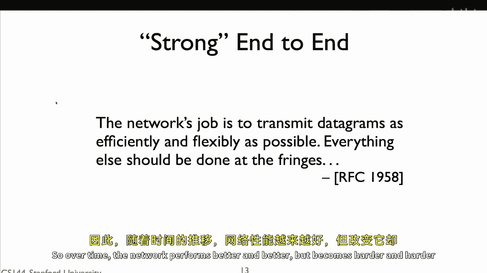

最后，我们对比了基本原则与强原则，认识到强端到端原则在维护网络长期灵活性和鼓励创新方面的重要性，尽管在实践中它与短期性能优化存在一定张力。掌握端到端原则，是理解互联网为何如此设计以及如何构建健壮网络应用的关键。