# 课程 P27：错误检测算法详解 🛡️

在本节课中，我们将学习网络通信中用于确保数据完整性的三种核心错误检测算法：校验和、循环冗余校验（CRC）以及消息认证码（MAC）。我们将探讨它们的工作原理、优缺点以及各自适用的场景。

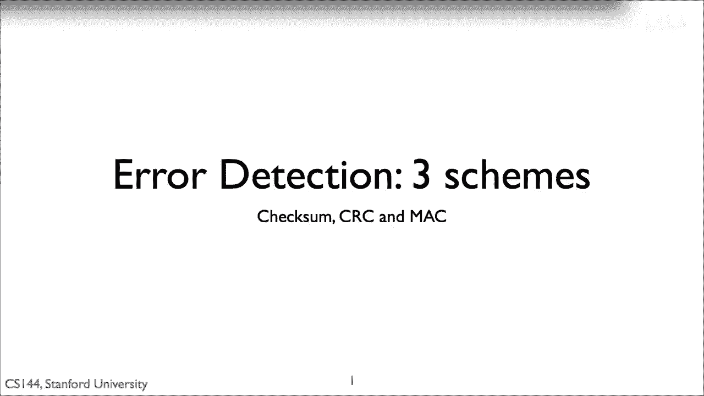

## 概述


网络和设备并非完美，在数据传输过程中可能引入错误。为了使网络能够正常运行，必须能够检测这些错误。例如，路径上的路由器可能因硬件故障而翻转数据包中的某些位。如果翻转的位恰好是信用卡交易金额的最高有效位，后果将非常严重。因此，我们需要能够检测到错误的发生，避免将损坏的数据当作正确数据接受。现代数据网络通常使用三种不同的错误检测算法：校验和、循环冗余校验（CRC）和消息认证码（MAC）。理解它们之间的差异至关重要，否则可能导致错误的协议决策或分析。

从高层次看，错误检测的过程如下：我们有一个数据包，在该数据上计算一些错误检测位，并将其附加或预置到数据包中。例如，以太网在数据包后附加一个CRC，而传输层安全协议（TLS）则在消息后附加一个MAC。IP协议则预先生成一个校验和，并将其放置在IP头部。

## 1. 校验和

校验和是三种算法中最简单的一种。其核心思想是将数据包中的所有数据相加。TCP和IP协议就使用了校验和。校验和的优点是计算速度快、成本低，即使在早期软件实现为主的时代也很有价值。然而，它的主要缺点是错误检测保证较弱。虽然它能捕获许多随机错误，但仅用两个位错误就可能“欺骗”校验和。如果这两个位错误相互抵消（例如，一个错误使数值增加3，另一个错误使其减少3），校验和将无法捕获这个错误。因此，校验和能捕获很多错误，但对能捕获哪些错误提供的保证非常弱。

### 校验和的计算方法

IP、UDP和TCP使用“一补码”校验和。这意味着它们使用一补码算术来累加数据包。算法步骤如下：

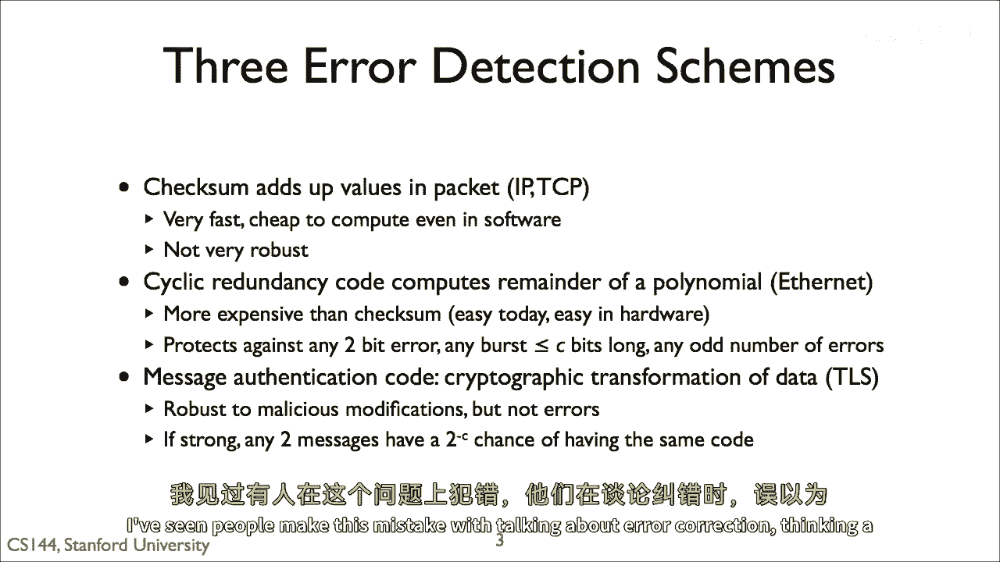

1.  开始时，将数据包的校验和字段设置为零。
2.  然后，将数据包的每个16位字相加。
3.  每当累加和超过 `2^16 - 1`（即65535）时，将溢出的高位（进位）加回到低位。
    *   例如：60000 + 80000 = 140000，这超过了65535。计算 `140000 - 65535 = 74465`，然后将进位1加回去，得到 `74465 + 1 = 74466`。
4.  累加完整个数据包后，对最终的和进行按位取反（即翻转所有位）。
5.  将取反后的值设置为数据包的校验和。
6.  在接收端，将整个数据包（包括校验和字段）再次按同样规则累加。如果结果全为1（即 `0xFFFF`），则校验通过。


有一个边缘情况：如果计算出的校验和恰好是全1（`0xFFFF`），则不能将其设置为零，因为校验和字段为零表示“未使用校验和”。因此，在这种情况下，校验和字段仍应设置为全1。


以下是用C语言风格伪代码描述的简化过程：
```c
uint16_t compute_checksum(char *data, int length) {
    uint32_t sum = 0;
    // 假设数据长度是16位（2字节）的整数倍
    for (int i = 0; i < length; i += 2) {
        sum += (data[i] << 8) | data[i+1]; // 组合成16位字
        if (sum & 0xFFFF0000) { // 检查是否有进位
            sum = (sum & 0xFFFF) + 1; // 将进位加回低位
        }
    }
    return ~(sum & 0xFFFF); // 取反得到校验和
}
```


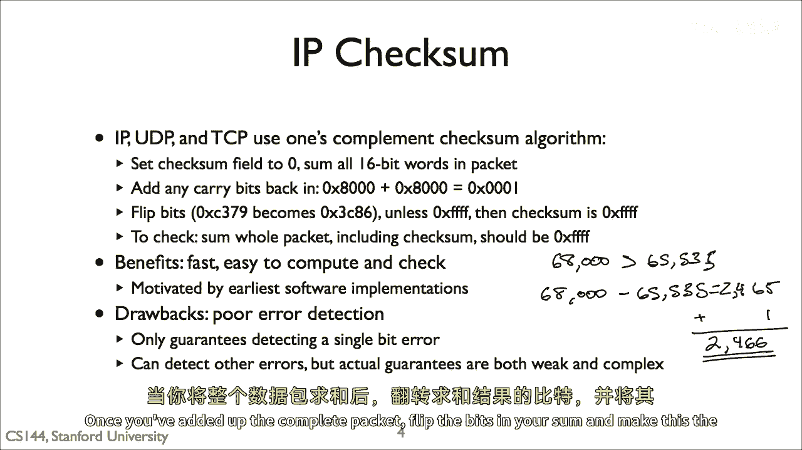

考虑到早期互联网实现大多基于软件，这种简单快速的算法非常有帮助。但其缺点是不够健壮，虽然能检测许多随机错误，但能提供的保证很弱。在实践中，它只能保证捕获单个位错误。不过，由于链路层承担了主要的错误检测工作，校验和在实际中工作得相当好。

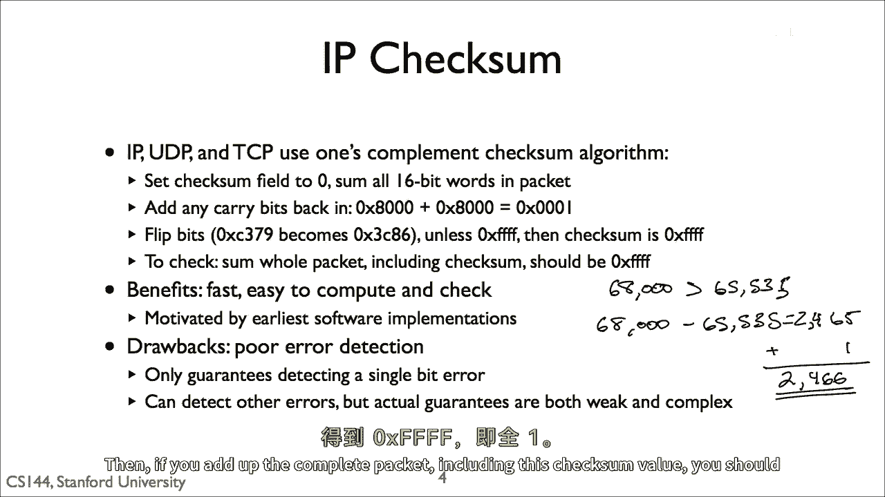

## 2. 循环冗余校验

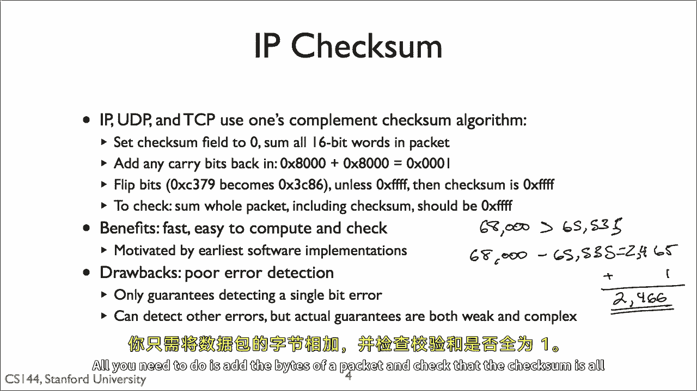

上一节我们介绍了简单快速的校验和。本节中，我们来看看更健壮但也更复杂的循环冗余校验（CRC）。CRC在计算上比校验和昂贵得多，但也健壮得多。它的核心思想是计算一个多项式除以另一个固定“生成多项式”后的余数。以太网和许多链路层协议都使用CRC技术。TCP和IP之所以可以使用较弱的校验和，部分原因在于链路层已经使用了更强大的CRC。


如果一个CRC的长度为 `c` 位，那么它可以保证检测到：
*   任何单个位错误。
*   任何两个位错误。
*   任何长度不超过 `c` 位的连续错误（即突发错误）。
*   任何奇数个位错误。


因此，CRC比校验和提供了强大得多的错误检测保证。

### CRC的工作原理

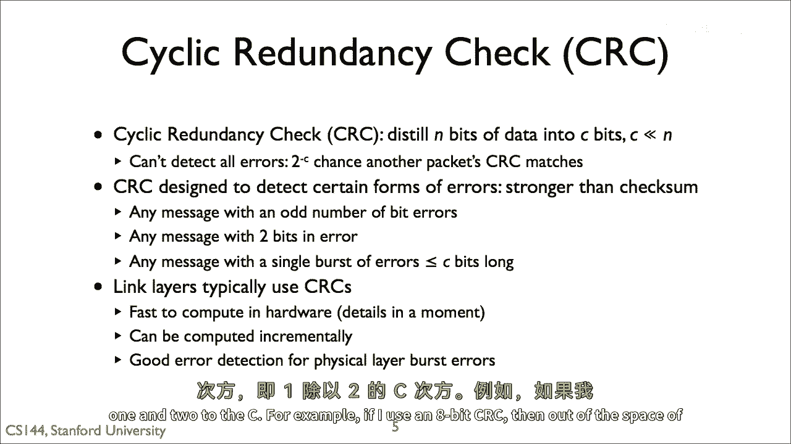

CRC将 `n` 位消息数据浓缩为 `c` 位错误检测数据（`c < n`）。例如，一个1500字节的以太网帧使用一个4字节（32位）的CRC。USB和蓝牙使用16位的CRC。当然，CRC无法检测所有错误。对于任意一个随机数据包，其CRC值与正确CRC值匹配的概率是 `2^{-c}`（即 `1/(2^c)`）。例如，使用8位CRC时，在所有可能的数据包中，有 `1/256`（约0.4%）的包会拥有相同的CRC值。


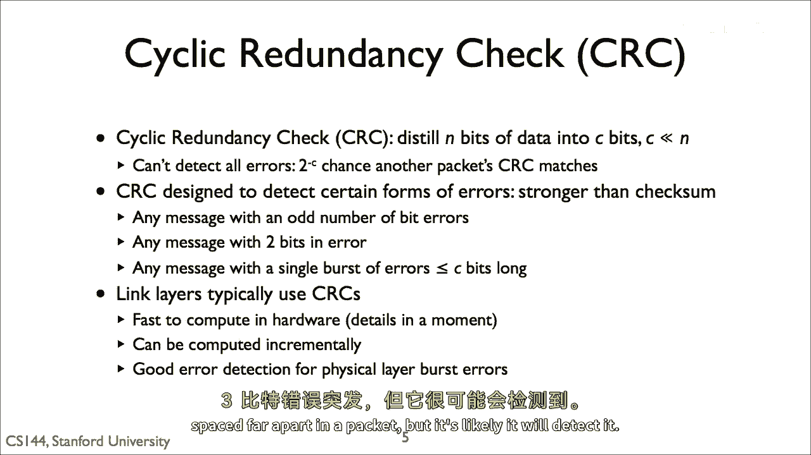

CRC算法基于多项式运算。它将消息的每一位视为一个多项式的系数（位为1表示该项存在，位为0表示不存在）。例如，消息 `11011101` 对应的多项式是：
`M(x) = x^7 + x^6 + x^4 + x^3 + x^2 + 1`
（注意：最高位对应最高次项）。


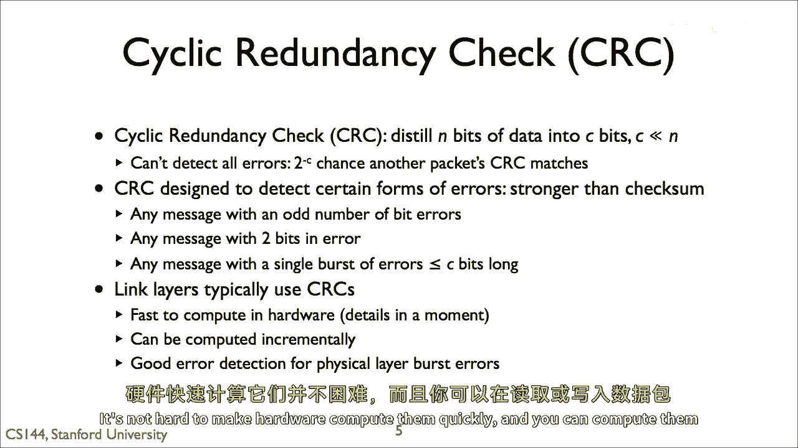

CRC计算需要一个称为“生成多项式” `G(x)` 的固定值。例如，用于USB的CRC-16算法的生成多项式是：
`G(x) = x^16 + x^15 + x^2 + 1`
（通常写作 `0x8005`，省略了最高位的 `x^16` 系数1）。

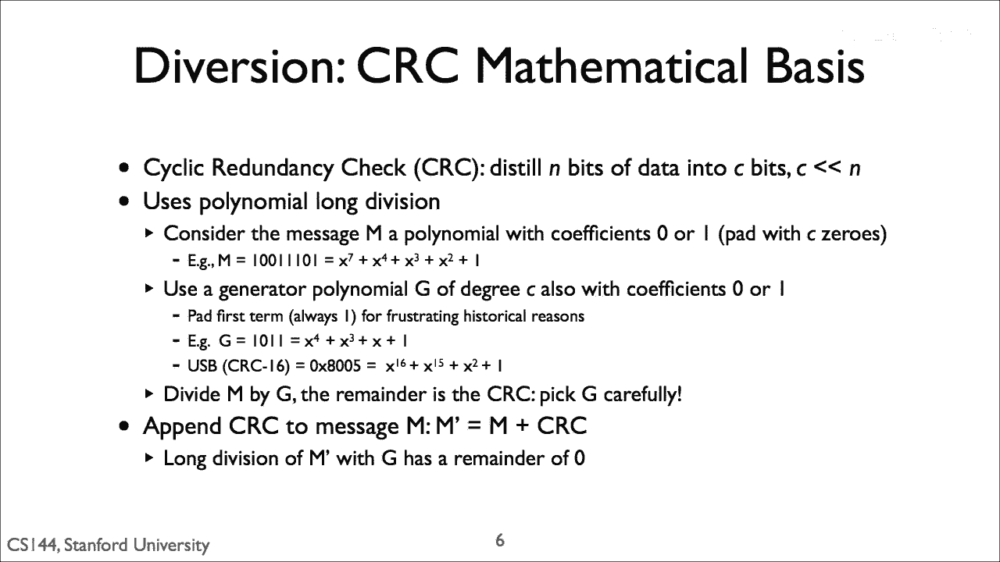

计算CRC的步骤如下：
1.  将原始消息 `M(x)` 左移 `c` 位（即在低位补 `c` 个0），得到新的多项式 `M'(x)`。
2.  将 `M'(x)` 除以生成多项式 `G(x)`。
3.  得到的余数 `R(x)`（长度为 `c` 位）就是CRC值。
4.  将CRC值附加到原始消息后面进行发送。
5.  接收端将收到的“消息+CRC”作为一个整体，再次除以 `G(x)`。如果余数为0，则CRC校验通过。

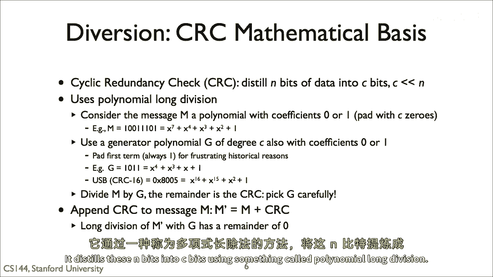


这个过程可以通过硬件非常快速和高效地实现。CRC算法的强度取决于所选择的生成多项式 `G(x)`。对此已有大量研究，产生了许多具有良好错误检测特性的标准多项式。因此，在实践中应使用这些标准多项式，而不是自行设计。

链路层通常使用CRC，因为它们相当健壮。由于许多链路层对突发错误敏感，CRC的突发错误检测能力非常有用。硬件可以很容易地在数据包写入或读取过程中实时计算CRC。


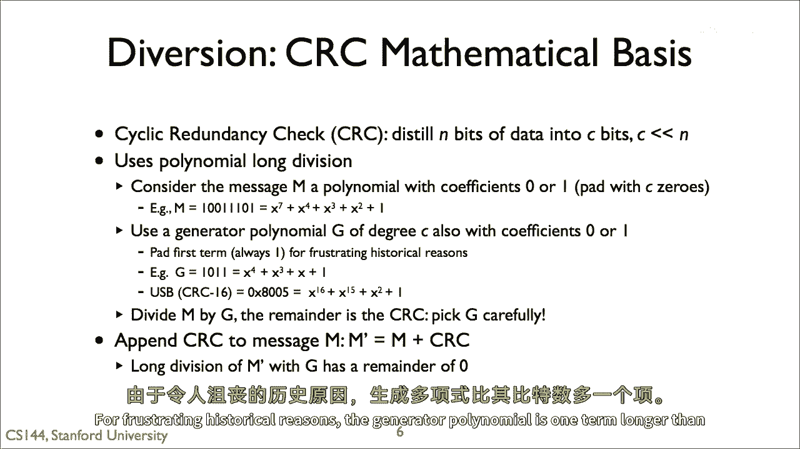

## 3. 消息认证码

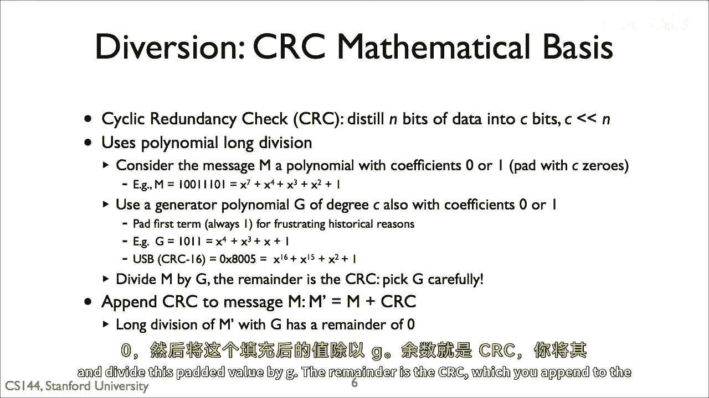

前面两节我们讨论了用于检测随机错误的校验和与CRC。本节我们来看第三种算法——消息认证码（MAC），它主要用于安全目的，但常被与错误检测混淆。MAC将数据包与一个秘密密钥结合来生成一个值。理论上，只有拥有该秘密密钥的人才能生成或验证MAC。


如果你收到一个数据包且其MAC正确，那么你可以相当确信该数据包来自拥有密钥的另一方（或是一个重放的数据包）。除非攻击者拥有密钥，否则生成一个具有正确MAC的新数据包异常困难。实际上，如果MAC算法足够强大，那么给定一个数据包及其MAC，攻击者对于MAC值看起来是什么样子一无所知。因此，MAC能够抵抗恶意篡改。


MAC在传输层安全协议（TLS）中被广泛使用，也就是当你通过HTTPS安全浏览网页时所用的技术。然而，MAC并不擅长检测非恶意的随机错误。如果我在数据包中翻转一个位，更改后的数据包拥有相同MAC的概率并非零。我看到很多人在谈论错误纠正时犯这个错误，认为MAC和CRC一样好。事实并非如此。


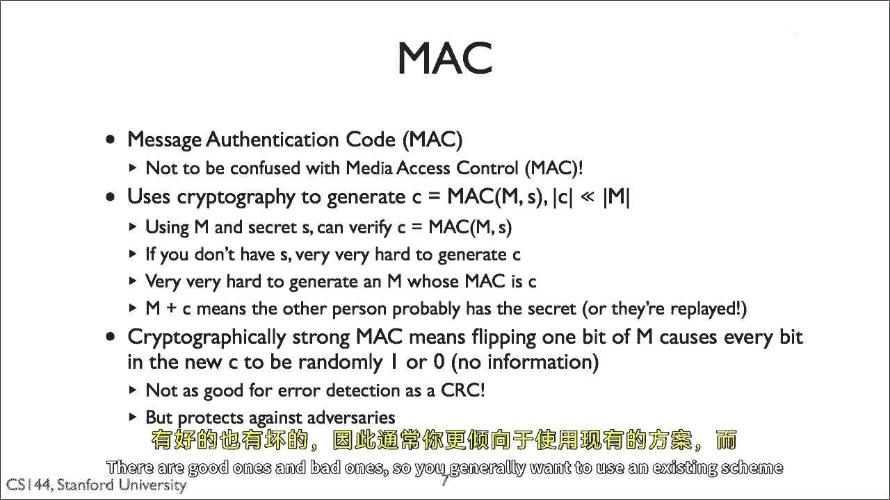

*   如果我有一个16位的CRC，我**保证**能检测到任何长度≤16位的突发错误。
*   如果我有一个16位的MAC，我只能**以很高的概率**（例如 `1 - 1/65536`）检测到篡改。这个概率很高，但考虑到网络传输的海量数据包，失效的可能性仍然存在。


### MAC的工作原理


MAC有深厚的数学背景，存在好的和坏的实现方案。因此，通常应该使用现有的、经过充分研究的标准方案，而不是冒险自创。幸运的是，标准协议通常会指定应该使用哪种MAC算法。

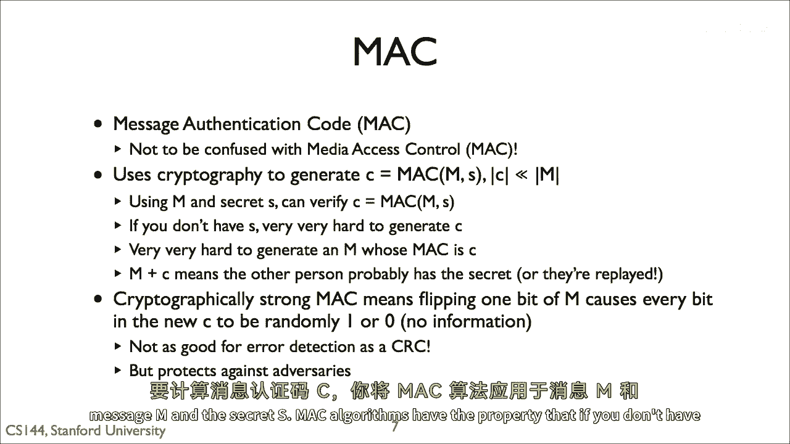

大多数MAC的理念是通信双方共享一个秘密密钥 `S`。这个密钥是一个随机生成的位串，因此很难被猜测或计算。消息认证码 `C` 是通过将MAC算法应用于消息 `M` 和密钥 `S` 而生成的：
`C = MAC(M, S)`

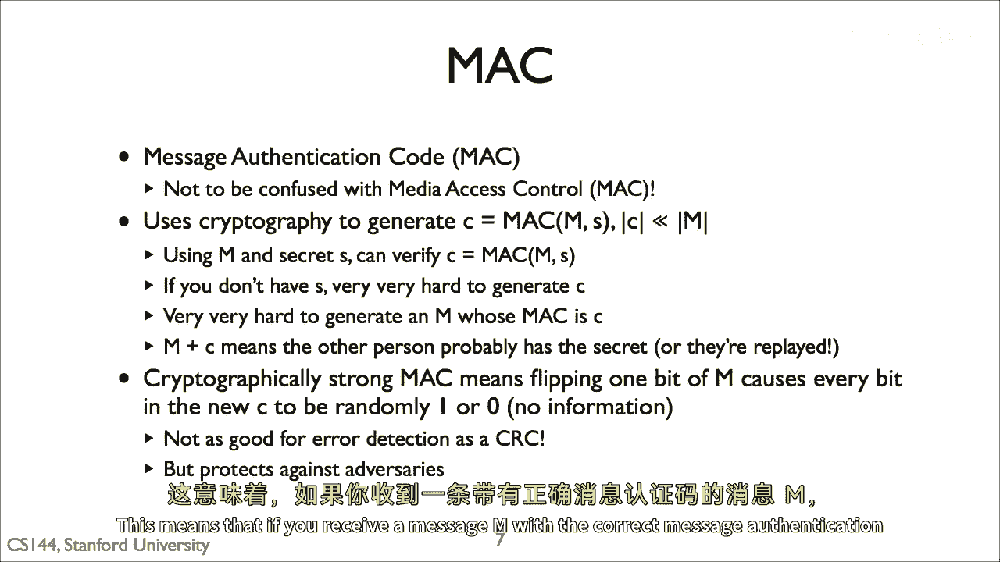

该算法具有一个关键属性：如果不知道密钥 `S`，那么为任何消息 `M` 生成正确的 `C` 异常困难。同样，给定一个MAC值 `C`，也很难找到一个能产生该 `C` 的消息 `M`。此外，即使你拥有一些 `(M, C)` 对，它们也几乎不会泄露关于密钥 `S` 的任何信息。

加密强度强的MAC有一个有趣的属性：如果你更改 `M` 中的一个位，这将导致一个全新的、看起来完全随机的MAC值 `C'`，`C'` 中任何一位为0或1的概率都是50%，并且与原来的 `C` 无关。如果不是这样，那么攻击者就可以通过翻转一些位（例如修改交易金额）来轻松生成具有正确MAC的恶意消息。


从技术上讲，这意味着消息认证代码**没有**错误检测的保证。如果你翻转一个位，你可能会（尽管概率极低）得到与原始MAC相同的MAC。因此，MAC首先和主要是一种安全机制。虽然一个强大的机制同时能提供错误检测和安全是件好事，但其安全特性意味着它在纯粹的随机错误检测方面不如CRC等专用方法。

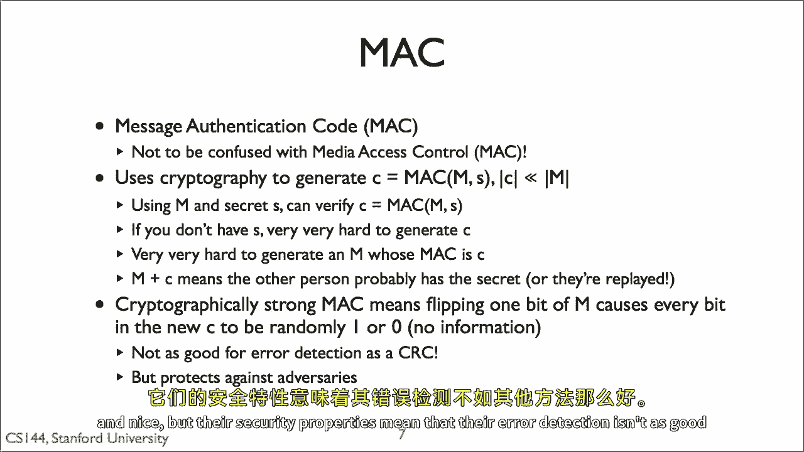

## 算法对比与总结

让我们通过一个对比表格来回顾三种算法的关键特性：

以下是三种算法对不同类型错误的检测保证对比（“是”表示保证能检测，“否”表示不保证）：

| 错误类型 | 校验和 | 8位CRC | 16位CRC | MAC |
| :--- | :--- | :--- | :--- | :--- |
| **单个位错误** | **是** | **是** | **是** | **否** |
| **两个位错误** | **否** | **是** | **是** | **否** |
| **长度≤8位的突发错误** | **否** | **是** | **是** | **否** |
| **长度=9位的突发错误** | **否** | **否** | **是** | **否** |
| **相隔很远的两个位错误** | **否** | **否** | **否** | **否** |

查看此矩阵，你可能会认为错误检测算法的保证非常有限。但请注意，“保证”是一个非常强的声明。虽然一个8位校验和无法**保证**捕获9位突发错误，但捕获的概率仍然很高。同样，一个16位CRC也有很高的概率检测到相隔很远的两个位错误。

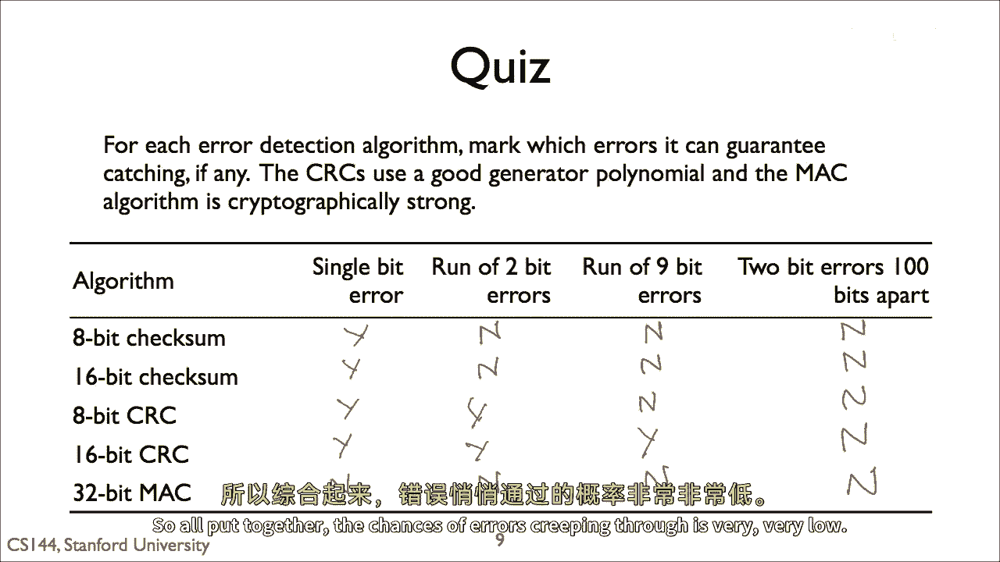

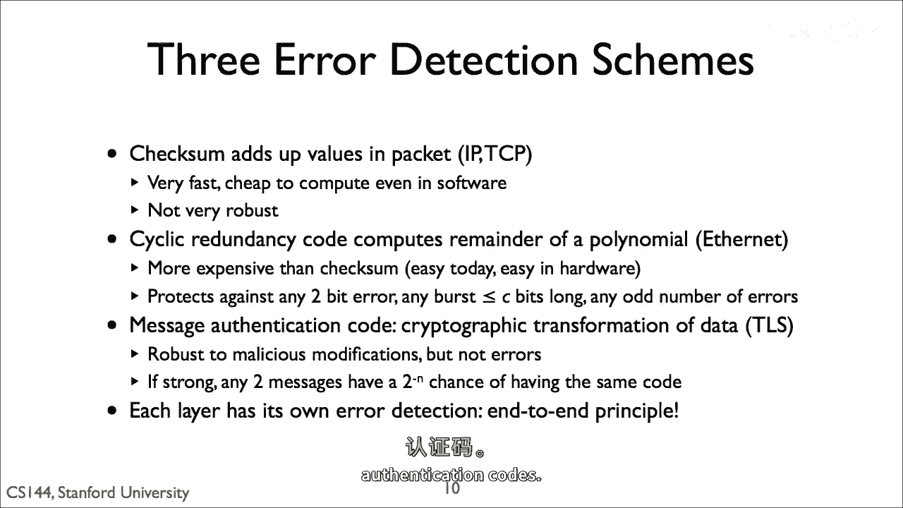

在实际应用中，高概率往往就足够好了。如果失败很少发生，那么只需要偶尔执行一些更昂贵的恢复操作即可。这也意味着在实际网络中，我们往往采用多层错误检测：
*   链路层使用CRC。
*   网络层（IP）使用校验和。
*   传输层（TCP）再次使用校验和。
*   最终，应用程序通常还有自己的错误检测或校验机制。

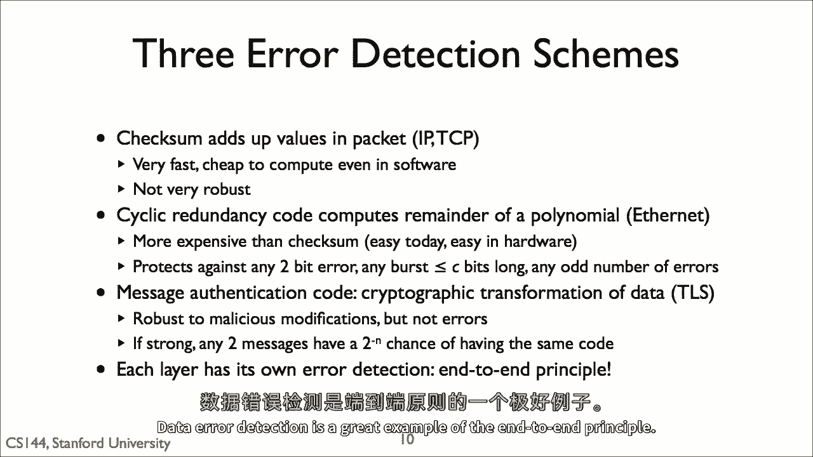


所有这些层次叠加在一起，使得错误能够渗透而不被发现的几率变得非常非常低。


## 端到端原则的体现

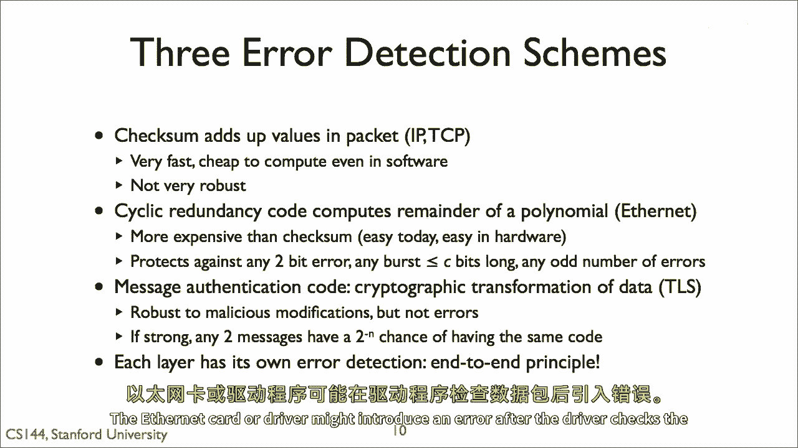


数据错误检测是“端到端原则”的一个绝佳例子。实际上，这正是该原则的驱动力之一。每一层只能通过进行端到端的检查来确保它正确地通信数据：
*   以太网需要确保其帧没有错误，以便正确解析，所以它有自己的CRC。
*   IP需要确保其数据包没有错误，以便正确解析。IP不能依赖以太网所做的检查，因为以太网卡或驱动程序可能在检查之后引入错误，所以IP必须在网络层进行自己的端到端检查（使用校验和）。
*   使用消息认证码的TLS是另一个有趣的例子。它对错误检测的要求与IP或以太网大相径庭——它主要追求安全性。因此，它必须提供自己从开始到结束的错误检测（和安全）方案，因为这是确保其安全要求的唯一方式。

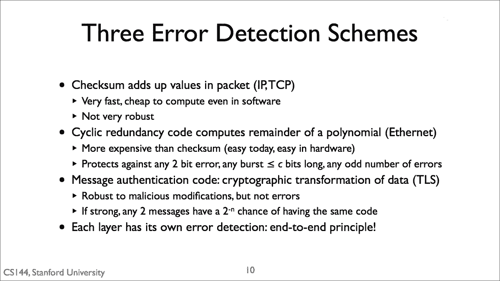

**本节课中，我们一起学习了三种核心的错误检测算法：校验和、循环冗余校验（CRC）和消息认证码（MAC）。我们了解了它们的基本原理、计算方式、优缺点以及各自在网络协议栈不同层次中的应用。理解这些差异有助于我们设计更健壮、更安全的网络系统和协议。**