# 课程 P28：有限状态机（FSM）基础 🧠

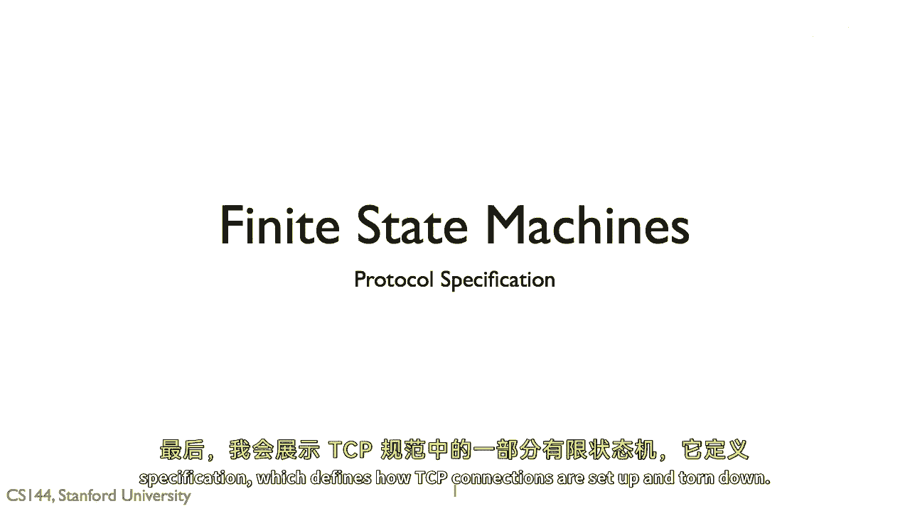

在本节课中，我们将要学习**有限状态机**（Finite State Machine, FSM）的基本概念。这是一种在描述网络协议和系统行为时非常常用的模型。我们将了解其构成要素、绘制规范，并最终通过分析TCP协议中用于建立和拆除连接的经典状态机来巩固理解。


## 什么是有限状态机？

正如其名称所示，有限状态机由**有限数量的状态**组成。**状态**代表了系统在某一时刻的特定配置。

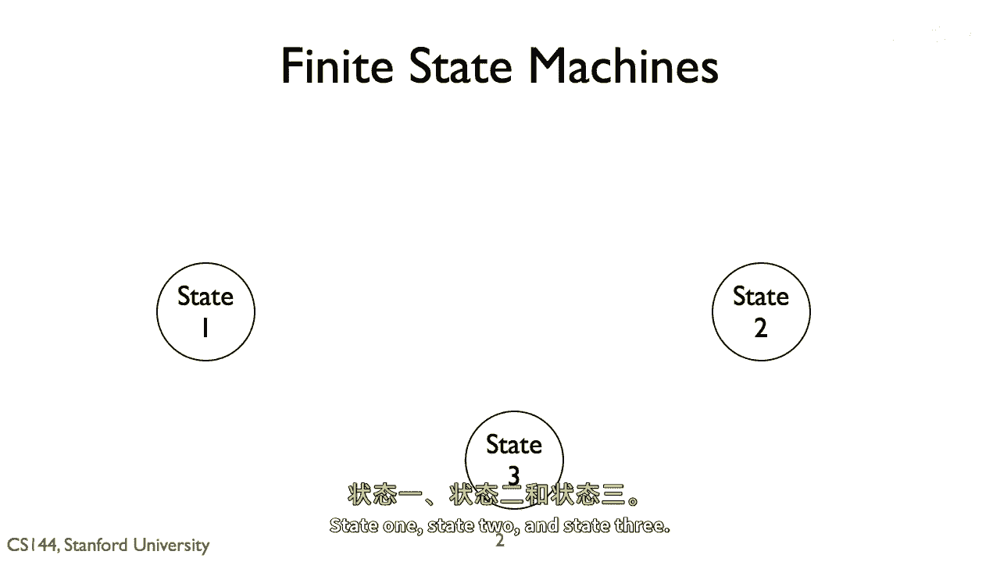

为了便于理解，我们从一个抽象的例子开始。假设一个系统有三个状态：**状态一**、**状态二**和**状态三**。系统在任何时刻都只能处于这三个状态中的一个。

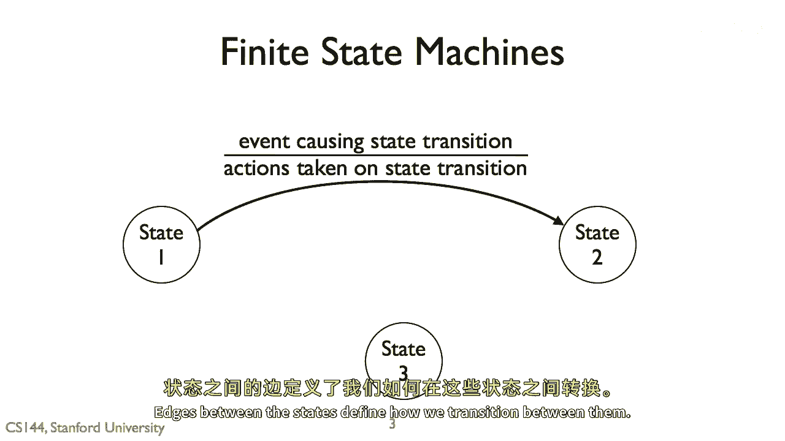


## 状态与转换


状态之间的**边**（或箭头）定义了系统如何从一个状态转换到另一个状态。这种转换由**事件**触发。


当我们绘制一条转换边时，首先需要标明导致转换的**事件**。在事件下方，我们可以声明当该转换发生时系统将执行的**动作**。动作部分是可选的，因为并非所有转换都伴随动作。

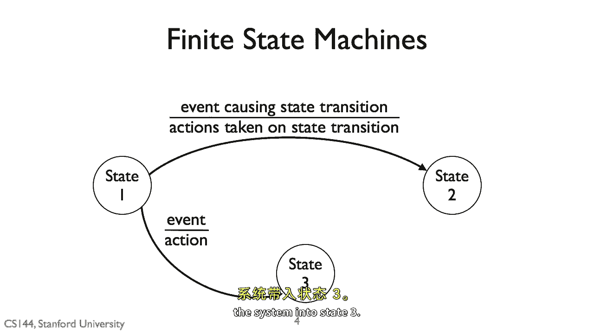

```
状态 --[事件/动作]--> 新状态
```

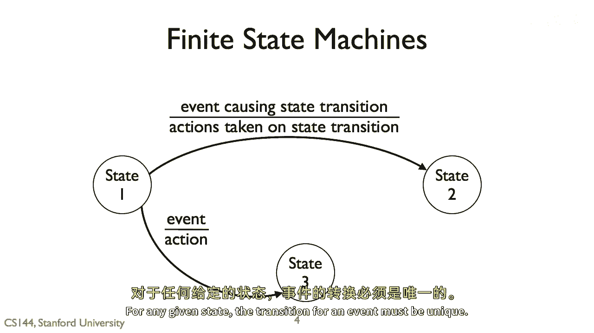

如果系统处于某个状态时发生了一个事件，但该事件没有对应的转换边被定义，那么有限状态机在该情况下的行为是**未定义**的。

## 转换规则

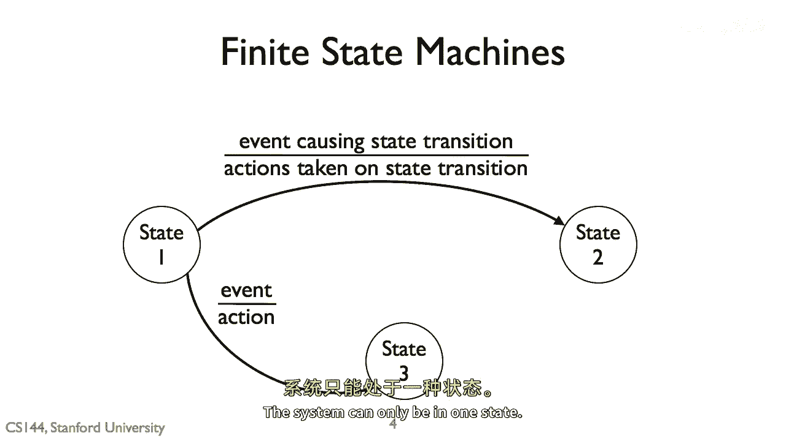

从一个状态出发，可以有多条转换边，每条边对应不同的事件。例如，从**状态一**可以因**事件A**转换到**状态二**，也可以因**事件B**转换到**状态三**。


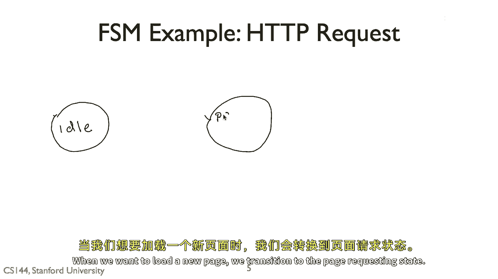

然而，对于任何一个给定的状态，**同一个事件不能对应多个不同的转换**。否则转换将是模糊的，系统无法确定应该进入哪个新状态。

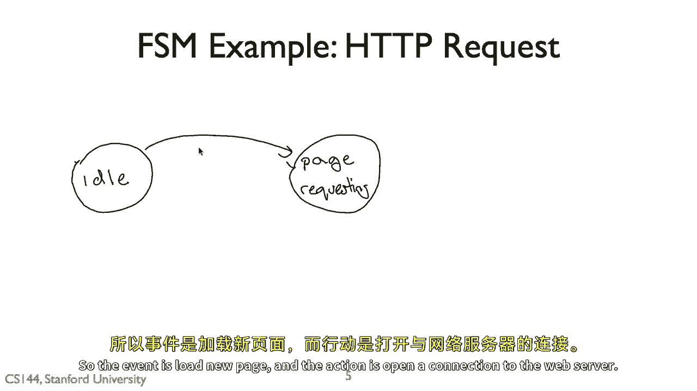

## 一个简化的HTTP请求示例

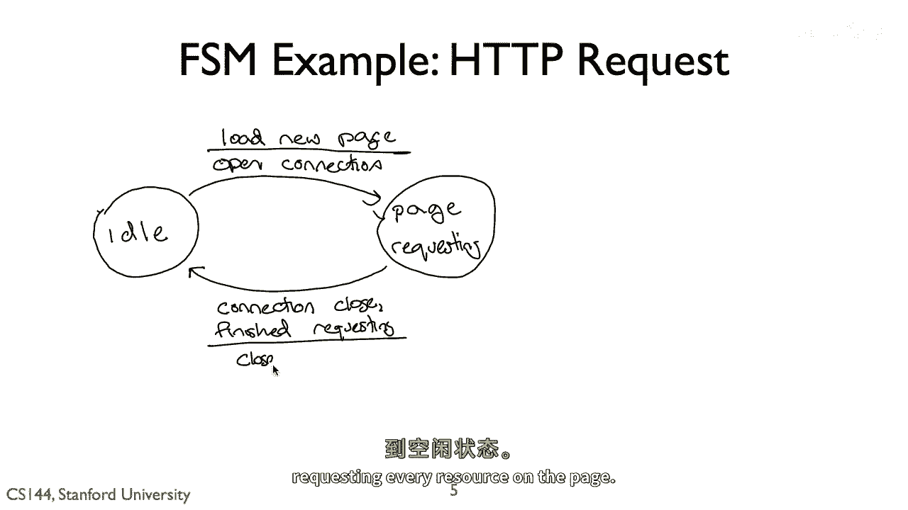

上一节我们介绍了状态机的基本构成，本节中我们来看一个简化的HTTP请求流程示例。

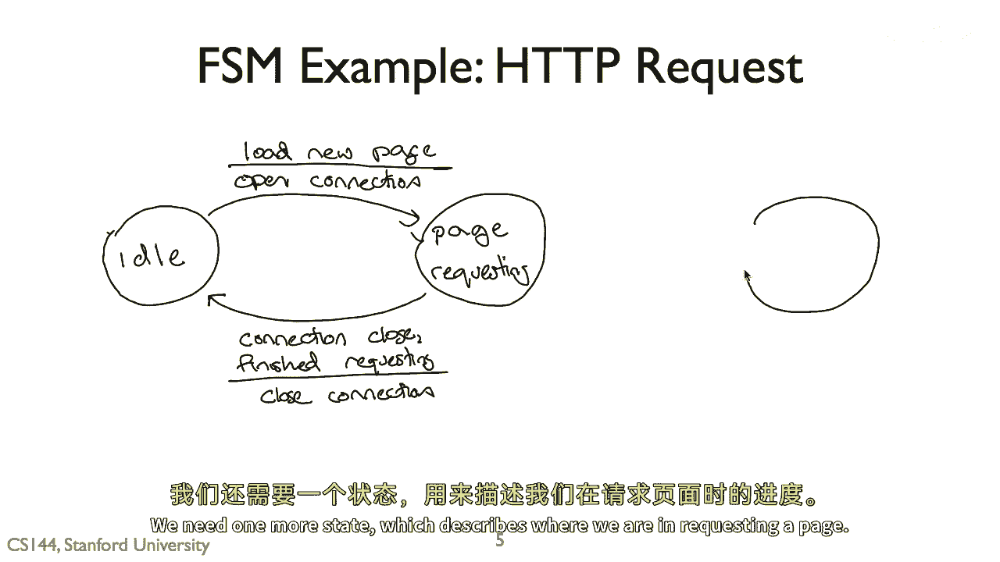

我们可以这样描述一个非常简单的网页加载系统：
*   **起始状态（空闲）**：用户正在浏览页面或处于空闲状态。
*   **事件**：用户请求加载一个新页面。
*   **转换**：系统从“空闲”状态转换到“请求页面”状态。
*   **动作**：打开与Web服务器的连接。

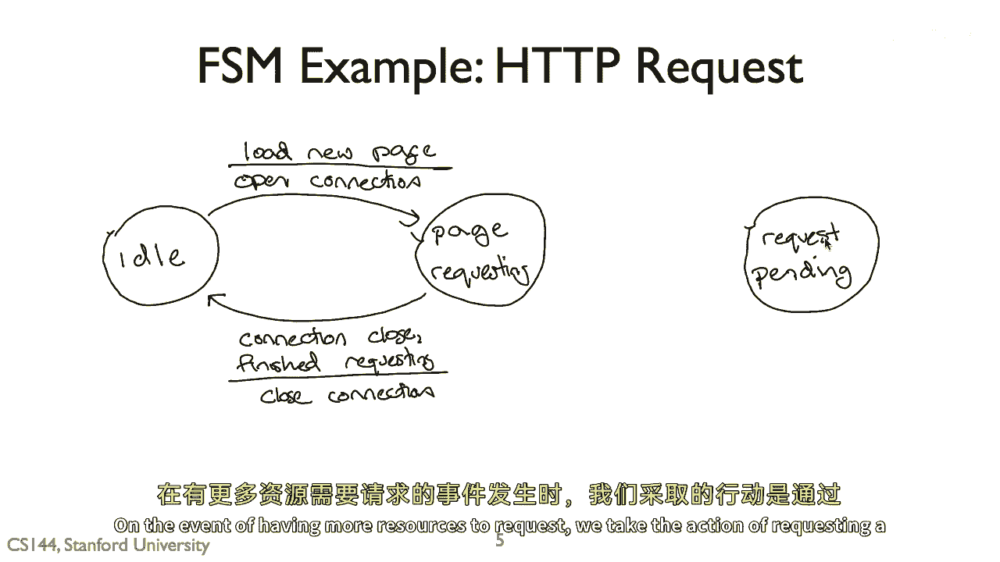

一旦连接打开，系统就处于“请求页面”状态。当页面上的所有资源都加载完毕，连接关闭时（事件：连接关闭），系统将转换回“空闲”状态。

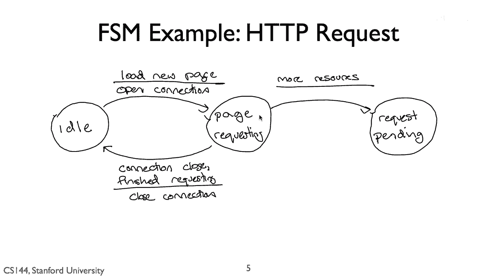

但这个模型过于简单。实际上，在请求页面时，我们可能需要逐个请求多个资源（如图片、脚本）。因此，我们需要一个额外的“请求待处理”状态。

以下是描述这个流程的状态列表：
1.  **空闲**：初始状态。
2.  **请求页面**：已打开连接，正在处理页面请求。
3.  **请求待处理**：已发出对某个资源（如图片）的HTTP请求，正在等待服务器的响应。

这个三状态系统虽然简单，但并未明确定义所有可能发生的情况。例如，如果在“请求待处理”状态时连接突然关闭了怎么办？或者在“空闲”状态时意外收到了服务器响应？

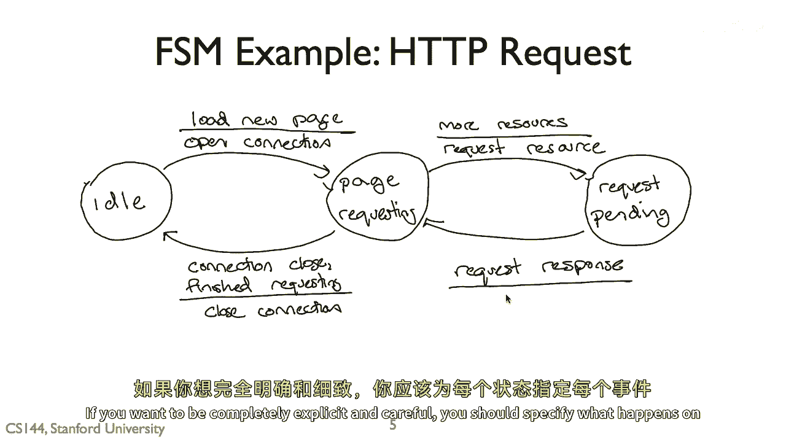

为了完全明确，理论上应该为每个状态下的每个可能事件都定义转换。但这会导致状态机变得非常复杂，拥有大量的边。

因此在实际规范（如IETF的协议文档）中，通常只描述最常见、保证互操作性所必需的路径，并通过附加文本来说明其他情况，或允许部分行为未定义，为未来的实现和扩展留出灵活性。

## 实战分析：TCP连接状态机 🖥️

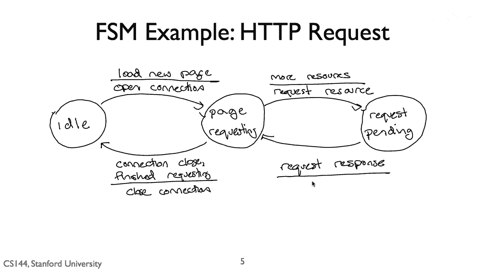

现在，让我们通过一个实际的、可能是互联网上最著名的有限状态机例子来巩固所学——**TCP协议的状态机**。

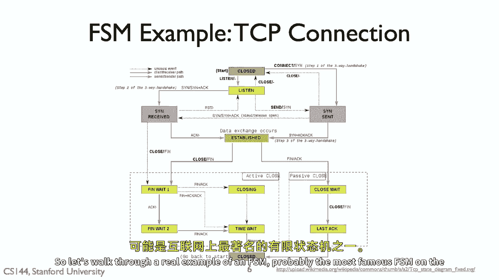

下图描述了TCP连接的整个生命周期，包括建立、数据传输和关闭。它看起来复杂，共有约十一个状态，但我们可以分部分理解。


这个图表大致可分为四个部分：
*   **顶部（建立连接）**：描述TCP三次握手的过程。
*   **中部（已建立）**：连接成功建立后，进行数据传输的状态。
*   **下部（关闭连接）**：描述连接如何正常关闭。
*   **底部（关闭）**：连接完全终止，系统可以释放相关资源。

### 解读三次握手

记住，TCP使用**三次握手**来建立连接。让我们结合状态机来一步步看：

1.  **客户端（主动打开者）发起**：
    *   程序调用 `connect()`。
    *   **事件**：`connect`调用。
    *   **转换**：从 **CLOSED** 状态转换到 **SYN-SENT** 状态。
    *   **动作**：向服务器发送一个 **SYN**（同步）报文。

2.  **服务器（被动打开者）响应**：
    *   服务器程序已调用 `listen()`，处于 **LISTEN** 状态。
    *   **事件**：收到 **SYN** 报文。
    *   **转换**：从 **LISTEN** 状态转换到 **SYN-RCVD** 状态。
    *   **动作**：向客户端发送 **SYN-ACK**（同步-确认）报文。

3.  **客户端确认**：
    *   客户端处于 **SYN-SENT** 状态。
    *   **事件**：收到 **SYN-ACK** 报文。
    *   **转换**：从 **SYN-SENT** 状态转换到 **ESTABLISHED** 状态。
    *   **动作**：向服务器发送 **ACK**（确认）报文。

4.  **服务器完成连接**：
    *   服务器处于 **SYN-RCVD** 状态。
    *   **事件**：收到 **ACK** 报文。
    *   **转换**：从 **SYN-RCVD** 状态转换到 **ESTABLISHED** 状态。

至此，双方都进入了 **ESTABLISHED** 状态，可以开始双向数据传输。通过这个例子，你可以看到状态机如何清晰地刻画了协议双方在每一步收到特定报文（事件）后应如何反应（动作）并改变自身状态。

## 总结

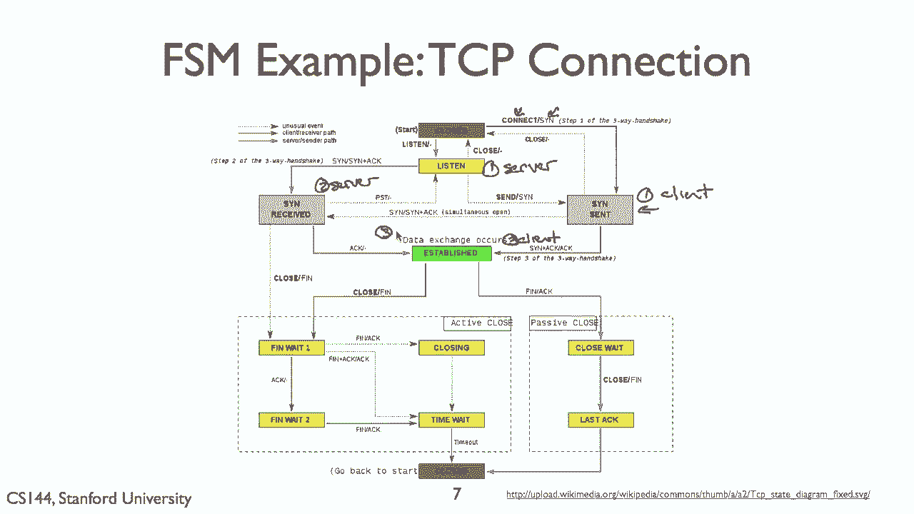

本节课中我们一起学习了**有限状态机**的核心概念。我们了解到FSM由**状态**、**事件**和**转换**（及可选的**动作**）构成，是描述具有清晰状态变化的系统（如网络协议）的强大工具。我们探讨了其绘图规范，并通过分析简化的HTTP流程和复杂的TCP连接状态机，看到了FSM如何从抽象模型应用到实际场景中。理解FSM是深入理解许多计算机系统，尤其是网络协议工作原理的基础。