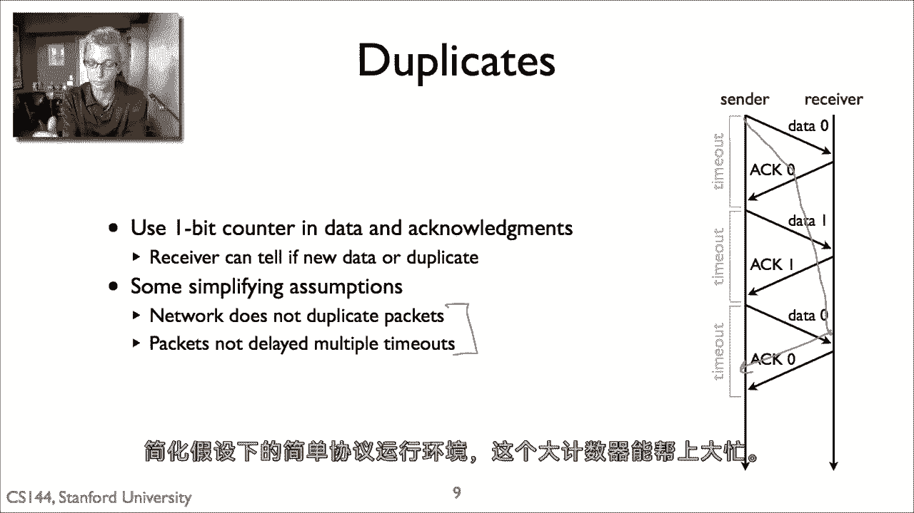

# 课程 P32：停止等待协议 🛑⏳

在本节课中，我们将要学习流量控制的基本概念，并深入探讨其最简单的实现方式——停止等待协议。我们将了解它如何解决发送与接收速度不匹配的问题，以及其基本工作原理和潜在缺陷。

---

## 概述

流量控制是可靠高效通信的基本构建块之一。它试图解决的核心问题是：当发送者发送数据的速度快于接收者处理数据的速度时，会导致数据包丢失和网络资源浪费。本节课将首先介绍流量控制的基本原理，然后重点讲解其最简单的实现——停止等待协议。

---

## 流量控制要解决的问题

上一节我们概述了课程目标，本节中我们来看看流量控制具体要解决什么问题。

当发送者可以发送数据的速度比接收者可以处理的速度更快时，就会出现问题。例如，发送者A每秒可以发送500万个数据包，但接收者B每秒只能处理200万个数据包。这可能是因为B的处理器速度较慢、网卡性能不足或其他原因。

因此，如果A以每秒500万个数据包的满速率发送，那么其中300万个数据包将不得不被B丢弃，因为B无法处理它们。实际上，只有五分之二的数据包能够成功通过。这对发送者A来说是巨大的浪费，也造成了网络资源的极大消耗，并且会完全占满接收者B。

发送者A没有理由以快于接收者B处理速度的速率发送数据。因此，流量控制的基本方法是：**确保发送者不会发送比接收者能处理的更多的数据包**。接收者需要以某种方式向发送者提供反馈（无论是隐式还是显式），指示发送者应该减速、加速或设置队列。

---

## 两种基本方法

目前大多数协议主要使用两种基本方法来实现流量控制。

*   **停止等待协议**：这是本视频首先讨论的方法，非常简单，易于实现为一个非常简单的有限状态机。
*   **滑动窗口协议**：这个方法将在后续视频中提到，它稍微复杂一些，但能提供更好的性能。

在深入协议细节之前，我们先简要复习一下有限状态机图。当我们绘制一个协议的有限状态机时，我们展示它可以进入的状态（例如状态一、状态二、状态三）。状态之间的边包含两个信息片段：**上方**是引起状态转换的**事件**，**下方**是状态转换时执行的**动作**。

---

## 停止等待算法原理

上一节我们介绍了流量控制的两种基本方法，本节中我们来看看停止等待算法的核心思想。

停止等待算法非常简单：它规定**在任何时间，从发送者到接收者最多只能有一个数据包在传输中（即“在途”）**。

基本算法如下：
1.  发送者发送一个数据包。
2.  然后等待接收者的确认（ACK）。
3.  当收到确认后，如果还有更多数据要发送，就发送下一个数据包。
4.  如果等待一段时间（即超时）后仍未收到确认，发送者就假设数据包已丢失（可能在网络中被路由器丢弃，或确认包被丢弃），然后它**重新发送**该数据包。

---

## 协议状态机

理解了基本算法后，我们来看看协议双方的具体行为如何用状态机描述。

**接收者**有一个单一状态的有限状态机：
*   **事件**：当它收到新数据时。
*   **动作**：它为那个数据发送一个确认（ACK）。如果数据是新的，它还将这个数据传递给上层应用程序。

**发送者**的有限状态机有两个状态：
1.  **等待数据状态**：在此状态中，协议准备发送数据，但应用程序尚未提供要发送的数据。
    *   **事件**：当应用程序调用发送函数时。
    *   **动作**：协议发送包含该数据的包（或能装入包的最大数据量），然后进入“等待ACK状态”。
2.  **等待ACK状态**：在此状态中，有两个可能的转换：
    *   **事件1**：收到确认（ACK）。
        *   **动作**：回到“等待数据状态”。如果有更多数据要发送，就发送新数据；如果没有，就等待应用程序再次调用发送。
    *   **事件2**：超时。
        *   **动作**：重新发送之前的数据包，然后继续等待ACK。

发送者需要谨慎选择超时时间，以确保在超时发生时，数据包或随后的确认几乎肯定已经丢失。该协议的核心是**在任何时间只有一个数据包在网络中传输**。

---

## 执行示例分析

以下是停止等待协议的四个典型执行示例，帮助我们理解其在不同场景下的行为。

**情况一：无丢失（理想情况）**
一切完美工作。发送者发送数据（DATA），接收者接收后发送确认（ACK）。发送者收到ACK后，如果有更多数据，就可以发送下一个。

**情况二：数据丢失**
发送者发送数据，但数据包在网络中丢失。发送者等待ACK超时，然后重新发送数据包。

**情况三：数据成功，但确认丢失**
数据成功交付给接收者，接收者也发送了ACK，但ACK在网络中丢失。发送者超时，并重新发送数据。这导致接收者（收到重复数据）发送一个新的ACK。此时，发送者收到ACK并继续正常操作。

**情况四：延迟确认导致的复杂性**
这个情况稍微复杂，揭示了基本算法的一个潜在问题。假设发送者发送数据，接收者发送ACK，但网络中发生拥堵（例如链路变慢或队列过长），导致ACK被严重延迟，超过了发送者的超时时间。
1.  发送者超时，重新发送数据。
2.  不久之后，那个被延迟的ACK（针对原始数据包）终于到达发送者。
3.  发送者知道数据已被确认，于是发送下一个新数据包。
4.  如果这个新数据包丢失了，而之前重传的第一个数据包到达了接收者，接收者会为这个（它认为是重复的）数据包再次发送ACK。

此时，发送者面临一个问题：它收到的这个ACK，到底是针对旧数据包的重传，还是针对新数据包的？如果它错误地假设这个ACK是针对新数据的，那么它可能认为新数据已成功送达（实际上已丢失），从而导致错误。在任何可靠的流量控制协议中，一个基本问题就是：**如何检测重复的数据包和确认？如何区分确认是针对重传包还是新数据包？**

---

## 解决方案：序列号

针对上述重复检测的问题，停止等待协议可以使用一个**一位序列号（1-bit sequence number）** 来解决。

思路是在所有数据包和确认包中都使用这个一位计数器。例如：
*   发送者先发送 **数据0（DATA 0）**。
*   接收者回复 **确认0（ACK 0）**。
*   发送者然后发送 **数据1（DATA 1）**。
*   接收者回复 **确认1（ACK 1）**，依此类推。

这样，接收者就能通过序列号判断收到的是新数据还是重复数据。在前面提到的复杂情况中，接收者可以通过序列号区分ACK是针对“数据0”的重传，还是针对“数据1”的首次传输。

然而，这种一位计数器方法基于两个简化假设：
1.  **网络本身不会复制数据包**。
2.  **数据包不会因延迟超过多个超时周期而失效**（例如，一个“数据0”包被延迟了很长时间，在发送者已经发送“数据1”后才到达，导致接收者错误地将其当作新数据）。

在实际中，可以通过增加序列号的空间（例如使用更多比特的序列号）来解决这些问题，但对于理解简单的协议运行原理，这些简化假设是合适的。

---

## 总结

本节课中，我们一起学习了流量控制的重要性及其最简单的实现——停止等待协议。我们了解了它通过“发送-等待-确认”的机制，确保同一时间只有一个数据包在传输，从而解决收发速度不匹配的问题。我们还分析了其基本状态机、几种典型的执行情况，以及使用**一位序列号**来解决数据包和确认包的重复问题。虽然停止等待协议简单且易于实现，但其效率较低，这引出了我们后续将要学习的、性能更优的滑动窗口协议。