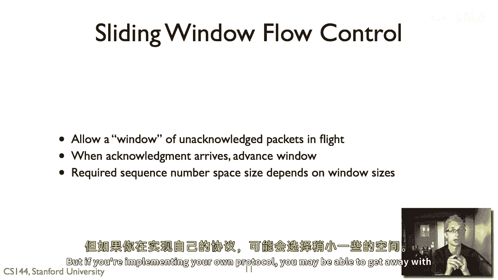

# P33：p32 2-8 Sliding window - 加加zero - BV1qotgeXE8D

我要讨论的视频是关于一种稍微高级的流控制算法，叫做滑动窗口，这种算法在今天大多数高性能协议中都被使用，所以被称为简单的，一种简单的流控制算法，叫做停止和等待，在任何时刻最多只有一个数据包在飞行。

所以这就是基本的简单协议，你可以说，算法，我试图在第一次你进行可靠的通信时实现它，所以发送者发送一个数据包或数据块的一部分，接收者发送确认，如果发送方没有收到确认，它将超时，尝试重新发送叮。

如果它收到确认，它发送更多的数据，并且存在重复的问题，你可以维护一个计数器，一个一位的计数器来确定，如果存在重复的行为或演员重复或新数据，嗯，只要事情重复超过周围旅行时间，停止方式，它起作用，它很棒。

它是如此一件事，虽然停止和等待工作正确，它有一个主要问题，假设你要在波士顿和旧金山之间通信，并且瓶颈假设是每秒十兆比特，所以这里有一个每秒十兆比特的链接，或者让我们假设波士顿节点可以接收每秒十兆比特。

那就是你处理数据的速度，你的往返时间为五十毫秒，让我们就说为了简化起见，我们正在发送以太网帧，所以这就是数据的大小，所以这些基本上就是一点，五千字节，或者嗯，现在十二千比特，往返时间五十毫秒。

这意味着旧金山可以发送一个包五十，如果那个包在五十毫秒后成功接收，我们将收到确认，所以每秒我们有一千毫秒除以五十毫秒，这意味着我们在这条路径上最多可以发送二十包每秒，嗯，在这个路径上。

二十包每秒乘以十二嗯，千比特，嗯，每个包的千比特等于二百四十千比特，嗯，千比特每秒，所以从旧金山到波士顿这条路线，使用停止协议最多可以发送240千比特每秒，假设没有包丢失，只有不断的RTT为50毫秒。

但瓶颈是10兆比特每秒，所以这意味着这个停止方式协议正在使用，你知道，停止和等待能力的通信能力的2%来停止和等待，虽然它工作起来可能极其效率低下，旧金山可以比停止等待允许的数据传输速度发送更快的数据。

所以今天大多数协议使用的基本解决方案，对于嗯，这个问题被称为滑动窗口，滑动窗口是停止重量的一般化，停止等待允许在任何时间有一个包在飞行，滑动窗口协议允许最多n个包在飞行，所以当n等于等于1时。

滑动窗口协议的行为就像停止等待，所以让我们假设我们有一个滑动窗口协议，n等于，说5个包，这意味着旧金山可以有5个包，同时在飞行，并且可以同时发送5个确认，也许有5个来自波士顿的确认，嗯，这里的想法是。

如果你可以适应，如果你可以设置n为正确的值，那么你就可以保持管道充满，那就是旧金山可以发送，嗯，数据给波士顿以10兆比特每秒的速度，所以让我们假设这是波士顿的速率，因此，波士顿通过配置滑动窗口大小。

可以允许旧金山以10兆比特每秒的速度发送数据，所以在这个案例中，对吧，如果我们有50毫秒的RTT，和10兆比特每秒的瓶颈，让我们说，我们正在发送以太网帧，10，嗯，每秒一包，嗯，我们有20个往返时间。

这基本上意味着滑动窗口将是，嗯，10兆比特每秒，除以20个往返时间，基本上等于500千比特每个往返时间，所以我们正在考虑一个滑动窗口大约是，嗯，四十九，我很抱歉，大约有四十一包。

四十等于四百八十千比特的往返时间，所以四一就等于四百九十二，嗯，如果我们有一个滑动窗口大小为四十包，那么我们实际上能够维持一个十兆比特的连接，从旧金山到波士顿，往返时间为五十毫秒，所以只是为了画个图。

稍微展示一下这个看起来什么样子，所以这里是原始的，这里是停止和等待，我们有一个位计数器，一个数据零x零，数据一动作，一个数据零x零，所以滑动窗口，让我们假设我们有一个滑动窗口的大小，嗯，三。

那么发送者将发送三包，让我们称它们为d零，D一，D二，然后接收者可以承认它们，动作零，动作一，动作二，一旦认可零到达，发送者可以发送数据三，一旦得到认可，当一到达，发送者可以发送数据四。

一旦得到认可二到达，发送者可以发送数据五，这是基本概念，而不是有一个包，你可以有很多包，所以在有上升窗口大小为四十的情况下，你可以想象有无数无数无数个包在飞行，让我们更具体地看看这个算法看起来什么样子。

对于发送者和接收者，就像我们对顽固的重量一样，所以滑动窗口发送者首先在滑动窗口协议中，每个段都有一个序列号，所以在TCP等协议中，这通常以字节为单位进行，因为它们可以变得不同大小，嗯，为了简便起见。

我们将其以包号为单位进行，所以每个段都有一个序列号，所以发送者维护三个变量，大小等于其发送窗口，它从接收者收到的最后确认和它发送的最后段，发送者的任务是保持这个不变量，即发送的最后段。

减去收到的最后确认，必须小于或等于发送窗口大小，这意味着如果它已经收到了包n，一个序列号为n的包，发送者不能发送超过n加sws的包，假设我们有一个上升的窗口等于五，并且已经收到的最后确认，嗯等于十一。

那么这就意味着发送者无法将包发送过十二十三十四，十五十六，不允许发送十七，直到收到十二美元的费用，当你收到新的确认，你前进，嗯，按需，并且你缓冲发送窗口大小段的部分以防止，突然你收到确认，然后你想要嗯。

发送一大批数据，让我们假装一下，我们的滑动窗口大小等于三，所以这里是包零一、二、三，假设零已经被发送并确认，所以发送窗口大小是三，接收器的最后确认是零，所以r等于零，Sw等于三，这就意味着。

最后一个分段，嗯，发送等于三，所以当对一个的确认安全到达时，然后发送窗口可以前进，所以现在协议可以发送，假设对四的确认到达，然后窗口可以前进，它可以发送五，六和七，在这里有一个重要的事情是。

假设我们有一个发送窗口，它包括五，六和七和五丢失了，但是六和七到达了接收者并被确认，发送者只有在五被确认后才能超过五的窗口，因此，窗口被称为ong，窗口可以在哪里停滞。

尽管窗口中的大部分数据都已经被交付，它不能超过第一个未被确认的数据片段，所以它不能超过接收者也维护的三个变量，它有一个接收窗口大小，最后一个可接受的片段，所以这就是它将接收的最后一段，它不会掉在地上。

如果它接收到超过这个值的一段，它会假设有什么问题或者不会缓冲它，然后它会直接丢弃它，然后这就是它实际上接收的最后一段，所以发送者，接收者然后维护这个不变量，即最后一个可接受的段。

减去我们最后收到的东西必须小于或等于接收窗口大小，所以如果你 ever 接收到窗口大小等于五，和一个最后接收到等于三的段，那么它不会激发超过四的任何东西，五，六，七八，所以如果它突然接收到第十段。

它不会接受它，我现在会丢弃它，如果接收包是，嗯小于这个可接受的段，那么我们会发送一个确认，所以如果它接收到这些任何包，它会发送一个确认，在基本情况下，大多数滑动窗口协议的工作方式。

这些确认被称为累积确认，这样，你会发送一个确认，不是您收到的数据，而是您连续接收的数据的结束，这个累积，如果我确认三，这意味着我已经收到了三和它之前的所有东西，不仅仅是三。

所以它代表了整个通信中的累积接收状态，所以，在这个例子中，如果接收者收到了一，二，三和五，然后突然收到五，它不确认五，它确认三，有一些协议可以做一些事情，如，实际上做选择性确认。

但基本情况是您使用累积确认，这是指累积地，您已经收到的连续数据块，所以这里有一个小细节，tcp，嗯，不确认它收到的数据，而是n加1，所以tcp确认是以字节为单位的，"因此。

如果TCP接收到的字节数达到了n，那么它的确认包就会"，"我们将说n加1"，所以，期待的是第一个数据字节，所以，如果你 ever 在寻找，TCP 翻译成中文是 "传输控制协议"。

"跟踪或试图了解TCP协议的工作方式"，"请记住这一点"，"TCP头部的确认值"，"收到的最后一个字节是否是累积的确认，而不是下一个字节？"，"第一个缺失的字节"，所以我们在停止和挥手中讨论的一件事是。

在停止等待协议中，一个一位计数器的计数器就足够了，假设包没有延迟超过往返时间，那么滑动窗口协议如何，突然接收窗口，我们有发送窗口，我们需要多大的序列号空间，所以c窗口总是大于一，发送窗口总是大于一。

而不是等于一，他们的c窗口大于等于或小于发送窗口，这是因为如果接收窗口曾经大于发送窗口，这是浪费，嗯，发送，发送者永远不会有那些在飞行的包，因此，存在一个永远不会被使用的额外缓冲空间，然而，但也有情况。

接收窗口可以小于发送窗口，并且协议仍然工作，所以，这里有一个被称为'基本情况'的有趣一例，"返回"，"让我们假设接收窗口的大小为一"，嗯，"并且比嗯更大的上升窗户"，大于一，"在这种情况下。

我们需要发送窗口大小加一的序列号"，"那么这个协议看起来什么样子？"，"很好"，发送者说说是一个发送，"窗口大小等于三"，所以发送者发送零，一和二，让我们假设这些都被确认了，所以接收者确认嗯，零。

确认一，确认二，但当它确认零时，发送者将发送三，将一滑到四，当我承认一个时，它将会，嗯，发送四个，当它承认两个时，它将会发送五个，所以现在让我们假设三个被丢弃，现在发送者，接收者将仍然接收四个和五个。

因此我可以行动两个，它将会发送动作二，动作二，发送者将超时并重新发送三个，这就是叫做回退端协议，因为接收窗口的大小是一，接收者不能缓冲四个或五个，因此当单个包丢失时，在这种情况下是三，发送者必须回退。

它必须重新传输整个发送窗口值包的数量，它必须重新传输三个，它必须重新传输四个，它必须重新传输五个，相比之下，如果接收窗口的大小是三，然后接收者可以缓冲四个和五个，中心只需要重新传输三个。

然后您得到动作五，它可以继续发送六七，所以这里，在回退端协议的情况下，您需要发送窗口大小加一的序列号，因为你想象如果你只有相同的窗口大小，有零一二，然后记住发生了什么并停止等待，当有包延迟时，嘿。

让我们说零的动作被延迟了，有超时，您重新传输零，现在你无法区分，是否延迟的承认是针对重传的，还是针对旧数据，一般来说，如果两个窗口大小相同，您需要两次，基本上有，所以这就是您需要的一般化，rwsws。

序列号，您使用，序列号空间至少等于窗口大小的总和，这就是基本的滑动窗口算法，发送者和接收者使用的算法，发送者如何管理窗口，TCP看起来什么样子，所以TCP是一个滑动窗口协议，使用该协议进行流量控制。

这就是TCP头部，TCP的工作方式是设置，接收者指定流量控制窗口，使用窗口字段，以字节为单位，所以，它基本上说，这是接收器上的我的缓冲区大小，所以，一组包，我将接受，嗯，基本规则是在这里。

数据序列号和确认序列号，所以，TCP接收器只会处理等于确认序列号的数据，加上窗口，所以，发送者不允许发送数据，超过确认序列号加窗口，那是为了确保它不发送数据，接收者不会缓存这些数据，因此。

这是一种让接收者基本上设置发送窗口大小的方法，让我们走一遍例子，所以这里再次，我将以包为单位谈论，而不是字节，就像在tcp中，嗯，这里是包的序列号空间，来自你的知识，从零到二十九。

所以让我们假设我们的接收窗口大小等于二，嗯和上升窗口大小，我等于三，所以通信开始，并且发送方将要发送，嗯，零，一和二，假设那三个包都到了，所以接收者接收到零，它会确认零，然后它会接收一个，确认一个。

接收两个并确认两个，当发送者这里发送零，它会推进窗口，发送窗口和发送三个，当它听到对一的确认，它将前进窗口并发送四个，当它听到对两个的确认时，现在发送五个以前进窗口，假设包三成功到达并得到确认。

但包四在网络中丢失，所以现在我们有这种情况，动作三已经发送，包四丢失，然后包五到达接收器，现在接收器将发送另一个确认三次，由于累积确认，所以现在发送者听到了动作三，然后另一个动作三超时并重新发送四个。

所以重新发送为，假设现在四到达，这个接收器可以确认为，所以它可以行动为，但由于其接收窗口大小为二，它实际上有五个缓冲的，所以它也可以确认五，所以它会发送回五，滑动窗口流量控制算法允许一个未确认的。

所以整个窗口的未确认包可以在飞行中，因此，这允许如果你可以设置那个窗口大小适当，它允许发送者实际上能够完全利用接收器有的能力，与停止方式协议不同，你可以最多有一个包在飞行中，当对新数据的确认到达时。

发送者前进窗口，通常滑动窗口协议使用累积确认，你使用的确切序列号空间取决于窗口大小，因此，它 turns out tcp 使用一个大的序列号空间，嗯，只是为了你真正能够 robust 对于严重延迟的包。

但如果你在实现自己协议。

