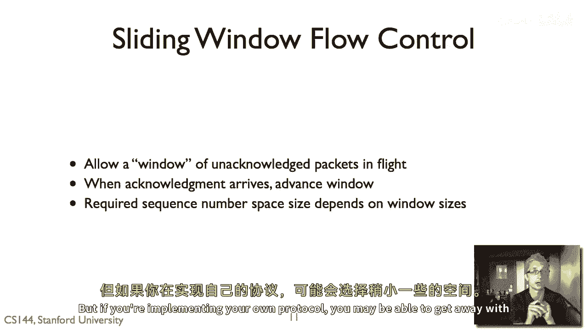

# 计算机网络课程 P33：滑动窗口协议 🪟

在本节课中，我们将要学习一种比“停止-等待”协议更高效的流量控制算法——滑动窗口协议。我们将了解其工作原理、核心概念以及如何通过它来充分利用网络带宽。

---

## 概述

上一节我们介绍了简单的“停止-等待”协议。本节中，我们来看看它的一个通用化版本——滑动窗口协议。该协议允许在任意时刻有多个数据包在网络中传输，从而显著提高了网络链路的利用率。

---

## “停止-等待”协议的局限性

“停止-等待”协议在任何时刻最多只允许一个数据包在传输中。其基本流程如下：
1.  发送方发送一个数据包。
2.  接收方收到后，发回一个确认（ACK）。
3.  发送方收到ACK后，才能发送下一个数据包。
4.  如果发送方超时未收到ACK，则重发该数据包。

虽然这个协议简单可靠，但它有一个主要问题：**效率低下**。

假设在波士顿和旧金山之间有一条10 Mbps的链路，往返时间（RTT）为50毫秒。我们发送的数据包大小为12千比特（约1.5KB）。那么：
*   每秒可以进行的往返次数：`1000 ms / 50 ms = 20` 次。
*   每秒最多可发送的数据包数：20个。
*   因此，最大有效吞吐量为：`20 包/秒 * 12 千比特/包 = 240 千比特/秒`。

然而，链路的实际带宽是10 Mbps（即10,000千比特/秒）。这意味着“停止-等待”协议只利用了 `240 / 10000 = 2.4%` 的链路容量，效率极低。

---

## 滑动窗口协议的基本思想

为了解决上述问题，滑动窗口协议允许最多有 **n** 个数据包同时在网络中传输（即“在飞行中”）。

*   当 `n = 1` 时，滑动窗口协议就退化为“停止-等待”协议。
*   通过将 `n` 设置为一个合适的值，可以让发送方持续不断地发送数据，从而“填满”整个传输管道，使吞吐量达到链路瓶颈带宽。

沿用上面的例子，要填满50ms的RTT管道，并达到10 Mbps的速率，我们需要计算所需的窗口大小（以数据包计）：
*   每个RTT内需要传输的数据量：`10 Mbps * 50 ms = 500 千比特`。
*   每个数据包12千比特，因此需要的窗口大小约为：`500 / 12 ≈ 42` 个数据包。

通过设置窗口大小为42，理论上我们就可以让发送方以10 Mbps的速率持续向接收方发送数据。

---

## 滑动窗口算法详解

让我们更具体地看看发送方和接收方是如何维护滑动窗口的。为了简化，我们以数据包编号为单位进行讨论（实际协议如TCP以字节为单位）。

### 发送方规则

发送方维护三个关键变量：
*   **发送窗口大小 (SWS)**: 允许的未确认数据包最大数量。
*   **最后收到的确认号 (LAR)**: 发送方已收到的、连续被确认的最大数据包序号。
*   **最后发送的段号 (LSS)**: 发送方已发送的最大数据包序号。

发送方必须始终遵守以下不变式：
```
LSS - LAR <= SWS
```
这意味着，如果最后确认的包是 `n`，那么发送方不能发送序号超过 `n + SWS` 的数据包。

**发送方的工作流程如下：**
1.  初始化 `LAR = -1`, `LSS = -1`。
2.  只要 `LSS - LAR < SWS`，就可以发送下一个数据包（序号为 `LSS + 1`），并更新 `LSS`。
3.  当收到一个确认号为 `n` 的ACK时，更新 `LAR = n`（假设是累积确认，见下文）。这相当于窗口向前“滑动”，发送方可以发送新的数据包。
4.  如果发生超时，则重传 `LAR + 1` 号数据包（即窗口中最旧的那个未确认包）。

**一个重要特性是：** 窗口的移动受限于第一个未确认的数据包。即使窗口后面的包已经到达并被确认，窗口也不能跳过这个缺口向前滑动。这确保了数据的顺序交付。

### 接收方规则

接收方也维护三个变量：
*   **接收窗口大小 (RWS)**: 愿意缓冲的数据包数量。
*   **最后可接受的段号 (LAS)**: 愿意接收的最大数据包序号，`LAS = LFR + RWS`。
*   **最后接收的段号 (LFR)**: 连续收到的最大数据包序号。

接收方遵守的不变式是：
```
LAS - LFR <= RWS
```
**接收方的工作流程如下：**
1.  收到序号为 `seq` 的数据包。
2.  如果 `seq <= LFR`，说明是重复包，丢弃它，但**仍然需要发送一个ACK**（ACK号为 `LFR`），以防之前的ACK丢失。
3.  如果 `LFR < seq <= LAS`，则接收该包并缓存。如果 `seq == LFR + 1`（即正是期望的下一个包），则更新 `LFR`，并可能连续交付一批已按序到达的包。
4.  如果 `seq > LAS`，说明超出接收窗口，直接丢弃。
5.  无论是否接收数据包，接收方通常会回送一个ACK，其中包含当前的 `LFR` 值（即下一个期望的序号）。这就是**累积确认**。

---

## 累积确认与序列号空间

### 累积确认
在基本的滑动窗口协议中，确认是**累积性**的。确认号 `n` 表示接收方已经正确收到了序号 `n` 及之前的所有数据。
*   **优点**：简单，ACK丢失时冗余的后续ACK可以提供相同信息。
*   **缺点**：无法精确告知哪些包丢失。现代协议（如TCP）有**选择性确认（SACK）** 作为扩展来解决这个问题。

**注意**：TCP的确认号略有不同，它表示“期望收到的下一个字节的序号”。例如，若正确收到0-99字节，则发回的ACK号是100。

### 序列号空间大小
我们需要多大的序列号范围来避免歧义？这与窗口大小有关。
*   在“停止-等待”（SWS=1, RWS=1）中，需要2个序列号（0和1）。
*   推广到滑动窗口，所需的序列号空间至少为：
    ```
    序列号空间大小 >= SWS + RWS
    ```
    这是为了区分是重传的老数据包，还是延迟到达的新数据包。

一个特例是**回退N步（Go-Back-N）协议**，其中 `RWS = 1` 但 `SWS > 1`。此时，任何一个包丢失，发送方都需要回退并重传其后已发送的整个窗口的数据，效率较低。此时需要的序列号空间为 `SWS + 1`。

---

## TCP中的滑动窗口

TCP是一个使用滑动窗口进行**流量控制**和**可靠传输**的协议。
*   **流量控制**：接收方通过TCP头部的 **`窗口大小（Window Size）`** 字段，告知发送方自己还有多少空闲缓冲区（以字节为单位）。这动态决定了发送方的有效 `SWS`。
*   **发送规则**：发送方不能发送序号超过 `确认号 + 接收方通告窗口` 的数据。
*   **大序列号空间**：TCP使用32位的序列号空间，足以应对高速网络下长延迟的旧数据包带来的歧义问题。

---

## 总结

本节课中我们一起学习了滑动窗口协议：
1.  **核心思想**：通过允许 `n` 个未确认数据包同时在途，来提升链路利用率，填满传输管道。
2.  **关键算法**：发送方和接收方分别维护窗口，通过序列号和累积确认来协调数据的发送、接收与重传。
3.  **重要关系**：协议正确运行所需的最小序列号空间为 `SWS + RWS`。
4.  **实际应用**：TCP协议使用滑动窗口机制实现可靠的、流量受控的字节流传输，其中接收方通过通告窗口来动态控制发送速率。




滑动窗口协议是理解现代网络通信（尤其是TCP）如何高效、可靠传输数据的基石。