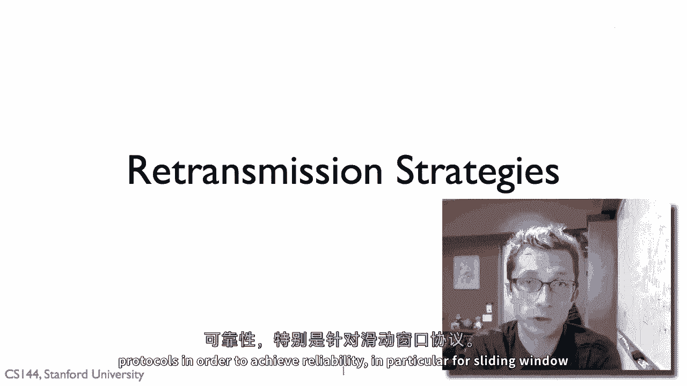
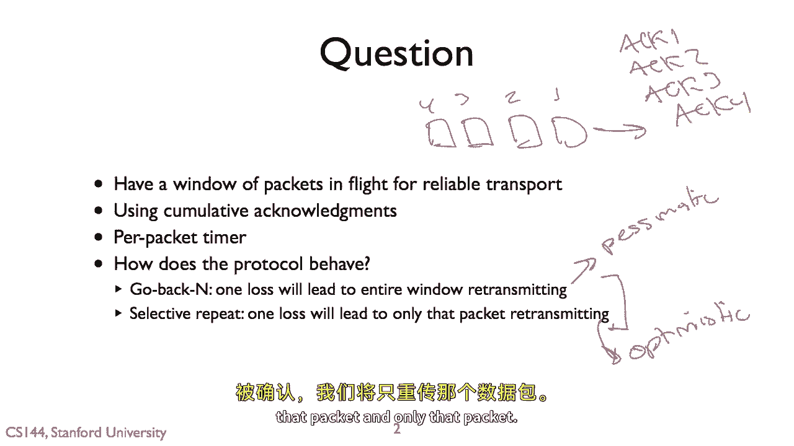

# 课程 P34：可靠通信中的重传策略 🚀

在本节课中，我们将探讨可靠传输协议中的重传策略，特别是滑动窗口协议下的两种主要方法：回退N帧（Go-Back-N）与选择重传（Selective Repeat）。我们将通过简单的例子和对比，帮助你理解它们的工作原理、行为差异以及各自的适用场景。

## 概述 📖

为了实现可靠的数据传输，当数据包可能丢失时，协议必须有能力重新发送它们。在滑动窗口协议的框架下，这引出了两种核心的重传策略。我们将分析这两种策略的行为逻辑，并理解窗口大小等参数如何影响协议的表现。

## 重传的基本问题 ⚙️

滑动窗口可靠传输面临一个基本问题：我们有一个“在途”的数据包窗口（例如四个包），并且使用累积确认机制。这意味着我们只能获得关于“最后一个被成功接收的包”的反馈。

我们对每个已发送但未确认的包维护一个重传计时器。计时器基于包的发送时间设置，提供了一个保守的估计：如果在此时间之后仍未收到该包的确认，则几乎可以断定包已丢失，应当重传。

那么，给定这些参数，协议将如何表现？其重传策略会是怎样的？实际上，最终你会看到两种主要的策略。

## 两种重传策略 🔄

以下是两种主要的可靠传输重传策略。

### 策略一：回退N帧（Go-Back-N）

回退N帧是一种较为悲观或保守的方法。其核心行为是：如果窗口中的任何一个数据包丢失，发送方将重新传输整个未被确认的窗口内的所有数据包。

**核心逻辑**：假设窗口大小为 `n`。如果检测到第 `k` 个包丢失，发送方将“回退”并重传从第 `k` 个包开始的所有 `n` 个包（即当前窗口内的所有包）。

### 策略二：选择重传（Selective Repeat）

选择重传是一种更为乐观的方法。它假设：如果一个包丢失，**只有**那个特定的包丢失了，窗口内的其他包可能已成功送达。

**核心逻辑**：如果检测到某个包丢失（未收到确认），发送方将**仅重传**那个特定的包，而不是整个窗口。

## 策略行为对比 🧪

上一节我们介绍了两种策略的核心思想，本节中我们来看看它们在实际传输中具体如何表现。

### 回退N帧行为示例

假设发送窗口大小 `n = 4`。
1.  发送方发送包 1, 2, 3, 4。
2.  包 2 在传输中丢失。
3.  接收方成功接收包 1，并回复确认 ACK 1。它无法确认包 2，因此后续的 ACK 也会停滞。
4.  发送方收到 ACK 1 后，可以滑动窗口并发送包 5。
5.  此时，包 2 的重传计时器超时。在回退N帧策略下，发送方悲观地认为整个未确认窗口（包 2, 3, 4, 5）都可能有问题，因此会**重传整个窗口**（包 2, 3, 4, 5）。

这种方法非常保守，可能会重传许多实际上已成功接收的包（如本例中的包 3, 4, 5），造成带宽浪费。

### 选择重传行为示例

同样假设窗口大小 `n = 4`。
1.  发送方发送包 1, 2, 3, 4。
2.  包 2 丢失。
3.  接收方确认包 1（ACK 1），发送方因此可以发送包 5。
4.  包 2 的重传计时器超时。在选择重传策略下，发送方仅重传丢失的**包 2**。
5.  接收方收到包 2 后，可以继续处理并确认已缓存的后续包（例如发送 ACK 5）。传输得以继续，仅重传了必要的包。

这种方法更高效，但假设丢失是孤立的。

## 为何不总是使用选择重传？ 🤔

既然选择重传发送的数据包更少，为什么我们有时还需要回退N帧策略呢？主要有以下几个原因：

1.  **恢复速度**：当出现**连续多个包丢失**（即突发丢失）时，选择重传需要为每个丢失的包单独等待其计时器超时，恢复速度可能较慢。而回退N帧一旦检测到丢失，便立即重传整个窗口，能更快地填补空缺。
2.  **接收方缓冲能力**：策略的选择与接收方的窗口大小紧密相关。如果接收方只能按序接收（接收窗口为1），它无法缓存乱序到达的包。此时，任何包的丢失都会导致发送方行为退化为回退N帧模式。
3.  **实现复杂度**：选择重传需要接收方能够缓存乱序包，并在发送方进行更精细的单个包重传管理，实现起来比回退N帧更复杂。

因此，这里存在一种权衡：在**带宽利用率**（浪费多少重传包）和**从错误中恢复的速度**之间进行取舍。

## 协议配置如何影响策略选择 ⚖️

上一节我们提到了接收方窗口的影响，本节我们通过两个具体配置例子，直观地看协议行为如何被塑造。

### 示例一：接收窗口为1 -> 行为类似回退N帧

*   **发送方窗口大小**: `n = 4`
*   **接收方窗口大小**: `1`

**过程分析**：
1.  发送方发送包 1, 2, 3, 4。
2.  包 2 丢失。
3.  接收方收到包 1，确认 ACK 1，并将包 1 交付给上层。其窗口滑动，期待包 2。
4.  发送方收到 ACK 1，发送包 5。
5.  包 2 计时器超时，发送方重传包 2。
6.  **关键点**：由于接收方窗口大小为1，它**无法缓存**乱序到达的包 3, 4, 5。因此，即使它收到了重传的包 2，它仍然没有收到包 3（它现在期待的下一个包）。它只能确认包 2。
7.  发送方需要等待包 3 的计时器超时，然后重传包 3... 以此类推。**这种行为实质上就是回退N帧**，发送方被迫重传丢失包之后窗口内的每一个包。

### 示例二：接收窗口等于发送窗口 -> 行为类似选择重传

*   **发送方窗口大小**: `n = 4`
*   **接收方窗口大小**: `n = 4`

**过程分析**：
1.  发送方发送包 1, 2, 3, 4。
2.  包 2 丢失。
3.  接收方收到包 1，回复 ACK 1。它可以将乱序但正确的包 3, 4 **缓存**起来。
4.  发送方收到 ACK 1，发送包 5。
5.  包 2 计时器超时，发送方**仅重传包 2**。
6.  接收方收到包 2 后，由于它已缓存了包 3, 4，并且收到了包 5，它可以按序交付包 2, 3, 4，并发送一个累积确认，例如 ACK 5。
7.  发送方收到 ACK 5，知道包 2, 3, 4, 5 均已安全接收，窗口大幅滑动。**整个过程只重传了丢失的包 2**，这是选择重传的典型行为。

## 实现注意事项 💡

当你自己实现传输协议（例如在实验作业中）时，设计重传策略需要考虑以下几点：

*   **避免过早重传**：不要因为一个包（例如包2）的计时器超时，就冲动地重传整个窗口。很可能窗口中的其他包（3,4,5）已经正确到达接收方并正在被缓存。过早地重传它们会将网络中数据包的数量增加到超出你窗口允许的范围，加剧网络拥塞。
*   **策略选择**：你可以选择保守的回退N帧策略，假设“一个包丢失，整个窗口都危险”。这在接收方缓冲能力有限时是自然的结果。你也可以选择更高效但稍慢的选择重传策略，只重传确认为丢失的单个包，这需要接收方有足够的缓存空间。
*   **管理网络负载**：必须谨慎控制网络中未确认数据包的数量，重传策略是其中的关键一环。

## 总结 🎯

本节课中，我们一起学习了可靠传输协议中的两种核心重传策略：
1.  **回退N帧**：悲观策略，丢失一个包则重传整个发送窗口。实现简单，恢复速度快，但可能浪费带宽。通常在接收方缓冲能力有限时自然出现。
2.  **选择重传**：乐观策略，仅重传确认丢失的单个数据包。带宽利用率高，但实现复杂，且在连续丢包时恢复可能较慢。需要接收方有足够大的窗口来缓存乱序包。

协议的具体行为并非孤立由策略决定，而是由**发送窗口大小**、**接收窗口大小**以及**网络丢包模式**共同塑造的。理解这些机制，有助于你设计出更适应特定网络环境的可靠通信协议。