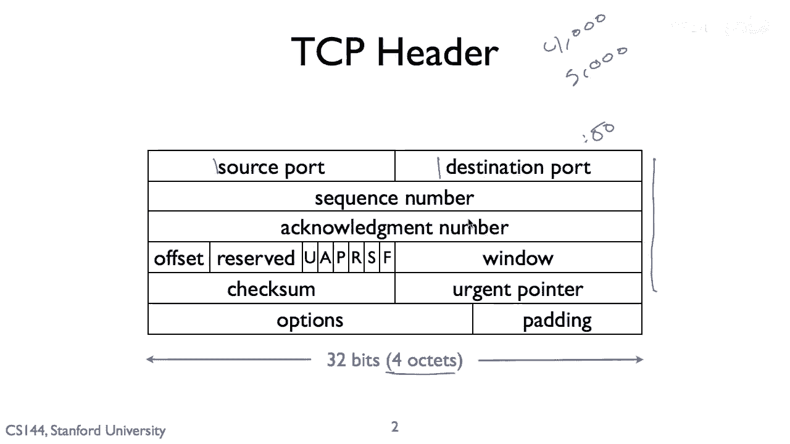
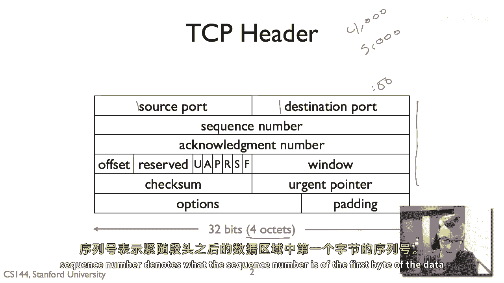
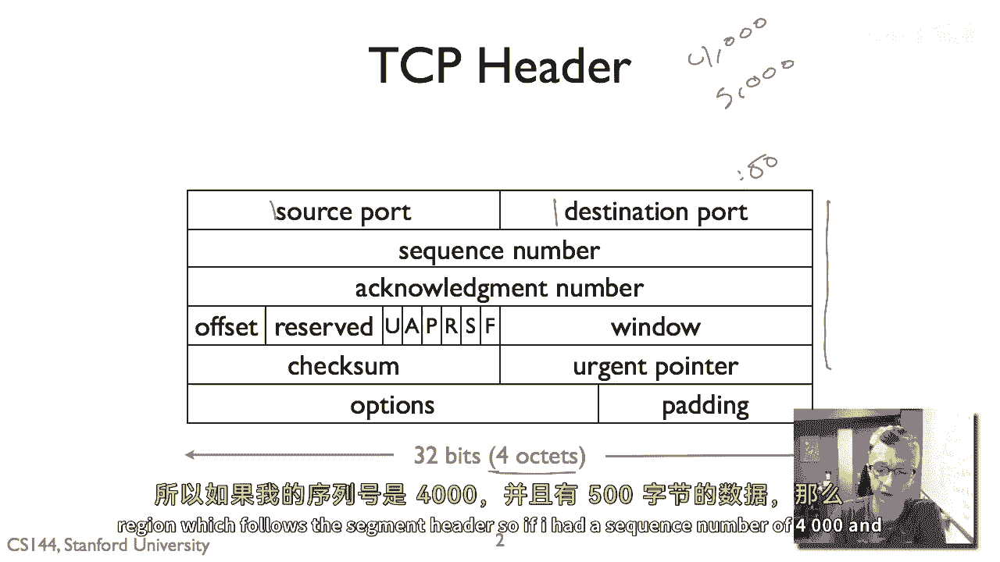
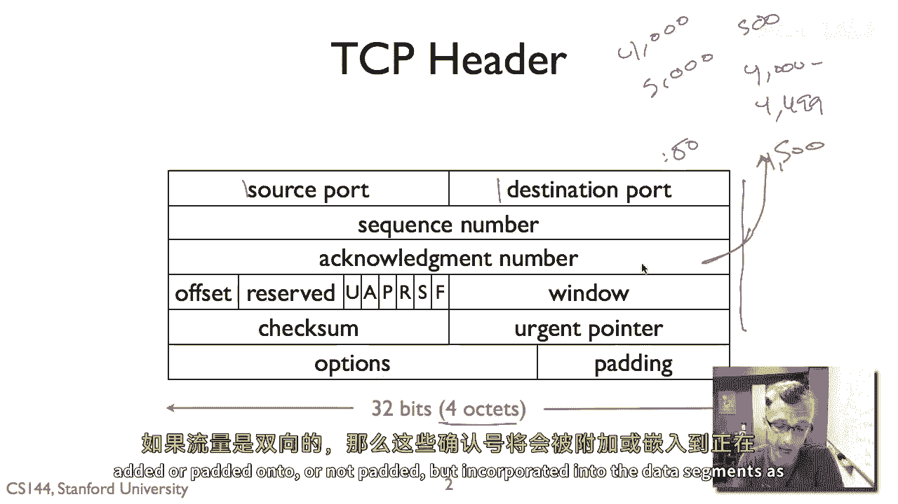
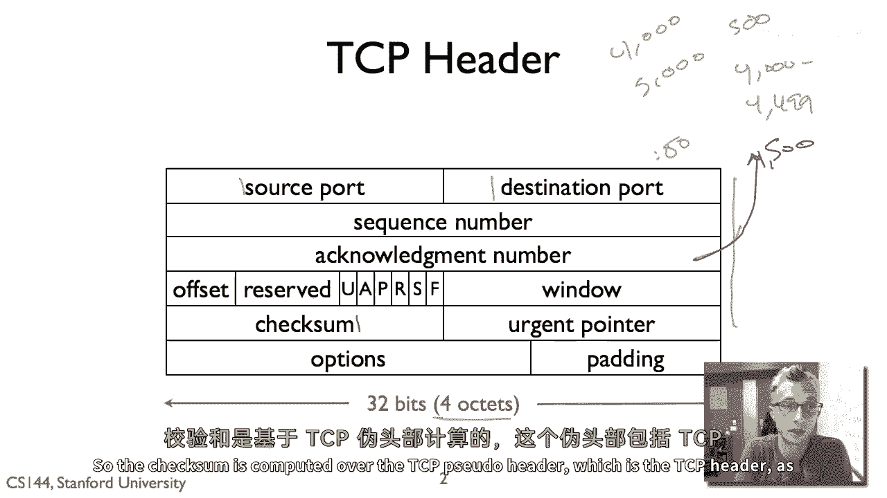
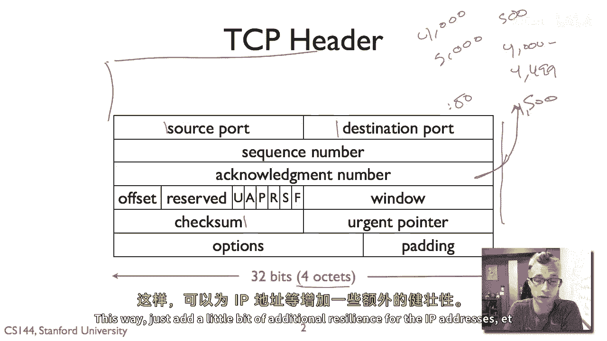
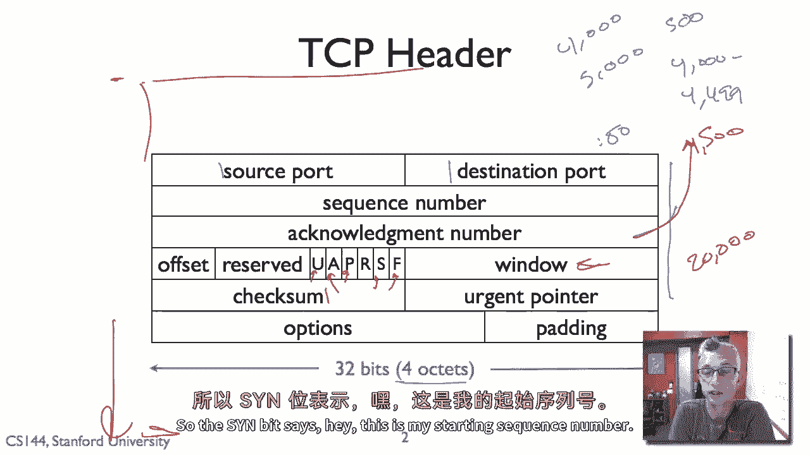
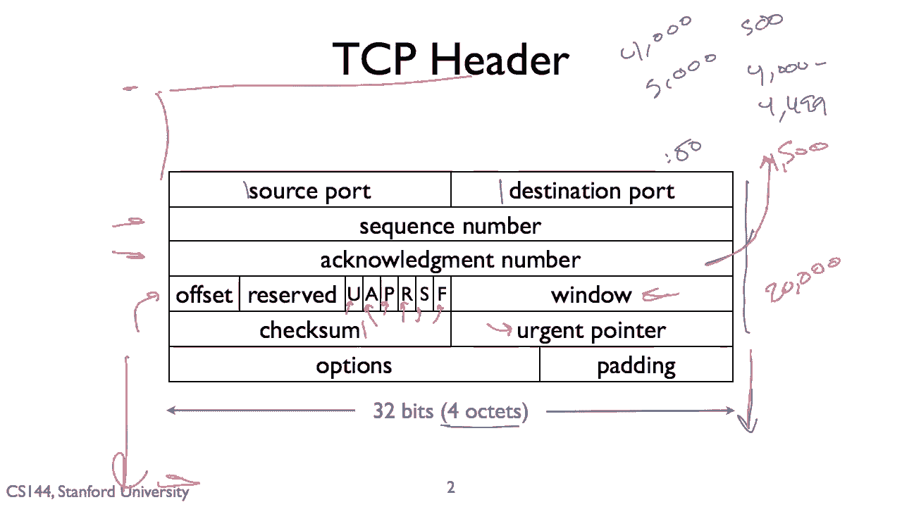

# 课程 P35：TCP 头部详解 📖

在本节课中，我们将学习传输控制协议（TCP）头部的结构和各个字段的含义。TCP头部是确保数据在网络中可靠传输的关键组成部分。我们将逐一解析每个字段的作用，帮助你理解TCP是如何工作的。

---

## 概述 📋

TCP头部是附加在TCP数据段前面的信息，用于管理连接、确保数据顺序和完整性。标准的TCP头部长度为20字节，包含源端口、目的端口、序列号、确认号以及多个控制标志等重要信息。

---

## TCP头部结构

标准的TCP头部长度为**20字节**。其结构通常可视化为五行，每行包含四个八位字节。此外，TCP头部之后还可以包含选项字段，但本教程主要关注基本的20字节头部结构。

---

## 端口字段

TCP头部的首两个字段是**源端口**和**目的端口**，每个字段均为16位（2字节）。端口用于标识发送和接收数据的应用程序。例如，访问网页通常使用目的端口**80**。

---

## 序列号与确认号

接下来是两个关键字段：**序列号**和**确认号**。

*   **序列号**：表示本数据段中第一个数据字节的编号。
*   **确认号**：表示接收方期望收到的下一个字节的编号。它等于已成功接收的最后一个字节的序号加1。

例如，如果发送一个序列号为4000且包含500字节数据的段，则该段包含字节4000至4499。接收方成功接收后，会回复一个确认号为**4500**的段，表示期望收到序号为4500的字节。

---

## 数据偏移与保留字段

**数据偏移**字段（4位）指示TCP头部长度（以32位字为单位），从而指明数据部分从何处开始。这是必要的，因为TCP头部可能包含长度可变的选项字段。其后是**保留**字段，目前未使用，应设置为0。

---

## 控制标志

以下是TCP头部的六个控制位（各占1位），它们管理连接状态和数据流：

1.  **URG (紧急)**：当设置为1时，表示本段包含紧急数据，应优先处理。
2.  **ACK (确认)**：当设置为1时，表示**确认号**字段有效。除了建立连接的初始SYN包，TCP通信中几乎所有的包都应设置此位。
3.  **PSH (推送)**：提示接收方应立即将数据交付给上层应用程序，而不是等待缓冲区填满。
4.  **RST (复位)**：当设置为1时，表示需要立即重置TCP连接，通常用于处理异常情况。
5.  **SYN (同步)**：在连接建立时使用。发送方设置此位以发起连接，并指明其初始序列号。
6.  **FIN (结束)**：当设置为1时，表示发送方已完成数据发送，希望关闭连接。

---

## 窗口大小

**窗口**字段（16位）用于流量控制。它告知对方，本端的接收缓冲区还有多少可用空间，即对方最多还能发送多少未被确认的数据。例如，窗口值为200000表示该方向上最多允许存在200,000个未确认的字节。

---

## 校验和与紧急指针

*   **校验和**：用于检测TCP头部、数据部分以及一个由IP头部信息构成的**伪头部**在传输过程中是否出错。计算范围覆盖伪头部、TCP头部和TCP数据。
*   **紧急指针**：仅当**URG**标志位设置为1时才有效。它与序列号字段相加，指向本报文段中紧急数据的最后一个字节的位置。

---

## 选项与填充

TCP头部可以包含**选项**字段，用于提供额外功能（如最大段大小协商）。选项的长度必须是4字节的整数倍，不足部分会用**填充**字节补足，以确保整个头部长度是32位的整数倍。

---

## 总结 🎯

本节课我们一起学习了TCP头部的详细结构。我们了解到，TCP通过20字节的标准头部（不含选项）管理端到端的可靠通信。关键组件包括：
*   用于寻址的**源端口和目的端口**。
*   保证数据顺序的**序列号**和**确认号**。
*   管理连接状态的各种**控制标志**（如SYN、ACK、FIN）。
*   用于流量控制的**窗口**字段。
*   确保数据完整性的**校验和**。

理解TCP头部各字段的功能，是掌握TCP/IP协议栈中可靠数据传输机制的基础。