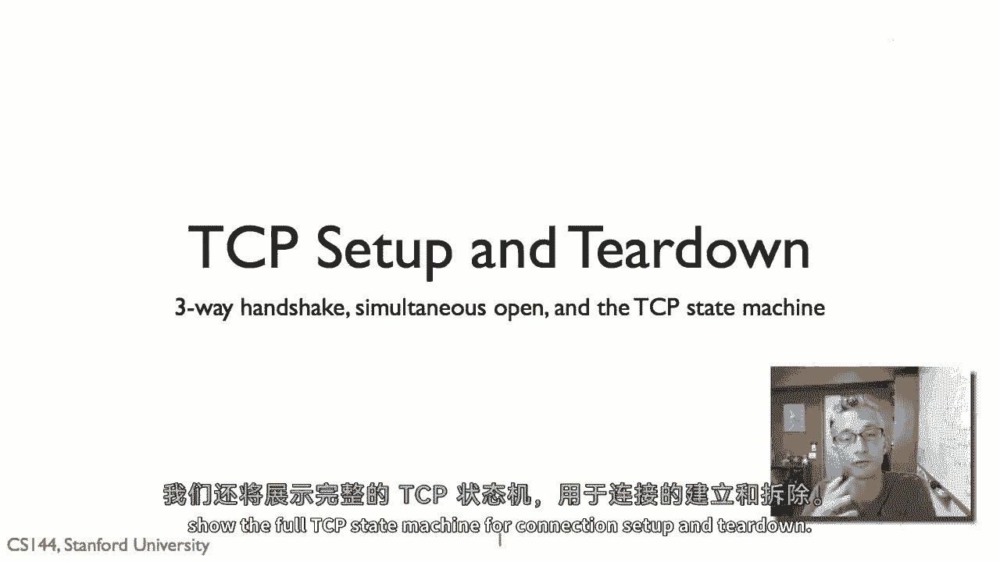
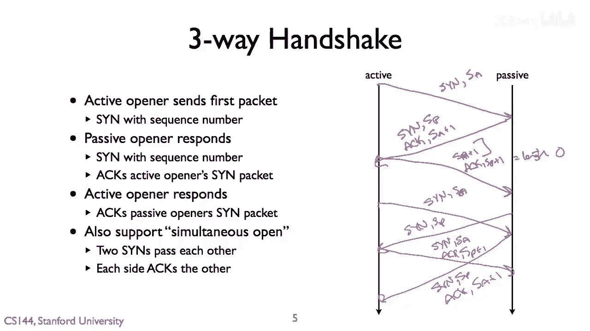
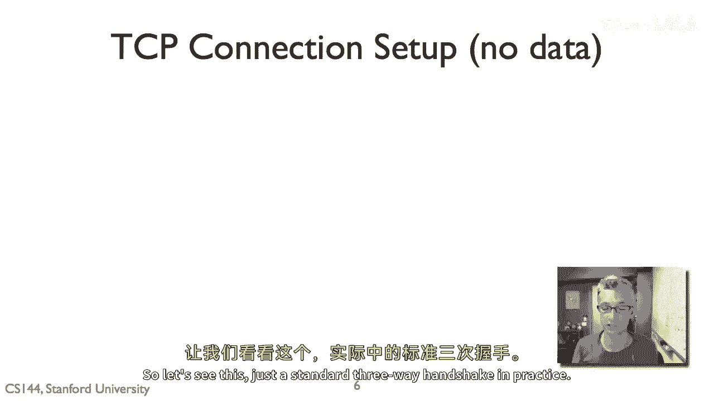
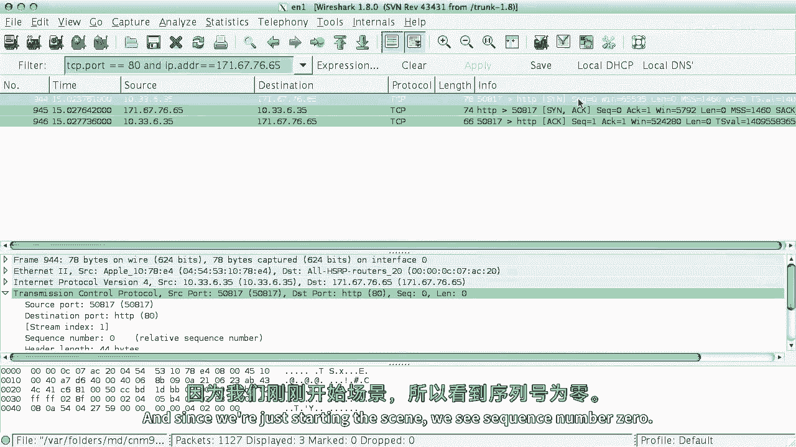
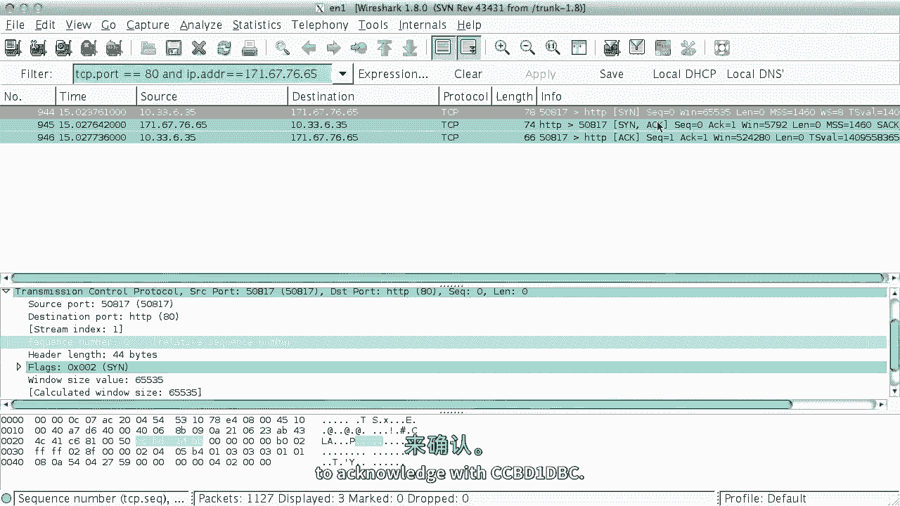
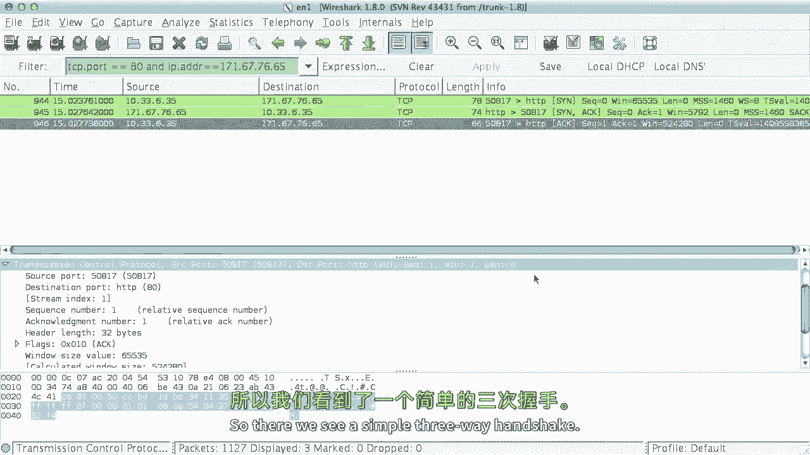
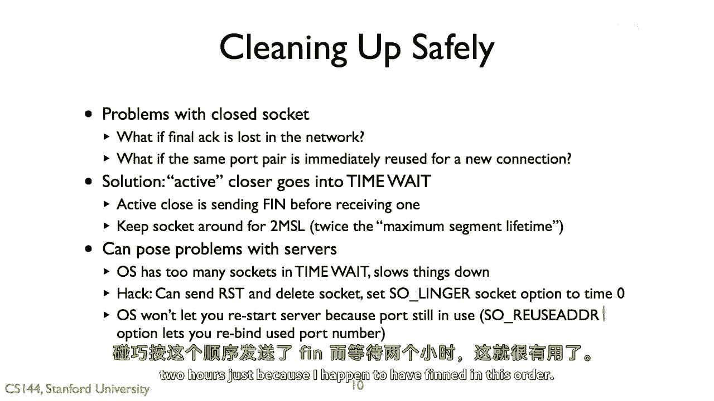
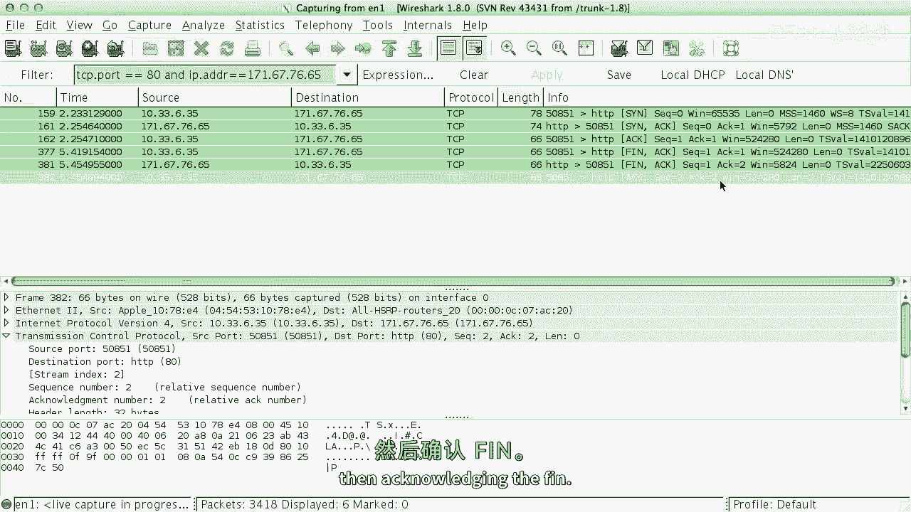

# P36：p35 2-11 Reliable comm --- Connection setup and teardown - 加加zero - BV1qotgeXE8D

这个视频，我将深入探讨在Terdown中TCP连接设置的细节，这比最初呈现的服务模型更深入，看看几个边缘情况，以及通过握手看到的整个TCP状态图，被称为同时打开，这在今天的点对点应用中实际上非常重要。

实际上展示TCP连接设置和拆除的全状态机。

所以这里的高级问题是，如果我们想要可靠地通信，结果发现，连接的一端或两端有状态是非常有帮助的，你可以，实际上，转向，结果，你可以在没有一端或另一端有状态的情况下可靠地通信，但效率要低得多。

有一点状态是非常好的，它会使你的吞吐量等大大提高，但如果我们有这个状态，存在这个问题，我们如何设置那个状态，连接建立的是什么，但是考虑到状态的占用内存，嗯，在你的机器上，你什么时候可以拆除它。

你什么时候可以清理这种垃圾，收集这个状态并重新使用它，所以你们用于tp连接的内存结构示例，缓冲区也是您使用的端口号，所以，这些连接建立和拆除的问题也是吗？

所以，这里是标准的TCP头部，包括它的，嗯，标准，嗯，20字节的负载，然后选项。

所以，对于连接设置，正如我们所见，头部中有四个部分被使用，序列号，确认号。

确认位和错误位，所以接下来我将通过一个握手过程来解释，并详细介绍在交换的包中发生了什么，所以回想起标准的三阶段模型，我们有一个主动发起者和一个被动发起者，被动发起者正在倾听，等待连接请求，例如说。

Web服务器，主动发起者是发起请求的一方，嗯，启动连接的请求，所以第一步是，主动打开者发送一个TCP分段，设置SYN位，以指示它将被动方同步到流开始的位置，它正在说什么是我流的第一个序列号。

所以我们可以称之为s_sub_a，所以你这样做，而不是只是说假设为零，嗯，由于各种原因，首先，为了安全原因，随机化你的开始序列号非常有用，这意味着人们可以猜到你的流开始在哪里，并尝试在你的流中插入数据。

嗯，此外，如果在互联网上飞着旧的数据包，这有时发生，如果你在某处给了巨大的延迟，如果你随机化你的开始序列号，那么某些随机段的出现就变得非常 unlikely。

或者也许一个损坏的片段将要重叠你自己的序列窗口，所以活跃侧发送一个正弦波，说这是我的起始序列号，S sub，被动侧也以正弦波回应，说，好的，那就是，我要同步你，说我的起始序列号，S代表被动。

但我也将设置动作位，这意味着包中的序列号在确认序列中是有效的，我将扮演加1的角色，记住，一个节点不确认最后接收的字节，而是确认尚未接收的第一个字节，因此，通过发送动作S加1，被动侧确认它已收到sin。

这实际上是由s sub实现的，主动侧然后响应它不需要发送发送，因为它是同步的，所以它发送一个序列号为s p加一的包，这是大多数人所使用的，嗯并执行s，嗯，对不起。

它发送一个序列号为s a加一的包并执行p加一的包，所以现在它正在承认说，我已经收到了你的信息，我现在正在承认这个初始包，序列号是论文加1，但通常为零长度，所以如果包中有一个字节，它将是加1，嗯。

但它不是，长度为零，这是一个简单的控制包，所以有一个序列号，字节将从这里开始，但没有字节，这就是基本的同步连接设置，A加一个加一，P加一个加一，然后一个空的部分只是为了连接建立。

所以结果tp也支持另一种打开连接的方式，它被称为同时打开，正如我所说，经常被使用，稍后我们会看到，嗯，在点对点应用课程中，用于穿越被称为网络地址转换盒子的东西，因此，同时有效的开放方式工作。

如果两个活跃的，如果我们称它们为活跃和被动的两侧，但现在它们真的都是活跃的，都知道对方的端口号，所以左边的节点知道那个端口，右边的节点正在发出连接请求，从那时起，对于左边的节点，右边是一样的。

他们正在使用正确的端口号，然后他们这样做，他们事先谈判同样的事情，所以同时开放的结果是双方同时发送罪孽，因此，左边的人发送一个罪孽，让我们叫它再次成为，但同时。

北方的右边发送一个罪孽s sub p well，然后左边回应，并发送，S，P加1，同样，右边的回应为sin s sub p c s a加上一，到这个点，我们已经建立了连接，双方同步知道起始序列号。

他们已经承认了。

但请注意，这需要四个消息，而不是三个，所以让我们看看，嗯，这只是实践中的标准握手。

所以这里我打开了wireshark，嗯，过滤在端口八十和一定IP地址，所以我只是告诉端口八十在那个主机。

然后我们将看到罪同步动作的设置，所以这就是它，所以这里是从我的主机发送到目的地的第一个数据包，我们看到它是HTTP端口80的罪序列号零，嗯，而且没有重音，没有动作位，因此确认字段是无效的，它不显示。

现在发现这个数据包的序列号实际上不是零，像Wireshark这样的工具只是为了使阅读更容易，是他们使用相对序列号，他们显示序列号相对于流开始的位置，因为我们刚刚开始场景，我们看到序列号零。

我们向下挖到这个数据包的底部，你可以看到鲨鱼告诉你序列号零的地方，相对序列号，然后如果我们看实际字段，它是ccbd1dbb，因此它比零大得多，现在我们看到为了确认这个第二个数据包。

它将使用ccbd1dbc再次确认。

它使用相对动作号，这就是我们看到的，Cc b d1dbc，它也在发送罪，所以这里是罪动作，所以又是序列号，一个相对序列号为零，但它是3413135ae，所以这是从我的主机发送到服务器的。

这是服务器返回的同步，然后我的主机响应确认，所以你可以看到序列号一，确认号一，所以它确认了服务器发送的罪，它给出了序列号一，但它的长度为零，所以它说，啊哈，你知道我，这个包包含从字节一开始的流。

但里面什么都没有，所以实际上还没有数据，所以我们看到了一个简单的三路握手。

现在让我们看TP连接，当有数据时，所以我们将看到罪同步。

然后一些数据通信，所以我可以做同样的事情之前，除了这次，而不是通过telnet连接到端口八十，没有数据传输的地方，我只是将要向端口八十发送一个标准的Web请求。

所以这里我们看到，和tp连接，所以这里我们有sin sync动作，现在连接已经建立，然后数据传输开始，所以这里是一个显示其HTTP的包，如果你看看这个特定的tp段，看到序列号一。

所以它是数据流长度的开始，474字节，所以这个数据块是474字节长，所以下一个序列号将是475，仍然动作一，所以这是我们向他们的Web服务器发送数据的数据，然后Web服务器响应并响应为动作75。

所以下一个字节期待的是475，但序列号一，所以这就是长度为零，这个动作中没有数据，我们称之为'离线'，只是一个动作包，嗯，所以它没有tcp段的数据，但它承认它收到的数据，下一个包，虽然来自服务器。

实际上它有数据在里面，你可以看到这里，长度1448，但序列号一，所以是一到四，一，四，四，九，这里是下一个tcp段，然后我们看到这里，将那些放在一起，这是HTTP响应，它被放在一起。

所以那里我们看到连接建立，现在序列号和确认号之间的空格正在向前走，根据数据通信，接下来我们将看TCP如何关闭连接，就像连接设置一样，这使用序列号和确认号字段，但与连接设置不同。

连接关闭不使用同步位来同步序列号，连接关闭使用FIN位来指示没有更多数据设置。

所以使用FIN和ACK位，所以当TCP发送包含FIN位的包时，这意味着发送者没有更多数据要发送，这是流量的结束，这是由于你说了关闭或关闭时引起的，嗯，嗯，在应用程序中，但是TCP连接。

像大多数可靠的连接都是双向的，所以直到双方都没有东西要发送时，你实际上才会终止连接，因为可能一方已经完成，但另一方还有更多要发送，所以直到双方都已经发送FIN，并且你已经承认你可以拆毁东西。

所以典型的拆毁交换看起来像这样，其中我们正在通信的a和b，并且a首先关闭，所以它发送一个包含FIN位和序列号s_sub_a的包，并确认嗯，s_sub_b b。

然后发送一个包来确认这个在so x s_sub_a加1，然后稍后某一点，b决定需要关闭其连接一侧，所以它发送一个FIN序列号s_sub_b，确认s_sub_1并仍然确认s_a加1，然后a响应，说啊。

我会确认sb加1，FIN像sin代表连接的最后一个字节，你像sin代表第一个字节，你通过确认来确认，加thin，你通过确认加1来确认你收到了它，当然你可以，你也可以有同时关闭的情况，他们同时发送FIN。

并且相同的交换发生得很好，所以现在我们已经交换了这些消息，嗯，我们已经确认了他们，我们实际上可以何时拆除连接，当我们实际上删除状态时，何时你可以重用端口。

这证明是非 trivia 的，你不能立即做，例如，如果最后的行动在网络中丢失会发生什么，所以我已经发送，然后我收到FIN，我问它，我不能立即拆除我的连接，因为如果那个行动丢失了会发生什么。

另一方永远不会听到它，它永远不会知道连接是否被中断，另一个问题是我们可能会执行薄FNAC并确认，然后中断，然后使用相同的端口对，相同的端口对，嗯，立即用于新的连接，我们想要确保我们不会无意中。

然后损坏数据，因为序列号空间重叠，所以使用的解决方案是活跃的关闭者，进入一个叫做时间加权的东西，这意味着如果我是第一个发送FIN的人，那么一旦连接被中断，我必须等待一段时间后才能，我再次使用我的状态。

所以你保持socket两秒钟，大约是最大段寿命或两倍，所以你期望网络中段可能生活的最长时间，大约是几分钟，这种方法的两个最大段寿命可能会对服务器构成问题，特别是，如果我有一个服务器。

并且它有无数的socket，这些socket处于时间加权状态，这可能会减慢速度，服务器是第一个关闭的，有技巧，你可以发送重置并删除socket，你可以设置一个选项，使linger时间为零。

另一个问题是我们可能不允许你重新使用端口，因为它仍在使用，有一个叫做重用外部的选项，这将让你能够重新绑定端口号，这是有用的，如果你只是在调试一些东西，天啊，我不想等待两个小时。

只是因为我无意中在这个顺序中冒犯了，让我们看看连接中断的样子。

所以这里是基本的同步连接设置，然后这里是中断，因为我们正在交换数据，我们有确认位设置，所以这里是FIN，这里是我主机的初始FIN，当我关闭连接时，所以它设置FIN，位一，序列号一，位一。

然后服务器在响应中也在关闭，也是序列号一，位一，所以，它发送一个鳍序列号一，动作二，所以这是对我无能的承认，然后，我的主人以第二个舞蹈序列的第二个动作来回应，"所以，这里是一个简单的三步握手。

用于断开连接的"，"承认一些先前的数据"，承认终结，"发送你自己的鳍"，"然后承认其终结"。

"所以现在如果我们把所有的这些都放在一起"，"我们可以看到完整的TCP有限状态机长什么样子"，所以这就是你经常会遇到的事情，这是非常成熟的金融状态机，这实际上为如何设置可靠的连接奠定了基础。

所以我要一步一步来，看起来相当复杂，当你第一次看到它时，但这是因为有几个情况，实际上，基于我们之前介绍的，所有这些都应该相当简单，所以我们首先从关闭状态开始，所以当没有连接时是这个样子，嗯，打开。

你知道，我只是坐在那里，嗯，我，我的应用程序没有尝试打开连接，所以这里首先过渡到监听状态，这是被动的开启者，这是服务器，服务器正在等待连接，所以你可以看到，动作是监听，嗯，没有任何数据包交换。

如果你关闭它，那么你就会返回到关闭状态，所以如果我正在监听连接，我什么也听不到，或者转向关闭状态，关闭状态的另一个转换是活跃打开，所以这里是连接和连接，导致一个SYN包被设置。

所以这是握手的三步流程中的第一步，所以你发送一个罪，你现在在罪中，发送状态，罪发送状态，这是主动侧，这些红色线条显示三路连接的主动开启者，所以罪发送，然后如果你收到一个罪并采取行动，阶段二说。

你发送一个行动，现在连接已经建立，所以这条路线，这是活动的打开者，现在，让我们看被动的开启者，所以被动的开启者在监听状态，并且它从活跃的开启者接收到一个罪，作为回应，它发送一个罪，行动，进入罪接收状态。

然后如果它接收到一个确认，因为它的罪是三次握手的第三个阶段，这是这一步骤的反映，所以现在连接已经建立，如果你在监听状态，嗯，你可能，嗯也可以调用发送，这将导致发送一个发送消息，或者你也可以，嗯，那样。

你将，即使你在监听状态，你也可以主动打开并处于打开状态，所以现在这里有一条更多的路径，我提到了四路，嗯同时打开，这是，这就是当双方都发送罪时，所以我们只是在看连接的一侧，对罪的响应。

你从另一方收到一个罪，所以这就是两个罪的交叉，所以您发送发送加动作罪接收，然后您行动，所以每个消息都发送并接收了一个罪，每个都接收了一个罪，嗯然后嗯，接收了一个罪，您发送同步。

然后有动作和数据交换可以发生，所以现在我们处于建立状态，当然，你可以总是通过关闭和重置等过渡出来，但现在到这个点我们已经通过了连接建立，我们现在要进入连接，拆除，所以这里有两个情况。

一个是如果我们是活跃的关闭者这里，我们调用关闭，这将导致一个FIN消息被发送，一个FIN包带有FIN位，我们现在进入重量为一的状态，另一个是如果我们收到鳍，然后我们承认它，我们现在处于被动关闭状态。

其中另一方关闭，然后当我们实际调用关闭时，我们呼叫，我们将发送，发送较少的堆栈并关闭，所以这里关闭等待，我们仍然允许发送数据，直到我们调用关闭，这是另一方关闭，但我们还没有，所以现在，当关闭被调用时。

我们处于一状态，从那里有许多从一状态过渡的过渡，如果我们收到鳍，所以我们已经发送鳍，收到防御，这是我以TCP拆除为例展示的，所以我们已经发送鳍，我们收到鳍，我们承认我们现在处于关闭状态。

然后我们过渡到时间重量，另一个是如果我们收到薄加动作，所以我们可以只是承认这个并进入时间波，最后一个是如果我们收到动作，嗯，但没有鳍，所以这是我们已经关闭了我们连接的一方，另一方还没有。

所以这是一种状态，它与这里状态相关，然后当我们收到鳍，我们承认它，进入时间等待状态，然后我们有时间到期，在我们可以实际关闭并恢复状态之前，所以你可以问，这个过渡到关闭和时间重量有什么区别。

原因是这个过渡到关闭是当两个鳍相互通过时，所以我发送鳍，另一方发送鳍给我，但它没有承认我的鳍，这是鳍动作和鳍的区别，加动作加动作，所以然后我等待那个鳍被承认，然后过渡到时间重量。

这是完整的TCP有限状态机，它看起来真的很复杂，确实它有一、二、三、四、五、六、七、八、九、十、十一、十二个状态，但当你意识到它分解为这两个部分时，连接，建立，连接，拆除，实际上。

鳍的交换方式有很多种可能，实际上并不复杂，所以我鼓励你打开wireshark，打开几个web连接，就看看你的tcp连接发生了什么。

