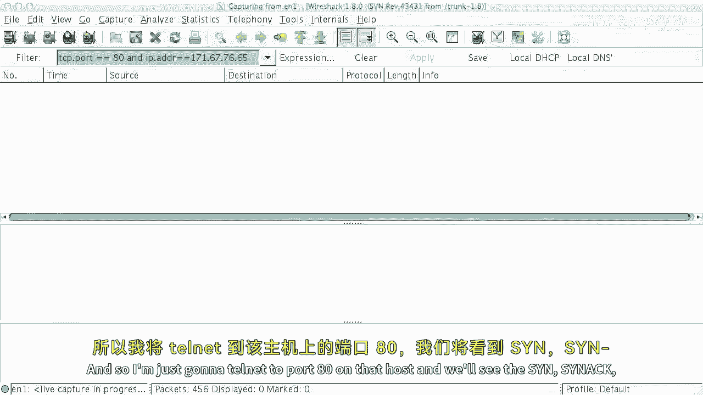

# 计算机网络课程 P36：TCP 连接建立与拆除详解 🔗

在本节课中，我们将深入探讨 TCP 协议中连接建立与拆除的完整过程。我们将学习标准的三次握手、四次挥手，以及“同时打开”等特殊情况。课程将结合状态机图、数据包抓包实例和核心概念公式，帮助你透彻理解 TCP 如何可靠地管理通信会话。

---

## 连接状态的重要性 🤔

上一节我们介绍了可靠通信的基本概念，本节中我们来看看为何在通信中维护状态如此重要。

如果我们想要实现可靠通信，让通信的一端或两端维护一些状态信息会非常有帮助。虽然理论上可以在两端都无状态的情况下实现可靠通信，但效率会低得多。

维护一点状态信息是非常有益的，它能显著提升吞吐量等性能指标。但既然我们引入了状态，就随之产生了两个问题：
1.  我们如何建立这个状态（即连接建立）？
2.  考虑到状态会占用内存，我们何时可以拆除并清理它？

这些连接建立与拆除的问题，也关系到 TCP 连接所使用的内存结构（如缓冲区）和端口号等资源的分配与回收。

---

## TCP 报文段头部回顾 📦

在深入连接过程之前，我们先快速回顾一下 TCP 报文段的头部结构。

标准的 TCP 头部包括一个 20 字节的固定部分，以及可选的选项字段。在连接建立与拆除过程中，头部中的以下几个字段会被关键性地使用：
*   **序列号** (Sequence Number)
*   **确认号** (Acknowledgment Number)
*   **SYN 标志位** (Synchronize)
*   **ACK 标志位** (Acknowledge)
*   **FIN 标志位** (Finish)

---

## 连接建立：三次握手 🤝

接下来，我们将通过握手过程来详细解释在交换的报文段中发生了什么。

回想标准的三次握手模型，我们有一个**主动发起方**和一个**被动接收方**。被动接收方（如 Web 服务器）监听并等待连接请求；主动发起方则发起连接。

以下是握手步骤的分解：

1.  **SYN**
    主动发起方发送一个设置 `SYN=1` 的 TCP 报文段。这表示它希望将被动方的序列号同步到流的起始位置。报文段中包含一个初始序列号，我们称之为 `seq = S_A`。
    *   使用随机化的初始序列号 `S_A` 而非从 0 开始，主要出于安全考虑（防止他人猜测并插入数据），以及避免网络中延迟的旧报文段造成混淆。

2.  **SYN-ACK**
    被动接收方回应一个设置 `SYN=1, ACK=1` 的报文段。它说：“好的，我收到了你的 SYN。我的起始序列号是 `seq = S_P`。” 同时，它通过 `ack = S_A + 1` 来确认已收到主动方的 SYN。
    *   确认号 `ack` 总是期望收到的下一个字节的序列号。

3.  **ACK**
    主动发起方响应。它不需要再发送 SYN，因为同步已完成。因此它发送一个设置 `ACK=1` 的报文段，其序列号为 `seq = S_A + 1`，确认号为 `ack = S_P + 1`。这表示：“我已收到你的 SYN，现在确认这个初始报文段。”
    *   通常这个报文段长度为 0（不携带数据），仅用于完成连接建立。

这就是基本的三次握手过程：`SYN` -> `SYN-ACK` -> `ACK`。

---

## 连接建立：同时打开 👐

TCP 还支持另一种建立连接的方式，称为“同时打开”。这在点对点应用中常用于穿越网络地址转换设备。

在同时打开中，双方都是主动发起方，并且都知道对方的端口号。其工作方式如下：

1.  双方几乎同时向对方发送 `SYN` 报文段（`seq = S_A` 和 `seq = S_P`）。
2.  双方在收到对方的 `SYN` 后，各自回复一个 `SYN-ACK` 报文段（`seq = 自己的序列号+1`, `ack = 对方的序列号+1`）。

此时，连接建立完成。双方都同步知晓了起始序列号，并确认了对方的 SYN。

**请注意，同时打开需要交换 4 个报文段，而不是 3 个。**

---

## 实战观察：Wireshark 抓包分析 🔍

现在让我们看看实践中的标准握手。以下是通过 Wireshark 抓取的一个访问 Web 服务器（端口 80）的 TCP 连接建立过程：

1.  **Packet 1: [SYN]**
    *   从客户端发往服务器。
    *   标志位：`SYN=1`。
    *   显示序列号：0 (Wireshark 为方便阅读使用了相对序列号)。
    *   实际序列号：`0xccbd1dbb` (一个随机数)。
    *   确认号：无效 (因为 `ACK=0`)。

2.  **Packet 2: [SYN-ACK]**
    *   从服务器发往客户端。
    *   标志位：`SYN=1, ACK=1`。
    *   显示序列号：0。
    *   实际序列号：`0x3413135ae` (另一个随机数)。
    *   确认号：`0xccbd1dbc` (`客户端序列号 0xccbd1dbb + 1`)，表示确认收到了客户端的 SYN。

3.  **Packet 3: [ACK]**
    *   从客户端发往服务器。
    *   标志位：`ACK=1`。
    *   显示序列号：1，确认号：1。
    *   这是一个长度为 0 的报文段，表示“我期待从字节 1 开始接收数据，但本包不携带数据”。

至此，一个简单的三次握手完成。随后，数据传输开始。例如，下一个数据包可能显示 `[ACK]`，序列号为 1，负载长度为 474 字节，表明它正在发送实际的 HTTP 请求数据。

---

## 连接拆除：四次挥手 👋

与使用 SYN 位来同步序列号的连接建立不同，连接拆除使用 FIN 位来指示数据发送完毕。

当 TCP 发送一个包含 `FIN=1` 的报文段时，意味着发送方没有更多数据要发送（流结束）。但 TCP 连接是双向的，必须双方都完成数据发送并交换 FIN 后，连接才能完全终止。

典型的连接拆除（四次挥手）交换过程如下（假设 A 先发起关闭）：

1.  **FIN from A**
    A 发送一个 `FIN=1, ACK=1` 的报文段，序列号为 `seq = S_A`，确认之前的数据。
2.  **ACK from B**
    B 收到后，发送一个 `ACK=1` 的报文段进行确认，`ack = S_A + 1`。
3.  **FIN from B**
    一段时间后，B 也准备关闭，发送自己的 `FIN=1, ACK=1` 报文段，序列号为 `seq = S_B`。
4.  **ACK from A**
    A 收到 B 的 FIN 后，发送最终的 `ACK=1` 报文段进行确认，`ack = S_B + 1`。

**注意**：也存在双方同时发送 FIN 的“同时关闭”情况，其报文段交换逻辑类似。

---

## 连接拆除后的状态：TIME_WAIT ⏳

交换完 FIN 和 ACK 后，我们何时才能真正拆除连接、释放状态并重用端口呢？这并非立即进行。

考虑一个问题：如果最终的 ACK 在网络中丢失了会怎样？对方将永远不知道连接已成功关闭。另一个问题是，如果立即重用相同的端口对建立新连接，旧连接中延迟的报文段可能会干扰新连接。

TCP 的解决方案是引入 **TIME_WAIT** 状态。**主动发起关闭的一方**在发送完最后一个 ACK 后，会进入此状态，并等待一段时间（通常是 2 倍的最大报文段寿命，约 2 分钟），然后才完全关闭连接。

这确保了：
1.  丢失的最终 ACK 可以有时间被重传。
2.  旧连接的报文段有足够时间在网络中消逝。

对于需要处理大量短连接的服务器，长时间的 TIME_WAIT 可能成为性能瓶颈。因此，操作系统通常提供套接字选项（如 `SO_REUSEADDR`）来调整行为，但这需要谨慎使用。

---

## 实战观察：连接拆除抓包 🧹

让我们再看一个 Wireshark 抓取的连接拆除实例（接续之前的通信）：

1.  **Packet N: [FIN, ACK] from Client**
    *   客户端发起关闭，设置 `FIN=1, ACK=1`。
2.  **Packet N+1: [ACK] from Server**
    *   服务器确认客户端的 FIN。
3.  **Packet N+2: [FIN, ACK] from Server**
    *   服务器也发起关闭，发送自己的 FIN。
4.  **Packet N+3: [ACK] from Client**
    *   客户端确认服务器的 FIN。

随后，客户端进入 `TIME_WAIT` 状态。

---

## 完整的 TCP 有限状态机 🗺️

现在，我们把连接建立和拆除的所有状态组合起来，就得到了完整的 **TCP 有限状态机**。它看起来复杂，但可以清晰地分为两大部分：

**第一部分：连接建立**
*   **CLOSED**: 初始状态。
*   **LISTEN**: 服务器端被动打开后进入监听状态。
*   **SYN_SENT**: 客户端主动发送 SYN 后进入的状态。
*   **SYN_RCVD**: 服务器收到 SYN 并回复 SYN-ACK 后进入的状态。
*   **ESTABLISHED**: 连接建立成功，双方可进行数据传输。
    *   路径包括：标准三次握手、同时打开（四报文交换）。

**第二部分：连接拆除**
*   **FIN_WAIT_1**: 应用发起关闭，发送 FIN 后进入。
*   **FIN_WAIT_2**: 收到对方对己方 FIN 的 ACK 后进入（但未收到对方的 FIN）。
*   **CLOSE_WAIT**: 收到对方的 FIN 并发送 ACK 后进入（己方还未发起关闭）。
*   **LAST_ACK**: 在 CLOSE_WAIT 状态的应用也发起关闭，发送 FIN 后进入。
*   **TIME_WAIT**: 主动关闭方在发送完最终 ACK 后进入，等待 2MSL。
*   **CLOSED**: 最终状态，连接完全关闭，资源释放。

状态机虽然包含多达十一个状态，但理解其核心是**建立同步**和**有序结束**两个阶段后，就会发现其逻辑是清晰且必要的。它奠定了 TCP 可靠连接的基础。

---

## 总结 📚

本节课中，我们一起深入学习了 TCP 连接建立与拆除的完整过程。

我们首先理解了在通信端点维护状态的重要性。接着，我们详细剖析了标准的**三次握手**（SYN -> SYN-ACK -> ACK）和**四次挥手**（FIN -> ACK -> FIN -> ACK）流程，并通过 Wireshark 抓包进行了实战观察。

我们还探讨了**同时打开**这种特殊情况，以及连接拆除后关键的 **TIME_WAIT** 状态的作用和意义。最后，我们将所有状态整合，俯瞰了**TCP 有限状态机**的全貌，认识到它如何严谨地管理着连接的整个生命周期。

建议你使用 Wireshark 工具，亲自抓取浏览网页时的 TCP 流量，直观地验证和巩固本节课所学的知识。