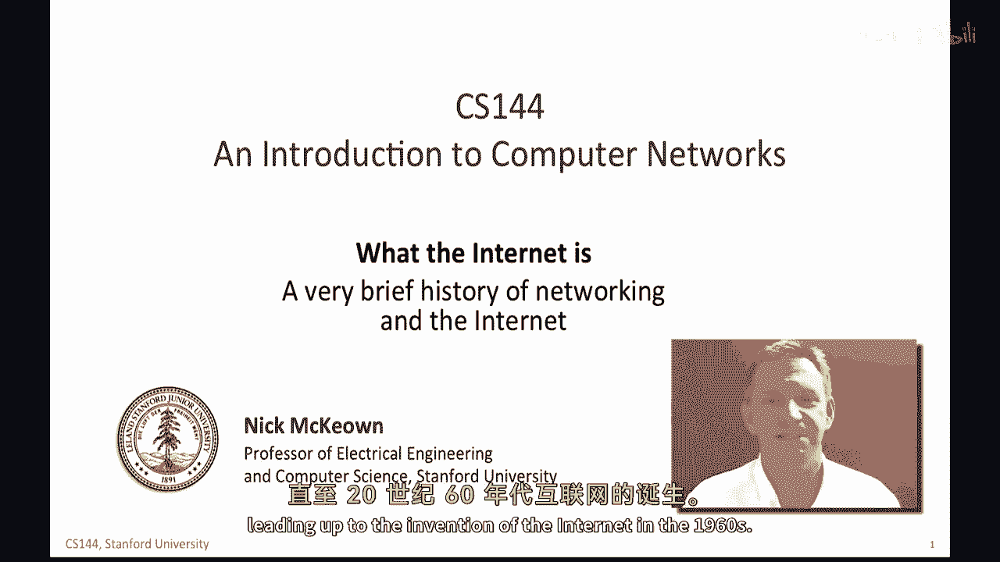
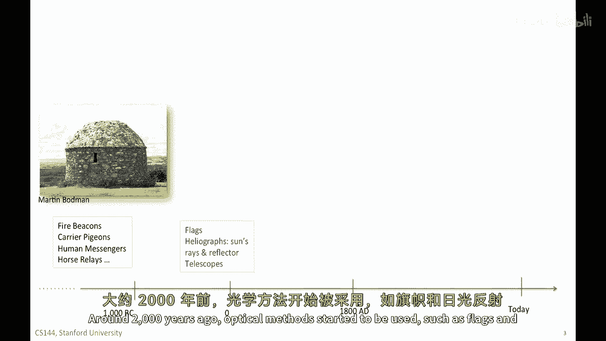
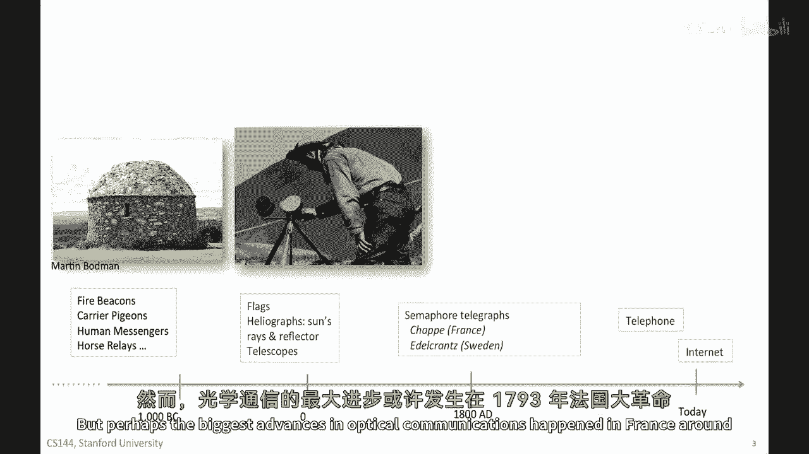
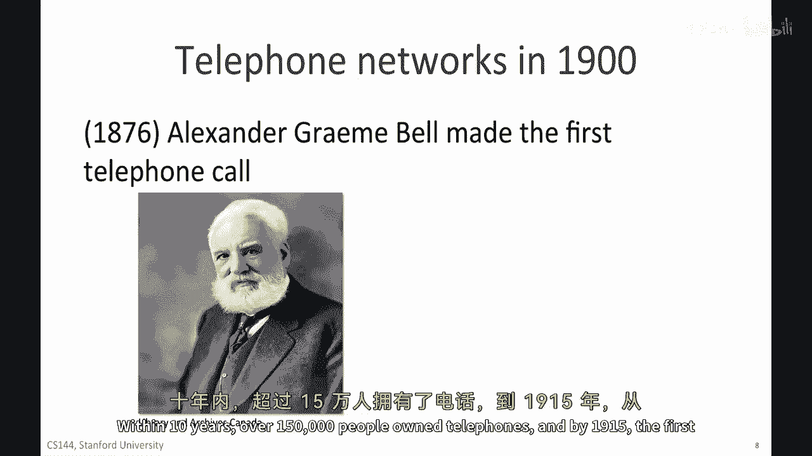
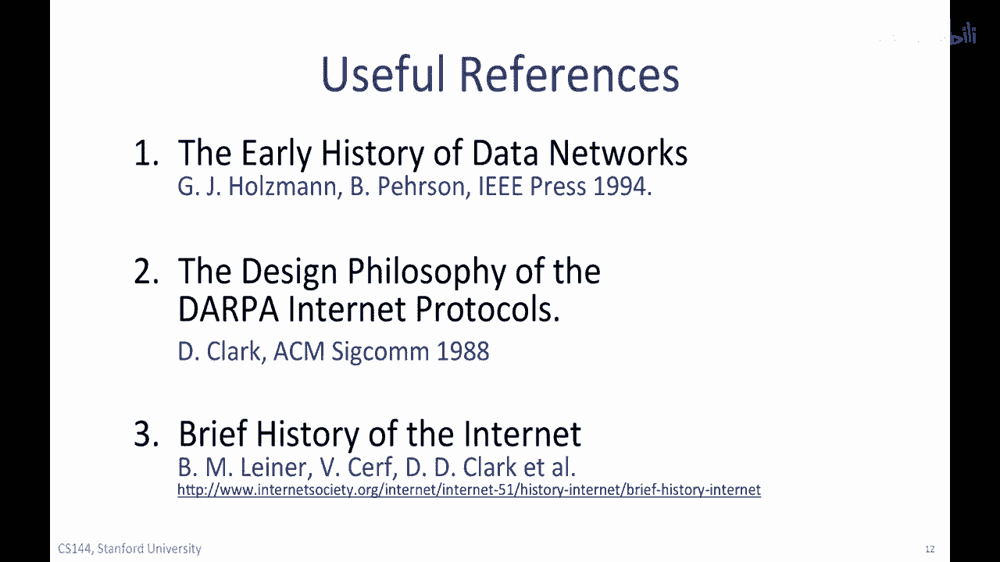

# 课程 P39：网络与互联网简史 📜

在本节课中，我们将简要回顾人类远距离通信方式的演变，并了解现代互联网是如何从早期的通信网络中一步步发展而来的。我们将从古老的烽火信号开始，一直讲到万维网的诞生。

## 从烽火到信使：早期通信方式 🔥

上一节我们介绍了课程概述，本节中我们来看看人类最初的远距离通信方式。虽然今天我们能够轻松地向世界另一端发送电子邮件，但在三千年前，远距离通信极其困难，甚至根本不可能。有记录的最早远距离通信大约始于公元前一千年。

以下是几种主要的早期通信方式：

*   **烽火信号塔**：这些塔楼主要为军事攻防目的设立。火炬被用来传递敌人来袭的信号或协调进攻。下图是英格兰南部的一个烽火信号塔示例。烽火传递信息迅速，尤其在夜晚危险最大时效果显著。但它们携带的信息量极少，通常只有“开启”（危险）或“关闭”（安全）两种状态。
    

*   **信使系统**：数千年来，人类信使、马匹和信鸽在全球范围内被使用，因为它们可以携带更多信息。最早的记录传递系统出现在约两千年前的埃及和中国。例如，在十三世纪，成吉思汗的军队每隔约四十公里就设有一个驿站，备有马匹供信使接力。这种方式直到十九世纪仍被用于邮件递送，例如美国著名的驿马快信。然而，这些系统的信息传递速度比光慢，且沿途的信号和信使容易被拦截，消息可能被阅读、篡改或完全阻断。

## 光学电报的突破：编码与协议 📶

上一节我们了解了依靠人力和畜力的通信方式，本节中我们来看看利用光速传递信息的重大进步。大约两千年前，人们开始使用光学方法，例如旗帜和反光镜。

这些方法可以编码数字信息，如字母、单词和数字。这些系统能以光速在有限距离内传输有限的信息，本质上是简单的编码。但光学通信最大的进步发生在法国。

在1793年法国大革命期间，克劳德·夏普发明并开始建设一个名为“信号机”的光学电报网络。

克劳德·夏普建造了带有大型水平横梁（称为调节器）和两个较小臂杆（称为指示器）的塔。其形态类似一个人用双臂做出不同手势，臂杆的位置指示一个特定符号。1793年，法国政府建造了15座站点，覆盖190公里。到1804年，一个从巴黎延伸至第戎、长达370公里的网络形成。该系统用于发送各类消息，包括军事信息和新闻快讯。

为了使网络正常工作，法国的光学电报系统（以及瑞典的系统）发展出了许多至今仍在网络中使用的核心概念。以下是他们需要开发的五个关键概念：

1.  **代码**：用于指示字符和控制信号的符号。例如，传输开始、传输结束、等待、冲突（当两个信号同时到达时）、错误取消、塔楼故障、确认，甚至表示“因雨或雾无法看清信号”。
2.  **流量控制**：防止发送方数据过快淹没接收方。本质上是接收方告诉发送方“请减速，我跟不上了”。
3.  **同步**：用于界定一个符号何时结束、下一个符号何时开始。这有助于定义由多个符号组成的单词。
4.  **错误纠正与重传**：当接收方告知发送方符号被误解时，允许发送方尝试重新发送。
5.  **加密**：确保消息无法被拦截。他们对股市新闻的泄露尤为担忧。
    

到1830年代，尖端的信号机网络已覆盖法国大部分地区。

## 通信网络的四个发展阶段 📈

上一节我们深入了解了光学电报的运作原理，本节中我们将其置于更宏观的通信网络发展史中来看。我们可以将通信网络的发明分为四个主要阶段：

1.  **约公元前至17世纪**：人们开始使用系统发送一组**预定义的消息**，例如使用烽火。
2.  **16世纪起**：人们开发了能够传输**任意消息**的系统，方法是对整个字母表进行编码。
3.  **17世纪初**：数字代码开始用于表示常见的单词和短语。这是**压缩**的最早形式，因为它减少了链路上需要发送的信息量。
4.  **17世纪**：为**控制信号**开发了代码。这些代码可以通信何时开始和停止发送、何时减速、如何重传等。这就是今天我们所说的**协议**的诞生。

到1800年，双方或多方如何通信的**协议**已达成共识。

在欧洲，多种不同的光学电报系统被开发和部署，使用了各种协议信号，例如：初始化信号（指示即将开始通信）、错误控制、重传、停止、等待、选择性重复（用于重传沿途损坏的数据）。这些概念与你在关于不同重传策略和流量控制的视频中所见非常相似。

## 电话的发明与互联网的萌芽 ☎️

上一节我们总结了通信网络的理论发展，本节中我们来看看推动现代通信的下一个重大发明。通信在19世纪末取得了巨大进步，当时电话被发明。此前，人们曾多次尝试增加连接美国许多城市的电报网络的容量。

图中展示的是亚历山大·格拉汉姆·贝尔，这位苏格兰裔发明家在1876年传输了第一次语音通话。尽管这项专利遭到了多次挑战（其中最具代表性的挑战者是另一位发明家伊莱沙·格雷），但它最终经受住了法律考验，我们通常将电话的发明归功于贝尔。十年内，超过150万人拥有了电话。到1915年，第一次从纽约到旧金山的跨大陆电话接通。

最终导致互联网诞生的一系列事件和发明进程从那时起开始加速。

## 阿帕网与互联网的诞生 🌐

上一节我们看到了电话如何连接大陆，本节中我们来看看计算机网络如何连接世界。大约在1960年，麻省理工学院的J.C.R. Licklider开始撰写备忘录并谈论他的“星际网络”概念。在这个网络中，全球各地的人们相互连接，可以从任何站点访问程序和数据。这被认为是对社交网络的第一次详细描述，并被认为可能由一个与当今互联网非常相似的大规模通信网络实现。

Licklider后来成为美国国防部高级研究计划局（DARPA）计算机研究项目的负责人。在DARPA期间，他说服了伊万·萨瑟兰德、罗伯特·泰勒和麻省理工学院的研究员拉里·罗伯茨关于其新网络概念的重要性。1964年，他们接过了这个重任。

*   研究者保罗·巴伦撰写了现在被认为是关于大规模通信网络的第一篇学术论文《论分布式通信网络》。
*   伦纳德·克莱因洛克撰写了关于队列理论的论文。
*   英国国家物理实验室的唐纳德·戴维斯也在研究非常相似的想法。

1965年，拉里·罗伯茨与托马斯·梅里尔合作，通过低速电话调制解调器，将麻省理工学院的TX-2计算机连接到加利福尼亚的Q-32计算机，创建了第一个广域计算机网络。1966年，拉里·罗伯茨加入DARPA帮助开发第一个ARPANET计划。该计划于1967年发布。

1969年，第一台设备在加州大学洛杉矶分校、斯坦福研究所、加州大学圣塔芭芭拉分校和犹他大学安装，并通过ARPANET发送了第一条消息。这就是1969年互联网最初的样子，它被称为ARPANET，是一个封闭的私有网络。

## 协议标准化与万维网的黎明 💻

上一节我们看到了第一个计算机网络ARPANET的诞生，本节中我们来看看互联网如何通过协议统一并走向大众。到20世纪70年代初，许多不同的分组交换网络开始出现：

*   **1971年**：第一个分组无线电网络在夏威夷群岛之间建立，称为ALOHAnet。其为ALOHA协议开发的机制影响了此后几乎所有的无线网络。
*   **1971年**：法国建造了CYCLADES研究网络。它是第一个让终端主机负责可靠通信的网络，对互联网设计产生了重大影响。
*   **1974年**：IBM引入了完整的数据网络协议栈SNA（系统网络架构），旨在降低构建大型分时计算机的成本。

DARPA赞助了对网状网络的研究，以创建第一个“网络的网络”（Internet）。互联网所需的核心协议首先由斯坦福大学的文特·瑟夫和DARPA的鲍勃·卡恩在1974年著名的论文《分组网络互联协议》中描述。最初的TCP要求可靠、按序的数据交付，并包含了今天我们所说的网络层的大部分功能。早期没有拥塞控制的概念，大约十五年后才被加入。到70年代末，TCP和IP被分离，为UDP作为不可靠传输服务（最初用于分组语音）留出了空间。

文特·瑟夫和鲍勃·卡恩在1983年被公认为“现代互联网之父”。TCP/IP在“旗日”首次在互联网上全面部署（即所有系统同时升级使用新协议）。1986年，美国国家科学基金会创建了NSFNET，以56kbps的链路连接全美各地的大学和超级计算机。其他小型网络开始涌现并连接到互联网。到80年代末，大约有10万台主机连接。

然后，大约在1990年，蒂姆·伯纳斯-李在欧洲核子研究中心发明了**万维网（World Wide Web）**。1993年，第一批网页浏览器出现，其中最著名的是马克·安德森编写的Mosaic浏览器。一年内，全球有超过1000万人使用网络。到90年代末，雅虎、谷歌、亚马逊等名字已家喻户晓。

如果你对网络和互联网的早期历史感兴趣，这里有三本非常值得推荐的参考书：

## 总结 📝

本节课中，我们一起学习了从古代烽火到现代互联网的通信发展简史。我们看到了人类如何从发送简单的预定义信号，发展到建立复杂的光学电报网络并发明了关键的通信协议概念。随后，电话的发明实现了实时语音通信。20世纪下半叶，计算机网络的兴起，特别是ARPANET的建立和TCP/IP协议的标准化，为全球互联的互联网奠定了基础。最终，万维网和浏览器的出现，使互联网走进了千家万户，彻底改变了人类社会信息获取与交流的方式。