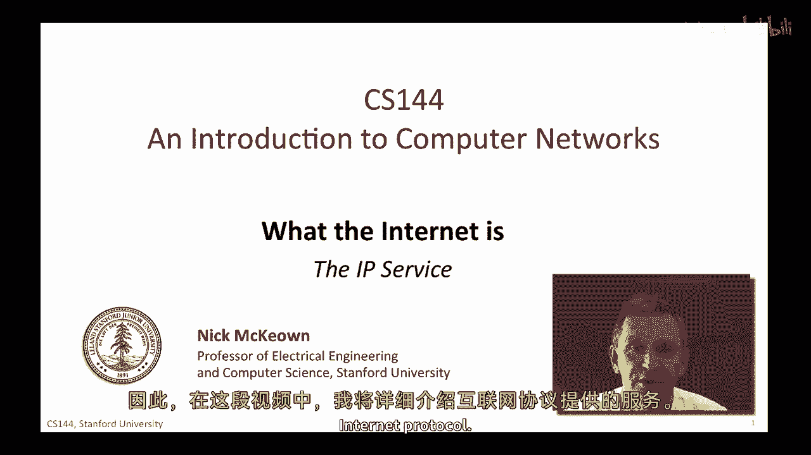
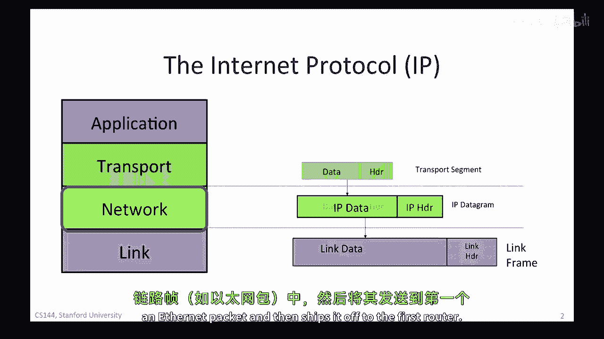
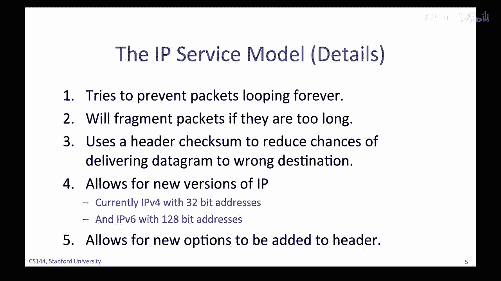
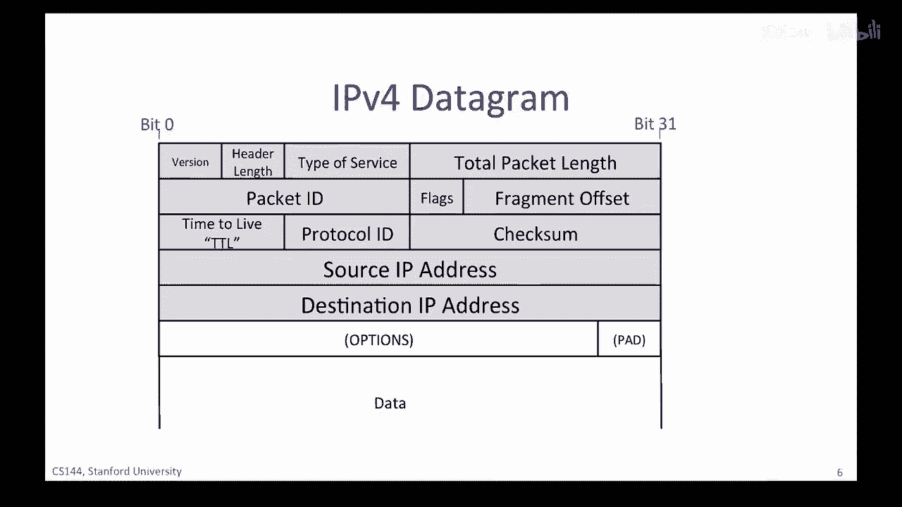
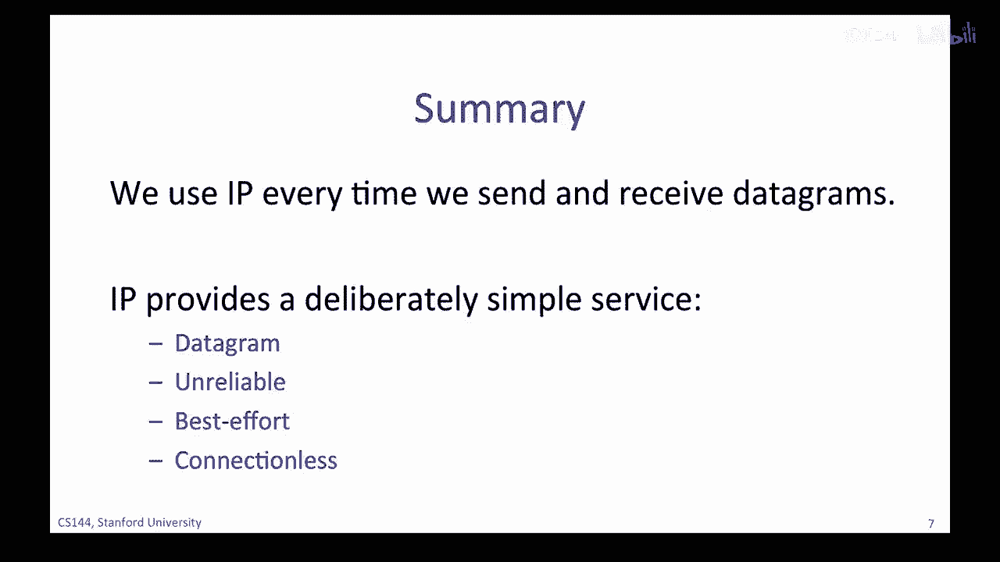

# P4：p3 1-3 The IP service model - 加加zero - BV1qotgeXE8D

现在，你已经了解了四层互联网模型，我们将专注于网络层，这是互联网的最重要一层，实际上，对于许多人来说，它就是互联网，每当我们使用互联网时，我们被要求使用互联网协议来发送和接收我们的数据包。

你会记得我们说过，每层都为上一层提供服务，为了正确使用一层，我们需要对它所提供的服务有深入的理解，因此，在这个视频中，我将走一遍互联网协议提供的服务。

IP数据包由头部和一些数据组成，当传输层有要发送的数据时，它将一个传输段交给网络层，在网络层下面，将传输段放入一个新的IP数据包，该数据包由网络层创建，它的任务是将数据包送达互联网的另一端，但首先。

IP数据包必须，通过第一个链接到第一个路由器，因此，IP将数据包发送到链路层，该层将其放入链路帧，例如，以太网包，然后将其发送到第一个路由器。

IP服务的特性可以由这里列出的四个属性来描述，它从源主机发送数据包到目的主机，它是不可靠的，但会尽最大努力传递数据包，网络不与数据包相关联的流状态，让我们来看看这些属性，按照表中的顺序，首先。

IP是一个数据包服务，当我们要求IP为我们发送一些数据时，它将创建一个数据包并将我们的数据放入其中，数据包是网络中单独路由的包，基于其头部中的信息，换句话说，数据包是自包含的，头部包含目的地IP地址。

我们在这里简称为ip da，IP目的地地址，在每个路由器的转发决策中都基于这个ipda，数据包头部还包含源IP地址，或ip sa，表示包来自哪里，所以接收者知道如何发送任何响应。

数据包通过网络从一个路由器跳到下一个路由器，一跳一跳地路由，从IP源地址到IP目的地地址，一路到底，我们将 later 学习路由器如何工作，但现在，足够了，知道每个路由器都包含一个转发表。

它告诉它下一个应该发送包的地方，当路由器匹配到一个给定的目的地地址时，路由器不知道整个路径，它只是使用目的地地址来索引其自己的转发表，以便它可以将包转发到路径中的下一个跳点，以到达其最终目的地。

一跳一跳，一步一个脚印，数据包从源点到目的地的旅程，在数据包中只使用目的地地址，你经常会听到IP数据包如何路由的比喻，和邮递服务如何路由信函的比喻，在邮递服务中这是一个好的比喻，我们将信函放入邮筒。

地址是目的地，信函无形地被路由到我们这里，一跳一跳地从分拣中心到分拣中心，直到到达目的地，发送者和接收者都不知道，也不需要知道邮递服务中信件或互联网数据包的传输路径，或IP服务的路由。

IP服务模型提供了一种服务，包括将消息路由到目的地，IP服务模型的第二个方面，而且可能最令人惊讶的是，是，IP不可靠，IP没有承诺包将被送达目的地，它们可能迟到、顺序混乱或根本不会被送达。

可能在传输过程中出现数据包的复制，例如，由行为不端的路由器引起，你需要记住的是，ip不可靠，不保证任何事，但它不会随意丢弃数据包，只是因为它感觉这样，如果你相信网络有感情，ip承诺只会丢弃数据包。

如果必要，例如，路由器的数据包队列可能会因为拥堵而填满，强制路由器丢弃下一个到达的包，IP不会尝试重新发送数据，实际上，IP甚至不告诉源包被丢弃，同样，错误的路由表可能会导致包被发送到错误的目的地。

或导致包被错误地复制，IP没有承诺这些错误不会发生，它也不会在它们发生时检测它们，但IP承诺只会在这些情况下发生错误并丢弃包，实际上，IP数据包服务非常类似于基本的邮递服务。

基本的邮递服务不保证我们的信会按时送达，或者如果我们连续几天连续发送两到三封信，它们不会按发送顺序收到，它不保证它们会被送达，除非我们为保证送达支付更昂贵的端到端服务，实际上，IP是一个非常简单的。

最小化的服务，它不维护与通信相关的任何状态，我们说一个通信服务是无连接的，因为它不是通过建立与通信的端到端状态来开始的，换句话说，当我们进行几分钟的skype通话，其中包括许多ip数据包时。

ip层对呼叫一无所知，并简单地将每个数据包单独、独立地路由，而不考虑其他所有的数据包，你可能在问为什么ip服务如此简单，毕竟它是整个互联网的基础，所有通过互联网进行的通信都必须使用ip服务。

考虑到互联网的重要性，难道不应该使ip更可靠吗，毕竟，我们曾经说过大多数应用程序想要一个可靠的字节通信服务，ip服务模型被设计得如此简单的几个原因，首先，为了保持网络的简单，愚蠢和最小化可以更快。

更流畅，更便宜地构建和维护，人们相信，如果网络保持简单，只有很少的功能和需求，然后数据包可以快速、低成本地送达目的地，人们认为，一个简单的网络可以使用专门的硬件快速运行。

考虑到网络由遍布全球的许多路由器组成，在世界各地，如果他们可以保持简单，那么他们更有可能可靠，更便宜，更容易维护，并且需要升级的次数更少，其次，是端到端原则，端到端原则指出，可能的话。

在通信系统的设计中，如互联网，应在终点主机中实现功能，有一个被称为端到端原则的原则，人们常说，如果你能在终点正确实现功能，那么我们将在后来的视频中更深入地研究端到端原则。

但基本思想是将尽可能多的智能放在终点，在我们的情况下，源和目的地计算机，这可以有多个优势，例如，确保特征为应用程序正确实现，并且它更容易进化和改进一个功能，如果它被实现在终点计算机的软件中。

而不是互联网的硬件中，在互联网的情况下，决定如可靠通信和控制拥塞等功能应由源和目的地计算机在终点实现，而不是网络当时，这是一项非常激进的建议，与电话系统截然不同的设计选择，当时最大的网络。

最初是基于简单手机和复杂的网络功能构建的，在后续的视频中，这是电话系统的最初设计，一个功能丰富的网络，我们将学习端到端原则作为通信系统重要架构原则之一，我们将看到端到端原则在实际中的应用，例如。

当我们研究传输层时，我们将看到端主机如何通过不可靠的ip构建可靠的通信服务，网络服务，一个简单的，ip服务也允许在各种可靠的或不可靠的服务之上构建，如果ip是可靠的，换句话说。

如果自动重传了任何缺失的包，那么对于某些服务来说就不是理想的，例如，在像视频聊天这样的真实实时应用中，重新传输丢失的数据可能没有意义，因为可能会太晚到达而无法有用，应用可能会选择显示几个空白像素。

或者使用前一帧的像素，而不提供任何可靠性保证，ip让应用选择它需要的可靠性服务，最后，ip在任何链路层上都工作，IP对链路层不做太多的假设，IP对链路层以下的任何期望都没有，链路可以是有线的或无线的。

不需要重传或控制拥塞，有些人说IP是如此简单，对底层链路层做出如此少的假设，以至于你可以在信鸽上运行IP，实际上，甚至有一个互联网标准告诉你如何做，使IP运行在任何链路层都 make sense。

因为互联网被专门创建来连接现有的网络，实际上这就是它被称为互联网的原因，除了基本的不可靠最佳努力外，无连接数据报服务，ip还提供了一些精心选择的其他服务，ip的设计者试图非常努力地在。

提供使通信工作所需的最小必要条件之间找到平衡，而不提供如此基本的服务，以至于它根本不起作用，我将在这里描述五个特征，你将在后续的视频中学习到这些特征中的每一个，因此，我在这里不会深入探讨太多细节，但是。

我将简要描述每个一个，这样你就可以先理解完整的ip服务的范围，ip试图防止数据包永远循环，因为ip路由器通过跳转将数据包发送到互联网上的每个节点，路由器的前向表可能出错，导致数据包开始循环并反复。

沿着相同的路径，这最有可能在转发表更改时发生，并且它们暂时进入不一致的状态，而不是试图防止循环永远发生，这将需要很大的复杂性，IP使用非常简单的机制来捕获，然后删除看起来被困在循环中的包以实现此。

IP只是在每个数据包头部添加一个跳计数字段，M，它被称为生存时间或ttl字段，它开始时像一百二十八这样的一个数字，然后由它通过的每个路由器减少，如果它达到零，IP认为它必须被困在循环中。

然后路由器丢弃数据包，M，这是一个典型的IP机制，它不保证循环不会发生，它只是试图限制由无尽循环的包引起的损害，在网络中，IP如果包过长，则会分割包，IP设计用于运行在任何类型的链接上。

大多数链接都有一个包大小的限制，它们可以携带，例如，以太网只能携带长度小于一千五百字节的包，如果应用程序有超过一千五百字节要发送，它必须在IP数据包中分解为一千五百字节的部分才能发送，现在。

朝着目的地的路径上，一个一千五百字节的数据包可能需要通过只能携带较小包的链接，让我们说，一千字节长，连接两个链接的路由器将数据分解为两个较小的数据包，IP提供了一些我们将在下一分钟看到的头部字段。

以帮助路由器将数据包分解为两个独立的IP数据包，同时提供端主机需要正确重新组装数据的信息，IP，使用头部校验和来减少将数据包发送到错误目的地的机会，IP在数据包头部包括一个校验字段。

以尝试确保数据包被发送到正确的位置，如果包被意外和频繁地发送到错误的地方，可能会成为一个严重的安全问题，因为沿途的路由器可能出现错误，第四，今天在使用两种版本的IP，I，P，V，四。

被超过九十 percent 的端主机使用，它使用你可能熟悉的三个二进制地址，因为我们正在耗尽IP4地址，互联网正在逐渐过渡到I，P，V，六，使用的是128位的地址，相反，你将学习iP地址的详细信息，i。

P，和i，P，V，在后续的视频中，你将学习6位地址，最后，IP允许在数据包头中添加新的字段，在实际应用中，这有点喜忧参半，一方面，它允许在头中添加新的特性，这些特性后来证明很重要。

但这些特性不在原始的标准中，另一方面，这些字段需要处理，因此，沿途的路由器需要额外的特性，这与简单的目标相冲突，愚蠢的最小转发路径，在实际应用中，路由器使用的或处理的选项非常少。

我现在要向您展示i，P，V，四个头部并解释所有字段做什么，你不需要，你不需要记住所有字段在哪里，我自己也不记得所有地点，但是，我希望你知道每个字段做什么，因为这有助于你理解IP服务模型的范围。

这应该帮助你更好地理解，并使IP的功能变得真的很清楚，它是一个故意简单的服务，这是IP的图片，V，四个头部，这是今天最常用的头部，我在这里用三个二进制字表示它，位零，首先在顶部左上角发送。

阴影部分是ip地址，V，四个头部，它后面跟着数据，ip头部中最重要的字段是目的地ip地址，源ip地址，协议id，告诉我们数据字段内的内容是什么，本质上，它允许目的主机解包到达的数据。

将它们发送到处理包的正确代码，如果原型协议ID的值为六，例如，那么它告诉我们数据包含一个TCP分段，因此我们可以安全地将数据包传递给TCP代码，它将能够正确地传递分段，互联网分配号码权威I，A，A。

定义了超过一百四十个不同的值的协议ID，代表不同的传输协议，版本字段告诉我们正在使用的IP版本，目前合法的值是I，P，V，四和I P，V，六，这个首部是IP V四首部，我们将看到IP V。

六首部在后续的视频中，IP V六首部，在以后的视频中，我们将看到IP V六首部，总包长度可以高达64千字节，包括首部和所有数据，生存时间或TTL字段帮助我们防止包在网络中意外循环，永远。

每个路由器都必须在TTL达到零时减少TTL字段，路由器应该以这种方式丢弃包，当源发送带有固定TTL值的包时，它被路由器保证会被摧毁，如果它开始旅行在循环中，有时包太长不适合链路，它即将在包中发送。

ID标志和碎片偏移量，所有这些都帮助路由器将IP包分解为较小的，自包含的数据包，如果需要，我们将在后续的视频中学习碎片化的工作原理，服务类型字段给路由器提供了关于这个包有多重要的提示。

首部长度告诉我们首部的大小，一些首部有可选的附加字段来携带额外的信息，最后，对整个首部计算一个校验和，以防首部被损坏，我们不太可能错误地将包发送到错误的目的地。

因此，总的来说，IP非常重要，我们在互联网上发送和接收包时每次都使用IP，IP提供了一种故意简单的服务，它是一种简单，愚蠢，最小化的服务，具有四个主要特征，它通过互联网跳点发送数据包，服务不可靠。

尽力而为，没有流状态，使协议无连接，到这个点，你应该对IP协议感到舒适，它的服务模型是什么，它如何融入互联网的分层结构，如果你有疑问，我建议你重看关于四层模型的这个视频和前面的一个。

你也会发现很多关于我如何如何的好参考，P，V，四部作品，任何一本好的网络书籍都会花费大量篇幅来解释ip是什么，以及它为什么被设计成这样，例如，计算机网络的第六版第四章，由qi和ross从顶部向下的方法。

