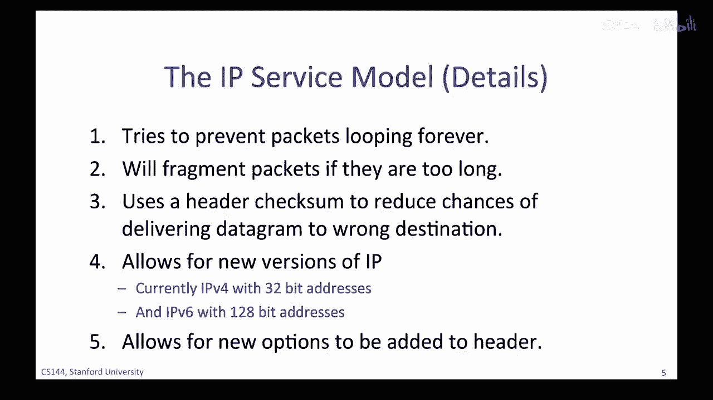

# 课程 P4：互联网协议（IP）服务模型详解 🧩


在本节课中，我们将深入探讨互联网协议（IP）的服务模型。IP是互联网网络层的核心协议，负责将数据包从源主机发送到目的主机。我们将了解IP服务的关键特性、设计原则以及其数据包格式。

---


## 互联网协议（IP）概述

上一节我们介绍了互联网的四层模型，本节中我们来看看网络层，特别是互联网协议（IP）。对于许多人而言，IP就是互联网本身。每当我们在互联网上通信时，都需要使用IP来发送和接收数据包。

每层都为上一层提供服务。为了正确使用网络层，我们需要深入理解IP所提供的服务。

---

## IP数据包的旅程

当传输层有数据要发送时，它会将一个传输段交给网络层。网络层将这个段放入一个新的IP数据包中。IP数据包由头部和一些数据组成，其核心任务是将数据包送达互联网另一端的接收主机。

首先，IP数据包必须通过第一条链路到达第一个路由器。因此，IP将数据包发送到链路层，链路层将其封装进一个链路帧（例如以太网帧）中，然后发送到第一个路由器。

---

## IP服务的四个核心属性

IP服务的特性可以由以下四个属性来描述：
1.  它是一个从源主机到目的主机的数据包投递服务。
2.  它是不可靠的，但会尽最大努力传递数据包。
3.  它是“尽力而为”的服务。
4.  它不与数据包流相关联，是无状态的。

让我们逐一详细探讨这些属性。

### 1. 数据包投递服务

当我们要求IP发送数据时，它会创建一个数据包并将数据放入其中。数据包在网络中基于其头部信息被独立路由，因此它是自包含的。

以下是数据包头部包含的关键信息：
*   **目的地IP地址（IP DA）**：每个路由器的转发决策都基于此地址。
*   **源IP地址（IP SA）**：表示数据包来自何处，以便接收方知道如何回复。

数据包通过“逐跳”的方式在网络中路由，从源地址到目的地址。每个路由器都维护一个**转发表**，它根据数据包的目的地地址，决定将数据包转发到路径上的下一跳。

### 2. 不可靠的服务

IP不承诺数据包一定会被送达目的地。数据包可能迟到、顺序错乱、丢失，甚至在传输过程中被意外复制。

IP只会在必要时丢弃数据包，例如当路由器队列因拥塞而满时。它不会尝试重传丢失的数据包，甚至不会通知发送方数据包已被丢弃。

### 3. 无连接与无状态

IP服务是无连接的。这意味着IP层不会为一次通信（例如一次Skype通话）建立和维护端到端的状态。每个IP数据包都被独立、单独地路由，IP层对它们属于哪个“流”或“会话”一无所知。

### 4. 设计如此简单的原因

你可能会问，作为互联网的基石，IP为何设计得如此简单？主要有以下几个原因：

*   **保持网络简单**：简单、最小化的网络可以更快、更便宜地构建和维护，也更容易使用专用硬件实现，从而更可靠。
*   **端到端原则**：该原则主张，尽可能将功能（如可靠通信、拥塞控制）实现在通信路径的终点（即源主机和目的主机），而不是网络中。这确保了功能为应用程序正确实现，并更容易演进和改进。
*   **灵活性**：简单的IP服务允许在其上构建各种可靠或不可靠的服务。例如，实时视频应用可能不希望重传丢失的数据包，而简单的IP正好提供了这种灵活性。
*   **链路层无关性**：IP对底层链路层（如以太网、Wi-Fi）做出极少假设，因此它几乎可以在任何类型的链路上运行。这种设计使得互联网能够连接各种异构网络。

---

## IP提供的其他关键机制

除了基本的“尽力而为”数据报服务，IP还提供了一些精心选择的机制，以平衡功能性与简单性。

以下是IP提供的五个重要特性：

1.  **防止数据包无限循环（TTL）**：IP在数据包头部包含一个**生存时间（TTL）**字段。该字段初始化为一个值（如128），数据包每经过一个路由器，TTL值减1。当TTL减至0时，路由器会丢弃该数据包，这防止了因路由错误导致的数据包在网络中无限循环。
    *   **公式表示**：`if (packet.ttl == 0) { discard(packet); }`
2.  **分片**：如果数据包太大，无法通过某条链路（如最大传输单元MTU较小的链路），路由器会将其分割成多个较小的IP数据包。IP头部中的标识、标志和分片偏移字段用于帮助接收端主机正确地重新组装原始数据包。
3.  **头部校验和**：IP头部包含一个校验和字段，用于检测头部在传输过程中是否出错。这有助于减少因头部损坏而将数据包错误投递的机会。
4.  **IP版本**：目前主要使用两个版本：**IPv4**（使用32位地址）和**IPv6**（使用128位地址）。互联网正逐渐从IPv4向IPv6过渡。
5.  **可扩展的头部选项**：IP允许在头部添加可选字段以支持新特性。但在实践中，为了保持转发路径的简单高效，路由器很少处理这些选项。

---



## IPv4数据包头部详解

现在，我们来看一下当今最常用的**IPv4**数据包头部。理解每个字段的作用有助于你更清晰地把握IP服务模型的范围和其“故意简单”的设计哲学。

下图展示了IPv4头部的结构（以32位字为单位）：

```
 0                   1                   2                   3
 0 1 2 3 4 5 6 7 8 9 0 1 2 3 4 5 6 7 8 9 0 1 2 3 4 5 6 7 8 9 0 1
+-+-+-+-+-+-+-+-+-+-+-+-+-+-+-+-+-+-+-+-+-+-+-+-+-+-+-+-+-+-+-+-+
|Version|  IHL  |Type of Service|          Total Length         |
+-+-+-+-+-+-+-+-+-+-+-+-+-+-+-+-+-+-+-+-+-+-+-+-+-+-+-+-+-+-+-+-+
|         Identification        |Flags|      Fragment Offset    |
+-+-+-+-+-+-+-+-+-+-+-+-+-+-+-+-+-+-+-+-+-+-+-+-+-+-+-+-+-+-+-+-+
|  Time to Live |    Protocol   |         Header Checksum       |
+-+-+-+-+-+-+-+-+-+-+-+-+-+-+-+-+-+-+-+-+-+-+-+-+-+-+-+-+-+-+-+-+
|                       Source Address                          |
+-+-+-+-+-+-+-+-+-+-+-+-+-+-+-+-+-+-+-+-+-+-+-+-+-+-+-+-+-+-+-+-+
|                    Destination Address                        |
+-+-+-+-+-+-+-+-+-+-+-+-+-+-+-+-+-+-+-+-+-+-+-+-+-+-+-+-+-+-+-+-+
|                    Options (if IHL > 5)                       |
+-+-+-+-+-+-+-+-+-+-+-+-+-+-+-+-+-+-+-+-+-+-+-+-+-+-+-+-+-+-+-+-+
```

以下是各关键字段的说明：

*   **版本（Version）**：指明IP协议版本，对于IPv4，此值为4。
*   **头部长度（IHL）**：以32位字为单位指示IP头部的长度，因为头部可能包含可变长的选项字段。
*   **服务类型（Type of Service）**：为路由器提供关于此数据包优先级的提示。
*   **总长度（Total Length）**：指整个IP数据包（头部+数据）的长度，最大可达65535字节。
*   **标识、标志、分片偏移（Identification, Flags, Fragment Offset）**：这三个字段共同用于数据包的分片与重组过程。
*   **生存时间（Time to Live, TTL）**：如前所述，用于防止数据包无限循环。
*   **协议（Protocol）**：标识数据部分承载的上层协议（如TCP为6，UDP为17）。接收主机根据此字段将数据交给正确的处理模块。
    *   **代码示例**：`if (ip_header.protocol == 6) { pass_to_tcp(ip_packet.data); }`
*   **头部校验和（Header Checksum）**：用于验证IP头部在传输过程中的完整性。
*   **源地址（Source Address）**：发送主机的32位IPv4地址。
*   **目的地址（Destination Address）**：接收主机的32位IPv4地址，是路由决策的核心依据。

---


## 总结

本节课中，我们一起学习了互联网协议（IP）的服务模型。我们了解到：

*   IP是互联网网络层的核心，提供从源到目的地的数据包投递服务。
*   IP服务是**不可靠**、**尽力而为**且**无连接**的，这是其保持简单、高效和灵活性的关键设计。
*   IP的设计遵循了**端到端原则**，将复杂性置于网络边缘的主机中。
*   除了基本服务，IP还通过**TTL**、**分片**、**校验和**等机制提供了必要的健壮性保障。
*   **IPv4头部**的各个字段共同协作，实现了上述所有功能。


理解IP这种“简单而愚蠢”的服务模型，是理解更上层协议（如TCP如何构建可靠性）和整个互联网架构的基础。如果你对四层模型或IP的工作方式仍有疑问，建议回顾相关课程内容或查阅经典计算机网络教材。