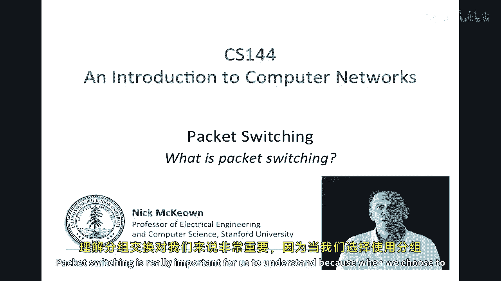
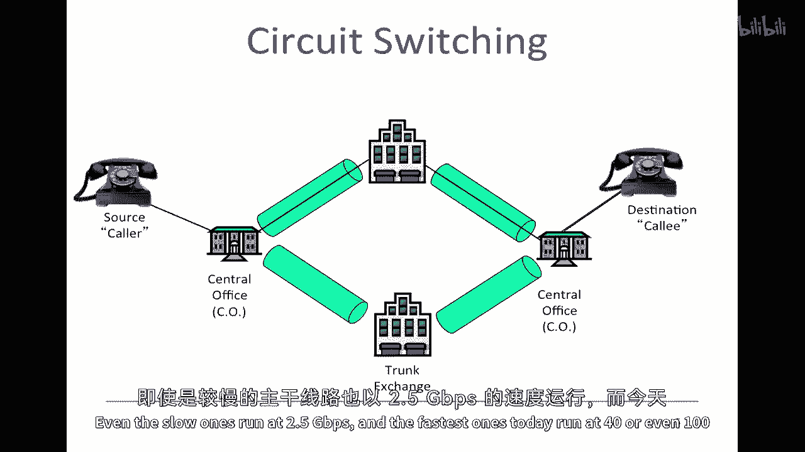
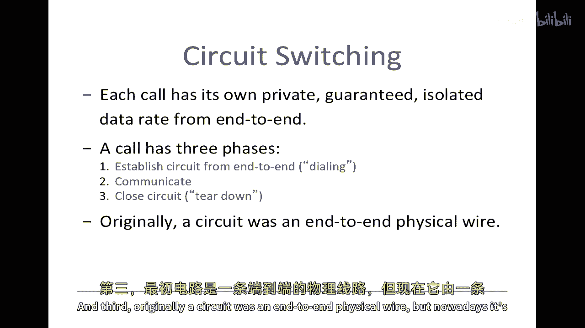
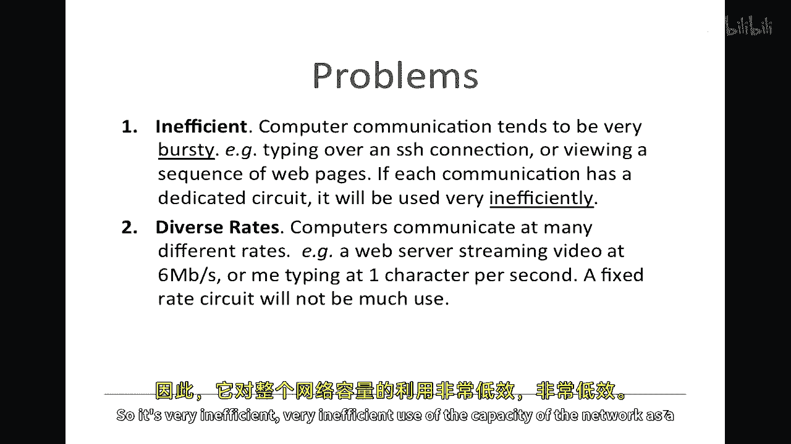
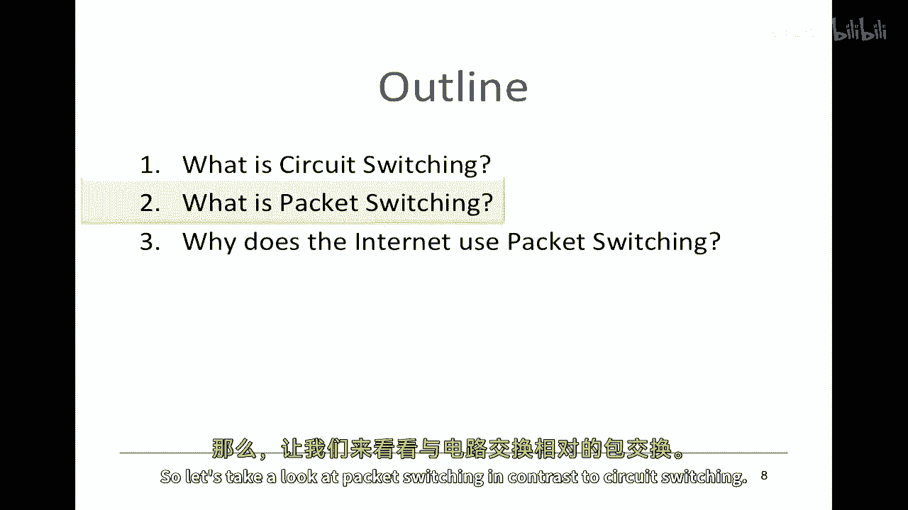
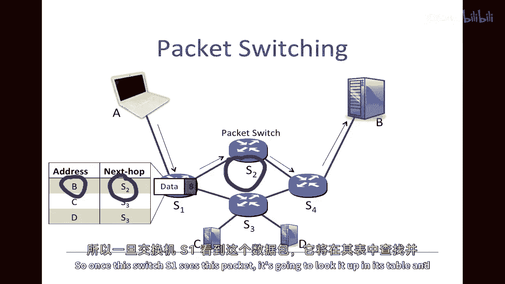
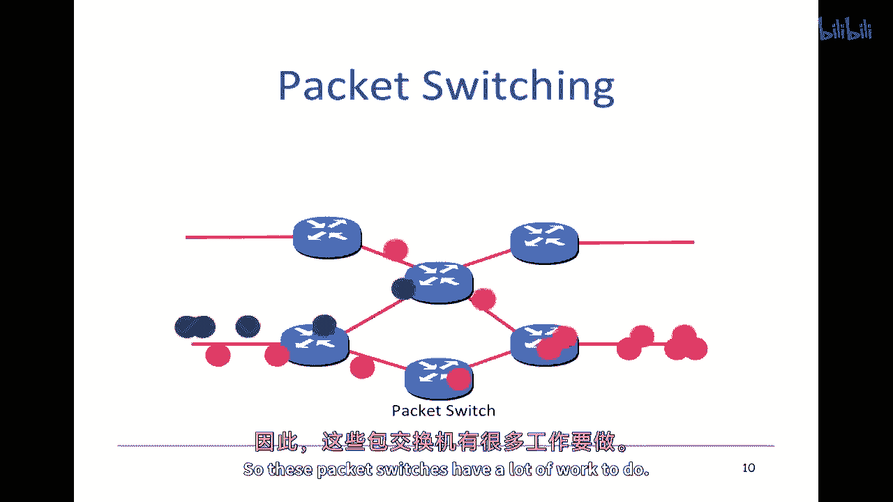
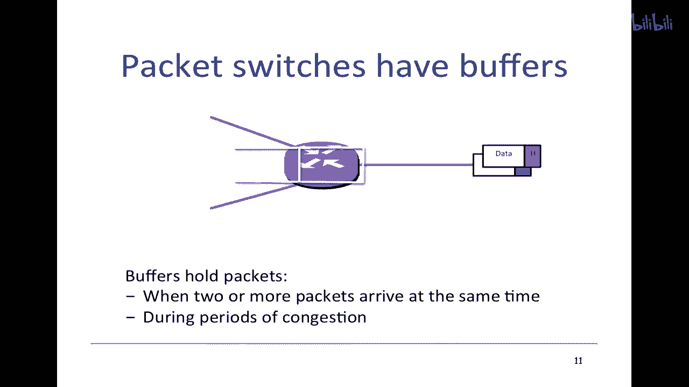
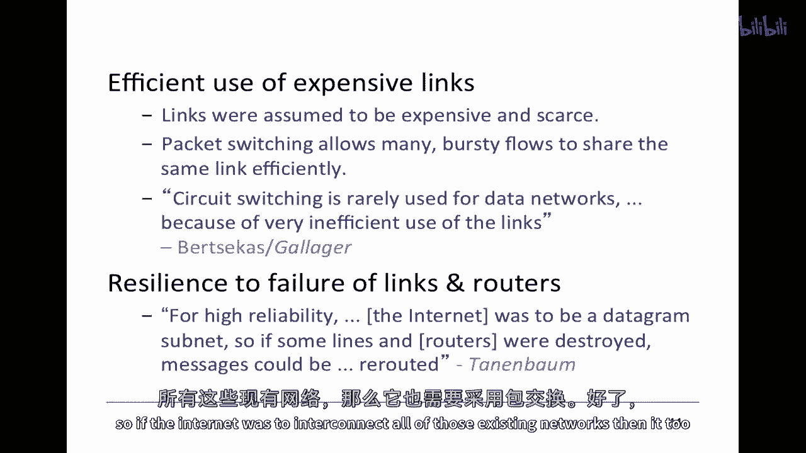
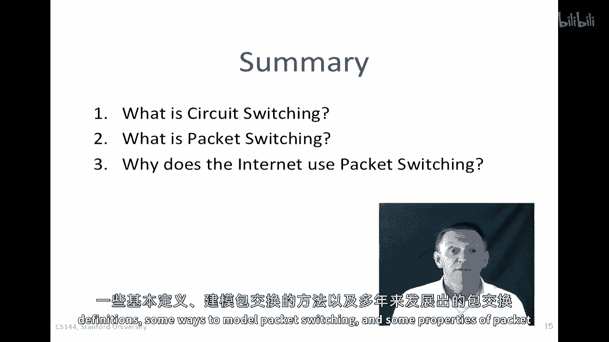

# P40：p39 3-2 Packet Switching - Principles What is packet switching - 加加zero - BV1qotgeXE8D

在这个视频中，我将告诉你什么是分组交换，以及分组交换在互联网中为何被使用。

分组交换最早由保罗·巴伦在二十世纪六十年代的早期描述，它描述了信息包是如何逐个通过互联网路由到目的地的，就像信件由邮局递送一样，分组交换对我们来说非常重要。

因为我们选择使用分组交换时，它决定了网络的许多属性。

今天我将描述分组交换是什么。

以及它为何被选择为互联网，但首先，让我们设定一些，嗯，设定一些背景，我将告诉你分组交换的前身，嗯，那就是电路交换，我们都非常熟悉电路交换，因为它是电话网络中使用的，所以电路交换的最常见用途是在电话。

传统的有线电话网络，我们将走一遍，当我们从左边的电话拨打到右边的电话时发生什么，现在，在图中，我有这里，它显示了电话通过专用线连接，而这不会使得电话系统很有趣，我们只能跟一个人通话，但是，所以实际上。

电话通过专用线连接在一起，下到交换中心，所以在电话网络的早期，大约在八十年代或更早，专用线连接到交换台操作员，并且交换台操作员是一个充满人的房间。

他们会从输入接管专用线，并将其连接到您要连接的电话的专用线，所以一切都是手动连接的，但是，这里的主要观点是，线从开始到电话通话的结束都是专用的，当然，我们现在没有满屋子的交换台操作员，并且这些。

嗯，相反，我们使用自动电路交换，它们为我们设置电路，从您的电话到我们朋友的电话在另一端，所以，可以帮助我们想象一个电话通话有三个阶段，首先，我们拿起听筒并拨打号码，拨打号码是在说，我们要连接到哪里。

第二阶段，电话系统会尝试找到并连接到您拨打的电话，第三阶段，当电话连接成功后，我们就可以开始通话了，这就创建了一条从一端到另一端的专用电路，所以这条专用电路将通过沿途的所有电路。

系统告诉每个电路将一个输入线连接到一个即将到来的线，或一个输入电路连接到一个即将到来的电路，所以每个开关都将保持状态，以将输入电路映射到正确的输出电路，然后在第二阶段，我们谈论数字电话系统。

就像今天的大多数电话系统一样，我们的声音在第一个开关处被采样和数字化，然后它被发送过专用电路，作为一个，通常为六十四千比特每秒，嗯，语音通道，所以，我们的电话对话有一条专门的电路或通道，贯穿整个路径。

并且，电路不与其他人共享，然后，当我们挂断电话，电路必须被移除，以及路径上开关的任何状态都必须被移除。

所以，实际上在开关之间，嗯，那些，那些，有干线，速度真的很快，换句话说，它们有非常高的数据率，即使是最慢的也以每秒2。5吉比特的速度运行。

而今天的最快者可以以每秒40甚至100吉比特的速度运行，有时你会听到人们叫这些大干线，大粗管子，因为它们可以发送大量的数据，但实际上，这些大粗的管道实际上非常细小，细小的光缆，比一根你的头发还要细。

城市之间可以共享同一根干线进行成千上万的电话呼叫，每个在独立的电路中，这里要记住的关键是，每个电话都有自己独立的六十，千比特每秒的电路，它与任何人共享。

因此，总的来说，我们可以将电路切换视为具有以下特征，每个呼叫都有其自己的私有，从端到端保证隔离的数据率，其次，呼叫有三个阶段，建立，通信和关闭，并且第三，原本电路是一条从端到端的物理线。

但现在是由虚拟私有线组成的，它将与别人共享那条线，但它在自己的线中有自己的专用电路，电路切换存在一些问题，显然它对电话系统工作得非常好，但当我们考虑使用电路切换来处理互联网或任何计算机通信时。

存在一些我们。

嗯，需要考虑的不足，所以我要讨论三个主要问题，第一个问题是它效率低下的计算机，当计算机通信时，它们往往非常突然的，我们倾向于以脉冲的方式发送数据，也许几秒钟，几个数据包，甚至可能几分钟。

取决于我们正在运行的应用程序，例如，如果我在SSH连接上打字，嗯，我会时不时地发送一些字符，有时是一串字符，作为单词的一种形式，然后之间会有很长的沉默期，或者如果我正在阅读一系列的网页。

我可能会在填充完一页时爆发，在填充完，填充那页的数字时爆发，然后当我阅读那些网页时，会有一段暂停期，所以它往往非常爆发性，当然，在那些沉默时期，当我什么都没做时，没有活动，我有一个专用的电路。

其他人无法使用。

所以非常低效，非常低效，网络容量的使用。

整体上，第二个问题是计算机往往具有非常广泛的应用，需要非常不同的速度。

计算机以许多，许多不同的速度进行通信，所以，Web服务器可能在以，说一兆比特每秒甚至六兆比特每秒的速度流媒体视频，但是如果你与我每秒钟输入一个字符进行比较，网络需要支持的速率之间存在巨大的差异，因此。

如果我们为视频选择固定的速率电路，然后我使用它来打字，它将几乎不会被使用，反之亦然，那么我甚至无法流媒体视频，所以，固定的速率电路实际上几乎没什么用。

电路切换的第三个问题是我们所需要保持的所有状态。

我们需要为每个电话呼叫保持一些状态，每次我们建立呼叫时都会发生这种情况，我们需要为每个交换机的入口到出口的电路映射设置起来，在过程中，如果电路失败或交换机失败或链路失败，我们需要进去更改所有这个状态。

以便重新路由，重新路由，呼叫，所以我们需要管理它，然后到最后我们需要记得删除状态，如果任何事情失败，然后我们可能会发现状态变得不一致，然后我们就有问题，所以电路交换中的状态管理被认为是一个问题。

如果我们同时进行成千上万或数百万的通信，那就是很多工作需要完成。

所以让我们来看看分组交换与电路交换的对比。

所以再次我们看看两个端系统如何在这种环境中通信，在这种情况下我们将看到这，嗯，左边的笔记本电脑，并且它将与右侧的服务器进行通信，在实际应用中，这些，当然，可能位于任何地方。

嗯，互联网上的任何地方，在分组交换中，我们没有专门的电路来携带我们的数据，相反，我们只在准备好时发送，"只要我们想要，就可以向数据块添加头部并发送它"，嗯，这就是我们所说的包。

"并且头部包含数据包的目的地地址"，"就像信封告诉邮局把信送到哪里一样"，"分组交换网络由终端主机组成"，"链接和分组交换机"，"当我们发送包"，"它一步一步地从源点路由"，在这种情况下。

笔记本电脑一直送到目的地。如果你看看这个包，它里面含有数据，而且还含有它要去的地址b，稍后我们会看到，包比这要复杂一些，但这是基本的信息，它需要的最小信息，我们想要得到的数据，以及它要去的地址b。

所以当我们发送包时，它会被路由，从源点到目的地，一步一步地走，沿途的每个包交换机都将查找转发表，所以它保持一个本地转发表和所有的包交换机，这就是一个转发表，说如果我们看到地址b。

那么我们将把它发送到下一个，跳转到s two，这就是s two在这里，好的，所以当交换机s one看到这个包，它将查找其表并发送它到交换机s two。

这就是它正在行进的路线，交换机S2将有自己的数据表，当然，那个数据表将与S1不同，因为它将具有一组不同的跳转地址，对于它看到的每个地址，然后它将将其发送到其路径，这次向我们四个发送。

然后最终到达正确的目的地，所以在互联网上，有许多不同类型的包交换机，其中一些被称为路由器，因为它们处理互联网地址，并且它们可能包括我们桌面上的小型路由器，在我们的家中。

或者是在大型配线柜和大型交换中心中的巨型路由器，但我们称那些路由器为，还有被称为以太网交换机的东西，我们将探讨不同类型的分组交换机的差异，在以后的讲座中。

我给你展示了一个分组，当然，一，在任何时刻，互联网上都会有许多数据包流动，数以百万计的数据包流动，而且各种各样的，它们正在被路由，由路径上的包交换机逐个跳转，一个接一个地发送，所以。

同时在各种方向上会有许多通信的流量。

所以，这些包交换机有很多工作要做。

记住，它们正在路由每个数据包，一个接一个地通过选择它要去的下一个跳转点并将其发送出去。

我们要快速查看包交换机的内部，一些相关的特性，我已经告诉你，包交换机有一个转发表，来告诉包去哪里，它们还需要有缓冲区，所以包交换机有缓冲区，让我来解释为什么，那就是在这里的中间我们有一个包交换机。

这个包交换机是，嗯，将要接收我在这里和这里的两个包，所以我们要查看会发生什么，这些包是否通过包交换机，如果他们同时到达，假设他们以出站链路的满线率到达，然后包交换机必须持有其中一个包，直到它发送另一个。

不能同时发送它们，所以它将一个包一个地发送，因为它可能有许多入站链接，包交换机必须有一个缓冲区来持有可能许多，许多包，我们将看到这些包，在实际应用中，这些缓冲区可以非常大，所以缓冲区。

当两个或更多的包同时到达时，所有包，特别是在交通拥堵期间，当有大量的包涌入时，所有这些输入链接都在试图到达相同的输出，在那些交通拥堵时期，它可能实际上有非常大的缓冲区来持有包。

因此，总的来说，包由路由器根据地址查找表单独路由，嗯，本地转发表，所有包都共享了链路的满容量，并且第三，路由器没有维护每条通信的特定状态，而且这在电路交换中真的很关键。

记住我们需要维护与每条我们维护的电路相关联的每个电路的状态，我们知道我们维护 none，我们只维护转发表，然后没有与通信的特定，没有与包的特定或流的状态相关联的那个通信。

所以为什么互联网使用分组交换可能现在很明显。

但是我真的很想把那个解释清楚，还有另外三个原始的原因，我在这里列出来了，那就是互联网使用分组交换，前两个是非常明显的收入来源，我刚刚，嗯，我刚刚描述的，第一个是分组交换允许我们高效地利用昂贵的链接。

所以高效利用昂贵的链接，链路链接被假设为昂贵且稀缺，连接互联网骨干网络上包交换机的第一个链接，运行在几千比特每秒，因此它们很昂贵，每个人都知道它们将成为稀缺的资源，分组交换允许许多。

许多突发的流量可以非常有效地共享那些相同的链接，因为任何一瞬间，分组都可以使用整个链接，但它可以立即被另一个使用整个属于不同通信的分组所跟随，所以它是一本著名的教科书由um编写，但是寻求者和加拉哈德说。

电路切换在数据网络上很少使用，这是因为链路的使用效率非常低，所以使用分组交换的第二大原因是它，人们普遍认为，分组交换允许的网络更加坚韧，能够抵抗链路和路由器的失败。

这是因为因为每个分组都被单独路由到路径上，如果发生任何事情，如果什么东西坏了，链路坏了或者路由器坏了，那么我们可以因为我们在所有交换机中都没有针对这个特定流量的状态。

我们可以简单地将分组发送到不同的路径上，我们可以将其发送到不同的路径上，通过不同的路由器，它最终会找到它的路，因此，因为这个原因，坦南巴曼和其他著名的教科书曾经说过，对于水力可靠性。

互联网应该是一个分组子网，如果一些线路和路由被破坏，消息可以很容易地重新路由，互联网使用分组交换的第三大原因是，互联网最初被设计为现有网络的互联连接，在那个时候，基本上所有的广泛使用的通信网络。

所有的计算机网络都是分组交换的，因此，如果互联网要连接所有这些现有的网络。

那么它也需要使用分组交换，好的，这是分组交换的第一段视频的结束。

到现在，你应该能够很容易地回答这些问题，在接下来的几段视频中，我们将学习更多关于分组交换的知识。

一些基本的定义，一些建模分组交换的方法，以及分组交换在多年中开发的一些特性。

