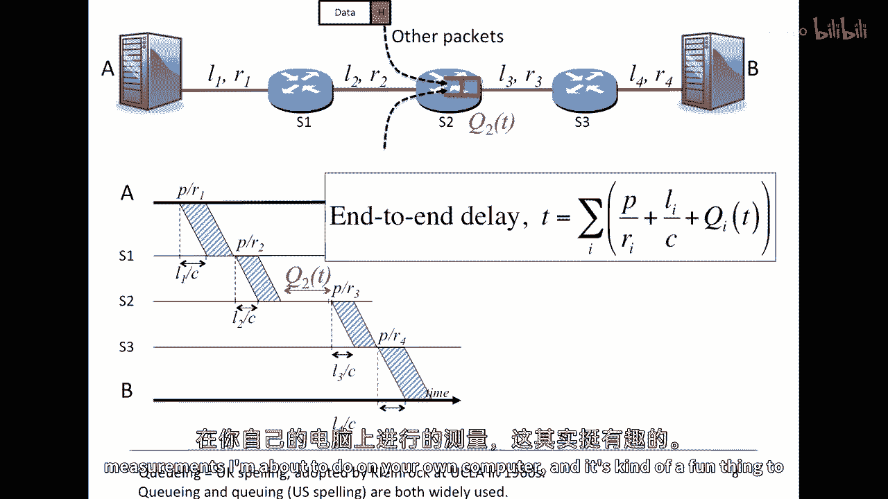

# P41：p40 3-3Packet Switching - Principles Terminology End to End Delay and Queueing d - 加加zero - BV1qotgeXE8D

在第一个关于分组交换的视频中，我告诉了你分组交换是什么，以及它为什么被用于互联网，分组交换将在整个课程中占据非常重要的地位，所以我们将花费相当多的时间来研究它，互联网的许多属性都直接来自分组交换的选择。

在这个视频中，我将给你一些关于传播延迟和打包延迟的有用定义，我们将使用这些定义来推导出一个表达式，一个包在网络中从源到目的地的总延迟，我还将告诉你关于队列延迟的信息。

那么它如何使端到端的延迟变得不可预测，那么让我们从一些有用的定义开始，我们将从传播延迟的定义开始，所以传播延迟是信息在一个链路上以传播速度旅行的时间，C 所以看看这个图片，你会看到我们有。

嗯 左边的电脑，我们将考虑一个比特从左边到右边所需的时间，那个时间就是传播延迟或t sub l，它仅仅是l除以c，从那个在左边的到在右边的，那个时间就是传播延迟或t sub l。

所以传播延迟仅仅由链路的长度l在我们的情况下决定，以及一个比特旅行的速度，C我们在感兴趣的大多数链接中都使用变量c，因为c或传播速度非常接近光速，例如，在双绞线电缆中，一个比特以大约光速的70%传播。

然后光纤，传播速度稍微慢一点，在我们的大多数例子中，我们将假设比特以每秒两亿米传播，哪个是哪个已经足够接近，它们开始传播，这里有沿着链路传播的比特，我们再来看看那个，所以，它是在。

或者它需要花费多长时间才能通过链路传播，所以，例如，如果我们在考虑时间，在光纤中，旅行一千公里或一亿米需要一些时间，在那里，传播速度是每秒两亿米，那么t sub l是一千亿，除以每秒两亿米或五毫秒。

稍微，我们将看看一些例子，并且在视频中嵌入的多选题目中，你将做一些例子，请注意，传播延迟不取决于链路的数据率，没关系，如果链路以每秒一千比特运行，或者每秒10吉比特。

"传播延迟仅取决于每个比特的传播速度"，"并且电缆的长度"，另一个有用的定义是分组延迟，"这是数据包第一个比特被放入链路的时间"，"直到最后一块被链接上"，"让我们来看看这里的一个例子"，所以。

看见那个正在向链接发送的包了吗，将所有比特放入链接所需的时间，"这将取决于我们放在链接上的位数"，并且它们之间的距离，或者是每秒钟我们可以将位传输到链路的数量，所以本质上。

一个链路的数据率由我们如何紧密地打包位决定，例如，如果，一个链路以每秒一吉比特的速度运行，我们可以将其传输为，我们可以将一个位传输到链路，在后续关于物理链路的视频中，我们将看到每秒钟可以看到一个位。

实际上限制链路数据率的是什么，所以打包延迟由我们如何快地将位传输到链路决定，或者是数据率，如果链接的传输速度为每秒一千比特，我们每秒可以向链接添加一千个新比特，如果它的传输速度为每秒十亿比特。

那么我们每秒可以向链接添加十亿个比特，他们看了几个例子，如果我们有一个大小为六十四字节的包，它是五百十二比特，那么它将在一百兆比特每秒的链接上花费五点一微秒进行传输。

为什么t sub p等于p over r，所以p在我们的情况下是六十四乘以八，因此，p的值为512，五百十二除以r和r就是十的六次方，另一个例子，一兆比特包需要一点零二四秒来传输。

传输到一个每秒一兆比特的链接上，所以这从哪来，一点零，二四来自哪里呢，这是一个在这里非常有用的例子，因为每秒一兆比特，对不起，我们看到的千比特包，当我们测量包或内存中的位数时，千比特等于一千位，千比特。

正如你知道的，是一千二百二十四，或者二的十次方，这就是为什么我们有一点，零到四秒，以便将其传输到每秒千比特的链接上，所以在这种情况下有些混淆，每秒千比特意味着每秒一千位。

而包中的千比特是一千二百二十四位，这是网络通信中的标准，然后我们将看到这种情况一再发生，所以请注意，打包延迟仅取决于包的长度，那就是p，在这里，以及我们每秒可以向链路或我们的比特/秒添加多少比特。

它们对结果没有任何影响，链路的长度或比特在其中传播的速度，所以接下来，我们将看到如何使用我们两种不同类型的延迟，来确定总体的端到端延迟，那就是包从源到目的地所需的时间，所以。

端到端延迟是从我们发送第一个比特在第一个链路时开始，直到最后一个包的比特到达目的地的时间，所以，端到端延迟是从我们发送第一个比特在第一个链路时开始，直到最后一个包的比特到达目的地的时间，那就是在这里。

直到最后一个包的比特到达目的地的b，所以，我们可以计算端到端延迟，通过在每个链路上添加传播和打包延迟，那就是，我们可以看那些，我们之前计算过的数字，包从第一个比特到第一个比特被发送所需的时间。

直到最后一个比特到达这个链路这里，然后我们可以将它添加到这里的时间，在这里和这里，所以在我们的情况下，这取决于第一个链路的长度，以及它运行的速度，然后我们可以使用我们的表达式来计算端到端延迟。

我们将得到一个看起来像这样的表达式，端到端延迟t等于所有第一个的，嗯，这里的延迟，这是打包，延迟，将包放入链路的时间，以及一个比特在该链路上传播的时间，我们将所有这些相加以获得端到端延迟。

让我们看看这个在稍微详细一点，因为我认为这将变得更加清晰，所以在我们的例子中，这里，包将穿越四个链路，所以我们将在路径上的每个链路上重复这个过程，它将看起来像这样，这里，我们更详细地看。

由于拉伸了在交换机中的链路并删除了其余的网络以使其更清晰，这里是一个，嗯，一个时间线，嗯，一个时间线，时间从左到右增加，将显示比特如何传播，并且整个数据包从a到b是如何传播的。

所以第一个比特需要l1过c的时间，那是第一个链路的长度除以传播速度，它需要那个秒数来从a到s1传播，在这里，我们可以看到比特从这里开始，然后沿着链路传播，l1过c是时间，这是它从a到s1传播的距离。

在我们发送第一个比特后，它将需要p过r1秒，直到我们可以将数据包的最后一个比特放在链路下，所以当p过r1后，我们已经将最后一个比特放在链路下，然后在时间l1c加上p过r1时。

最后一个比特将到达交换机s1，好的，所以到这个点，当我们到达这个点时，整个包已经到达s1，所以互联网路由器被称为，存储转发设备，这意味着交换机s1，它将等待整个包到达。

直到它查找地址并决定将其发送到下一个地方，它可能开始转发包后仅看到头部，而不等待整个包到达，这就是我们所说的切通过交换，但互联网路由器通常不这样做，将在后来的视频中讨论，在一些练习中。

我们将看到切通过包交换的例子，但回到我们的例子，这是一个存储转发网络，其中每个交换机都将存储和转发包，交换机一，S1将在包完全到达后查看它，然后它将将其发送到下一个链接，它将其发送到s2，在这里。

我们可以看到包发送到uh，到s2，就像以前，第一个比特到达s2需要l2过c的时间，然后最后一个比特将在p过r2秒后到达，我们可以重复这个过程对于每个链接，直到我们到达be。

所以总体的端到端延迟表达式只是这些从端到端的和的总和，这与我们之前有过的表达式相同，好的，所以，它 turns out 我 only told you part of the story。

让我来告诉你剩下的故事，你看，关于分组交换的事情是，你的包与来自其他用户的包共享链接，当多个包同时出现时，想要使用相同的链接，你可以在这里看到，我们有来自这里的包，来自这里，我们正在处理。

也许来自进入包交换机的另一个链接，并从这里进入包交换机，来自另一个链接，所有想要前往从s2到s3的出站链接的包，当这种情况发生时，所有的包都必须为那个出站链接进行战斗或竞争，所以当几个包同时出现时。

想要使用相同的链接，在这种情况下，从s2到s3，然后一些包必须在路由器的队列中等待，看这个符号，这里有一个红色符号，这里是，我将为队列绘制的图片，有些人称之为包缓冲器，一般来说，让我们说。

先来先服务队列，在其中，包将按照它们到达的顺序离开，我们将说，从s2到s3的链接拥堵，因为有许多包在队列中等待要穿越它，包缓冲器帮助我们避免丢失任何包，缓冲器越大。

我们越不可能不得不丢弃想要穿越链接的包，所以这些包缓冲器将存在于所有交换机中，每个包交换机都有缓冲器，它们是包交换的基础，如果我们没有包缓冲器，那么我们每次有两个包同时出现时都会丢失一个包。

想要穿越链接，所以包缓冲器是我们的朋友，但是，包缓冲器本身将改变我们对端到端延迟的表达，如果我们的包到达并且队列中有一些包，那么它将延迟它可以被转发到下一个链接的时间，因为它可以对前面的包有一个权重。

以便在我们自己的包到达之前离开，所以我已经显示了这里是q2的t，意味着它跨越从s2的链接，我已经说过它是q2的t，因为它将随时间变化，它将取决于其他用户从其他链接出现的包数量，如果前面有3个包。

我们将等待3个打包延迟，在我们自己可以离开之前，我已经在这个队列中展示了，当然，这可以在所有沿途的交换机中发生，嗯，只是使图表变得更加复杂，所以我只在q2中展示了。

所以现在我们的端到端延迟有了第三个组成部分，它包含，我们看到的打包延迟，那就是p over r sub i，然后它包含通过链接的传播延迟，然后它有这个新的表达式，Q i of t，这是包在队列中的延迟。

等待其他包，这可能为零，如果没有其他包，当然，但一般来说它会是一些非确定性的值，因为我们不知道同时发送包的人是谁，所以这里最重要的一点一切都是确定的，除了排队延迟。

P over r sub i li over c，他们都是确定性的，它是qi sub q i of t 排队延迟，那就是可变部分，并且为了说服你实际上，那里存在不确定性，我将在下一刻展示一个例子。

最后一件事，所以你可能已经注意到，嗯，我用的是英国的排队拼写方式，这并不是因为我是英国人，但在谈论互联网时，使用'q'拼写排队是很常见的，'ueuei'似乎有太多的元音，我知道。

但这是kleinrock采用的惯例，他是二十世纪六十年代的互联网先驱和发明者之一，但你会看到英国和美国都使用这两种拼写，这是完全可以的，所以总的来说，这是我们对端到端延迟的总体表达，它考虑到了。

沿途每个包交换机的排队延迟，请记住，排队延迟是不确定的，它取决于网络中其他用户发送的流量，就我们所知，排队延迟是一个随机变量，它是我们端到端延迟表达式中唯一的随机变量，其他所有东西都是确定的，所以。

如果你不相信端到端延迟是不确定的，我们将测量它，我将使用一种非常广泛使用的工具，叫做png，来测量我从计算机到互联网上其他计算机的端到端延迟，Ping将测量这个端到端延迟，实际上，它将测量往返时间。

这是端到端，它是双向端到端延迟的总和，你在计算机上会发现ping命令，并且你可以使用它来重复我正在您自己的计算机上要做的测量。

这是一种有趣的事情可以做，我们可以通过互联网测量数据包的延迟，使用ping命令，我现在要向您展示ping命令的示例，所以我要从我的电脑上ping到，嗯，普林斯顿点edu。

普林斯顿是美国新泽西州的一所大学，它离我大约有四千公里或两千五百英里，当我这样做时，您在右侧可以看到，它正在显示给我，它正在显示我发送到普林斯顿并返回的包所需的时间，让我们看看是否能够突出显示这些。

所以如果你看到这样，这些是包去那里和回来所需的时间，所以那些数字大约是一百毫秒，对应于包所需的时间，以往返时间为单位去那里和回来，让我们看看这与通过ping说相比如何，嗯。

让我们尝试北京大学在um的大学，在中国北京。

所以，我们将看到那离我更远，那大约离我有十万公里，或者大约六千英里，你可以看到，ping时间大大增加，所以，如果我可以只是突出那些，我们可以看到那里的ping值大约是两百毫秒。

所以我使用ping来测量从我电脑上的几百个rtt值，从斯坦福到普林斯顿，正如我之前所说，它大约有四千公里或两千五百英里远，图表显示了cdf，那是我为所测量的值计算的累积分布函数，所以0%。

这意味着没有任何值低于这里的值，大约是一百毫秒，并且100%的值都小于，让我们说，三百毫秒，在这个图表上很难看出，所以这显示了，范围，并且还有，嗯，这个，这个变化量，这个，我测量到的值。

并且总体方差大约是嗯，变化量大约是五十毫秒，并且，百分之九十的样本落在一百到一百二十毫秒之间，现在，让我们看看当我重复这个实验时发生了什么，从斯坦福大学到清华大学，这是中国北京的一所大学，它离得很远。

大约有十万公里远或六千英里远，正如我所预期，RTT值大大增加，因为传播延迟大大提高，但是也要注意，RTT样本的变异性大大增加，它们变化的范围更大，看看这个值在这里，这些是这个范围的值。

它们比过短的长度上的样本变化得多，从斯坦福到普林斯顿，所以这里的变化来自队列延迟，我的数据包遇到了更多的队列，更多的拥堵，更多的其他用户，当用户穿越太平洋前往中国时，其他用户的流量会增加。

我的包在那里相遇，在圆周中遇到其他包，沿途的缓冲区，因此它们被阻塞，它们需要等待更长时间，我猜可能是因为有更多跳转，在路上遇到其他人包的可能性更大，大约有200毫秒的范围，你知道在这里大约是320毫秒。

也许他们上升到大约五百二十，范围大约为二百二百毫秒，排队延迟几乎占整体端到端延迟的一半，这很高，实际上这有点，嗯，异常高，这就是我为什么把这作为示例给你看的，只是为了把观点传达清楚，总结。

"端到端的延迟由三个组件决定"，第一个是链路上的传播延迟，"这些由链路的长度和传播速度决定"，"第二个是分组延迟"，"这由包长和每个链路的数据率决定"，"第三是排队延迟"。

"这由缓冲区的拥堵和队列延迟决定"，"并且，路径上的路由器"，"这是一段关于端到端的视频结束"，"下一个视频的分组交换延迟"，我将解释这个变量的一些后果，队列延迟，特别是在实时应用中。

