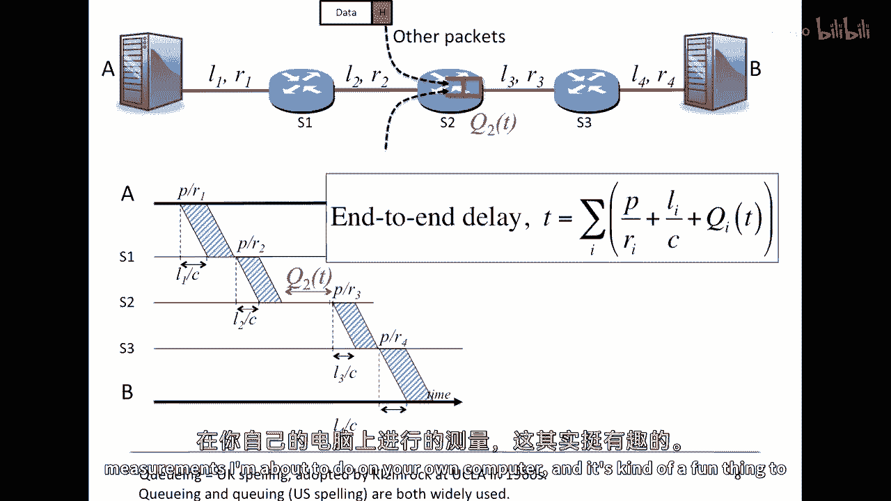
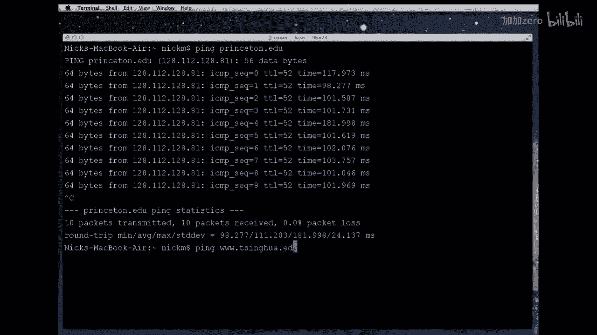
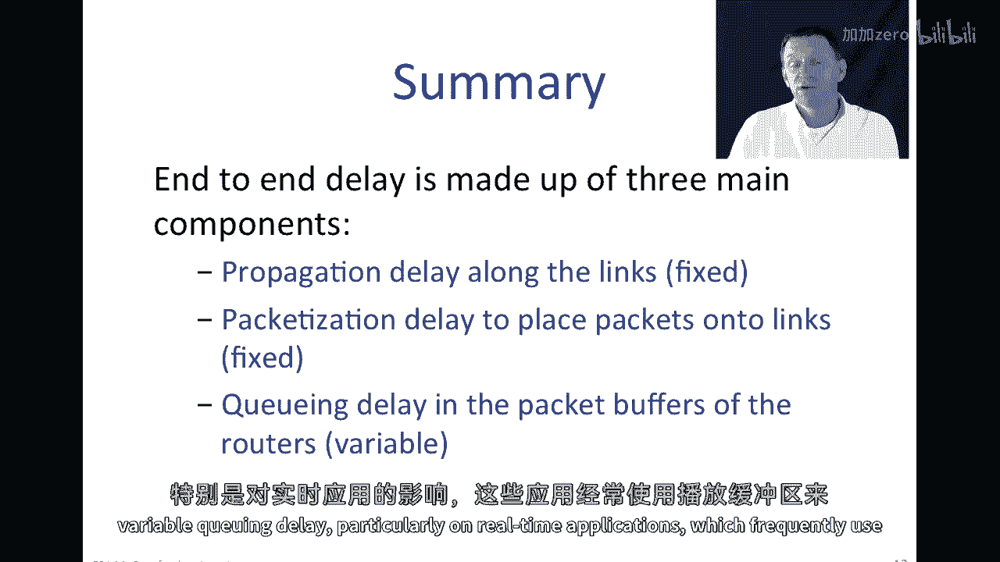

# 课程P41：分组交换原理、术语、端到端时延与排队时延 🧩

在本节课中，我们将深入学习分组交换的核心概念。我们将定义传播时延和打包时延，并推导出数据包从源到目的地的总时延表达式。此外，我们还将探讨排队时延如何影响端到端时延的可预测性。

---

## 概述

分组交换是互联网的基础。在上一节视频中，我们介绍了分组交换是什么以及它为何被用于互联网。本节中，我们将深入探讨与分组交换相关的关键术语和时延计算，特别是端到端时延的构成。

---

## 传播时延

上一节我们介绍了分组交换的基本概念，本节中我们来看看第一个关键定义：传播时延。

传播时延是指一个比特在链路上以传播速度 `c` 从一端旅行到另一端所需的时间。观察下图，左边是发送端计算机，右边是接收端。一个比特从左到右所需的时间即为传播时延 `t_l`。

传播时延 `t_l` 的计算公式为：

**`t_l = l / c`**

其中：
*   `l` 是链路的长度（单位：米）。
*   `c` 是传播速度（单位：米/秒）。

传播速度 `c` 通常接近光速。例如，在双绞线中，比特以约光速的70%传播；在光纤中则稍慢。在大多数计算中，我们假设 `c = 2 × 10^8` 米/秒。

**请注意**：传播时延仅取决于链路的物理长度和比特的传播速度，与链路的数据率无关。无论链路速率是1 Kbps还是10 Gbps，传播时延都相同。

**示例**：假设光纤长度为1000公里（`1 × 10^6` 米），传播速度 `c = 2 × 10^8` 米/秒。则传播时延为：
`t_l = (1 × 10^6) / (2 × 10^8) = 0.005` 秒，即5毫秒。

---

## 打包时延

理解了信号在介质中传播需要时间后，接下来我们看看将数据“装入”链路需要多长时间，这就是打包时延。

打包时延是指将数据包的第一个比特放入链路开始，到最后一个比特也被放入链路为止所花费的时间。

打包时延 `t_p` 的计算公式为：

**`t_p = p / r`**

其中：
*   `p` 是数据包的比特长度（单位：比特）。
*   `r` 是链路的数据率（单位：比特/秒）。

数据率 `r` 决定了我们向链路“注入”比特的速度。速率越高，打包时延越短。

**请注意**：打包时延仅取决于数据包的长度和链路的数据率，与链路的长度或传播速度无关。

以下是两个计算示例：

1.  **示例一**：一个64字节（512比特）的数据包，在100 Mbps（`1 × 10^8` bps）的链路上传输。
    `t_p = 512 / (1 × 10^8) = 5.12 × 10^{-6}` 秒，即5.12微秒。

2.  **示例二**：一个1 Kibibit（1024比特）的数据包，在1 Kbps（1000 bps）的链路上传输。
    `t_p = 1024 / 1000 = 1.024` 秒。
    *这里需要注意单位：网络通信中，数据包大小的“Kibit”通常指1024比特（2^10），而链路速率的“Kbps”通常指1000比特/秒。*

---

## 端到端时延

现在我们已经掌握了两种基本时延，本节我们将学习如何计算一个数据包从源主机到目的主机的总时间，即端到端时延。

端到端时延是指从源主机在第一条链路上发送数据包的**第一个比特**开始，到目的主机接收到数据包的**最后一个比特**为止所经历的总时间。

在由多个存储转发路由器（交换机）构成的路径上，总时延是路径上每一段链路（或称“跳”）的时延之和。对于每一跳 `i`，其贡献的时延包括：
1.  在该链路上的打包时延 `p / r_i`。
2.  在该链路上的传播时延 `l_i / c`。

因此，不考虑排队时延的端到端时延 `T` 的表达式为：

**`T = Σ (p / r_i + l_i / c)`**，对路径上的所有链路 `i` 求和。

让我们通过一个时间线图来详细理解这个过程。假设数据包从A经过交换机S1、S2到达B，穿越了三条链路：
*   **第一跳 (A -> S1)**：
    *   第一个比特需要 `l1 / c` 时间到达S1。
    *   在 `p / r1` 时间后，最后一个比特被放入链路。
    *   在时间 `l1/c + p/r1`，整个数据包到达S1。S1作为存储转发设备，需要等待整个包到达后才开始处理并转发。
*   **第二跳 (S1 -> S2)**：
    *   重复类似过程。第一个比特需要 `l2 / c` 时间从S1到达S2。
    *   最后一个比特在 `p / r2` 时间后到达S2。
*   **第三跳 (S2 -> B)**：
    *   过程同上。

将每一跳的时延相加，就得到了总端到端时延。

---

## 排队时延

然而，上面的故事并不完整。在分组交换网络中，链路是被多个用户的数据包共享的。这就引入了端到端时延中的第三个，也是唯一不确定的组成部分：排队时延。

当多个数据包同时到达一个路由器，并希望使用同一个出站链路时，它们必须进行“竞争”。路由器内部设有包缓冲区（或队列）。数据包按照先到先服务的原则在队列中等待链路空闲。

排队时延 `Q_i(t)` 是指数据包在路由器 `i` 的队列中等待被转发的时间。这个时间值 `t` 表示它是一个随时间变化的量。

*   **缓冲区的作用**：缓冲区可以避免在链路拥塞时立即丢弃数据包。缓冲区越大，丢包的可能性越低。
*   **排队时延的特性**：排队时延是**不确定的**（非确定性的）。它取决于同一时刻网络中有多少其他用户也在发送数据，以及他们的流量模式。如果队列前面有N个包，你的包就需要等待大约 `N * (p / r)` 的时间。

因此，包含排队时延的、更完整的端到端时延表达式为：

**`T = Σ (p / r_i + l_i / c + Q_i(t))`**

在这个表达式中，只有 `Q_i(t)` 是随机变量，其他部分（打包时延和传播时延）都是确定的。

---

## 时延测量实例

为了让你确信端到端时延确实存在不确定性，我们可以进行实际测量。一个广泛使用的工具是 `ping` 命令，它测量的是往返时延（RTT），即数据包从源到目的地再返回源的总时间，这大致是单向端到端时延的两倍。

以下是两个测量示例：
1.  **从斯坦福到普林斯顿大学（约4000公里）**：
    *   RTT值大约在100毫秒左右。
    *   测量值的波动范围（方差）较小，约90%的样本落在100-120毫秒之间。这表明路径相对稳定，排队时延影响较小。
2.  **从斯坦福到清华大学（约10000公里）**：
    *   RTT值显著增加，大约在200毫秒以上，这是因为传播距离大大增加。
    *   **关键发现**：RTT样本的**变异性**（波动范围）急剧增大，可达200毫秒。这是因为数据包在更长的路径上经过更多路由器，遇到其他用户流量和网络拥塞的可能性更高，从而导致排队时延变化巨大。在这个例子中，排队时延几乎占了总时延的一半。

这些测量直观地展示了排队时延如何成为端到端时延中不可预测且有时占主导地位的部分。

---

## 总结

本节课中，我们一起学习了分组交换网络中端到端时延的三个决定性组成部分：

1.  **传播时延**：由链路物理长度 `l` 和传播速度 `c` 决定，计算公式为 `t_l = l / c`。
2.  **打包时延**：由数据包长度 `p` 和链路数据率 `r` 决定，计算公式为 `t_p = p / r`。
3.  **排队时延**：由路径上路由器缓冲区的拥塞程度决定，记为 `Q_i(t)`，它是端到端时延中唯一不确定的随机变量。

完整的端到端时延表达式为：**`T = Σ (p / r_i + l_i / c + Q_i(t))`**。

排队时延的不确定性对实时应用（如语音、视频通话）有重要影响，我们将在下一个视频中探讨其后果。