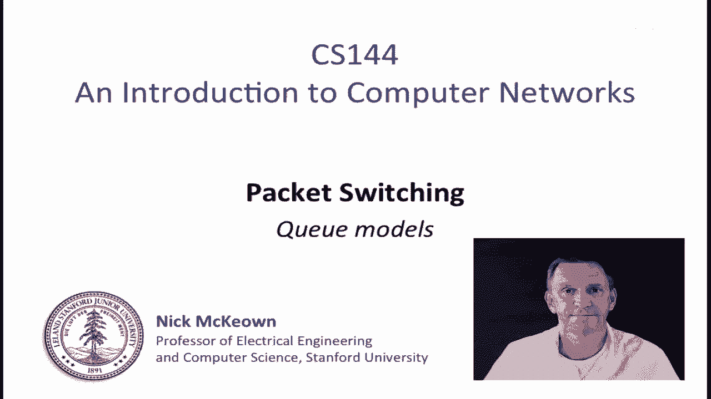
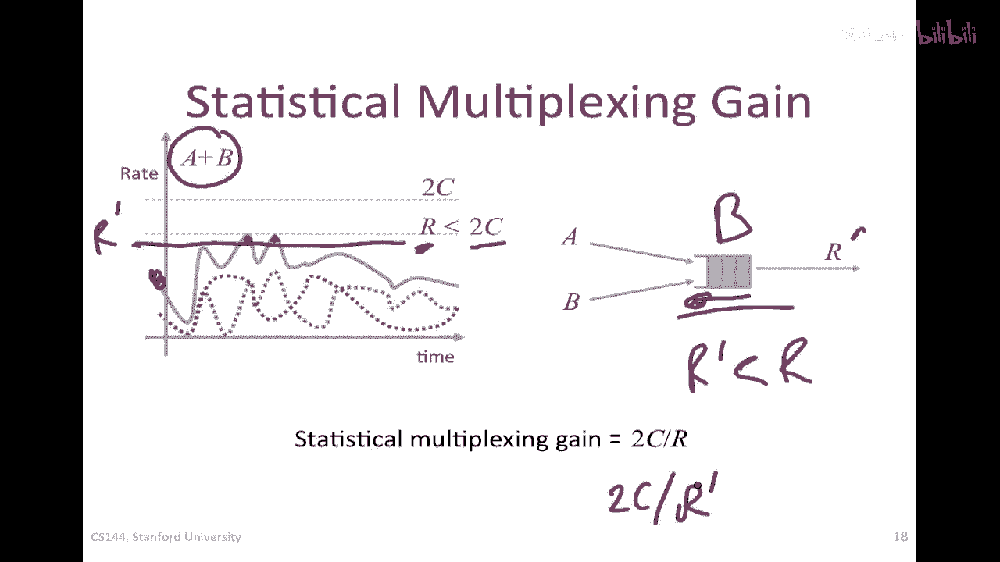
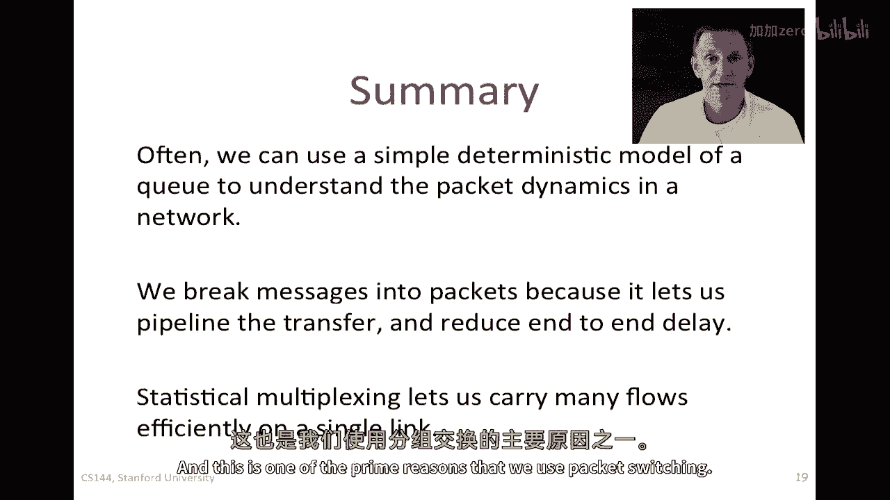

# P43：p42 3-5 Packet Switching - Principles Simple Deterministic Queue Model (revised) - 加加zero - BV1qotgeXE8D

本视频是关于分组交换的继续，在本视频中，我将谈论几种不同的队列模型。

我将从描述一个简单的确定性队列模型开始，这将帮助我们理解许多简单的队列系统的动态，它经常作为理解网络发生了什么的一种好方法，这里是一个路由器，正如我们已经知道，路由器在接口上必须有队列，在拥塞期间。

整个包，这就是队列延迟变异性发生的地方，如果我们能理解动态，即使只是粗略地理解那个队列的动态，真的很有助于我们理解端到端的队列延迟和网络的动态，所以我们将更详细地研究这个，我们将创建一个简单的模型。

这是队列的主要特征，我将这样画一个队列，这是绘制队列的标准方式，显示包将被存储的地方，嗯，在那个路由器队列中，这是一个四端口路由器，所以包可以从任何接口进入那个队列，然后它们将从输出链接离开。

我们将说那个 q 的占用率为 q(t)，所以到时间 t，它含有 q 个包或字节，思考聚合或累积的离开过程将是有用的，那就是所有有离开的包，或直到时间 t 的所有字节，同样，思考累积的到达也将是有用的。

直到时间 t 到达的总包数，因为输出链接通常具有确定性和固定的速率，我们将说它有一个固定的速率 r，所以它们将是我们模型的主要参数，我们也可以把队列想象成一个装满水的桶，这里是一个简单的例子，在这里。

A(t)是到时间 t 为止到达的字节数，D(t)是到时间 t 为止离开的字节数，在这个例子中，它们以固定的链路速率 r 离开，在任何一个时间点，可能有一些字节到达，但还没有离开，它们是坐在桶这里的字节。

桶的占用率将是 q(t)，这就是我们 q 的简单模型，这只是另一种思考方式，我们可以绘制这个随时间的演变，我将尝试勾勒出这可能看起来的样子，这里是我的图的轴，作为时间的函数。

我将尝试描绘这可能看起来的样子，我们将查看累计字节数，所以记住这是累积的，我将首先看到达到过程，在时间t处的a字节通常作为包的一部分到达，他们将以特定的链路到达率到达。

所以我将绘制累积到达过程可能看起来的样子，它可能看起来像任何东西，但，这是包到达的字节，这是第一个包和第二个包之间的间隔，这里有更多的字节到达间隔，这次可能是一个长间隔，然后一个新的包到达。

所以这应该是一条直线，这将是进入链接的包的到达率，这是字节的数量，让我们假设包的长度是，P第一个包的字节数，现在，让我们看看出发过程可能看起来的样子，我将尝试绘制它。

我只是要标记这个为at的累积到达过程，然后在黄色，我将尝试绘制，我将草图出出发过程可能看起来的样子，我们知道出发过程将以率和操作率r工作，在某个时间点之后，第一个包到达，让我们假设它是存储和转发模型。

这不重要，这只是为了 my 例子，在这个时间点，包已经到达，然后我们会说 okay，它将以率r出发，所以那是我的斜率那里，所以这是3，这是率r，那个包是对的，在那个点，那个包出发，什么都没有了。

所以我们要等到队列中有一个新的包，然后我们将再次以率r出发，那就是rar，等等，我们将等待整个新的包，然后它将是rar again，这可能是其中的一种演变方式，这里的重点是不是这种图的特定形状。

但是说你可以很容易地绘制到达和出发过程，以及这个，嗯，这种系统的一种有趣特性是，我们可以立即从这个中告诉一些系统的一些 nice 特性，首先，我们可以立即知道t时刻q的值是多少，因为任何时刻。

所以如果我们选择特定的时间，Q of t是到达的字节数，但还没有离开，所以它只是d of t减去a of t，抱歉，a of t减去d of t，所以它是到达的数，减去那些已经离开的，例如。

如果我们在这里画一条线到那里，所以是垂直的，它应该是一条垂直线，那个值就是那两个之间的距离是q of t，所以任何时间都是q的占用率，同样，如果我们看一个特定的字节到达，说在这里的时间。

如果我们假设所有字节都以相同的顺序到达并离开，那么这一口，因为它是这个特定的累积字节，我们知道它从这里离开，所以如果我们计算这两条线的水平距离，这将告诉我们d的t，我会叫它小d的t，通过q的延迟。

所以这是一个非常有用的模式，给我们一个直觉，我经常草图，"像这样的图表"，"当我试图理解队列的动态或系统的动态时"，"好的"，"然后，总结一下"，我们可以说，队列占用率等于时间t的队列长度。

"已经到达的是他们"，减去已经离开的，所以，对于这个问题的一个简洁而美好的表达方式是，"并且那个t时刻是时间t时到达的字节在队列中花费的时间"，所以这就是，这是排队所花费的时间。

在时间t到达的字节排队的时间，那就是这两条线之间的水平距离，这个假设总是认为它是先到先得或fifo，我们也说先进先出，在这个上下文中，这些有相同的含义，所以这是真的。

如果字节没有按照相同的顺序到达和离开，然后我们在这里不能关于t的d做出这个声明，因为我们不知道我们指的是同一个字节，让我们现在去看一个我们如何可能使用这一点的例子，所以，我将通过一个例子来工作。

我们将假设每秒，一个一百位的包将以一千位/秒的速率到达队列，换句话说，这个包将以一千位/秒的速率到达，并且它长度为100位，我们将假设我们的最大离队率r是我们的500位/秒。

那么问题就是队列的平均占用率是多少，所以只阅读问题，这并不是那么明显，但是如果我们按照我之前的方式绘制这个，嗯我不会尝试绘制它，因为我想让这些数字非常清楚，A(t)以红色显示，这里是到达过程。

这里是数据包到达，它是千比特的数据包以千比特/秒的速率到达，所以因此它需要十分之一秒，一秒的第一部分到达，最大出发率是每秒五百位，它更慢，所以我们的出发率d的出发，d of t。

这里的速率是那的梯度的五五百位/秒，所以那一千一百位包需要一秒的第二部分，为了出发，在之前的例子中，我作为存储转发服务进行了展示，在这里，我对每个包进行了存储转发，没有，那就是一个选择。

我只是做出了那个选择，在回答问题时，问题并不清楚它是哪种方式，现在我们可以看到q对t的时间演化，这是两个线之间的垂直垂直差异，以及单个包的延迟，但问题是队列的平均占用率是多少，很好。

让我们来看看我们如何可能解决这个问题，我将写下来，只是为了让你有一个清晰的记录，所以解决方案是这个，在每个重复的一秒钟周期中，队列将以每秒五百位元的速度填充十分之一秒，这就是我在这里的到达过程。

然后以每秒五百位元的速度排放，然后以每秒五百位元的速度排放一点一秒，在第一两个十分之一秒内，因此，队列的平均占用率是五点，一次五百，等于二十五位，队列在八分之一秒内为空，从这里到那里的每个周期，所以。

队列的平均占用率，当队列为二十五位时，Q bar of t 为点二秒，当队列为零时，为点八秒，所以，队列的平均占用率为五位，继续我们的简单确定性队列模型主题。

我想要解释为什么小的数据包可以减少端到端的延迟，延迟，你可能在疑惑为什么我们不能简单地将整个消息打包在一个数据包中，为什么我们必须将消息分解成更小的数据包，有一个非常好的原因，对于这个原因有很好的理解。

我想用端到端的方式来解释这个，延迟放在这里，我有一个长度为r的消息的例子，这个消息从端到端传递，这就是通过三个路由器的，R一R二和R三，我只是像以前那样显示，在每个链路上的延迟。

在分组化层和链路传播延迟方面，它穿越网络的过程中，我们已经知道端到端的表达式，对于这个的延迟，它仅仅是所有m over r眼睛的总和，这是分组化延迟，然后，所有链接的传播延迟之和，所以我们以前见过。

如果你看右边的那个，我们可以看到包是那样的，消息已经被分解成长度为p的包，所以我分解了同一个消息，总的来说，它的长度与以前相同，这是消息，但我只是分解成了长度为p的包。

所以第一个链接的打包延迟是p除以r，因此，端到端的延迟就是这个表达式，P over ri表示步行化，在每个链路上放置，然后i over c表示传播延迟，M over p仅仅是一个人对额外时间的表示。

到达终点的人，严格来说，应该有一个负一过p，因为它是剩余的包，我将假设m大大超过p，所以基本上就是相同的，M超过p次r的三次方，那个包组在最后一个链路上的打包延迟，但最重要的事情在这里是。

你可以看到正在发生的事情，在这种情况下，左边，整个消息都必须通过第一个链路传输，在它可以在第二个链路上开始之前，而 here，第一个包先去，然后通过第二个链路传输，当第一个链路正在携带第二个包时。

所以我们有了管道效应，我们在链路上有了并行性，因此，在很长的网络上，消息很大时，端到端的延迟将会降低，这将会产生很大的影响，因此，通过使包更小，端到端的延迟可以减少，让我们来看看这个简单的例子。

我有许多流和流，或者在来自n个外部链接的包中，所有这些都以速率r运行，有一个与路由器输出队列对应的包缓冲区，然后有一个以速率r运行的出站链接，显然，如果所有的入口链接都以满速率r运行。

那么输出链接将被淹没，我们将开始丢弃stop，开始快速丢弃数据包，实际上，将有n次r的速率进入，并且有1个速率的数据包流出，所以我们将以n-1次r的速率丢弃它们，但由于统计复用和到达的突发性。

我们可能能够承受这种情况，如果平均速率足够低，所以总的来说，我们称，在出口处我们需要的速率降低，与入口相比，是由于统计复用，我们称之为统计复用增益，我们永远不知道它会精确是多少。

因为它将取决于包到达过程的特定情况，暂时，如果对输出链有暂时的超订，缓冲器可以吸收那些短暂的时期，因此，更大的缓冲器将吸收更大的和更长的时期，当总速率恰好超过r时，但是，因为自助餐的容量有限。

总是可能出现损失，而且在分组交换中，这就是生活的事实，我们无法对此做些什么，让我们来看看几个具体的例子，例如，看看这里顶部的部分，我在这里有一个通信的到达过程a，进入这个路由器缓冲区，这个被以率c排出。

嗯，见顶部这里，我有一个嗯，一个通信到达过程a，进入这个路由器缓冲区，并且有一个正在通过路由器到达b的分支，以速率b到达，并以速率c耗尽，我在这里在左边显示，时间的流量率函数，在这里。

你可以看到峰值和谷底，谷底并不精确对齐，所以如果我们取这两个流量的一些或这两个流的和，那么我们可以预期会有一些统计复用增益，让我们看看这可能是什么，当然，我编造了这些数字，这些只是作为示例的公正的。

但如果我们在这里加上a和b，那就是a加上b的速率，那就是粉色的线，那就是这里这个，你可以看到他们的总速率，联合流量的速率r比两个c的速率要少得多，换句话说，少于两个峰值的总和，所以在这种情况下。

我们可以说统计复用增益等于r除以2c，这是我们从求和中得到的益处，他们两个实际上可以，嗯，提出一个不同的定义，有些人对统计复用增益有不同的定义，因为在这种情况下你可以看到，我们实际上没有充分利用事实。

即有一个缓冲区，我们没有使用它来缓冲任何，嗯，任何临时的，一，超过r的速率，所以，一种定义可能是对于给定的缓冲区大小b，速率的比率，我们需要防止包丢失的需求就是我们需要的统计复用增益，而且。

一般来说这将是一个较低的速率因为我们可以吸收变化，所以，例如，在这种情况下，想象如果我们以这个，这个速率r'来提供它，所以我们将那个称为我们的基本数，基本数稍微小于r，只要这里和这里的缓冲量足够。

当速率超过，r基本数可以被缓冲区容纳，那么我们就安全了，所以在这种情况下，对于大小为b的缓冲区，我们可能会说，相反，复用增益是c对r基本数的，这是一个稍微更大的数字，好的，所以统计复用增益的两个定义。

一个不考虑缓冲区的和一个考虑缓冲区的。

所以总的来说，常常我们可以使用简单的，确定性队列模型来理解网络中的数据包动态，我鼓励你们这样做，它给了一个非常直观的理解网络中正在发生的事情，我经常自己使用这个，第二。

我们学到了我们可以将消息分解为数据包，或者换句话说，我们分解消息的原因，是因为它让我们能够管道，从一端到另一端的数据包传输，并减少端到端的，延迟，最后，统计复用让我们在单个链路上高效地携带许多流。

并且这是使用分组交换的主要原因。

好的。