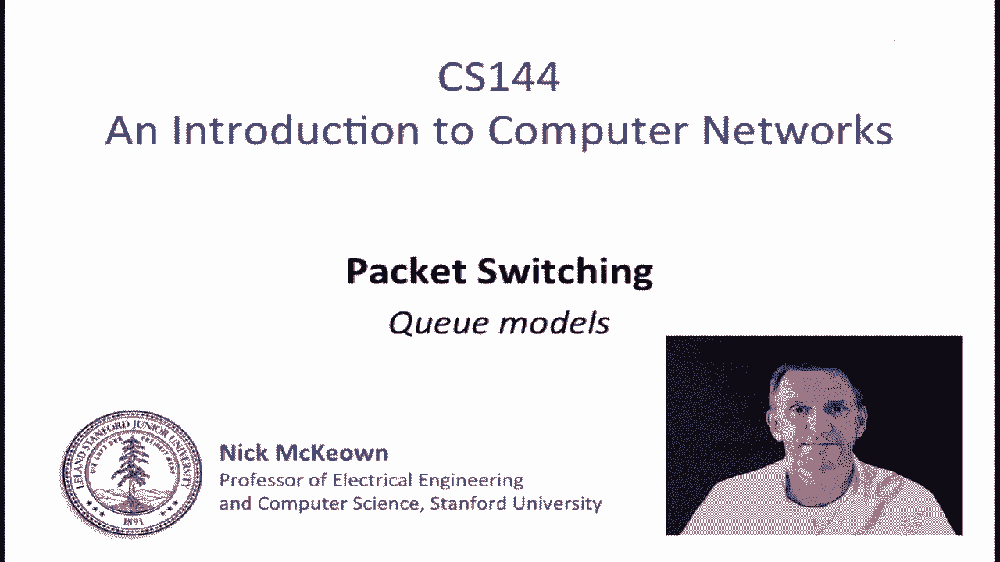
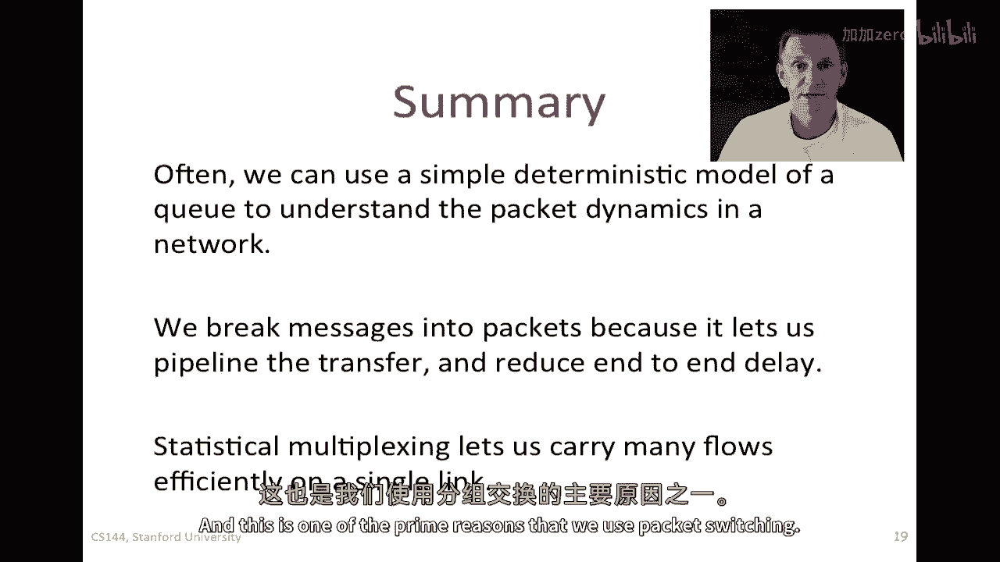

# 📦 课程 P43：分组交换原理 - 简单确定性队列模型

在本节课中，我们将继续学习分组交换，并重点探讨几种不同的队列模型。我们将从一个简单的确定性队列模型入手，理解其动态过程，并学习如何利用这种模型来分析网络中的队列延迟、数据包化对延迟的影响以及统计复用的概念。

---

## 🧠 理解队列模型：一个简单的确定性视角

上一节我们介绍了分组交换的基本概念，本节中我们来看看如何用一个简单的模型来描述路由器队列的行为。这个模型有助于我们直观理解网络拥塞时队列的动态变化。

我们可以将一个路由器的输出队列想象成一个“桶”。数据包（或字节）像水一样流入这个桶，并以一个固定的速率从桶中流出（即通过输出链路发送出去）。

*   **A(t)**：表示到时间 `t` 为止，累计到达队列的字节数。
*   **D(t)**：表示到时间 `t` 为止，累计从队列离开的字节数。
*   **r**：输出链路的固定服务速率（单位：字节/秒）。
*   **q(t)**：在时间 `t`，队列中暂存的字节数，即队列的占用率。其计算公式为：
    **q(t) = A(t) - D(t)**

通过绘制 `A(t)` 和 `D(t)` 随时间变化的累积曲线图，我们可以直观地看到：
1.  任何时刻 `t` 的队列长度 `q(t)`，就是两条曲线在 `t` 时刻的垂直距离。
2.  一个在时刻 `t` 到达的字节所经历的排队延迟 `d(t)`，就是该字节对应的 `A(t)` 和 `D(t)` 之间的水平距离（假设队列遵循先进先出 FIFO 原则）。

这个简单的图形化工具为我们分析队列行为提供了强大的直觉。

---

## 📊 应用示例：计算平均队列占用率

理解了模型的基本形式后，我们通过一个具体例子来看看如何应用它。

**问题设定：**
*   数据包以每秒 1 个的间隔到达。
*   每个数据包长度为 100 位。
*   数据包到达速率为 1000 位/秒（即发送一个包需 0.1 秒）。
*   队列的输出链路速率 `r` 为 500 位/秒。

**求解：队列的平均占用率是多少？**

**分析与解答：**
我们可以分析一个周期（1秒）内的队列行为：
1.  在第一个 0.1 秒内，数据包以 1000 位/秒的速率到达，但只能以 500 位/秒的速率离开。因此，队列在此期间以 `1000 - 500 = 500` 位/秒的速度累积。
2.  0.1 秒后，数据包到达完毕，队列开始以 500 位/秒的速度清空。清空累积的 100 位数据需要 `100 / 500 = 0.2` 秒。
3.  因此，在一个 1 秒的周期内，队列有数据的时间为 `0.1 + 0.2 = 0.3` 秒，空闲时间为 `0.7` 秒。

在队列有数据的 0.3 秒内，其占用率从 0 位线性增长到 100 位，再线性下降回 0 位。因此，**平均队列占用率**可以计算为：
`平均占用率 = (0.5 * 100位 * 0.3秒) / 1秒 = 15位`

这个例子展示了如何利用确定性模型分析队列的基本性能指标。

---

## ⏱️ 数据包化如何减少端到端延迟

在了解了单个队列的行为后，我们将视角扩展到整个网络。你可能会问，为什么要把消息拆分成多个小数据包？一个关键原因是为了降低端到端延迟。

考虑一个长度为 `M` 位的消息需要穿越多个路由器。
*   **方案A：不拆分**。整个消息作为一个大“包”发送。在第一个链路上传输时，后续链路必须等待，无法并行工作。
*   **方案B：拆分**。将消息拆分为多个长度为 `P` 位的小数据包（`P < M`）。第一个小包在第一个链路上传输后，可以立即开始在第二个链路上传输，而此时第一个链路正在传输第二个小包。

这种**流水线（管道）传输**效应，使得多个链路可以同时工作，从而显著减少了消息的端到端总延迟。尤其是在消息很长、网络路径很长的情况下，将消息分包的收益非常明显。端到端延迟的近似公式为：
`总延迟 ≈ (M/P) * (P/R1 + P/R2 + ...) + 各链路传播延迟之和`
其中 `Ri` 是第 `i` 条链路的速率。通过减小 `P`，可以增加流水线的并行度。

---

## 🔀 统计复用：共享链路的高效利用

最后，我们探讨分组交换的另一个核心优势：统计复用。它允许多个数据流高效地共享同一条物理链路。

想象一个路由器，有 `N` 条输入链路（速率均为 `r`）和一条输出链路（速率也为 `r`）。如果所有输入链路同时满速率发送，输出链路将无法处理，必然导致丢包。但现实中，数据流的到达通常是突发且不规律的。

**统计复用增益** 就来源于这种不规律性。多个流同时达到峰值的概率较低，因此它们的**总平均到达速率**可能远低于 `N * r`。只要这个平均速率低于输出链路的速率 `r`，网络就能正常处理。即使短时间内总速率超过 `r`，路由器中的**缓冲区**也可以暂时存储多余的数据包，平滑流量波动。

因此，统计复用使得我们能够用一条链路承载多个数据流，提高了链路资源的整体利用率。这是分组交换网络效率远高于传统电路交换网络的重要原因之一。

---

## 📝 课程总结

本节课我们一起学习了分组交换中的几个核心模型与概念：
1.  **简单的确定性队列模型**：我们学会了如何用累积到达/离开曲线来建模和分析队列的动态，包括计算队列长度和排队延迟。
2.  **数据包化的优势**：我们明白了将大消息拆分为小数据包可以通过流水线传输的方式，有效降低网络中的端到端延迟。
3.  **统计复用**：我们了解了多个数据流如何通过共享链路和利用缓冲区来高效地利用网络资源，这是分组交换的基石之一。

掌握这些基本原理，将帮助你更好地理解复杂网络的行为和性能。