# P44：p43 3-5a Simple Queueing Model Example - 加加zero - BV1qotgeXE8D

本视频包含了一个快速的工作示例，如果在这个短视频中你发现示例难以跟随，我将详细解释同一个示例，并问一些关于同一个示例的问题。

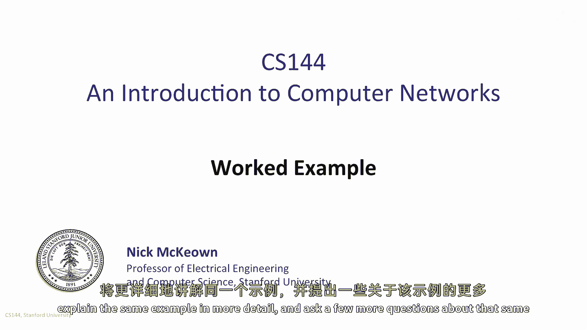

每个秒的开始都有一个问题，每秒一千位元到达一个队列。

队列的离开率是每秒五百位元，队列按位服务。

你可以假设缓冲区是无限的，队列的平均占用率是多少，累积到达和离开过程将首先看起来像这样。

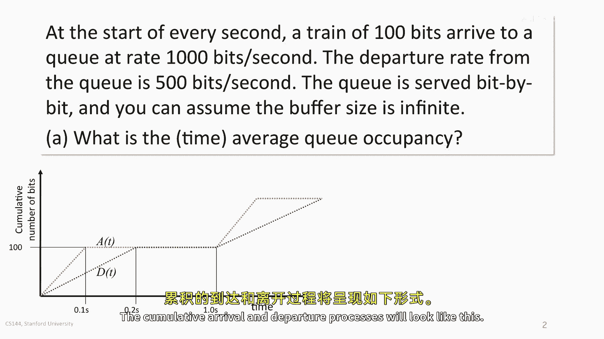

看累积到达，在第一个十分之一秒中，A of t以红色显示，每秒一千位元到达。

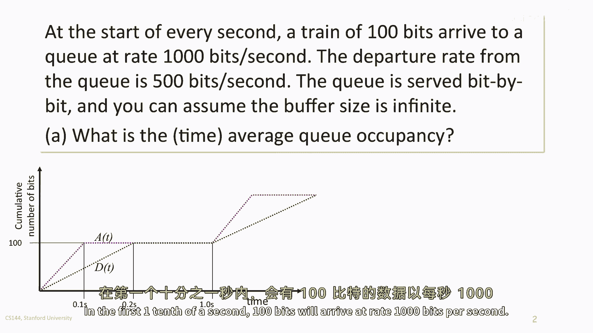

在一秒后没有更多到达。

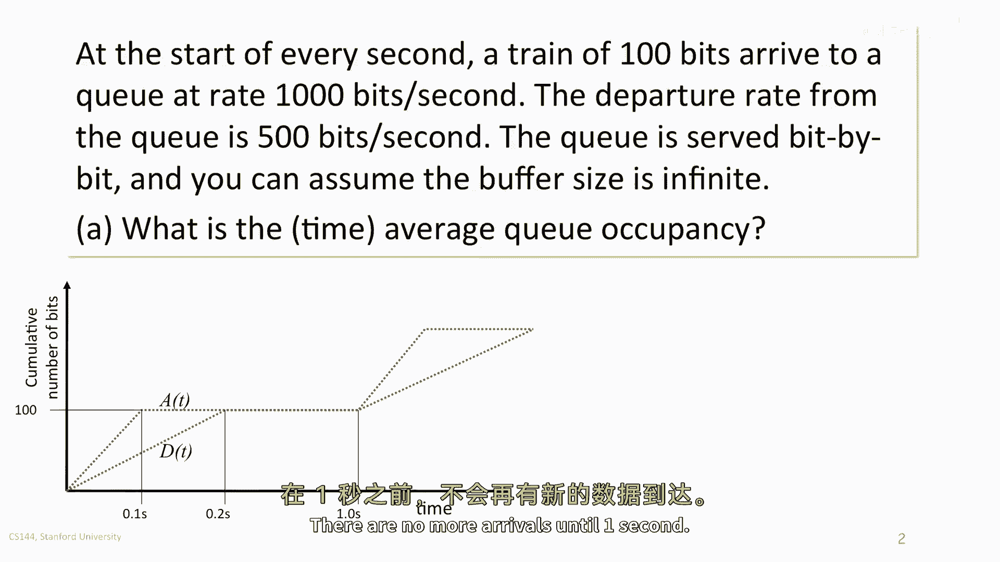

现在，新的一百位元到达，我们来看看离开过程，D of t以绿色显示，一旦第一个位元流以每秒一千位元的速度开始到达。

位元开始离开，因为问题说它们按位服务，如果我们必须等待一个完整的包到达。

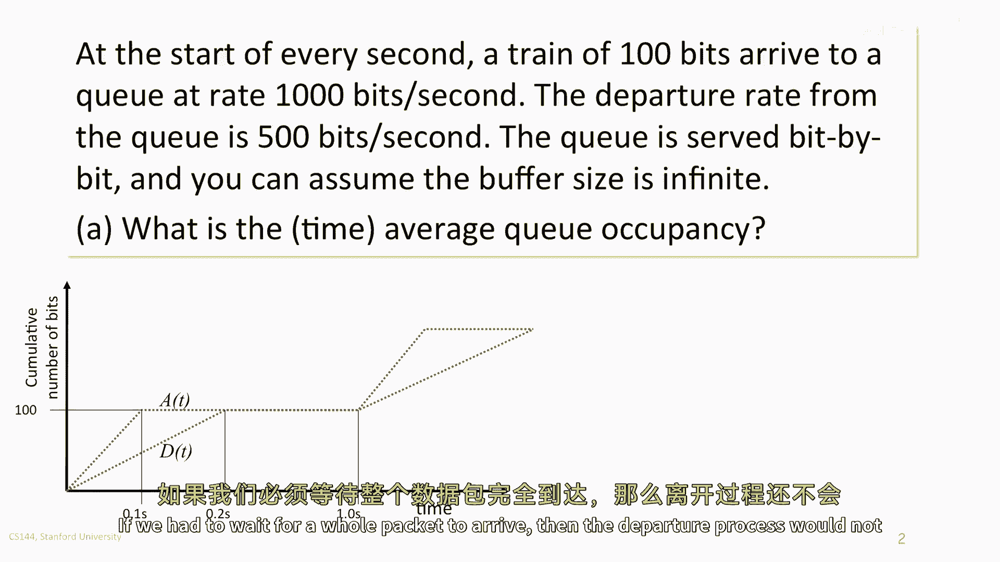

那么离开过程不会开始增加，然而，位元需要两秒钟才能离开，因为它们以每秒五百位元的速度离开，这是新位元到达率的一半，队列，因此，在点一秒后达到峰值，以回答问题。

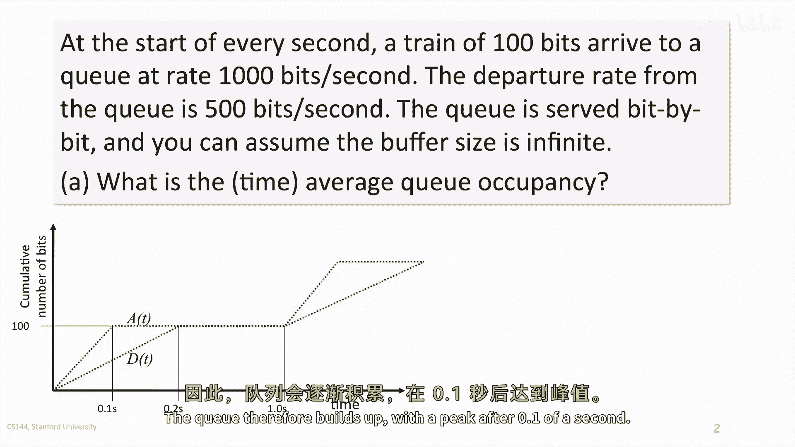

让我们看看q的占用率，Q of t作为时间的函数，队列占用率是a of t和d of t之间的垂直距离。

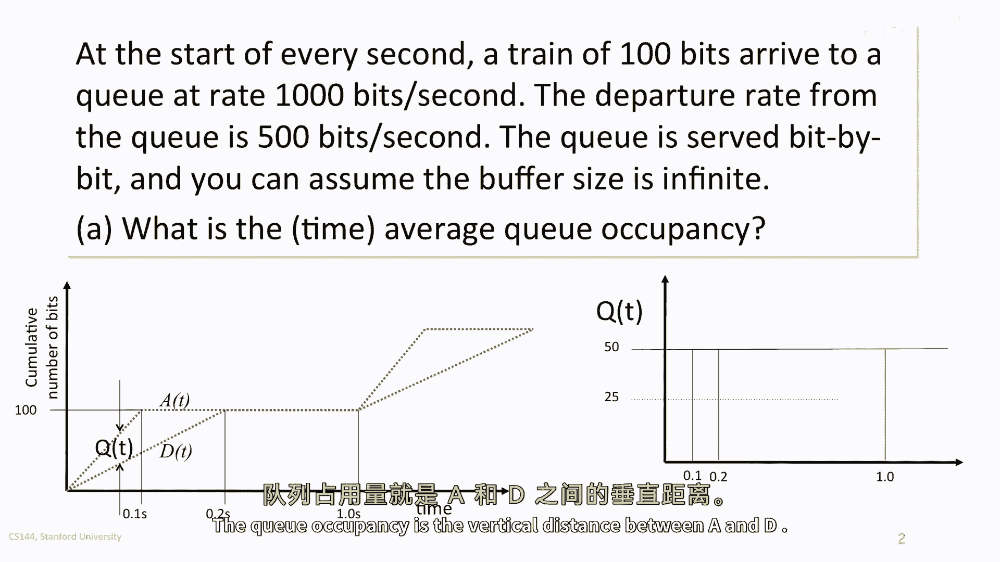

它仅仅是到达到这个点的位元数量，减去在第一点一秒期间离开的位元。

队列随着新位元的到达达到峰值为五十位元，在第一点二秒期间，平均占用率为二十五位元，从点一秒到点二秒，队列开始排空，直到它为空，所有位元都离开。

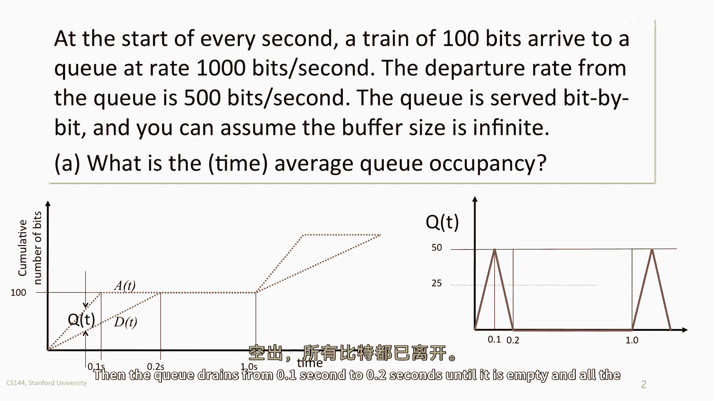

队列在八秒内为空，然后相同的过程重复，我们可以立即计算队列的时间平均占用率，它花费点二秒的平均占用率为二五位元。

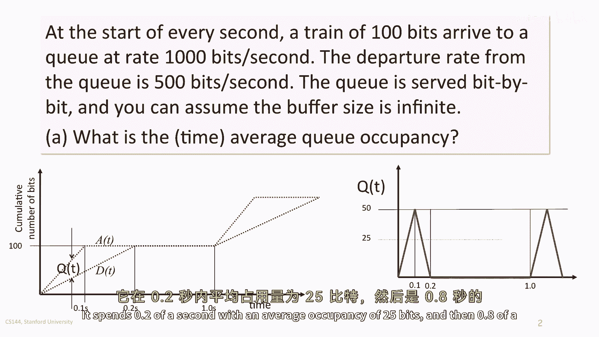

然后点八秒的占用率为零，因此，时间平均占用率为五位元，回答问题a。

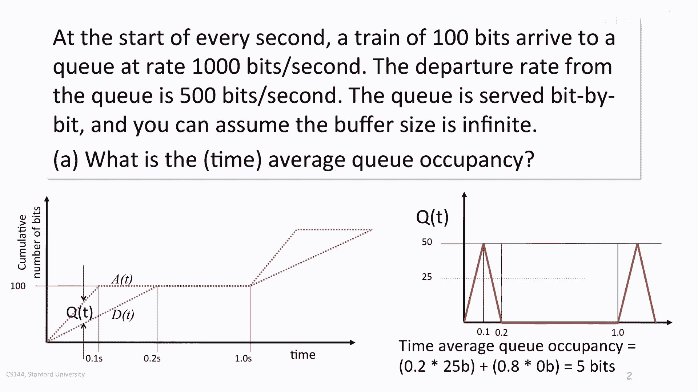

第二个问题是位元在队列中的平均延迟是多少，让我们再看一下a of t和d of t的演变，一个在时间t到达的位元的延迟是d of t - d of t，两条线之间的水平距离。

第一个在时间零到达的位元没有延迟，而一个在点一秒到达的位元经历点一秒的延迟，注意，在点一秒后没有更多位元到达，所以，考虑一个秒的第一点处的比特延迟没有任何意义，和一点零秒的第一点。

我们实际上是在条件概率上考虑一个比特到达，这只在每个秒的第一点零一中发生，因此，一个到达队列的比特看到的平均延迟仅仅是零点五秒。

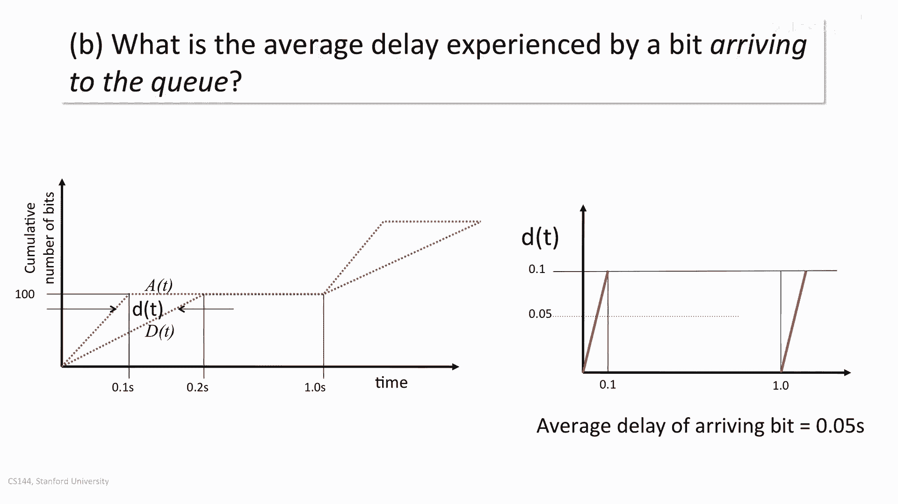

问题c仍然使用相同的线索，第三个问题是如果一百个比特的火车以随机间隔到达，平均每秒一辆火车，与部分a相比，平均密钥占用率是否会更高或更低。

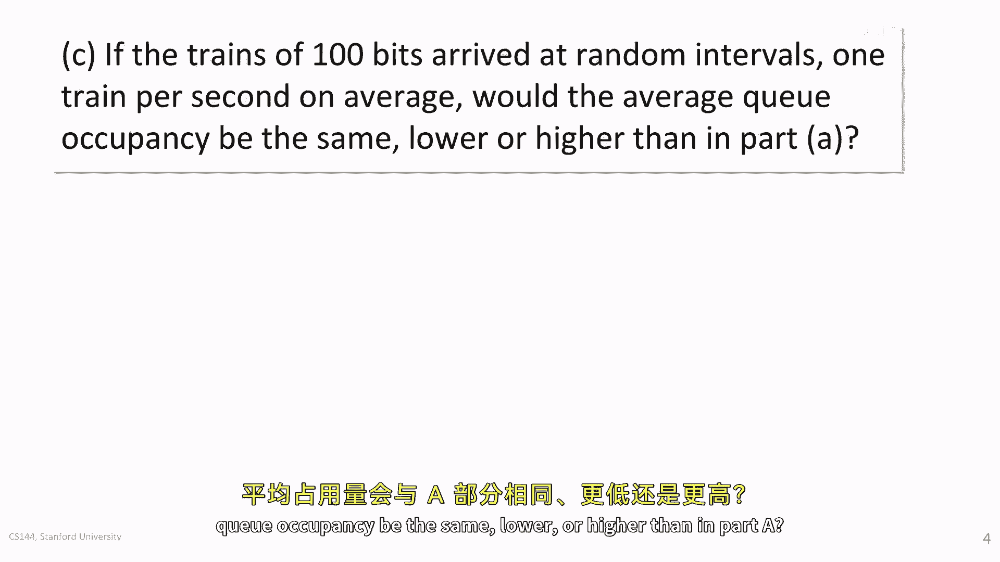

时间平均占用率将更高。

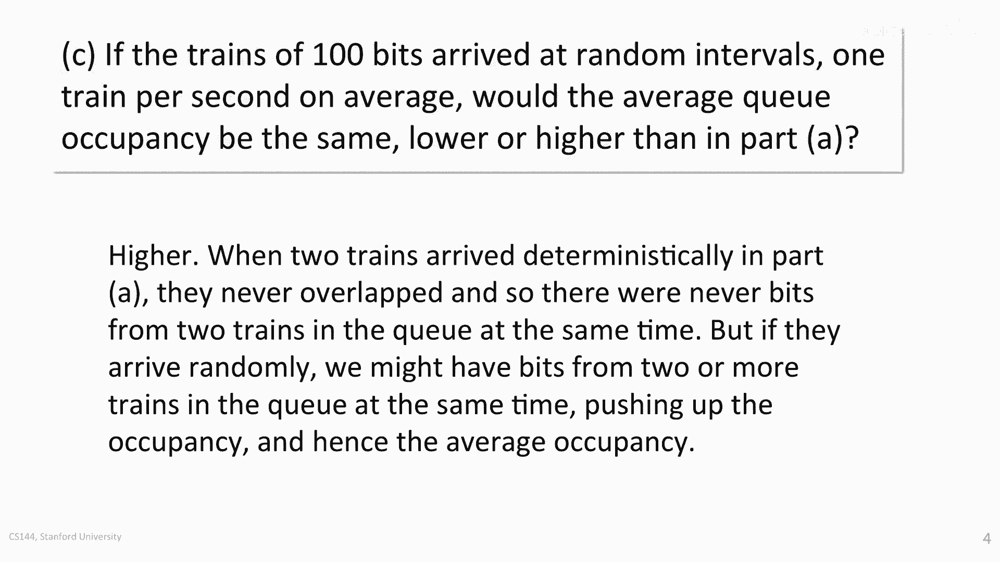

当两列火车确定到达时，在部分a中它们从未重叠，因此，队列中从未有两个火车的比特同时存在。

但如果它们随机到达。

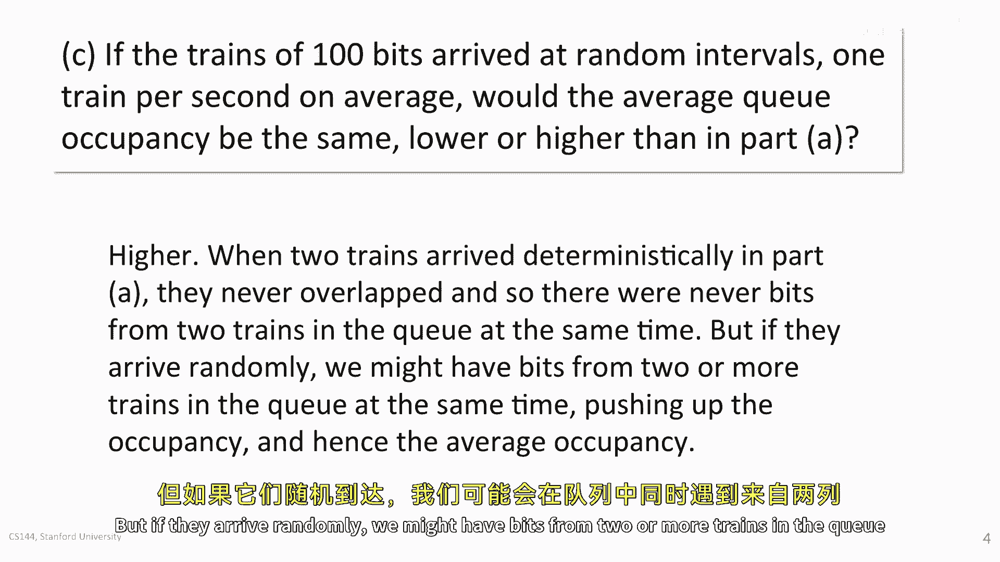

我们可能会在队列中有两个或更多的火车的比特同时存在。

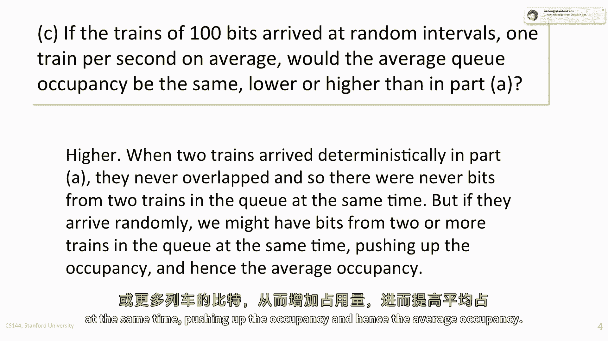

提高了占用率，因此，这可能会令人惊讶的平均占用率。

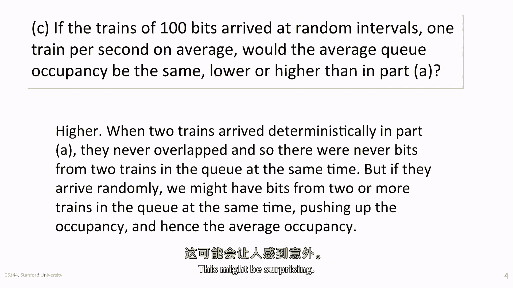

所以让我们看一个例子来了解为什么这是真的，考虑两个情况，情况一是像部分a一样，我们假设火车随机到达，但任何两列火车从未重叠，就像在部分a中它们从未重叠一样，平均队列占用率将与之前相同，这是五比特。

一旦两列火车重叠，即使只有一次，平均也会增加来看为什么，考虑这个例子，红色线显示了一辆火车的队列占用率，我们假设它到达时间零，让我们说第二列火车到达时间零，一点一秒，就在队列中有五十个比特时。

仍然来自第一辆火车，队列将继续增长，因为比特的到达速度是离开速度的两倍，队列不会排空直到四点秒，如果这种情况每两秒发生一次，到达率将与之前相同，但时间平均队列占用率现在将如下所示，对于四点秒的点。

时间平均占用率是五十比特，然后对于一点六秒，它是空的以获取时间平均，我们除以两秒，时间平均占用率是十比特，这是之前两倍，为什么这是因为队列只在五百比特每秒时排空，因此，不仅它填满了之前两倍的数量。

它也需要两倍的时间来排空三角形，显示队列非空时，有四倍之前的面积。

问题的第四部分，如果从队列中离开的位被输入到一个第二个，与第一个队列具有相同离队率的相同队列，第二个队列的平均占用率是多少，第二个队列将以每秒五百位到达，并且位将以每秒五百位离开，换句话说。

