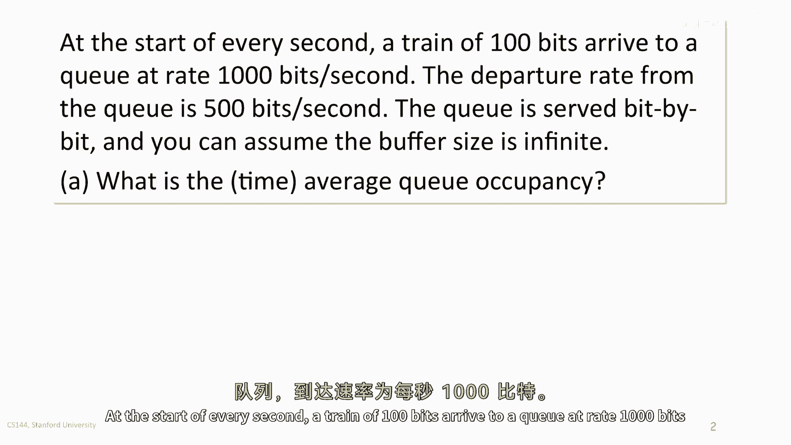

# 排队论基础教程 P44：一个简单的排队模型示例 📊

在本节课中，我们将通过一个具体的工作示例，学习排队论中的基本概念，包括队列占用率、平均延迟以及随机到达对系统的影响。我们将使用简单的数字和图表来阐明这些概念。

## 概述 📋

本教程将分析一个特定的排队场景：数据包（比特流）以特定速率到达一个队列，并以较慢的速率离开。我们将计算队列的平均占用率、比特的平均延迟，并探讨当到达模式变得随机时，系统性能会发生什么变化。

## 问题设定与参数 🔧

首先，我们明确示例中的系统参数。

以下是系统的基本设定：

*   **到达过程**：在每个“秒”的开始时刻，有100比特的数据到达队列。这意味着到达速率 `λ = 1000比特/秒`（因为100比特在0.1秒内到达）。
*   **服务过程**：队列的服务（离开）速率是 `μ = 500比特/秒`。
*   **服务规则**：数据按比特（bit-by-bit）进行服务，这意味着无需等待整个数据包到达，比特就可以开始离开。
*   **缓冲区**：假设缓冲区容量是无限的。

我们的目标是分析这个系统的行为。

## 累积到达与离开过程 📈

上一节我们设定了系统参数，本节中我们来看看累积到达过程 `A(t)` 和累积离开过程 `D(t)` 是如何随时间演变的。

以下是两个过程的演变描述：

*   在第一个0.1秒内，`A(t)` 以1000比特/秒的速率线性增长，在 `t=0.1` 秒时达到100比特。
*   在 `t=0.1` 秒后，没有新的比特到达，因此 `A(t)` 保持为100比特的水平线。
*   离开过程 `D(t)` 在比特开始到达后立即开始。由于服务速率是500比特/秒，`D(t)` 以该速率线性增长。
*   由于到达速率是离开速率的两倍，队列会开始堆积。在 `t=0.1` 秒时，到达停止，此时队列中的比特数达到最大。之后，队列开始以500比特/秒的速率排空。

## 计算队列平均占用率 🧮

了解了累积过程后，我们可以计算队列长度 `Q(t)`，它定义为 `Q(t) = A(t) - D(t)`，即任意时刻 `t` 在队列中等待的比特数量。

以下是队列占用率的计算过程：

1.  在 `0 ≤ t ≤ 0.1` 秒期间，比特持续到达。队列长度从0开始增长，在 `t=0.1` 秒时达到峰值。峰值比特数为：`100比特（到达的总比特） - 500比特/秒 * 0.1秒（离开的比特） = 50比特`。
2.  在 `0.1 ≤ t ≤ 0.2` 秒期间，没有新比特到达，队列以500比特/秒的速率排空。队列长度从50比特线性下降到0比特。此期间的平均队列长度为 `(50 + 0) / 2 = 25比特`。
3.  在 `0.2 ≤ t ≤ 1.0` 秒期间，队列为空，长度为0比特。

现在，我们计算在一个完整的1秒周期内的时间平均队列占用率。系统以25比特的平均占用率运行了0.1秒，然后以0比特的占用率运行了0.8秒。

**时间平均占用率公式**为：
`(0.1秒 * 25比特 + 0.8秒 * 0比特) / 1秒 = 2.5比特`

因此，队列的平均占用率是 **2.5比特**。

## 计算比特的平均延迟 ⏳

上一节我们计算了队列的占用情况，本节中我们来看看比特在队列中经历了多长的等待时间（延迟）。一个在时刻 `t` 到达的比特的延迟，是 `D(t)` 曲线超过 `A(t)` 曲线的水平距离。

以下是关于延迟的分析：

*   在 `t=0` 时刻到达的第一个比特无需等待，延迟为0。
*   在 `t=0.1` 时刻到达的最后一个比特，需要等待队列中它之前的所有比特被服务。由于队列中有50个比特，服务速率为500比特/秒，因此它的延迟是 `50比特 / 500比特/秒 = 0.1秒`。
*   比特的到达时间在0到0.1秒之间均匀分布。因此，所有到达比特的平均延迟是 `(0秒 + 0.1秒) / 2 = 0.05秒`。

所以，比特在队列中的平均延迟是 **0.05秒**。

## 随机到达的影响 🎲

现在，我们考虑问题的一个变体：如果100比特的“数据列车”不是定期到达，而是以随机间隔到达（平均每秒一列），那么平均队列占用率会如何变化？

结论是：**与定期到达相比，随机到达会导致更高的平均队列占用率**。

以下是原因分析：

*   在定期到达的案例中，两列数据从未在时间上重叠。前一列数据完全离开后，后一列数据才到达。这避免了队列的额外堆积。
*   在随机到达的情况下，两列数据有可能在时间上发生重叠。即，前一列数据还未离开完毕，后一列数据就已经到达。这会导致队列中同时存在来自多列数据的比特，从而使队列长度增加，排空所需的时间也更长。
*   即使重叠只是偶尔发生，它也会显著增加时间平均队列长度。因为队列“非空”的时间段变长了，并且在这些时间段内的平均队列长度也更高。

简单来说，随机性引入了“拥堵”的可能性，从而恶化了系统性能。

## 串联队列分析 ⛓️

最后，我们考虑一个两级串联队列系统：第一个队列的输出作为第二个队列的输入。第二个队列的服务速率也是500比特/秒。

以下是分析过程：

*   第一个队列的输出过程（即离开过程 `D1(t)`）的平均速率是500比特/秒。因此，第二个队列的到达过程平均速率也是 `λ2 = 500比特/秒`。
*   第二个队列的服务速率是 `μ2 = 500比特/秒`。
*   在这种情况下，平均到达速率等于平均服务速率（`λ2 = μ2`）。对于这种确定性的、规则化的到达流（经过第一个队列后，输出流被平滑了），第二个队列将不会积累比特。它的平均占用率将为 **0**。

需要注意的是，这个结论依赖于“比特按比特服务”的假设，它使得第一个队列的输出流是平滑的。如果服务是以数据包为单位的，情况会更为复杂。

## 总结 🎯

本节课中我们一起学习了一个简单的排队模型示例。

我们首先定义了系统的到达率和服务率，并通过分析累积到达和离开过程，计算出了队列的**时间平均占用率（2.5比特）**和比特的**平均延迟（0.05秒）**。随后，我们探讨了**随机到达**如何通过引入数据流重叠的可能性，导致平均队列占用率升高。最后，我们分析了一个**两级串联队列**，发现当第二个队列的到达率等于其服务率且到达流规则时，其平均占用率为零。

这个示例清晰地展示了排队论中到达过程、服务过程与系统性能（如占用率和延迟）之间的基本关系。