# P45：p44 3-6 Packet Switching - Principles Queueing Model Properties - 加加zero - BV1qotgeXE8D

在我们的视频中，我们将继续讨论分组交换的主题，我将告诉你一些关于提示符的有用参数，这些将在我们考虑队列如何演变时非常有用，一个包缓冲器如何改变以影响网络中包队列延迟。

正如我们所见，我们可以将网络视为由一些通过某些链接连接的队列组成的集合，并且那些链接正在携带来自许多，许多不同用户的流量或包，当它们被合并时，当它们统计上被合并时，那个包到达的全过程非常复杂。

所以我们通常认为到达过程是随机事件，每一个当然都是由确定地生成，但是，我们可以认为聚合是一个随机过程，所以，理解随机到达过程的队列如何工作对我们来说是有益的，所以，这就是我今天要讨论的主题，所以。

通常到达过程在像网络这样的系统中是复杂的，所以我们经常使用随机过程来建模它们，研究具有随机到达过程的队列被称为队列理论，你可能以前听说过队列理论，它以拥有非常复杂的数学而闻名。

尽管那杂乱无章的数学队列与随机到达过程有一些真的很有趣的特性，这对我们来说是有益的，它们将真正帮助我们理解网络的动态。

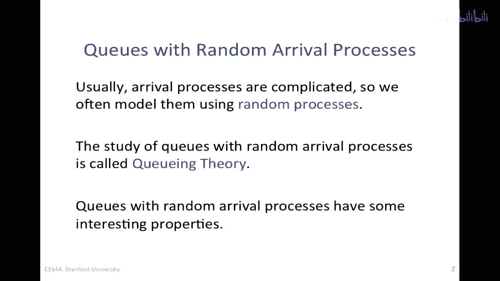

所以我要介绍一系列的特性，我将从这里开始，那就是突发性倾向于增加延迟，我希望你在这个级别记住这些参数，至于细节，数学，我们不会太担心。

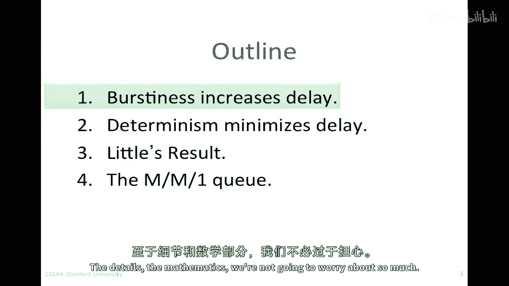

我 wonder want to understand these basic intuitive properties of queuing systems。

So it all comes down to the way that the queue evolves，So i'm going to just sketch here。

My queue again，This is the arrivals to the queue of our packets。

You'll hear people call customers as well，Because queuing theory applies to many other systems。

So if i say customers，I mean packets in this context，And so this is our arrivals，这些是我们的出发时间，我们将考虑。

队列占用率的演化，Q of t um q，在这个时间线上作为时间的函数，我在这里绘制了一系列的到达和出发，数据包到达发生在上面，这些蓝色的向下箭头代表到达的时间或时期，然后这些红色的向上箭头是出发。

队列被服务的时间，就像在网络许多提示中一样，我们，我们将把这个视为代表一个固定速率r的链接，这意味着离开的间隔机会相隔1/r，现在让我们看看，队列的演化，这里的队列有，嗯，第一个到达，蓝色的一个。

她拿起来增加到一，然后我们有服务，向上红色的箭头，它将带我们去零，有新的到达者，它将带我们回到一又再次，这里有一个出发，它将带我们去零，然后回到一又再次，然后零等，到这个点，我们已经连续有两个到达。

它将带我们回到队列，两人以上的占用率，所以这就是要成为的，队列的演化，现在，我们来看看这个这里，这个，这个离开的机会，我画这个的原因是，这是点状线，这是嗯，有时候人们叫这个阴影离开的时间。

这是我们可以设置包的离开的机会，但是队列是空的，所以实际上我们并没有发送包，因为我们实际上无法降到一个不会存在的负队列占用率，嗯，这不可能，因此队列停留在零，尽管我们错过了这个机会。

结果发现这些错过的机会相当重要，你不能有负q占用率，所以有人说你没有得到，你不因为不在这个期间到达而获得良好的行为信用，这里，这意味着关键占用率一直保持在零，但我们不会因为这个而获得信用，所以嗯。

如果我们有随机到达，且到达时间分散，如果我们错过发送机会，这很难，我们永远无法再获得那个，现在让我们来看看我想要讨论的第一个属性。

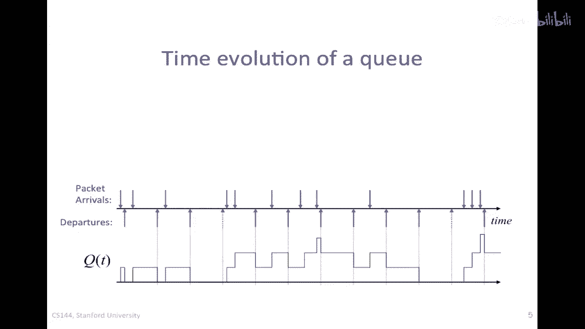

我想要解释，那就是突发性或突然的到达往往会增加延迟，我将从，嗯，以一个非常简单的例子开始，在没有突发性的情况下，我们拥有最简单的到达过程，这是一个序列的到达，所有精确地一秒钟间隔，所以这是每秒一个包。

实际上它是每秒精确地一个包，这完全没有随机性，让我们看看序列的离开出发，我将假设每秒有一个离开出发，如果我们在这里绘制队列占用率，我不会绘制图表，我只会把数字放进去，如果我们在这里采样占用率。

如果有到达但没有离开出发，所以它将有一个然后零，然后它是一个又然后零一零，所以在这里很长，我像这样绘制它，这里有很长的零期，然后短的一期，当有到达但没有离开出发时，但当然我可以移动到达或离开出发。

并使那些零和一成为不同的长度，好的，他们将继续，因为一切都很周期性，这里有一个有趣的事情要注意的是q(t)，队列占用率要么是零要么是一，所以我们可以说它总是小于或等于一。

并且平均队列占用率将位于零和一之间，我们肯定知道，只是因为问题的结构，周期性的到达使对qq演化的理解变得简单而美好，现在让我们看一个不同的例子，当事情更突然的时候，就像以前。

到达将以每秒一个包的速度进行，但它们将以突然的方式到达，实际上我们将有n个到达，我们有n个到达，n个到达每n秒，所以n个包每n秒，但它们将以这些n的突然的方式到达，在这个特定的情况下，它是每5秒5个包。

服务机会或离开出发将与以前相同，我们将有每秒一个，所以在速率上，到达率和离开的率一切都与以前相同，每秒一个包，只是到达率的突发性可能会改变一切，让我们来看看他们如何改变，他们如何改变。

所以这里我们有一个突然到来的到达量是五，所以取决于我们何时采样q或c，我们将有q(t)等于0一直延伸到5，取决于我们在这个时间段内何时采样，它是4然后3然后2然后1然后0，然后它将再次上升到5。

在这里的某个时候是4，然后如此等等，好的，所以在我们的队列占用率之前是0或1，但现在即使到达率和离开的率相同，我们的队列占用率可以介于0和5之间，所以，我们的到达平均队列占用率更高。

并且队列占用率的方差更高，因为它一直在0到5之间变化，所以，平均值和方差都增加了，尽管速率没有改变，所以显然。

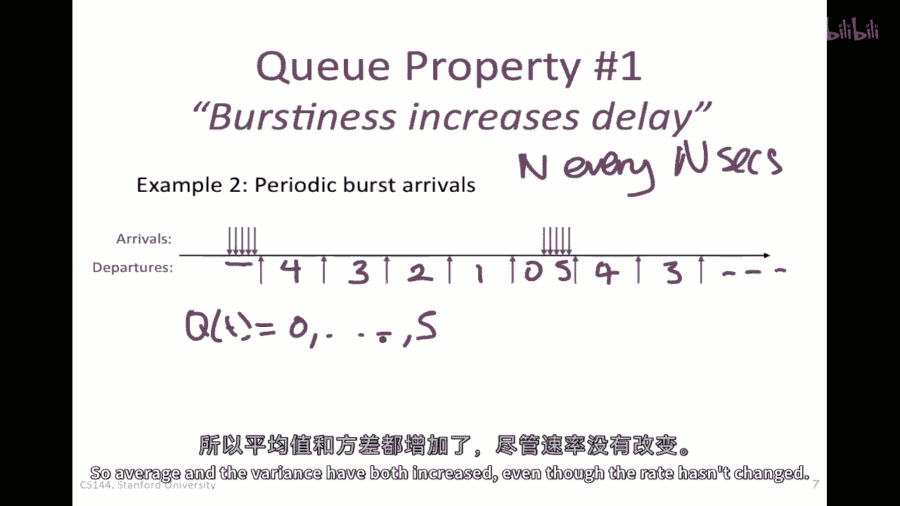

突发性将产生很大的影响，一般来说，我们称突发性增加延迟，那个简单的例子，它展示了它，它没有证明它，但希望它能给你直觉，关于为什么突发性会增加。

延迟是第二个属性，它与第一个属性非常相似，总是第一个的对立面是，确定性倾向于最小化延迟，但足够了，我们知道一般来说，确定性最小化延迟，换句话说，随机到达的平均等待时间比简单的周期性到达时间更长，好的。

让我来谈谈第三个属性。

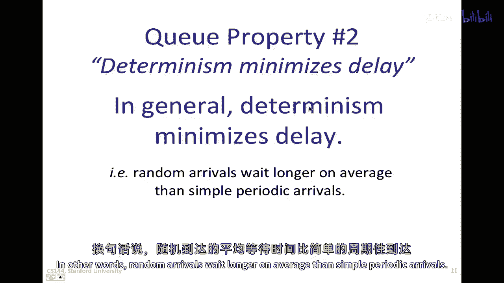

我想让你知道，那就是一个众所周知的结果，叫做小结果，Q非常复杂，嗯。

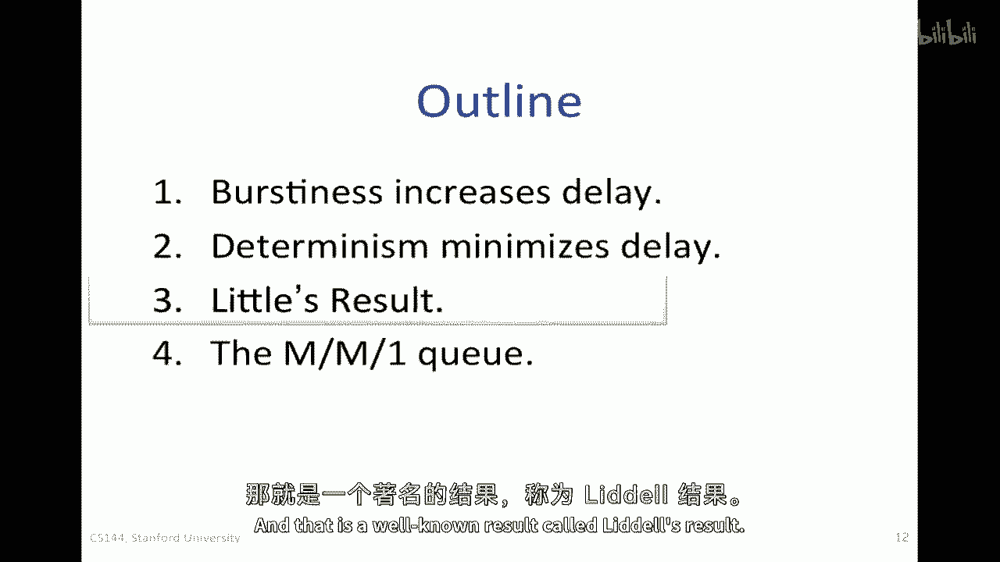

正如你已经从我那里得到的指示，数学的趋势往往会变得非常复杂，但你确实需要了解一些简单的结果，我已经给你一个暗示，数学往往会变得极其繁琐，但有一些基本的结果你真的需要了解，这对我们来说很重要。

因为我们在理解时需要它们，嗯，队列的基本属性，因此，尽管它很小，但却欺骗性地简单，所以在像这里显示的任何队列系统中，有一个属性，它是，嗯，嗯，这是有些令人惊讶的，如果我有一个明确的到达率。

让我们叫它lambda，而且我在系统中的平均提示数量是，L，我想要知道平均延迟是多少，我将称这个为，D等于客户或包在队列中的平均延迟，然后小结果告诉我们，一般来说系统中的客户数量等于。

等于平均到达率乘以，客户通过队列的平均延迟，这就是全部，这个看似简单的结果适用于任何队列系统，因此，没有丢失或脱落的客户，所以如果没有丢失或脱落，所以到达过程的形式并不重要，到达率的定义并不重要。

非到达率的定义并不重要，只要它有一个明确的到达率lambda，那么我们可以做这个计算，以便你可以去任何队列，稍后我们将看一些例子，你可以根据到达率计算队列的平均人数，并计算平均延迟，或者当然。

如果你知道l和lambda，那么，你可以计算出通过这个队列，客户看到的平均延迟，现在l是队列中的平均人数加上正在服务的人数，只要d是到达并完成服务的客户平均延迟。

我们发现这个结果也适用于如果我们说l是平均时间，抱歉，仅在队列中但不 yet 进入服务的客户平均人数，只要d也等于进入服务前队列的平均延迟，所以这两点都是真的，在接下来的季度里，我们将广泛使用这一结果。

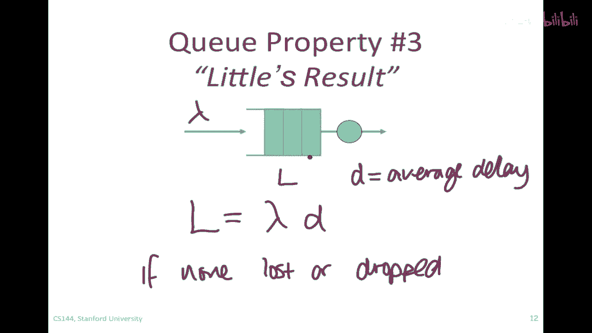

我已经向你们介绍了这三种线索的特性，在讨论第四个特性之前，我需要告诉你们一件事，那就是泊松过程，你将听到很多关于泊松过程的事情，每当你研究线索，或者是我们概率建模的任何复杂系统，好的，现在，首先。

我们将告诉你什么是泊松过程，我将告诉你为什么它有趣，以及使用时需要注意的一些事项，所以，泊松过程在我们的情况下是一个到达过程，也是一个到达过程，我们说它是泊松的，如果而且，并且只有当。

在t秒的间隔内到达k次事件的概率由这个表达式给出，一个复杂的表达式，但是，重要的是我们可以将这个表达为，在间隔t内到达的预期次数仅仅是λt，其中，λ是到达率，连续到达间隔是独立的。

这意味着一旦我们从这里选择了一个到达事件，这将导致一个到达事件发生，然后，下一个到达事件与第一个到达事件是独立的，实际上，如果我们取一个滑动窗口并将其移动到到达过程中在任何期间。

一个期间的到达间隔与下一个期间是独立的，这意味着没有突发性或一个到达事件与其他到达事件的耦合，好的，这就是泊松过程，如果你拿起任何一本概率书，那么你可以找到更详细的描述。

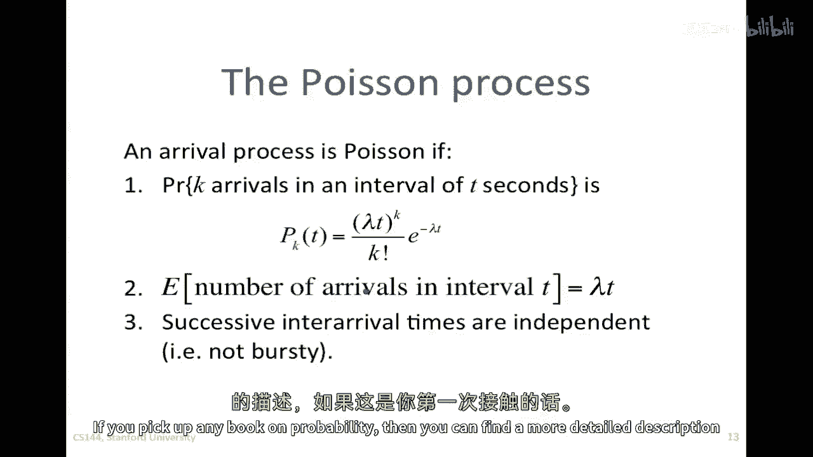

如果你对此感到新鲜，所以，为什么泊松过程，我们为什么，我们为什么对泊松过程感兴趣，嗯，泊松过程恰好能够很好地模型许多相互独立的随机事件的聚合，例如，它被用于新电话呼叫到达交换机的模型。

所以当我们有一个电话交换机，我们说，我们想要模型一天中新电话呼叫的到达，那么泊松过程是一个非常好的模型，或许多独立核粒子的衰变，嗯，我们有大量的粒子，它们独立地操作，它们会在某个时间衰变。

这种衰变为许多随机事件的聚合，倾向于泊松过程，随着粒子数量的增加，你可能也熟悉电路中的射频噪声，它也被模型为泊松过程，最后的事情，尽管前一个幻灯片上的方程很复杂，实际上，它使数学变得非常简单。

这也是它被广泛使用的一个大原因。

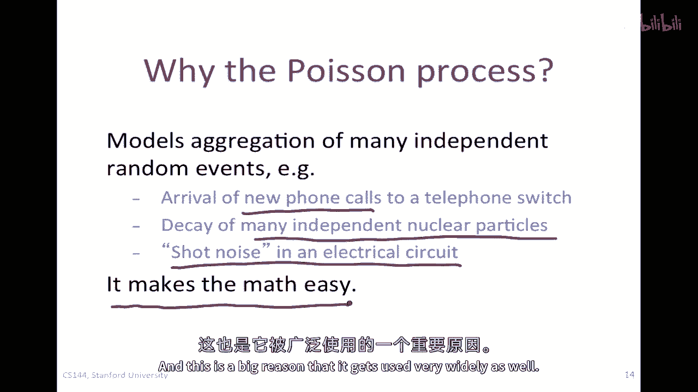

到这个时候，我应该给你一些警告，嗯，网络流量非常突发，什么都没有，一个包后的到达没有独立性，正如我们将看到的，包们非常频繁地以突发的方式到达，而且网络中许多事物实际上帮助它们保持这种状态。

使它们非常突发，所以包到达不是，而且我不能过分强调这一点，它们不是连续的，有一些经典的论文，研究论文已经证明了这一点，然而，它相当好地模型了新通信流量的到达，例如。

一个特定个体的Web请求或发送电子邮件的间隔时间，它们可能稍微连续，但当你考虑许多用户将他们的网络流量放入网络时，实际上由泊松过程建模，有时我们可以使用适用于泊松到达的某些结果。

来给我们提供一些直觉和理解，可能正在发生的事情，甚至在包级别。

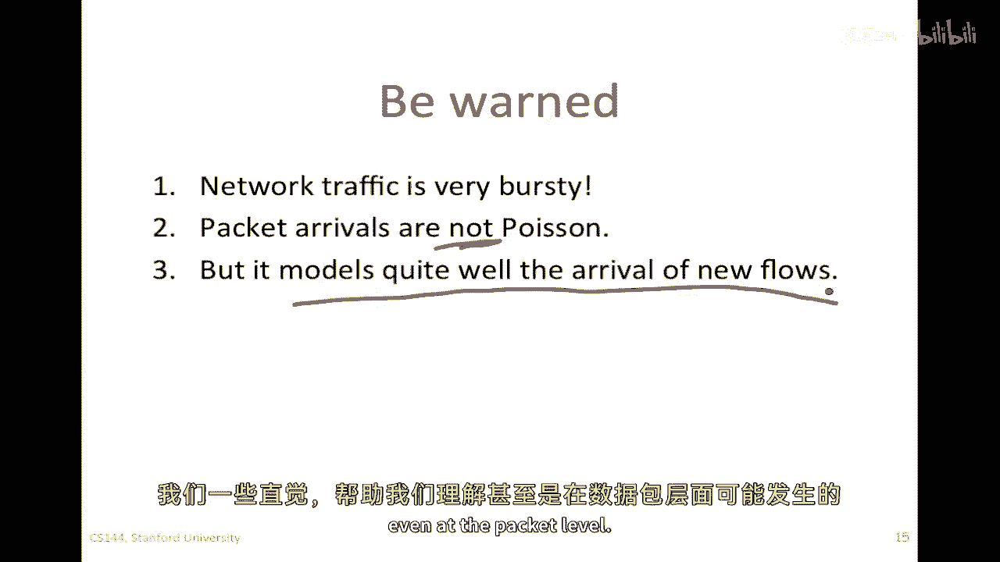

但我们必须非常，非常小心地做，让我们看一个我们使用泊松过程的非常常见例子，这个被称为M/M/1。

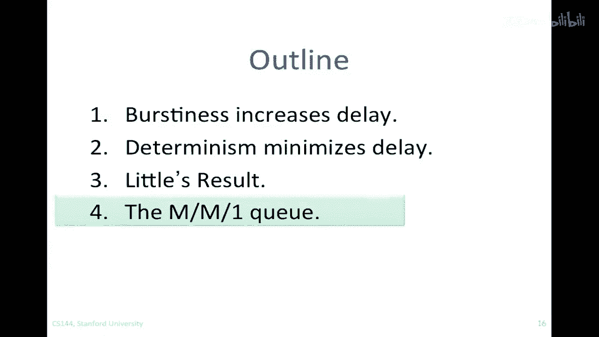

M/M/1是关于最常见分析的Q类型的最简单的一种，符号是m代表马尔科夫到达过程，在我们的情况下是泊松马尔科夫服务过程，在我们的情况下是指数分布，这意味着服务一个包的时间是指数分布的。

并且每个都有与所有其他独立的服务时间，并且只有一个服务器，换句话说，有一个出站线正在服务这个队列，因为它假设了一个简单而美好的，加上到达的独立性，从一个包到下一个包。

但它也被使用因为它的数学是简单而美好的，并且结果非常直观，所以如果我们要分析这个，我们可以使用，使用连续时间马尔科夫链，我们将发现他们，通过这个队列的包平均延迟是给出来的简单表达式。

一除以mu减去lambda，这告诉我们它是一除以一个，除以服务率和到达率的差值，所以当负载增加，当负载越来越接近服务率时，这个数字会增长得非常快，如果我们在图表上绘制它。

作为lambda over mu的函数，所以当lambda over mu越来越接近一，换句话说，当他们相等时，"通过这个队列，一个包的平均延迟将增加非常显著"，"非常陡峭"。

"这种情况对于几乎任何排队系统都适用"，不仅仅是那个m m的q，我们使用'mone q'有时作为更复杂系统的占位符的原因是，"仅仅只是数学更简单，而且这个表达式也简单"，"但你可以看到。

任何排队系统的形状都非常相似"，我们可以利用小的结果来计算平均q占用率，"我们知道l等于lambda乘以d"，在这种情况下，它将仅仅是lambda除以mu，再除以一减去lambda除以mu。

将其以lambda over mu的形式书写的原因仅仅是，因为mu的lambda代表强度，就像我在这里绘制的图一样，当lambda接近mu时，mu的lambda趋近于一，并且分母变为零。

并且队列占用率和平均延迟会爆炸并趋近于无穷大，所以m m one q为我们提供了一个好的理解，虽然不要假设这是真正的队列占用率或平均延迟的代表性度量，但它可以帮助我们直观地理解正在发生的事情。

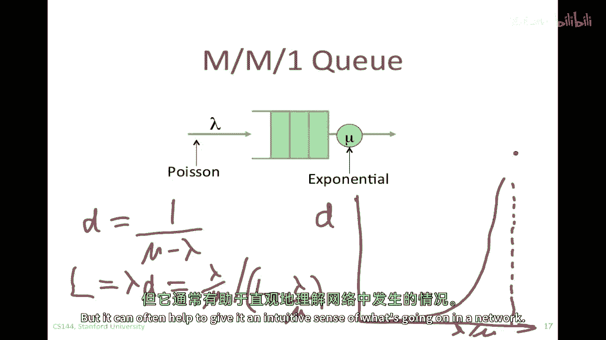

在网络中，所以总的来说，我希望你从这个视频中带走的主要提示是，爆发性往往增加延迟，因此，爆发性到达往往会使队列延迟更长。

Little的结果给我们提供了一个平均队列长度λ与客户通过该队列的平均延迟d之间的良好关系，到达率和d是客户通过那个队列的平均延迟。

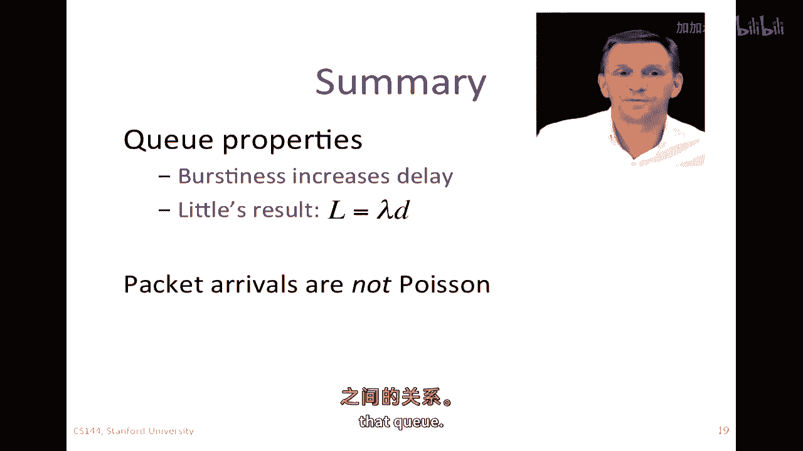

数据包到达不是泊松分布，一些事件如Web请求和新流量，到达过程和泊松过程也是M/M/1的基础。

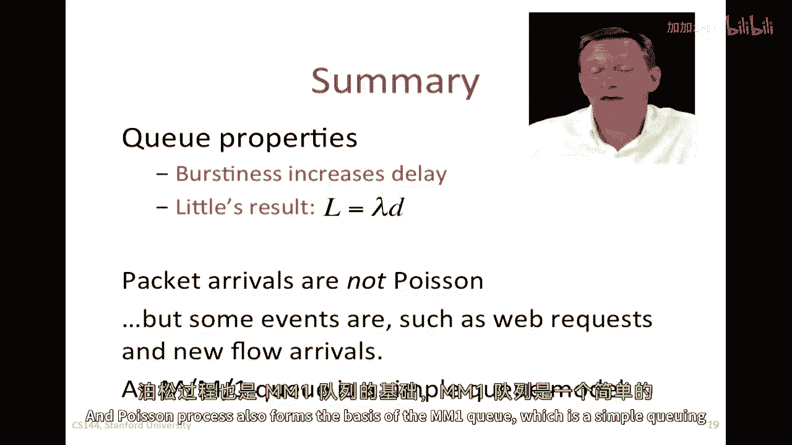

这是一个简单的队列模型，那往往可以给我们一些关于网络延迟特性的直觉。

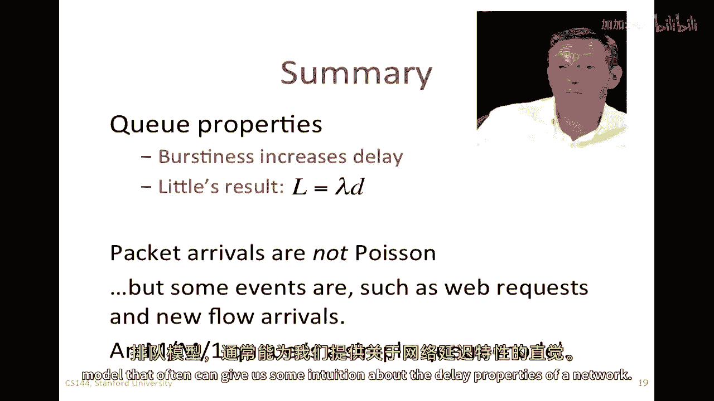