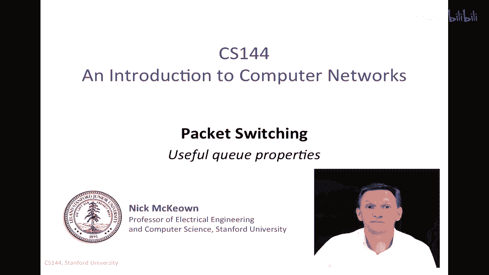
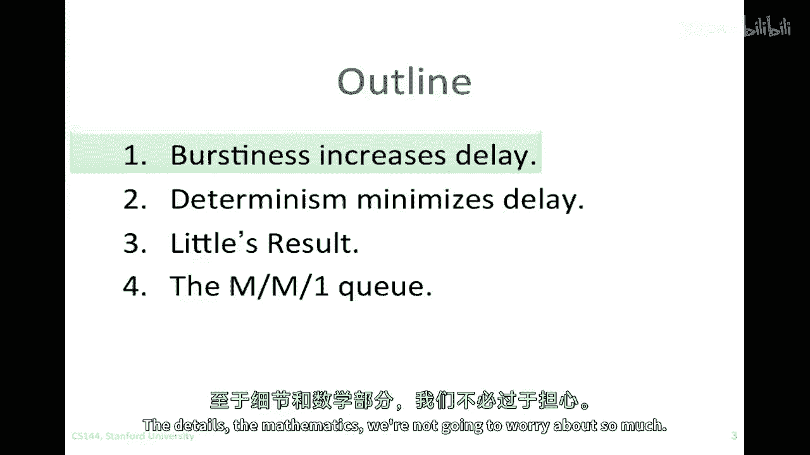
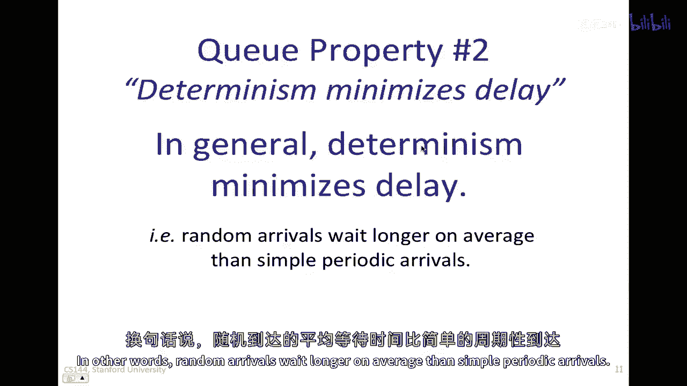
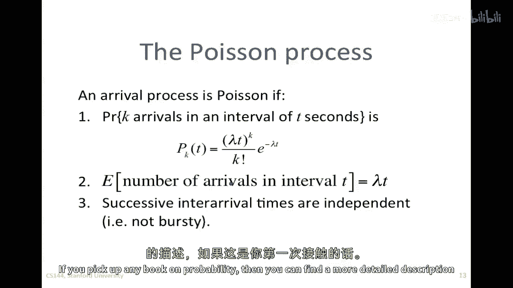
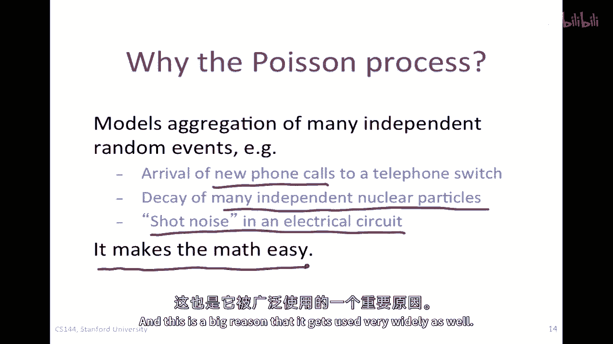
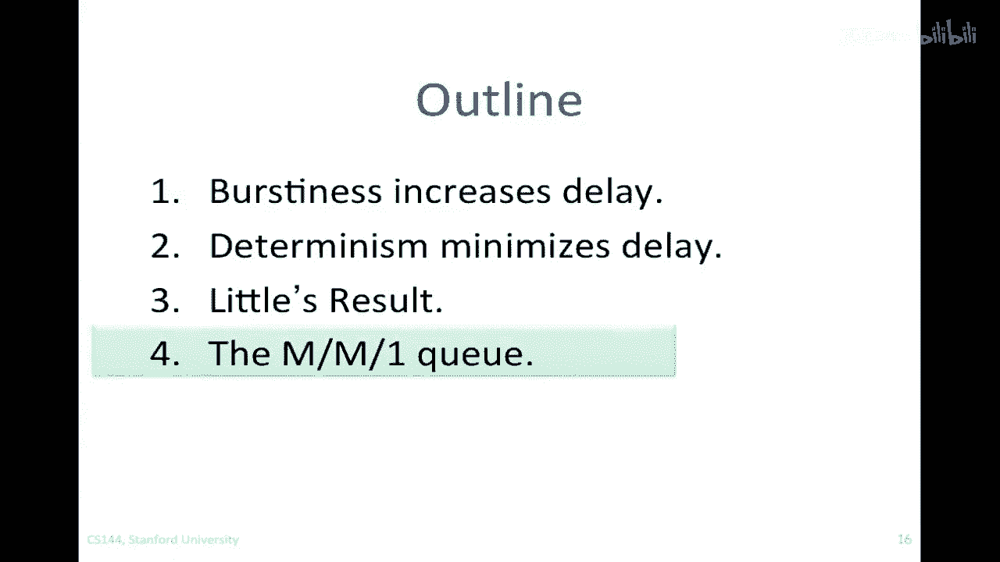

# 📊 课程 P45：排队模型特性



在本节课中，我们将继续学习分组交换，并探讨排队模型的一些核心特性。我们将了解突发性如何影响延迟，学习一个重要的通用关系式，并认识泊松过程及其在网络建模中的应用。

---

## 🧠 排队模型概述


上一节我们介绍了分组交换的基本概念。本节中，我们来看看如何用排队模型来分析网络中的延迟。



我们可以将网络视为由许多队列组成的集合，这些队列通过链路连接。来自众多用户的流量或数据包在这些链路上汇聚，使得数据包的到达过程变得非常复杂。

因此，我们通常将到达过程视为随机事件。虽然每个数据包的生成是确定的，但聚合后的到达过程可以看作一个随机过程。理解具有随机到达过程的队列如何工作对我们非常有益。

在像网络这样的系统中，到达过程很复杂，所以我们经常使用随机过程来建模它们。研究具有随机到达过程的队列被称为排队论。排队论以数学复杂而闻名，但这些具有随机到达过程的队列有一些非常有趣的特性，能帮助我们理解网络的动态行为。

---

## 📈 特性一：突发性增加延迟

首先，我们来探讨第一个特性：**突发性倾向于增加延迟**。我们通过一个直观的例子来理解。

假设有一个最简单的到达过程：数据包以精确的每秒一个的固定间隔到达，完全没有随机性。同时，服务（数据包离开）的机会也是每秒一次。

在这种情况下，队列占用率 `Q(t)` 要么是0，要么是1。平均队列占用率在0和1之间。


现在，考虑一个更具突发性的场景：到达率仍然是平均每秒一个包，但数据包以突发形式到达。例如，每5秒到达5个包，然后安静5秒。服务机会仍然是每秒一次。

虽然平均到达率和离开率相同，但队列占用率现在可以在0到5之间变化。这意味着平均队列占用率和占用率的方差都增加了。

**核心结论**：即使平均速率不变，到达的突发性也会导致更高的平均队列长度和更长的延迟。

---

## ⏱️ 特性二：确定性最小化延迟

与第一个特性密切相关的是第二个特性：**确定性倾向于最小化延迟**。

这本质上是第一个特性的反面。它表明，在相同的平均到达率下，完全确定性的、周期性的到达过程所产生的平均等待时间，比任何随机到达过程都要短。

换句话说，随机性（不确定性）本身就会引入额外的延迟。


---


## 🔗 特性三：Little 定律




在讨论第四个特性之前，我们需要了解一个强大而通用的结果：**Little 定律**。

对于任何稳定的排队系统（即没有数据包丢失），都存在一个简单的关系。设：
*   `λ` 为平均到达率（例如，数据包/秒）。
*   `L` 为系统中顾客（数据包）的平均数量（包括正在排队和正在被服务的）。
*   `D` 为顾客（数据包）在系统中经历的平均延迟。

Little 定律指出：
```
L = λ * D
```

这个看似简单的结果适用于**任何**排队系统，只要系统稳定且有明确的平均到达率 `λ`。它不依赖于到达过程的具体形式或服务时间的分布。

**应用**：我们可以利用这个公式进行转换计算。例如，如果我们测量出平均队列长度 `L` 并知道到达率 `λ`，就可以估算出平均延迟 `D`。这个定律在后续分析中会非常有用。

---


## 📊 泊松过程简介

在介绍第四个特性前，我们需要了解一个重要的随机过程模型：**泊松过程**。

泊松过程是一种常见的到达过程模型。如果一个到达过程是泊松过程，那么：
1.  在长度为 `t` 的时间间隔内，恰好有 `k` 个事件（数据包）到达的概率由一个特定的公式给出（涉及参数 `λ`）。
2.  连续到达之间的时间间隔是相互独立的。
3.  在间隔 `t` 内到达事件数的期望值是 `λt`，其中 `λ` 是平均到达率。

**为什么泊松过程重要？**
*   **建模聚合事件**：它能很好地模拟大量独立随机事件的聚合，例如电话呼叫到达交换机、放射性原子衰变等。
*   **数学简便**：尽管定义公式可能看起来复杂，但它使得后续的排队分析数学上相对简单，因此被广泛使用。



**重要警告**：然而，网络中的数据包到达**通常不是泊松过程**。实际的网络流量具有显著的突发性，数据包常常成群到达，前后数据包之间并不独立。泊松过程更适合建模**新通信流的开始**（如新的网页请求），而不是聚合后的数据包流本身。因此，使用基于泊松的模型时需要格外小心。

---



## 🧮 特性四：M/M/1 队列模型

基于泊松过程，一个最经典和简单的排队分析模型是 **M/M/1 队列**。

*   第一个 **M** 代表马尔可夫（Markov）到达过程，这里即泊松到达。
*   第二个 **M** 代表马尔可夫服务过程，这里指服务时间服从指数分布。
*   **1** 代表只有一个服务器（例如，一条出站链路）。


由于其假设（泊松到达、指数服务时间），M/M/1队列的数学分析相对简单，并能给出直观的结果。



**核心公式**：
对于一个M/M/1队列，数据包通过系统的平均延迟 `D` 为：
```
D = 1 / (μ - λ)
```
其中：
*   `μ` 是服务率（例如，链路每秒能发送的数据包数）。
*   `λ` 是到达率（`λ < μ` 系统才能稳定）。

平均队列长度 `L` 可以通过 Little 定律得出：
```
L = λ * D = λ / (μ - λ)
```

**关键洞察**：
从公式可以看出，当负载 `ρ = λ/μ` 趋近于1时，分母 `(μ - λ)` 趋近于0，导致平均延迟 `D` 和平均队列长度 `L` 急剧增加，趋向于无穷大。这形象地展示了当系统接近饱和时，延迟会爆炸性增长。

虽然真实的网络队列并非严格的M/M/1，但这个简单模型能为我们提供关于延迟与负载关系的重要直觉。

---

## 📝 本节总结


本节课我们一起学习了排队模型的四个核心特性：

1.  **突发性增加延迟**：数据包到达的突发性会导致更长的队列和更高的延迟，即使平均速率不变。
2.  **确定性最小化延迟**：周期性的、确定的到达过程能产生最小的平均延迟。
3.  **Little 定律**：这是一个通用关系式 `L = λ * D`，连接了平均队列长度、平均到达率和平均延迟。
4.  **M/M/1 队列模型**：这是一个基于泊松到达和指数服务时间的简化分析模型，其公式 `D = 1/(μ - λ)` 揭示了延迟随负载增加而急剧上升的特性。


我们还认识了**泊松过程**，它是一个重要的数学模型，适用于描述许多独立事件的聚合，但需注意**网络数据包到达本身通常不是泊松过程**。


理解这些特性有助于我们定性地分析网络性能，并理解延迟产生的根本原因。