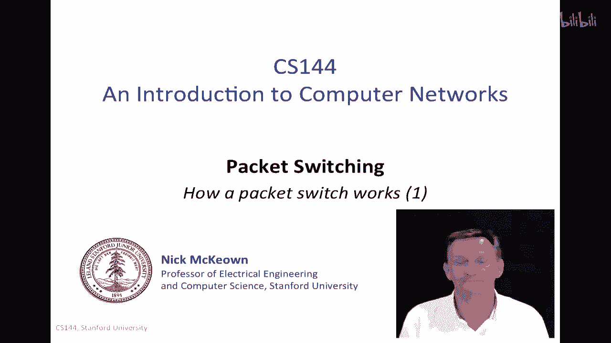

# 计算机网络课程 P46：分组交换 - 交换与转发实践 (1) 🔄

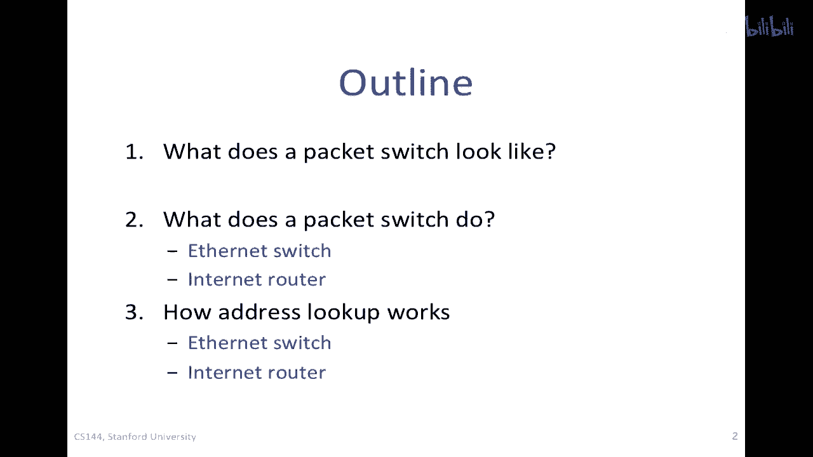

在本节课中，我们将继续学习分组交换的主题，具体探讨分组交换机（如以太网交换机和互联网路由器）的工作原理、内部结构以及核心的地址查找机制。

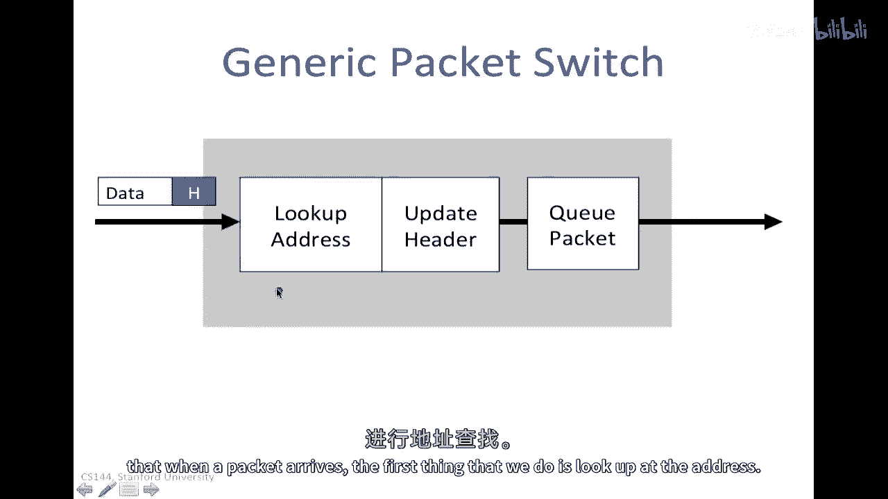

---

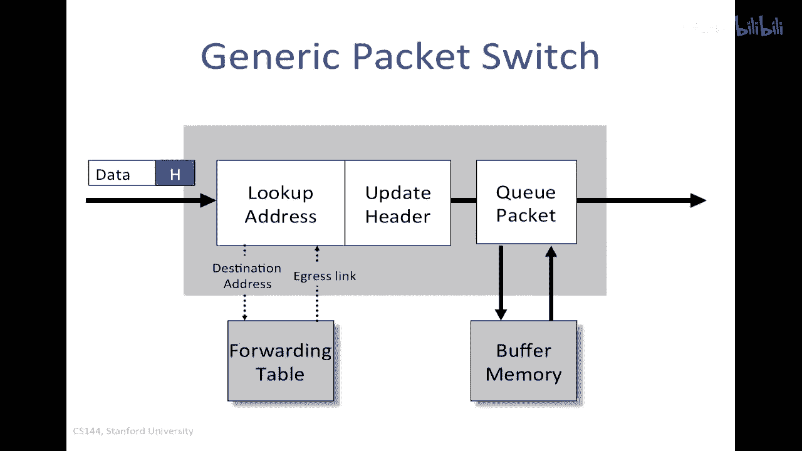

## 通用分组交换机结构 🏗️

上一节我们介绍了分组交换的基本概念，本节中我们来看看一个通用分组交换机的内部结构和工作流程。

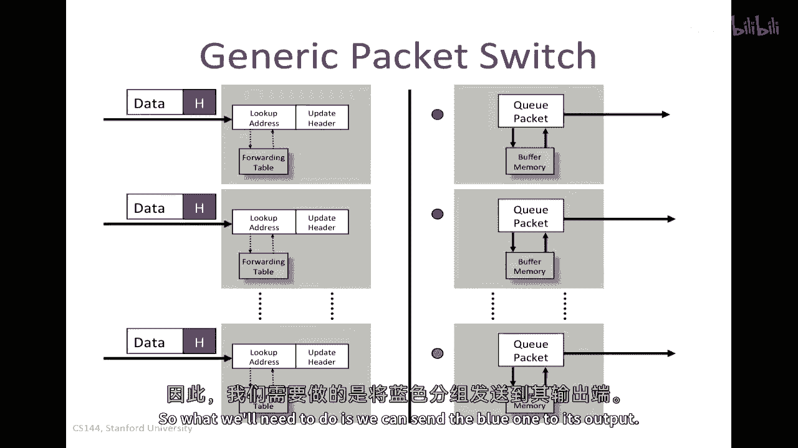

分组交换机处理数据包通常包含三个主要阶段：

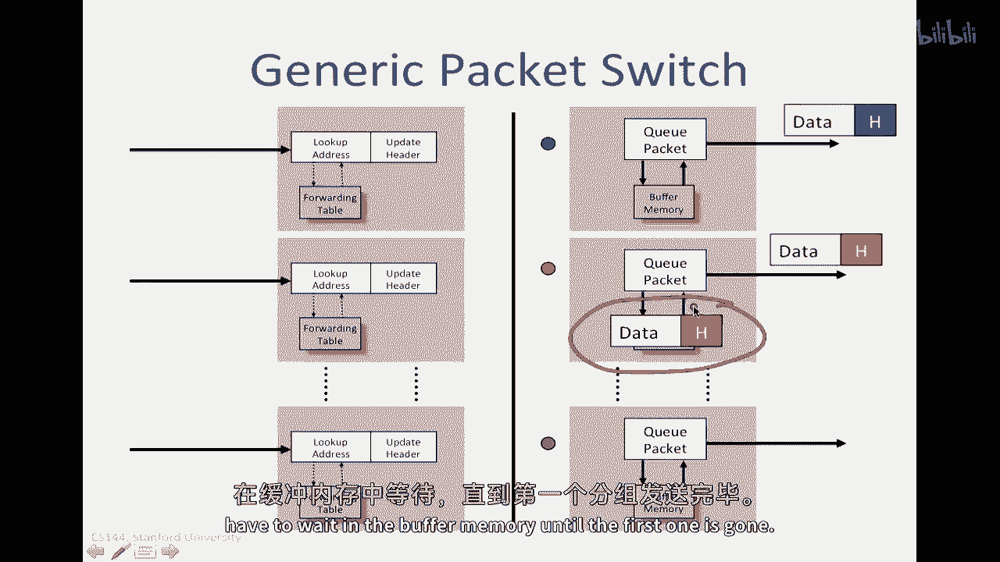

1.  **地址查找**：当数据包到达时，首先查看其目的地址，通过查询转发表来确定数据包应该从哪个出口链路或端口发出。
2.  **头部更新**：根据需要进行头部字段的更新。例如，互联网路由器需要减少TTL（生存时间）并重新计算校验和。
3.  **排队与转发**：将数据包放入输出端口的缓冲区中排队，等待在出口链路上发送。这是因为多个数据包可能同时竞争同一个出站链路。

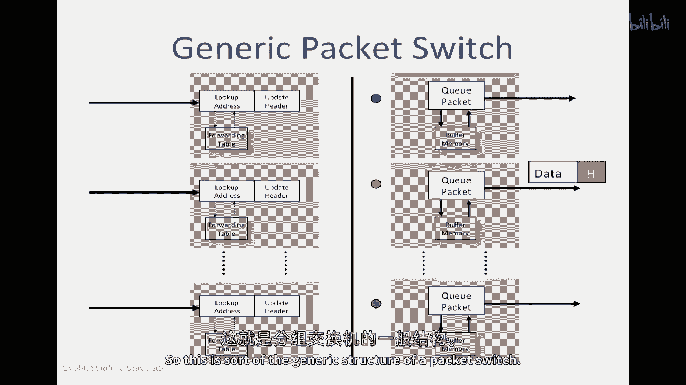

一个典型的分组交换机拥有多个输入和输出端口。数据包从输入端口进入，经过上述处理后，会通过一个共享的内部交换结构（如总线）被传送到正确的输出端口队列。如果多个数据包目的地相同，它们将在输出队列中缓冲，依次发送。

---

## 以太网交换机 🖧

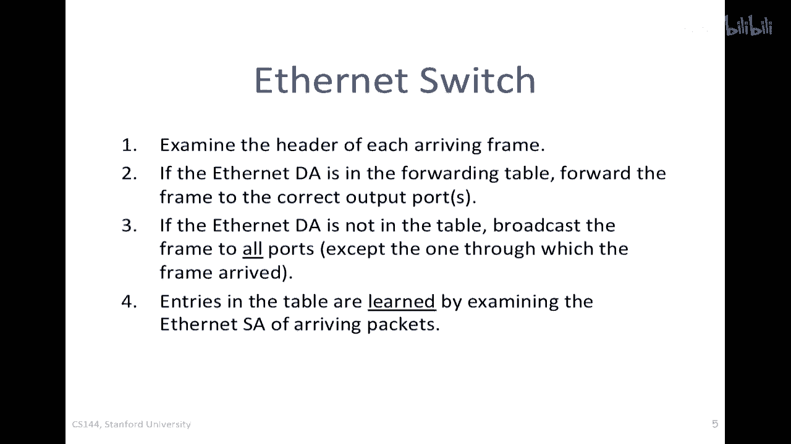

了解了通用结构后，我们具体看看以太网交换机是如何工作的。以太网交换机是专门处理以太网帧的分组交换机。

以太网交换机必须执行以下四个基本操作：

以下是其工作步骤：
1.  **检查帧头**：检查每个到达帧的以太网目的地址。
2.  **查表转发**：若目的地址存在于转发表中，则将帧转发到对应的输出端口（或多个端口，如广播情况）。
3.  **广播未知帧**：若目的地址不在转发表中，则向除接收端口外的所有其他端口广播该帧。
4.  **学习地址**：通过检查到达帧的**以太网源地址**来学习并填充转发表。当交换机首次看到某个源地址的帧从某个端口进入时，它就知道未来发送给该地址的帧应从该端口转发。

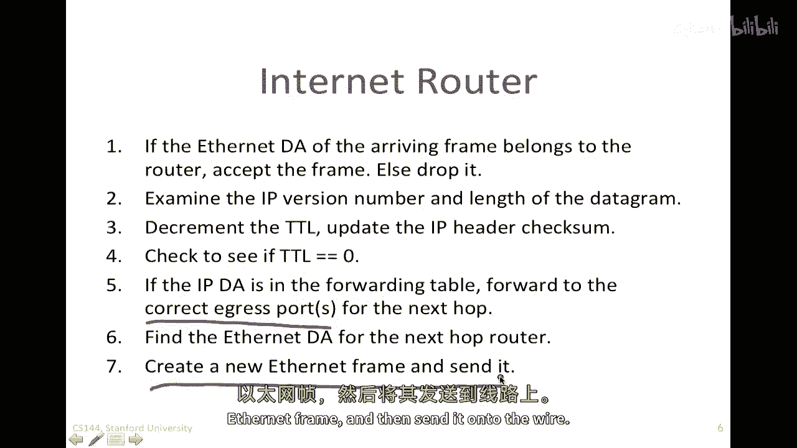

其转发表查找基于**精确匹配**。例如，一个表项可能如下所示：
```
目的地址: 00:1A:2B:3C:4D:5E -> 转发端口: 7
```
查找时，交换机通常使用哈希表来快速匹配48位的MAC地址。

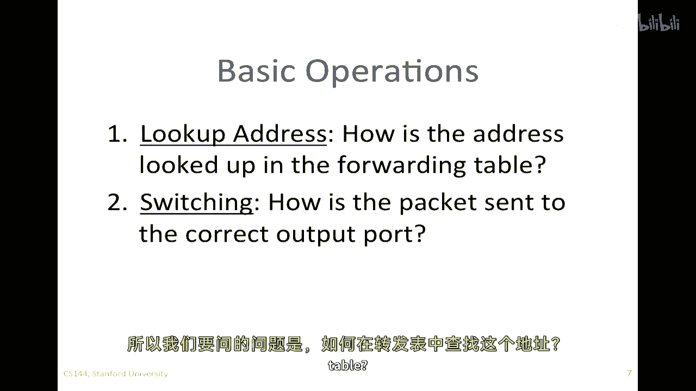

---

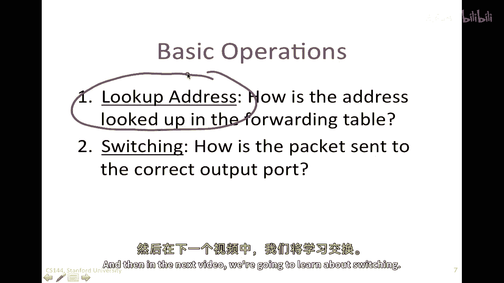

## 互联网路由器 🌐

接下来，我们对比学习另一种重要的分组交换机——互联网路由器。路由器处理的是IP数据包，其操作比以太网交换机更复杂。

互联网路由器需要执行以下七个基本操作：

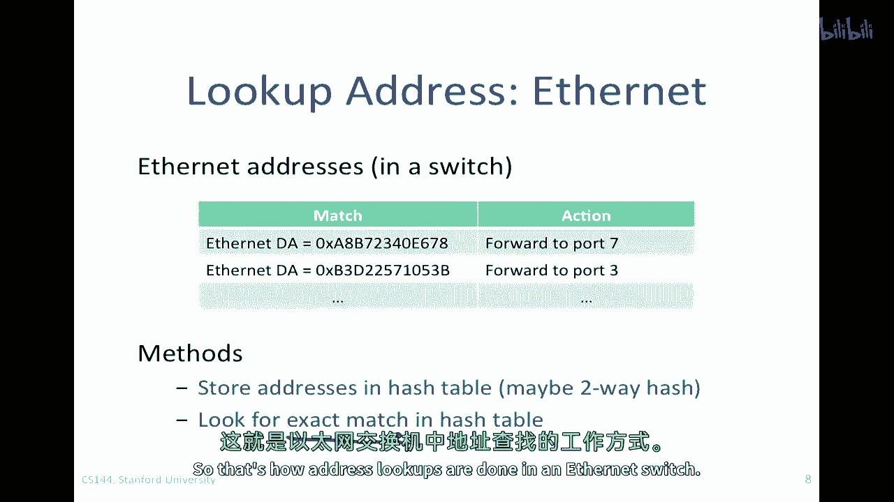

以下是其处理IP数据包的步骤：
1.  **检查帧目的地址**：确认到达的以太网帧的目的MAC地址是否属于本路由器。若不是，则丢弃。
2.  **检查IP版本**：检查IP头部的版本号是否为4（IPv4）。
3.  **处理IP头部**：减少TTL值，并据此更新IP头部校验和。
4.  **检查TTL**：若TTL减为0，则丢弃数据包。
5.  **查找路由表**：根据IP目的地址查询路由表，执行**最长前缀匹配**，以确定下一跳和出口端口。
6.  **重新封装**：将IP数据包封装进一个新的以太网帧中。
7.  **解析下一跳地址**：通过ARP等协议，找出下一跳路由器接口的MAC地址，并将其作为新以太网帧的目的地址。

---

## 地址查找机制 🔍

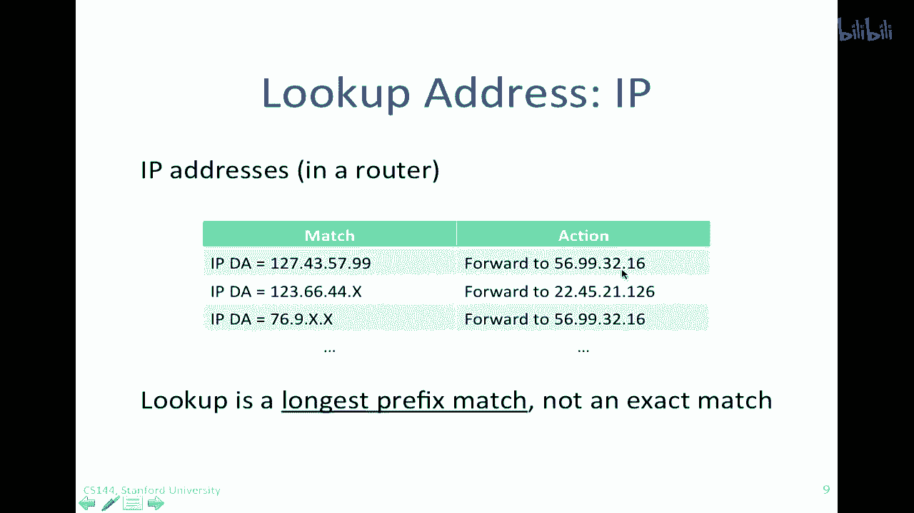

无论是交换机还是路由器，地址查找都是核心操作。我们已经看到，以太网交换机使用**精确匹配**，而互联网路由器使用**最长前缀匹配**。

### 最长前缀匹配详解

在IP路由中，地址不是单个主机地址，而是代表一个网络范围的**前缀**。例如：
*   前缀 `65.0.0.0/8` 匹配所有第一个八位组为65的IP地址。
*   前缀 `128.9.0.0/16` 匹配所有前16位为128.9的IP地址。

当一个目的IP地址同时匹配多个前缀时，路由器会选择**前缀长度最长**（即最具体）的那条路由。例如，地址 `128.9.16.14` 同时匹配 `128.9.0.0/16` 和 `128.9.16.0/24`，但会选择更长的 `128.9.16.0/24` 作为匹配项。

### 实现方式

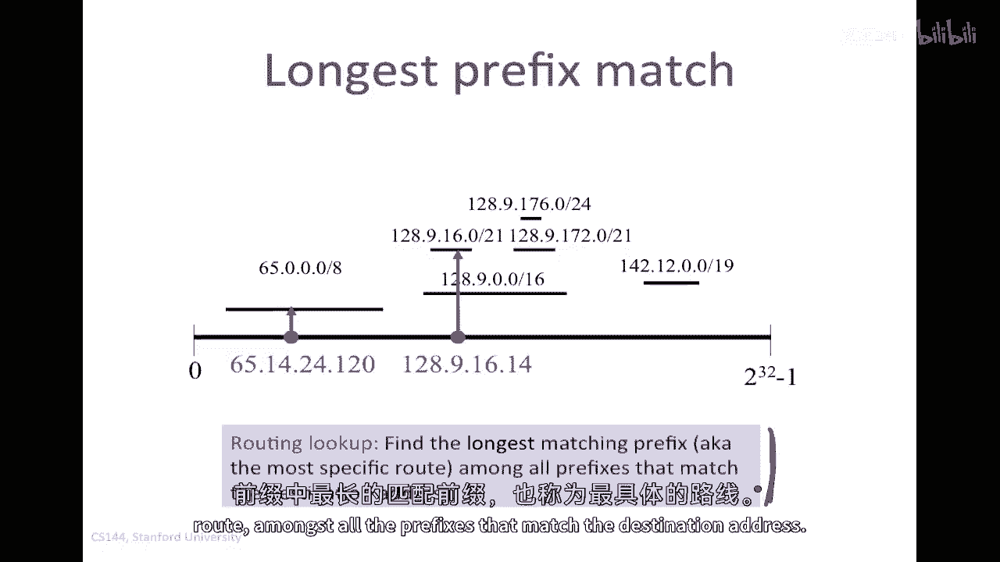

实现最长前缀匹配的两种常见数据结构是：

以下是两种关键技术：
1.  **二叉线索树**：一种树形结构，根据IP地址的每个比特位（0或1）决定遍历左子树或右子树。树中的节点可以存储路由前缀信息。查找时，从根节点开始逐位匹配，最终找到最长匹配的前缀。
    ```
    示例：对于前缀 0/1（二进制0...），会存储在左子树根部。
    ```

2.  **三态内容可寻址存储器**：一种特殊的硬件存储器。它将路由表项存储为（值，掩码）对。查找时，TCAM能并行地将输入地址与所有表项进行比较，并返回匹配的、掩码最长的表项。这种方法速度极快，但功耗较高。
    ```
    表项示例：
    值: 128.9.16.0
    掩码: 255.255.255.0  (表示前24位需要匹配)
    ```

---

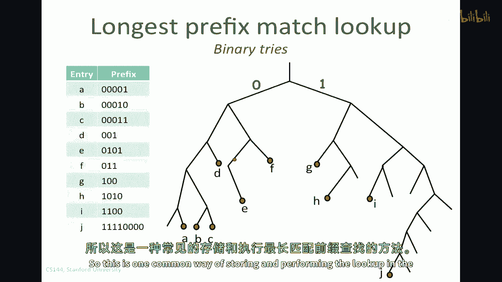

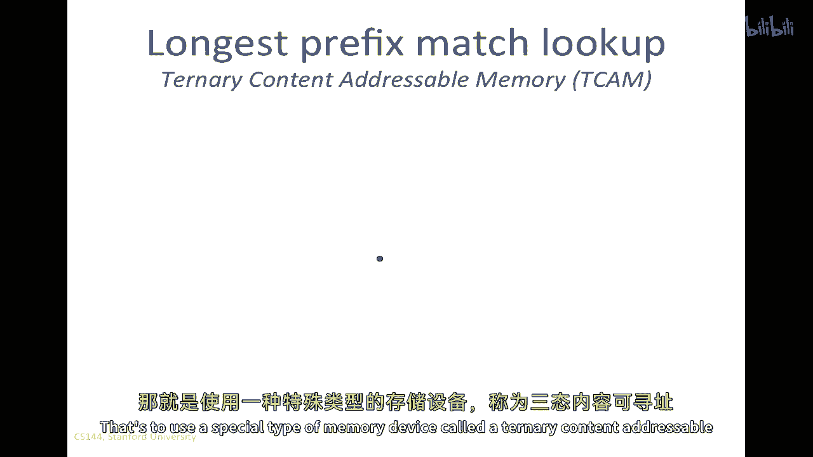

## 通用化视角：匹配-动作范式 ⚙️

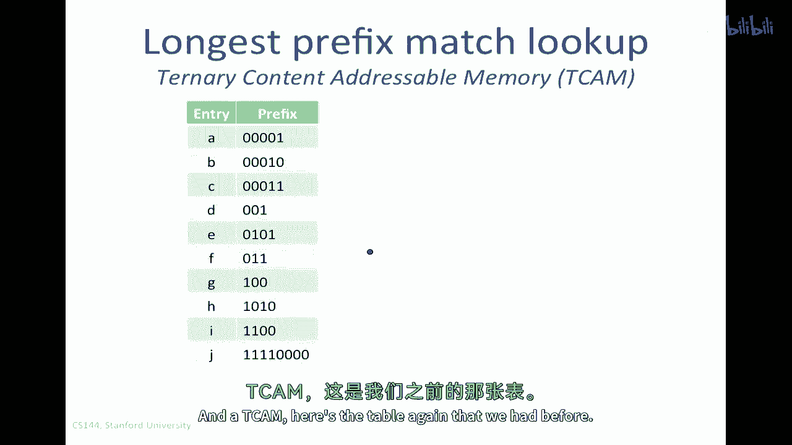

现代分组交换设备（交换机、路由器、防火墙等）的功能可以抽象为一个通用的**匹配-动作**范式。

*   **匹配**：可以基于数据包头的任意多个字段（如MAC地址、IP地址、端口号等）。
*   **动作**：可以是转发、丢弃、修改字段、封装等。

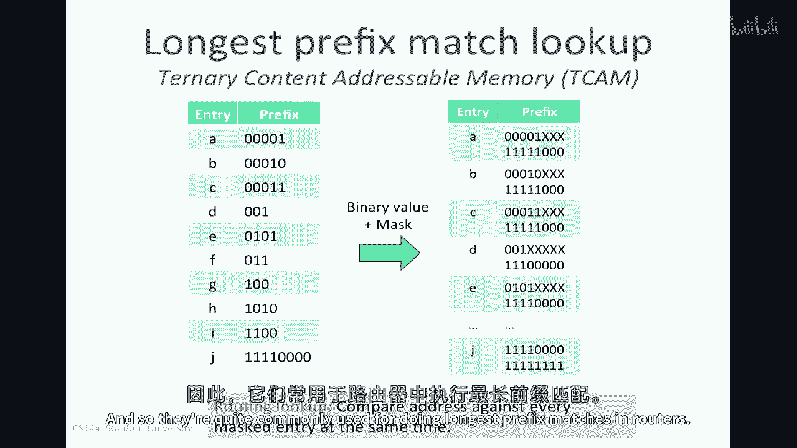

这种抽象使得设备能够灵活地支持多种网络功能，而不仅仅是二层交换或三层路由。

---

## 总结 📚

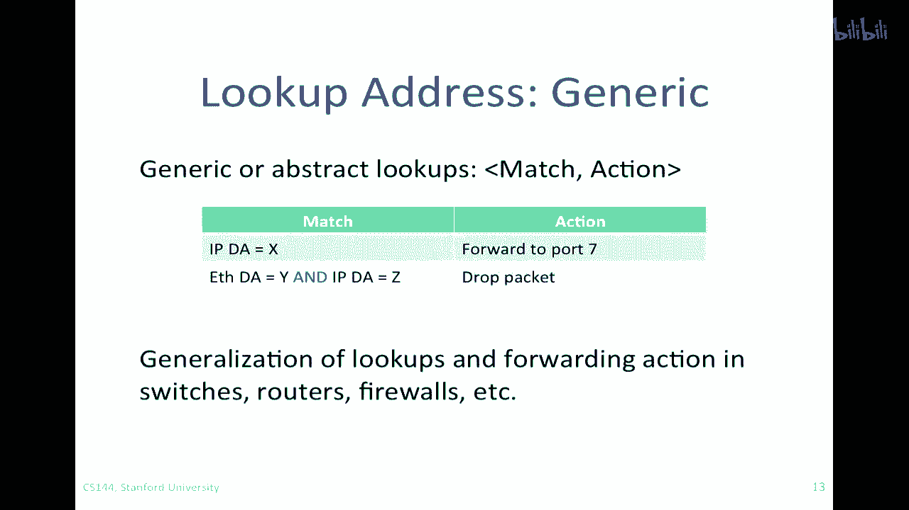


本节课中我们一起学习了分组交换的核心实践操作。

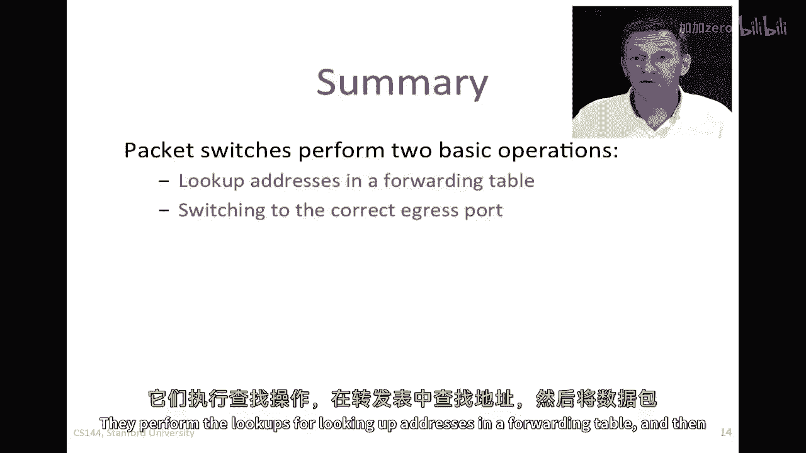

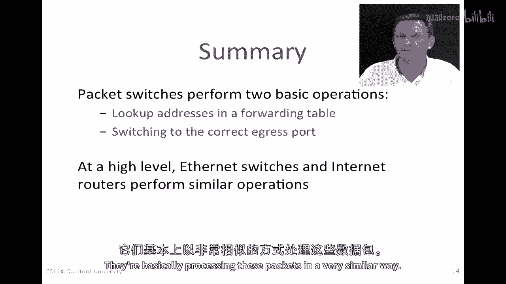

我们首先剖析了通用分组交换机的三个处理阶段：**地址查找**、**头部更新**和**排队转发**。接着，我们深入探讨了两种典型设备：**以太网交换机**基于MAC地址进行**精确匹配**查找和转发；**互联网路由器**则基于IP地址进行更复杂的**最长前缀匹配**查找。最后，我们介绍了实现高效查找的**二叉线索树**和**TCAM**技术，并将分组交换的核心抽象为通用的**匹配-动作**范式。

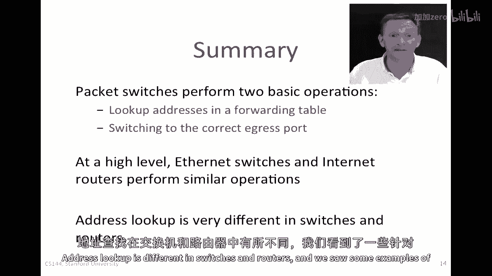

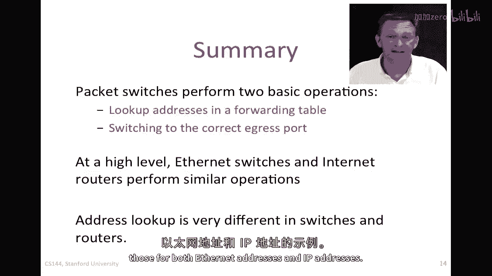

下一节，我们将继续学习分组交换的另一个关键环节：数据包在交换机内部是如何被**交换**到正确输出端口的。