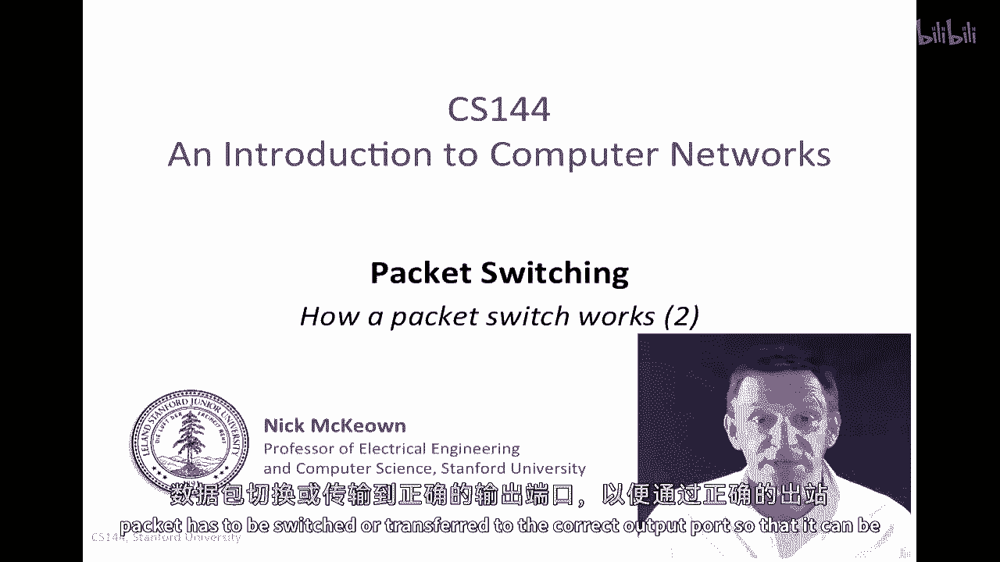
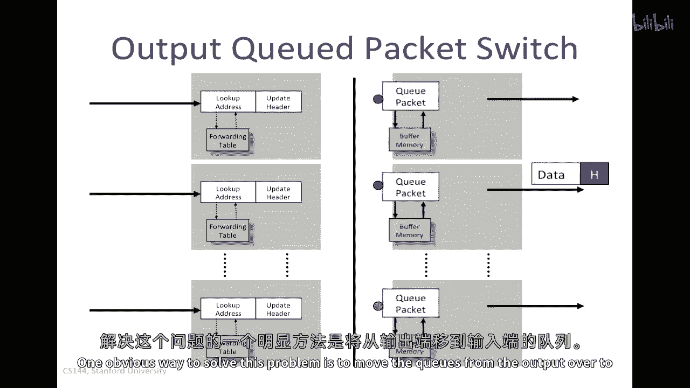
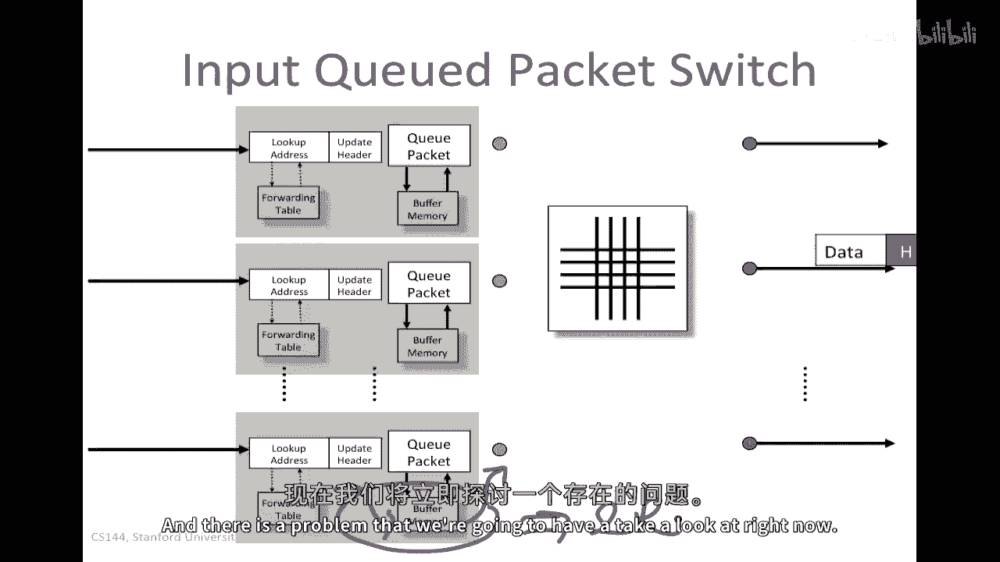
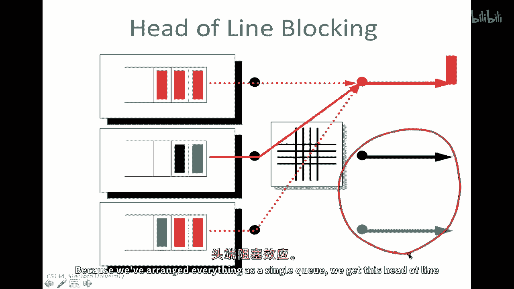
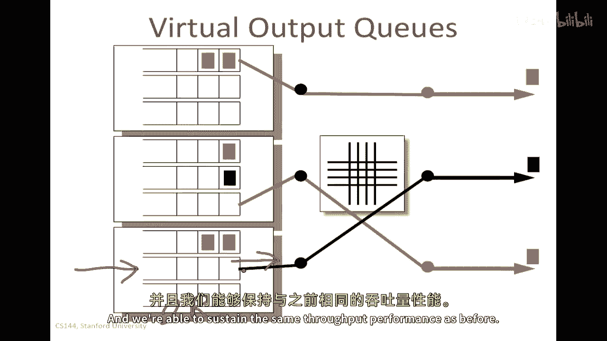
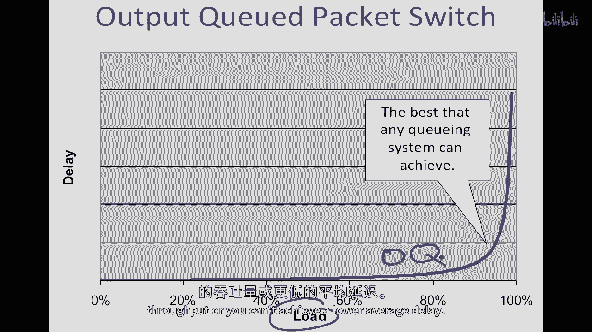
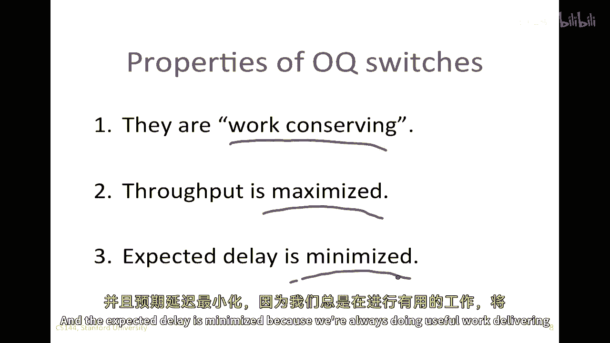
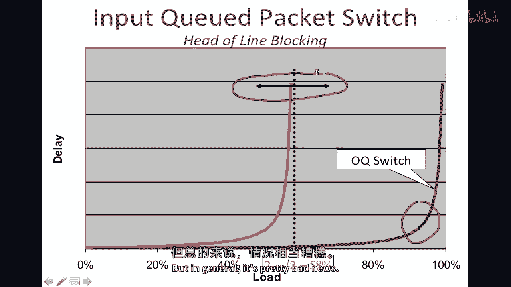
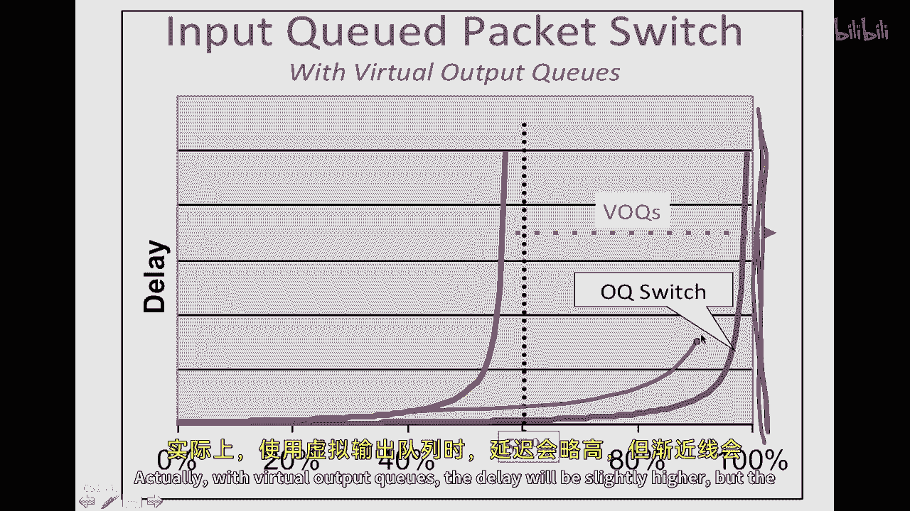
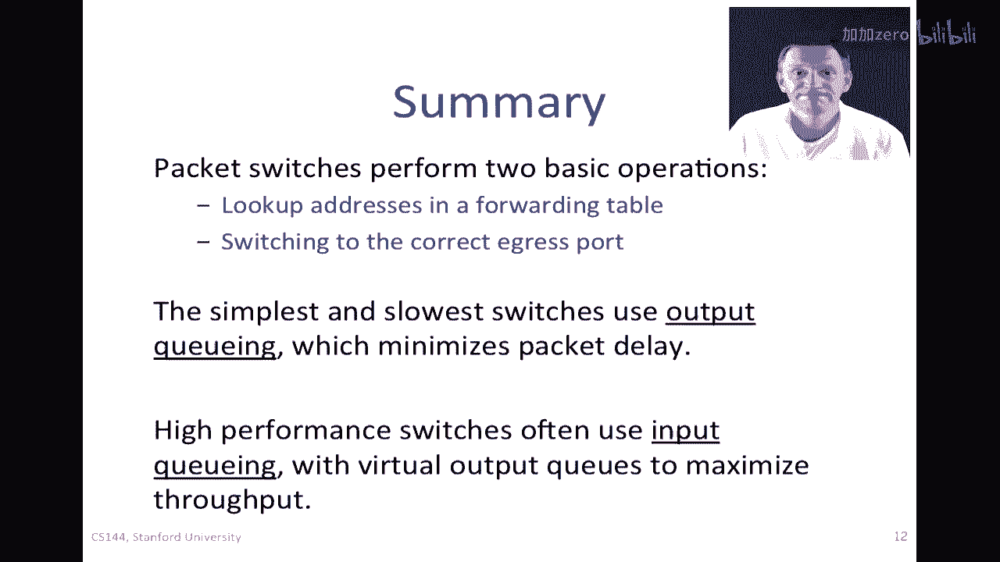

# P47：p46 3-8 Packet Switching - Practice Switching and Forwarding (2) - 加加zero - BV1qotgeXE8D

本视频是我们对第一段关于包交换器如何工作的视频续集，在第一段视频中，我们看到包交换器有两个基本操作，首先，包地址必须被查找到一个转发表，然后，包必须被切换或传输到正确的输出端口。

以便它可以通过正确的出站链接发送，在最后一段视频中，我们看到如何在以太网交换机和互联网路由器的表中查找地址，而在本视频中，我将解释如何将包切换到正确的出口端口，我将看几种不同的技术，输出队列，输入队列。

和虚拟输出队列，我们将看到和理解这些包交换器是如何实际构建的。

嗯，我将从，基本的香草交换机开始，这是我之前向你展示的类型，我们有地址查找在这里，在这里的左边，然后在这个，这是转发表，我们在这里查找地址，然后我们有包队列逻辑，然后有缓冲内存，在这里。

包在交通拥堵时被持有，当包到达时，这里有三个到达的包，具有不同的出口端口，由包的头部颜色指示，所以顶部的红色包将去这里的红色端口，中间的一个，当这些包穿越背板时，我们看到蓝色包能够去其输出。

一个红色的包可以立即交付，另一个被持有在输出队列中，等待它的轮次，所以只要，第一个两个离开后，这个就可以然后离开，按照FIFO顺序，我们经常将这种交换机称为输出队列交换机，因为线索在输出端。

这对交换机的性能有某种影响，让我们来看看，嗯，当我们有包到达时，有可能，在最坏的情况下，所有从外部同时到达的包，都将想要前往相同的输出队列，让我们说这里，所以如果我们有n个端口，每个以速率r运行。

并且有m个包，}，假设有n个它们，那么在最坏的情况下，我们可以实际上将这个写入率设置为n次r到这个输出q中，同样地，而且嗯，我们从队列中总是有一个阅读率，率为r，所以我们这样做，我们在输出队列切换中说。

这个内存必须运行一个聚合，总速率不超过n加一次r，这个有些恼人或令人沮丧的事情是，长期来看，它不可能是这种情况，我们将以速率n乘以r向此队列写入，系统无法承受仅在某些机制的作用下此才真正有效，例如。

拥塞控制，以不超过一个r的速率将平均写入此队列的速率保持在此，所以感觉好像，我们应需要的最大速率是两倍的r，这就是我们可能会偏离的，不幸的是，我们正在支付这个惩罚n，n可能是一个大数字。

它可以是几百甚至几千，所以这内存必须运行得更快，输出：可爱可爱，据说这个问题限制了它，"他们必须拥有能够快速奔跑的记忆"，非常快，"当构建可扩展的输出触发开关时，这个问题就变得相当具有挑战性。"。

或者使用记忆，或者创建一种记忆层次结构，使其运行足够快，解决这个问题的一个显而易见的方法是将提示从输出移动到输入。

"让我们来看看当我们这样做时会发生什么"，"由于显而易见的原因"，我们称这个为输入触发的包交换机，现在，包将被持有的队列位于交换机的输入侧，这种优势可能在片刻后变得显而易见，如果我们考虑到达交换机的包。

与以前相同，两个红色，一个蓝色，在这种情况下，我们将做所有事情，所有的包都将通过交换机，只需要其中一个被持有，那就是下面等待轮到它穿过交换机的那个，这是因为它的输出线正忙，在输出端没有提示信号来保持它。

所以我们在输入端保持它，然后当它的轮次到来时，它可以离开，就像从输出立方体中一样，所以它显示在表面上，好消息是嗯，事情看起来像是一样的工作，更好的消息是这里的缓冲内存是，嗯，现在只需要接受。

最多只能接受一包，一次只能从入口接收一包，并且只能一次在包时间内将一包发送到交换机，因此其速度已经从n加一次r降低到我们的最小值，而我们的目标是2次r，因此是几乎n的减少，因此这有很大的影响，因此。

人们经常说，输入队列交换机在许多方面都更加可扩展，确实，许多大型交换机都是这样制造的，但是，有一个前提，并且有一个问题我们将要面对。

我们现在必须看一看，在一个可爱的输入开关中，问题被称为头线阻塞，这个问题在许多情况下都可以看到，所以我想在这里解释它，所以你在其他环境中看到它时会认出它，让我来通过一个例子，所以这些是，输入缓冲区。

我在开关上删除了所有其他东西，只是为了让它更清楚一些，我们将看到数据包到达这些地方，它们是，嗯在那里，嗯，红色的数据包将送到红色输出，黑色的数据包送到黑色输出，绿色的送到绿色输出，想象一下。

你有任务决定哪些包应该发送，你看到这个队列的头部，看到所有的包都被读取，问题是你只能一次发送一个包，所以在这个特定情况下，我们只能发送红色的包，尽管系统中有绿色和黑色的包。

这些包可以送到这些未使用的输出，嗯，因为我们已经将一切都安排成一个队列，嗯，我们遇到一种头线阻塞效应。

解决这个问题的自然方法是一种被广泛使用的方法，叫做虚拟输出提示，每个输入都有一个为每个输出维护的独立队列，所以在这种情况下，我们有一个3x3的切换，所以，这是一个FIFO队列，包正在等待输出1。

红色输出用于输出2，对于输出3，所以，当包到达这里时，到达的包与以前相同，但是现在它们被预先分类并放入与它们将要输出的队列相对应的队列中，这就是为什么我们称它们为虚拟输出队列。

这是一些将要输出到相同输出的数据包队列，现在好消息是，因为每个队列都包含要去向相同输出的数据包，一个数据包不能被前面的数据包阻塞，要去向不同输出，所以它不能被阻塞，因为它的头部被阻塞，因为某人被困住了。

所以现在我们可以说，啊哈，我们对所有头部数据包都有可见性，并且我们可以一次发送所有三个，因此可以获得更高的瞬时吞吐量，这是一个明显的解决方案，在实践中实现可能有些困难，但是，美好的事情是。

它完全克服了头部阻塞，所以总体上来说，我们已经将队列的速度减半，我们的内存速度，因为记住我们只能一次接收一个数据包，并且只能一次发送一个数据包，我们仍然能够维持以前的吞吐量性能。

只看这个图，我们经常看到像这样的图，这是，这是延迟的图，或一个包将经历的平均延迟作为负载函数的函数，这基本上是多忙，入口线是任何队列系统所能达到的最佳性能，这条线在这里，这对应于一个系统。

当负载接近一百时，延迟增加或平均延迟增加，并且趋近于百分之百，实际上，这就是我们将与输出队列交换器看到的，输出队列交换器在完美意义上意味着你不能达到更高的吞吐量，或你不能达到更低的平均延迟。

让我们看看输出队列交换器的主要属性，首先，我们说它们是工作保守的，工作保守意味着输出线永远不会空闲，当系统中有等待发送到它的包时，这意味着没有内部阻塞阻止包到达这条线，每当这条线空闲时。

系统中没有等待发送到它的包，因此，吞吐量被最大化，因为你不能比所有线都忙碌时达到更高的吞吐量，每当有包可供它们时，并且预期延迟被最小化因为我们总是在做有用的工作。

在发送包到输出线，总结一下，我们由于头部阻塞所遭受的性能问题，这是我们完美的输出切换设备，这里右侧的切换已经修复，这里与线头阻塞相关的良好性能，嗯，众所周知，通过率可以减少，换句话说，当事情崩溃时。

这个渐近线，减少到二减二减根号二或大约五八，所以我们系统几乎失去了一半的性能，由于这个线头阻塞，产生了这个结果，实际的数字将取决于特定的到达模式，但总的来说，这是坏消息。

但如果我们使用虚拟输出队列，这五十八 percent又会被推回满状态，整个系统的百分之百，它不完全匹配输出cuswitch，极限在这里仍然会是百分之百，嗯，实际上，使用虚拟输出队列，嗯。

延迟将会稍微提高。

但渐近线是百分之百，我想再说几句关于虚拟输出队列的话，虚拟percues实际上被广泛使用，嗯，你可能甚至在街上注意到它们，所以在我们美国，我们是右行驾驶的，有左转车道的情况非常普遍，就像这里显示的那样。

这是为了持有即将到达并且因为来自另一方的车辆而被阻塞的汽车，所以这些车道被阻塞，直到没有来自另一方的车辆才能左转，但是，在这个车道上的车辆可以继续直行，或者右转，它们不是因为前方有包车而被阻塞或停滞的。

前往在这种情况下位于这里的输出，哪个暂时不可用，所以，在我们驾驶的左行国家，然后，右转车道也很常见，所以下次你开车时，你看到其中一个，记住，这是虚拟输出，排队，所以总的来说。

我们已经看到分组交换机执行两种基本操作，它们查找转发表中的地址，我们在上一段视频中看到了例子，对于以太网交换机和互联网路由器，并且一旦它们决定一个分组的去向，它们必须切换它。

他们必须将其送达正确的出口端口，以便它可以通过正确的输出链接，最简单的和最慢的交换机使用输出队列，因为这样可以最大化通量和最小化数据包的预期延迟，而更可扩展的交换机往往使用输入队列与虚拟输出队列。

以最大化通量。

