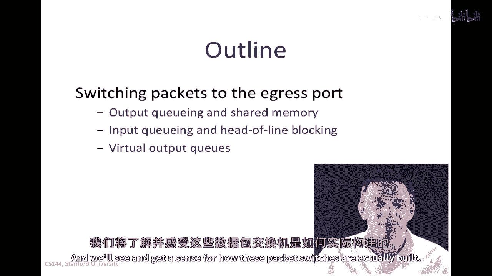
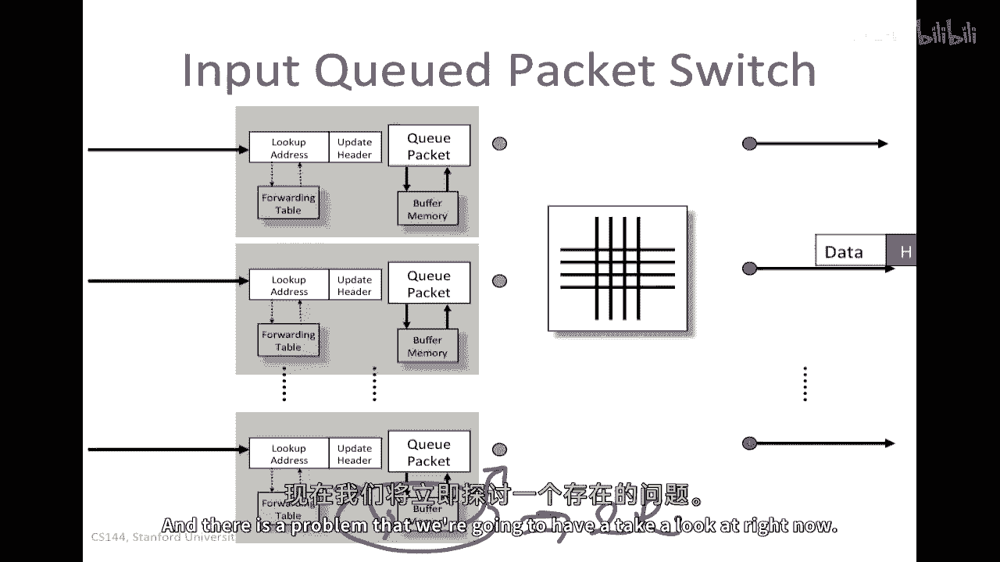
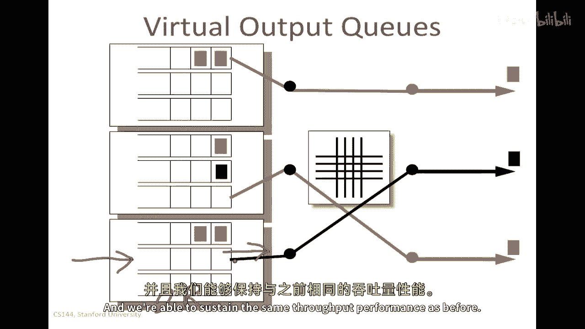
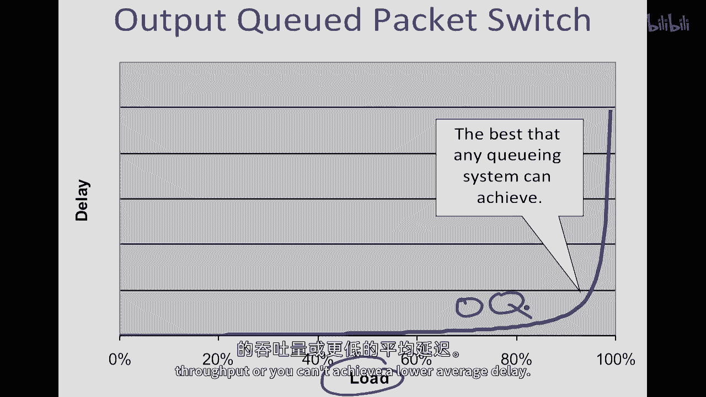
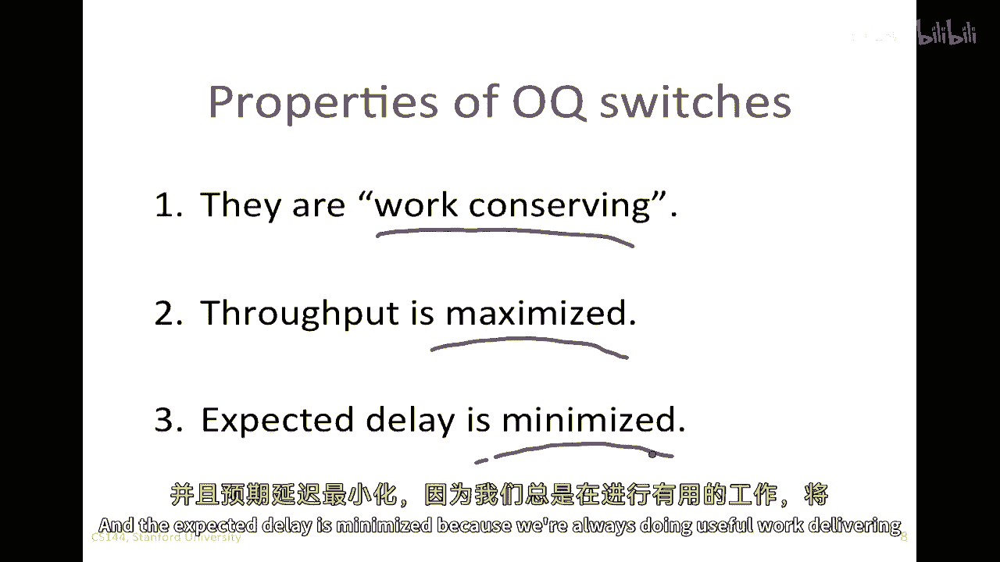
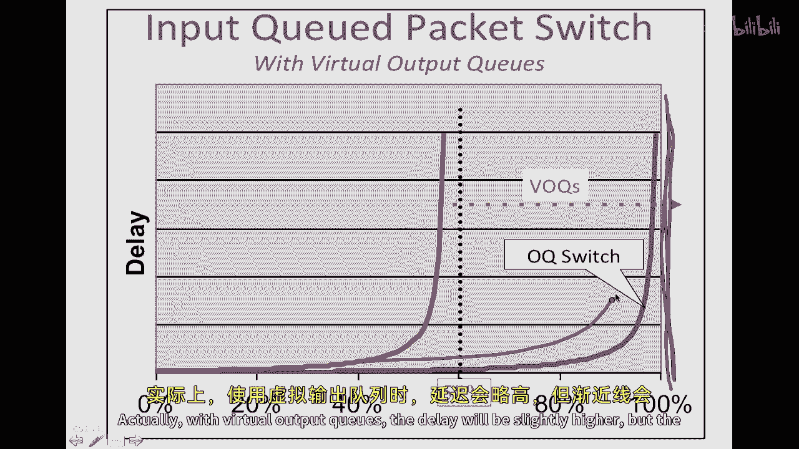
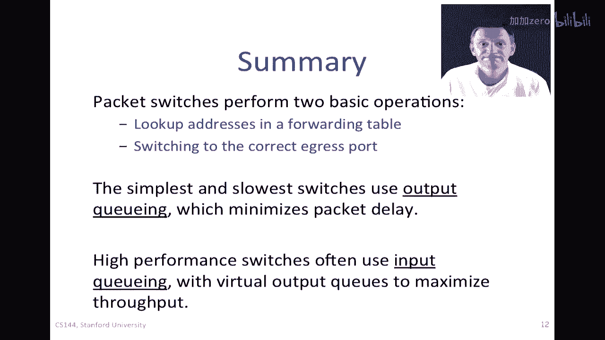

# 计算机网络课程 P47：包交换实践 - 交换与转发（2）🚀

在本节课中，我们将继续学习包交换器的工作原理。我们将重点探讨包交换器在完成地址查找后，如何将数据包切换到正确输出端口的不同技术。我们将了解输出队列、输入队列以及虚拟输出队列这三种核心交换架构，并分析它们各自的优缺点。

---

上一节我们介绍了包交换器如何通过查找转发表来确定数据包的去向。本节中，我们来看看如何将数据包实际切换到正确的出口端口。

包交换器在确定数据包的目标端口后，需要将其传输到对应的输出端口，以便通过正确的出站链路发送。这个过程被称为“交换”或“转发”。

## 输出队列交换机 📤

最简单的交换架构是**输出队列交换机**。在这种设计中，数据包在通过交换背板后，会在输出端口处排队等待发送。

以下是其工作流程：
1.  数据包到达交换机，其头部信息（如颜色所示）指示目标输出端口。
2.  交换逻辑将数据包通过内部背板发送到对应的输出端口。
3.  如果输出链路繁忙，数据包将在该端口的**输出队列**中缓冲，并按照先进先出（FIFO）的顺序等待发送。

这种架构的主要挑战在于对缓冲内存速度的要求极高。在最坏情况下，所有 `n` 个输入端口的数据包可能同时要发往同一个输出端口。这意味着：
*   写入队列的速率可能高达 `n * r`（`r` 为端口速率）。
*   而从队列读取的速率仅为 `r`。

因此，输出端口的缓冲内存需要能以 `(n+1) * r` 的聚合速率运行。对于端口数量 `n` 很大的交换机，这限制了其可扩展性。

## 输入队列交换机 📥

为了解决输出队列对内存速度的苛刻要求，一种自然的思路是将队列从输出端移动到输入端，这就构成了**输入队列交换机**。

以下是其工作流程：
1.  数据包到达输入端口后，先在**输入队列**中缓冲。
2.  交换调度器决定哪个输入队列的数据包可以通过背板发送。
3.  只有当前输出链路空闲时，对应目标端口的数据包才能被发送。

这种设计的优势在于，每个输入端口的缓冲内存只需处理本端口的流量。其读写速率从 `(n+1) * r` 降低到了 `2 * r`，大大降低了对内存速度的要求，提高了交换机的可扩展性。

然而，输入队列交换机面临一个关键问题：**队头阻塞**。

## 队头阻塞问题与虚拟输出队列 🚧

在基本的输入队列交换机中，每个输入端口只有一个FIFO队列。当一个数据包因为目标端口繁忙而阻塞在队头时，即使它后面数据包的目标端口是空闲的，这些数据包也无法被发送。这种因队头数据包阻塞而影响后续无关数据包传输的现象，就是队头阻塞。

队头阻塞会显著降低交换机的吞吐量。理论分析表明，在最坏情况下，其最大吞吐量可能降至约 `58%`。

为了解决队头阻塞，业界广泛采用了**虚拟输出队列** 技术。

以下是VOQ的工作原理：
1.  在每个输入端口，为**每一个**输出端口都维护一个独立的队列。
2.  数据包到达时，根据其目标端口被放入对应的虚拟输出队列中。
3.  调度器可以查看所有输入端口上所有VOQ的队头，并灵活地调度那些目标端口空闲的数据包进行传输。

因为去往不同端口的数据包被物理隔离在不同的队列中，所以一个队列的阻塞不会影响其他队列。这使得调度器能更充分地利用交换背板，理论上可以将吞吐量重新提升至 `100%`。

VOQ的一个现实类比是道路上的专用转向车道（如左转车道）。直行车辆不会因为前方有等待左转的车辆而被阻塞，这类似于VOQ避免了去往不同“输出端口”（方向）的“数据包”（车辆）相互阻塞。

## 性能对比与总结 📊

让我们总结一下这三种交换架构的关键特性：

*   **输出队列交换机**：性能最优（工作保守，吞吐量最大，延迟最小），但对内存速度要求极高，可扩展性差。
*   **输入队列交换机**：内存要求低，可扩展性好，但受队头阻塞影响，吞吐量可能严重下降。
*   **虚拟输出队列交换机**：在保持输入队列低内存要求的优点的同时，通过为每个输出维护独立队列，有效消除了队头阻塞，使吞吐量接近输出队列的水平。

下图展示了不同架构下，数据包平均延迟随负载变化的趋势：
*   输出队列能实现最佳性能曲线。
*   基本输入队列因队头阻塞，在负载较高时性能急剧下降。
*   虚拟输出队列的性能则非常接近输出队列。

---

本节课中我们一起学习了包交换的三种核心转发架构。我们了解到，包交换器在完成地址查找后，需要通过内部交换结构将数据包送达正确端口。**输出队列**性能最好但成本高；**输入队列**更可扩展但存在**队头阻塞**问题；而**虚拟输出队列** 则是一种优秀的折中方案，它结合了可扩展性与高性能，因此在现代高速交换机中被广泛采用。理解这些基础架构，是深入认识网络设备内部工作原理的关键一步。