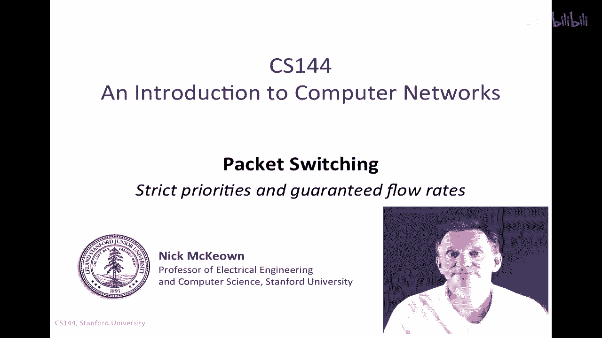
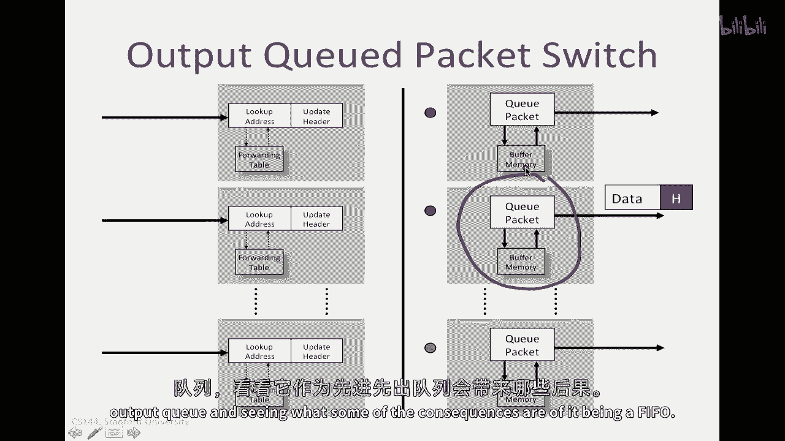
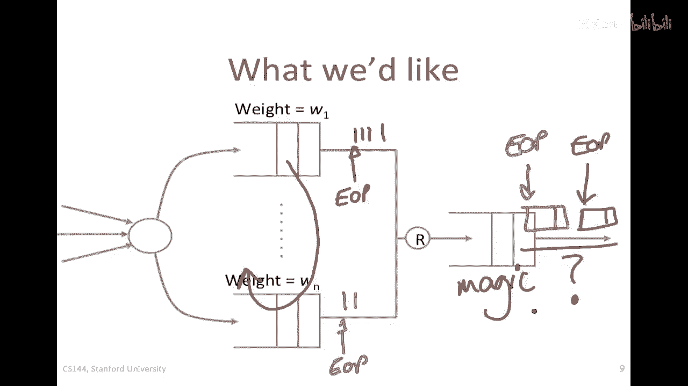
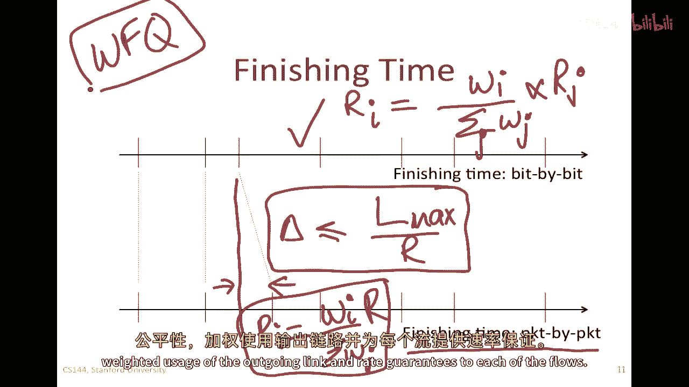
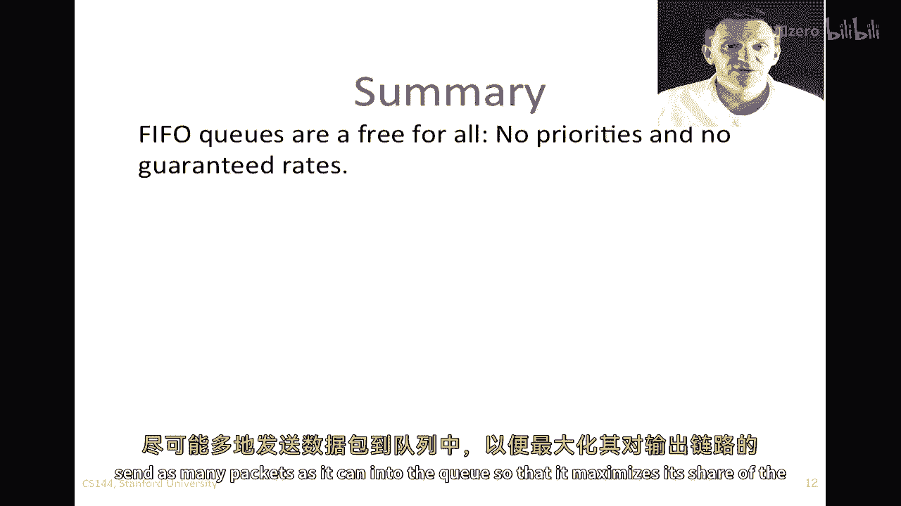
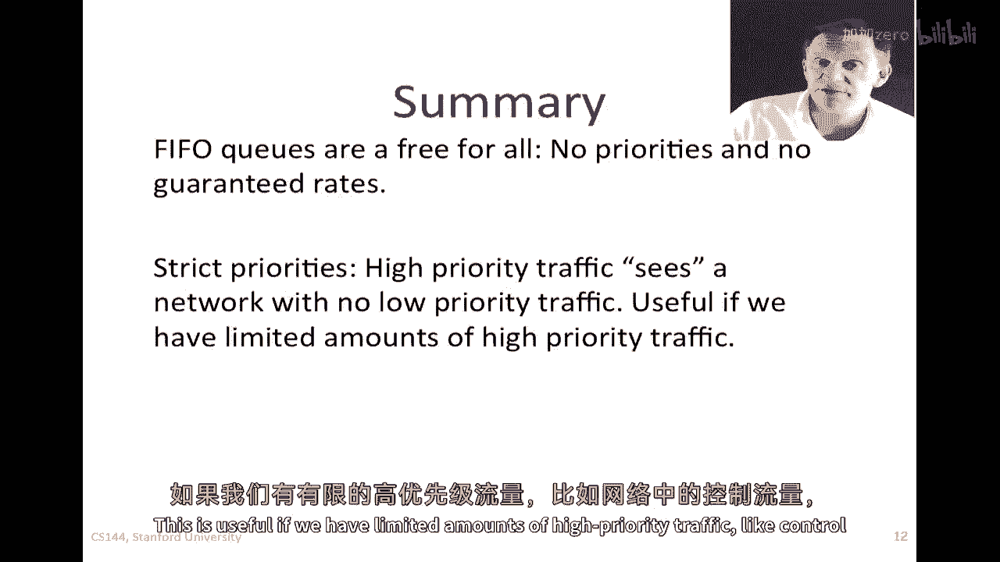
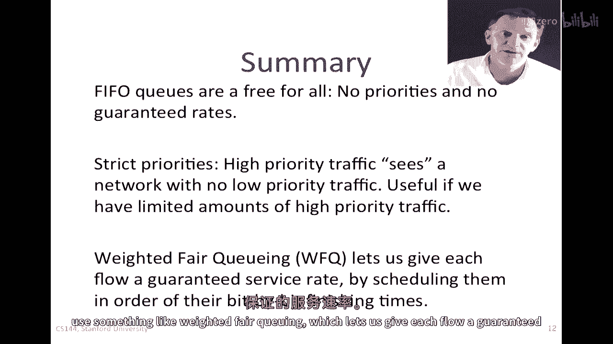
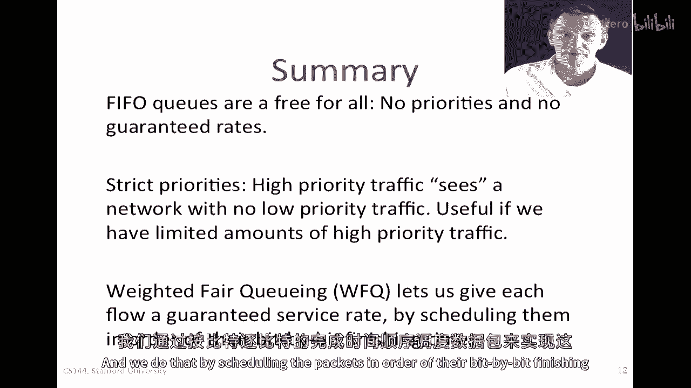

# P48：p47 3-9 Packet Switching - Principles Rate guarantees - 加加zero - BV1qotgeXE8D

在这个视频中，我将开始告诉你，FIFO输出队列的一些缺点和一些它引起的问题，然后，我将描述两种替代方案，提供严格优先级的交换机，可以给高优先级和低优先级流量，以及可以提供每个通过它流量的保证率的交换机。

让我们先回顾一下ala cute包交换机的外观，这是我们之前看到的一个例子，我们有三个包到达，它们的地址将被查找，并将被切换到正确的输出，在这种特定情况下，两个红色信封。

意味着他们会去中间红色的输出和蓝色的一个去顶部，其中一个红色信封可以去，另一个被保留，等待链接被释放，然后它继续前行，所以隐含的，这里是假设输出队列是一个fifo，先进先出。

这对大多数路由器队列来说是一个相当合理的假设，但是，接下来我们要看的是，我们将专注于这个输出队列，并看看当它是FIFO时，一些后果是什么。

所以，FIFO队列有时被称为所有输入的免费cu，如果通过这个队列流过的包很多，来自不同的输入，所以我在这里画了三个输入到队列，代表从其他输入到交换机的三个输入，所以这些都是通过这里来的包。

它们是一部分流向这个输出的流，所以我们将看到从这里出来的包，来自所有这些输入，并且假设在任何一个我们遇到拥堵的时刻，我们将看到包在这个fifo cu中排队，如果通过队列的流量很多，谁发送速率最高。

谁发送最多的包实际上将获得这个输出链路的最高使用率，换句话说，如果这个在上面的能够将大量的包送到这里，那么这个在下面的，这个，嗯，底部的输入只能获取到一小部分，上面的这个人要独占这个输出链接。

所以如果流量大到惊人，通过一点流量，很容易被完全挤出，人们说这种fifo q，虽然简单而美好，但它鼓励不良行为，因为对于流来说，最好的事情就是能够尽可能地挤出其他的所有流，尽可能快地发送。

这就像当你下载一个网页时，你应该尽力将你的包发向你，以可能的最高速率，以最大化你能获得的提示量，这不是友好的行为，而且它不提供对良好行为的良好激励，现在想象一些交通非常紧急，例如，一些控制交通。

那么假设我们有一些，嗯，一些紧急的红包在这里，然后，我们在其他地方有一些不那么紧急的绿色红包，也许还有一个被挤在前面的，在这里有一个绿色红包，在这里还有一个绿色红包，也许让我们再加入一个红色红包。

以防万一，所以，如果这个更重要，FIFO队列的工作方式就是简单地按照它们到来的顺序将它们发送出来，所以如果我们要按照它们到达的顺序给它们编号，所以这是第一个，这是第二个，这是第三个到达的。

这个一个是第四个到达的，这是第五个和第六个，它们显然只是按照顺序一、二、三地发出去，二，三，四，五，出站线上的六，对于紧急控制交通来说并不是很好，或者可能是一些重要的视频流量。

所以FIFO没有区分重要的任何方法，它只是说如果你先到这里，队列里有空位，你是最重要的数据包，所以我们不能说出每个流共享这个队列的速率有任何意义，一个后来证明有用的小观察。

这就是我为此标记为队列大小的原因，以b和它被服务的速度，出站链接r注意到如果一个包成功地进入队列，所以如果我有一个包成功地进入队列，让我们假设这个包最终到达队列的尾端，它最多等待的时间是b除以r对吧。

所以通过那个队列的延迟，我们知道不超过或等于b除以r，所以我们要记住这个，我们将在后来使用这一观察，"在这个视频中"，"我将描述两种简单fifo队列的替代方案"，第一个叫做严格的优先级。

"我们对某些流量给予更高的优先级"，"第二个是利率保证"，"我们在哪里提供保证利率"，"或者对每个流量的出链接的保证比例"，"所以基本上，我们将使用我们之前有的一个单向队列"。

"并将它替换为一个在这里更复杂的机制"，我们仅仅将其替换为一个高优先级队列和一个低优先级队列，所以输入与以前相同，这些是来自输入链接的包到达的地方，但现在当一个包到达时。

我们将决定是否将其放入高优先级队列，或放入低优先级队列，我们做的决定基于头部中的位，所以当一个包到达时，它可能头部中有一个位，在ip中，有为此专门设置的字段，它被称为服务类型字段。

我们可能会使用这个来决定哪些交通是高优先级的，哪些是低优先级的，我们可能会这样做，例如，可以说视频流量比电子邮件更重要，所以我们可能想要将视频放在优先级高的队列中，并将电子邮件放在优先级低的队列中。

或者我们可以说控制流量比数据更重要，因为我们总是希望网络管理流量有高优先级，或者运营商可能会说，他们的黄金用户，他们的流量对他们的银级客户有严格的优先权，所以。

那就是一种分类用户并优先考虑付费用户的方式，实际上这是如何工作的是嗯，当数据包到达时，所以它们将被放置，我将放，我将在这里放置红色数据包，我将在这里放置绿色数据包以较低优先级。

嗯基本的纪律是这里是有一个调度器坐在这里，它总是将从高优先级中取包，如果他们在那里，它只会服务低优先级，如果高优先级队列中没有内容，结果是高优先级流量看不到低优先级流量，它对此无影响。

因为我们只服务低优先级队列，如果高优先级队列为空，它就像高优先级流量有自己的私有网络，并且完全不能看到低优先级流量，这对许多类型的许多场合都非常好，在我们想要严格优先于另一个的时候。

但它也面临着低优先级流量饿死的危险，所以你只能这样使用，当高优先级流量相对较小时，我们不想完全占据，他们紧紧地抱住链接，完全饿死这个低优先级流量，但它被广泛使用，并且许多交换机和路由器都支持这个。

今天的能力，如果 instead of 严格的优先级，我的意思是，那就是，如果一个数据包进入这个队列这里，并且数据包进入这个队列这里，我想要这个，在某种意义上，对于这里的流量来说，被视为比这里重要两倍。

不是总是有严格的偏好，但有两倍的机会更精确地发送，我将说，这个队列的服务率，将是二除以二加一，换句话说，二是这个总出站链路的一部分率，同样，我将说，这个的服务率，是它的权重除以总权重乘以。

出站链路的速率，好的，这就是我想要实现的，我可以将这个一般化到许多队列如下，这只是简单地从二增加到n，其中qi将接收wi位服务，这就是它的权重，例如，在这里的w1将有一个率。

R1是w1除以所有权重的总和，对吧，那就是对i的求和wi乘以r，一直下去到，当然 uh w sub n就像以前，R of n等于w of n除以所有权重的总和，我会这样写它乘以。

R of the outgoing link，如果所有的包都是相同的长度，这将实际上相当容易，我们只是依次访问每个队列，我们将称之为一轮，所以一轮是我们依次访问了所有队列，然后我们将发送wi个单位。

所以它们可以是位或完整的包从每个队列在每个轮中，所以在出站线上我们可以有，我们可以有w sub one位从这里，然后一直延伸到w sub n位从这个一个，以及中间的所有队列，因此，当我们访问所有线队时。

这大约是什么时候，你可以看到，每个队列在当前轮中被服务的比例，与权重成正比，这正是我们想要的，所以如果我们能一次服务数据包，实际上将它们作为位发送出去，当然我们不能，但如果我们能。

那么实际上实现我们想要实现的事情会很容易，我们只需要将数据包按照它们到达队列时的顺序进行分类，他们注定要成为，然后我们将根据每个轮次的w sub i位来服务这些线索，然后发送它们出去，当然。

包长度是可变的，它们不是由单个位组成的，问题是，实际包大小从像六十四字节这样的范围变化到，嗯，在，在以太网的情况下，大约是一千五百字节，这里有比这还要长的巨帧，但在这里，甚至甚至。

我们也有包大小相差两个量级的情况，所以如果我们按包来服务这个包，而不是按位，这将真正混乱权重，而且我们不可能清楚地完成我们试图做的事情，我们必须考虑包长度，如果我们想要防止长包挤占短包。

所以让我来描述我们，我们如何做，我将首先以思想实验的形式来描述它，我将再次使用轮次的概念，在那里我们访问每个队列，按顺序在轮次中，然后在那个轮次中，我们将从每个队列发送w sub i位。

但我假设除了这些，嗯，我在这里有的线索，我还有另一个，我将它称为魔法线索，只是为了提醒我们，这并不是真正的提示，这只是一个处理元素，只是为了帮助我们思考问题，我们将在几分钟内删除这个，所以，在第一轮中。

队列一将发送w-1位，并最后队列将发送wn位，我们将要做的是，我们将想象，我们将按照每个轮中的每个队列的位数来服务这些提示，然后，当到达数据包标记的末尾时，这是最后一比特在最后一比特的包中的位置。

所以这里将是包的结束，然后让我们假设这里是包的结束，一旦我们到达包标记的结束，我们将构建完整的包并将其发送到出站链接，所以这就是这个魔法队列要做的，它将把那些比特一比特地转换为包一包地。

所以这将是包比特的结束在这里，这里是包比特的结束，但这是识别这一点的，嗯，我们不能将它们作为位发送出去，我们等待一个完整的包被积累，然后发送它们，所以问题在于我们应该以什么顺序将这些发送到线上。

我们应该在什么时候发送它们，因为我们的目标是满足速率保证，在每个队列中，它将获得那个加权公平的出线份额，所以我们应该以什么顺序发送这些包，以实现这个目标。

我将在下一个描述那个，所以，就像以前，我们假设时间以轮为单位进行，所以，我们的时间单位将是轮，我们将尝试计算如果我们按位处理数据包，他们将在哪个轮完成，好的，如果我们按位处理他们，他们将在哪个轮完成。

我将从做一个观察开始，这将给你一个，关于我们如何使用这个的线索，让我们考虑一个等待发送的数据包，让我们考虑它开始的那个轮次，我们将那个轮次称为s of k，并且它将在k个轮次后结束。

我们将那个轮次称为f sub k，因为我们正在服务所有事物，嗯，在轮次和时间中，时间会随着轮次的推移而前进，我们可以说这个包的完成时间是它在轮次中的起始时间，加上包的长度除以w of one。

这是因为那个第一个队列在每个轮次中都将精确地接收w sub one位服务，所以它的完成轮次就是它的起始轮次，加上它的长度除以它在每个轮次中接收的位数，好的，所以这就是这里的完成时间。

现在让我们思考当一个数据包到达时发生了什么，所以我们将尝试计算那个数据包到达时开始的时间，换句话说，它进入服务和完成服务的时间可能会令人惊讶，我们可以这样做，但我要告诉你一种方法。

我们可以在数据包到达时计算出它的开始时间和完成时间，所以那个数据包的开始时间，服务结束时间，取决于在它前面的队列中的东西，所以如果我们在轮中跟踪这个包的完成时间。

并且我们想要知道这个下一个包的开始时间在这里，以及它的完成时间，我们可以做以下计算，所以这是k-1包的完成时间，它是在它前面的q中，我们可以说这个包的开始时间，K将是它前面的包的完成时间。

因为我们正在按轮进行，所以它将立即进入服务，一旦前面的包完成，除非队列恰好为空，没有什么在前面，在这种情况下它将进入服务，现在，这两个值的最大值将是，前面包的完成时间的最大值，现在。

我们可以说k的完成时间是它的开始时间，加上l除以w，就像以前，因为我们知道那是服务的时间，所以这两个组合给我们提供了一个递归，只要我们继续计算完成时间并跟踪它，我们可以计算包的开始时间和完成时间。

当他们到达时，这是一个很漂亮的属性，然后，我们将服务包，换句话说，我们将从队列头部取包，这里是一个调度器，它将检查队列头部的包，并选择具有最低f的最低完成时间的包，所以它将选择完成时间最低的包。

这就是调度器所做的，我们计算了k的f，当包到达时，然后，当它到达队列头部时，它与所有队列头部的包竞争离开，调度器只是选择完成时间最低的包，这有一个很好的属性，即完成时间可以在包到达时确定。

并且包按完成时间顺序服务，至少从直觉上看，这似乎是最好的事情要做，结果，它不仅仅是从直觉上看，做这件事是好的，我会显示，为什么，实际上，它是正确的事情要做，如果我们绘制包的完成时间，如果他们按位服务。

换句话说，包位结束的时间将在输出线上离开，如果包按位服务，但它可能看起来像这样，这只是我草绘的，如果我们看按包方案包段的完成时间，每个包去哪儿，并且必须在前面的包完成之前等待，才能上线。

包可能会实际上稍微晚一些离开，因为它们可能会被仍在服务的包所阻塞，所以可能会有一点差距，当包按位完成时，如果我们知道按位，那么它接收的速率，那么q i我将接收的速率将是w sub i，超过w的总和。

换句话说，我们正在寻找的出线权重，所以如果这被满足，那么我们知道在包到包方案中这将是真实的，它可以被证明，它离开的时间差异，在包到包方案中是不超过lmax的，最大包长除以r，比在比特到比特方案中晚。

这对于系统中的每个单个包都是真实的，所以这真的很有用，因为过很长一段时间，这告诉我们，相同的位数将会离开，与按位方案相同，它们只会稍微摇晃一下，实际离开时间会有一点差异，但在很长一段时间内。

所以按包方案，R of i将与以前相同，所以它将是i的重量除以我们对于所有w j的和，所以这将实现我们想要达到的具体率，这个方案经常被称为wfq或加权公平队列，加权公平队列是一种相当著名的技术。

你可以找到大量的关于它的参考，嗯，它也被称为包包，通用处理器共享，但如果你看wfq，你可以找到大量的关于它的参考，但它本质上告诉我们，它告诉我们计算包完成时间的特定机制，并安排它们。

以便我们可以提供加权公平性，对每个流提供加权出链使用和率保证。

总的来说，Fifo q's有点自由放任，它们没有优先级，没有保证率，并且有一个激励，对于流来说，将尽可能多的包送入队列。

以便最大化其对外部链接的份额，因此，他们某种程度上鼓励不良行为，因此，使用严格的优先级相当常见，高优先级流量可能会看到或体验到似乎完全没有低优先级流量的网络，它对此无影响。

如果我们在网络中有有限的高优先级流量，如控制流量，那么这个是有用的。

但如果我们要做更多的加权优先级的事情，那么我们就需要使用像加权公平队列这样的东西，它让我们能给每个流分配一个保证的服务率。

我们做到这一点是通过安排数据包，按照它们的比特位完成时间顺序。

