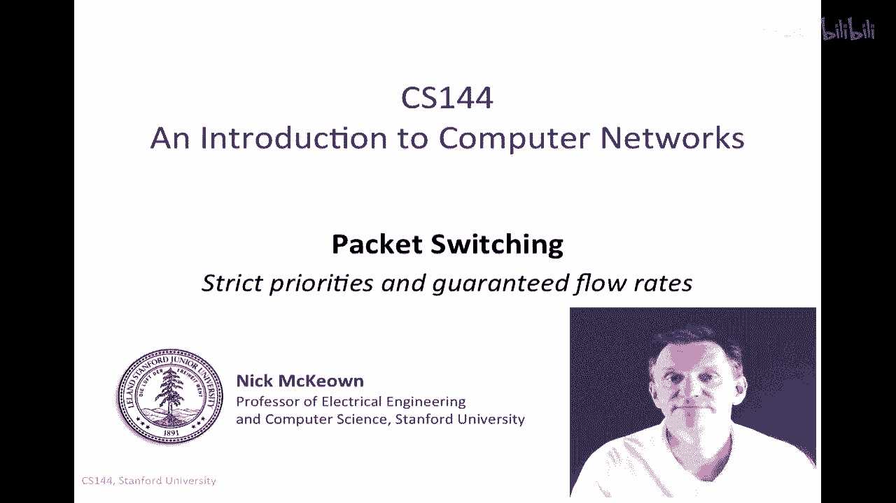
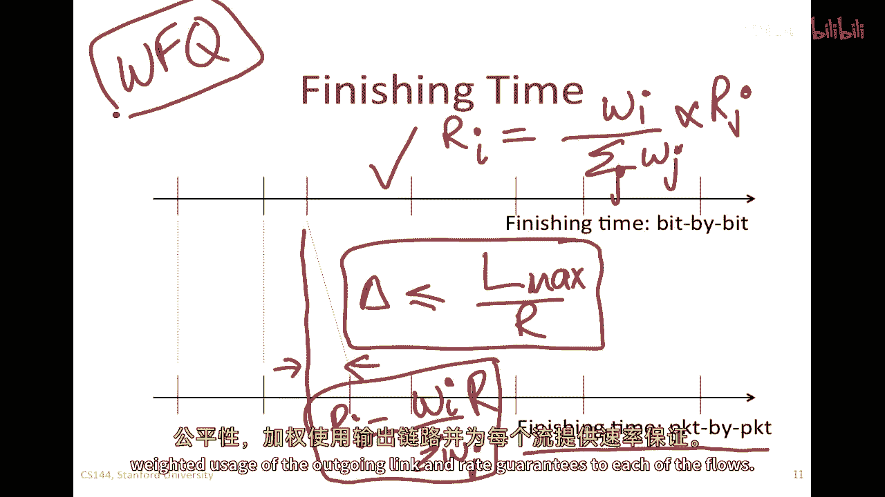
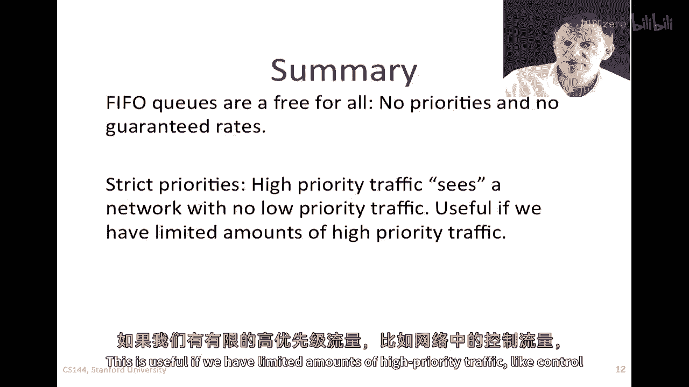
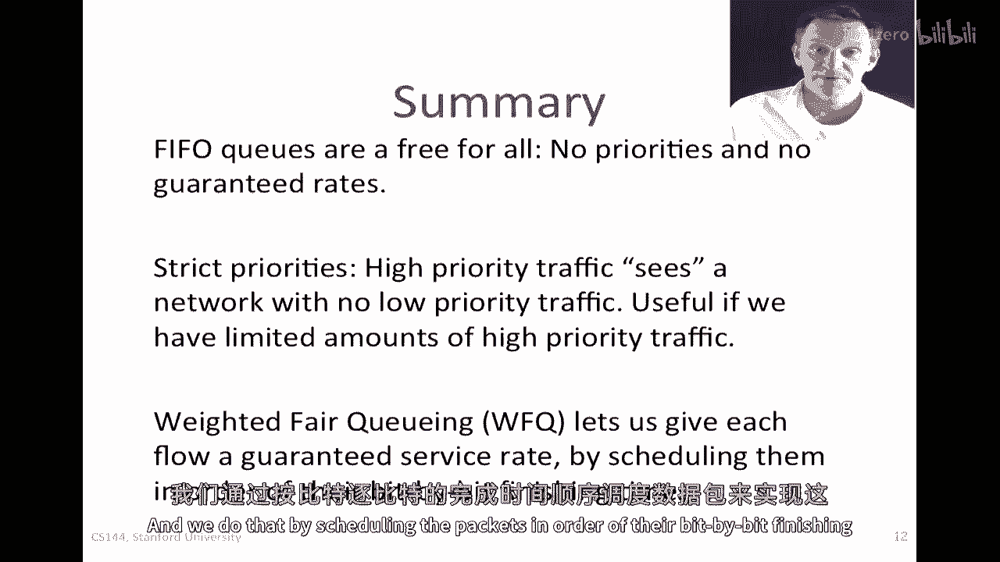

# 课程P48：包交换原理 - 速率保证 🚦

在本节课中，我们将学习先进先出（FIFO）输出队列的缺点，并探讨两种能够提供更好流量控制的替代方案：严格优先级交换机和提供速率保证的交换机。

---

## FIFO队列的缺点

上一节我们回顾了包交换机的基本工作原理。现在，我们专注于输出队列，并分析当它采用FIFO（先进先出）规则时会产生哪些问题。

FIFO队列有时被称为“所有输入的免费竞争区”。如果流向该队列的流量来自多个输入源，那么在任何发生拥塞的时刻，数据包都会在这个FIFO队列中排队。发送速率最高的流将获得输出链路的最大使用份额。

这意味着，如果某个流能够以高速率发送大量数据包，它就可能独占输出链路，而其他低速率的流则可能被完全“挤出”，几乎无法获得服务。这种行为模式鼓励了“不良行为”——每个流都倾向于尽可能快地发送数据包，以最大化自己获得的带宽份额，这对网络整体是不友好的。

此外，FIFO队列无法区分数据包的重要性。无论是紧急的控制流量、重要的视频数据还是普通的背景流量，都按照到达的先后顺序被处理。这可能导致低延迟要求的流量（如实时视频）因为排队在后面而经历高延迟。

关于FIFO队列，有一个有用的观察：如果一个数据包成功进入队列，它在队列中等待的最长时间是 **`B / R`**，其中 `B` 是队列容量（以比特为单位），`R` 是出站链路的服务速率（比特/秒）。这个最大延迟界限在后续分析中会用到。

---

## 两种替代方案概述

鉴于FIFO队列的上述问题，本视频将描述两种替代方案：
1.  **严格优先级**：为特定流量提供更高的优先级。
2.  **速率保证**：为每个流保证一定的输出链路带宽份额或速率。

本质上，我们将把之前简单的单一队列替换为更复杂的调度机制。

---

## 方案一：严格优先级 🥇

在严格优先级方案中，我们将单一队列替换为一个高优先级队列和一个低优先级队列。

当数据包到达时，交换机会根据其包头中的信息（例如IP头中的“服务类型”字段）决定将其放入高优先级队列还是低优先级队列。分类的依据可以是：
*   视频流量比电子邮件更重要。
*   网络控制流量比普通数据流量更重要。
*   付费用户的流量比普通用户的流量更重要。

以下是其工作原理：
1.  数据包根据分类被放入相应的队列。
2.  调度器始终优先服务高优先级队列中的数据包。
3.  只有当高优先级队列为空时，调度器才会服务低优先级队列。

**结果**：高优先级流量完全“看不到”低优先级流量的存在，仿佛拥有一个私有网络。这对于需要绝对优先级的流量（如关键控制信令）非常有效。

**潜在问题**：如果高优先级流量过大，它可能长时间独占链路，导致低优先级流量被“饿死”（完全得不到服务）。因此，严格优先级通常只在**高优先级流量相对较少**的场景下使用。目前许多交换机和路由器都支持此功能。

---

## 方案二：加权公平队列与速率保证 ⚖️

如果我们不希望总是严格偏好某个队列，而是希望为不同流量分配**成比例的、有保障的带宽份额**，就需要更精细的调度机制。例如，我们希望队列1获得的带宽是队列2的两倍。

### 目标与模型

我们的目标是实现**加权公平**。假设有 `N` 个队列，每个队列 `i` 被赋予一个权重 `w_i`。那么，在出站链路总速率 `R` 中，队列 `i` 应获得的保证服务速率 `R_i` 为：

**`R_i = (w_i / Σ(w_j)) * R`** （公式中 `j` 从1到 `N`）

如果所有数据包长度相同，实现起来就很简单：我们可以进行“轮询”服务，每轮依次访问每个队列，并从队列 `i` 发送 `w_i` 个单位的数据（可以是比特或完整数据包）。这样，长期来看，每个队列获得的服务比例就与其权重成正比。

### 挑战：可变长数据包

然而，实际网络中数据包长度是可变的（例如从64字节到1500字节不等）。如果我们按完整数据包来服务，长数据包会占用更长的发送时间，从而破坏权重的比例关系。我们必须考虑包长，以防止长包挤占短包。

### 解决方案思想：按位公平的模拟

我们引入一个思想实验：假设我们可以按比特服务数据包。我们以“轮次”为单位，每轮中，队列 `i` 可以发送 `w_i` 比特。当一个数据包的最后一个比特被服务后，这个完整的包才被认为“完成”并准备发送。

关键问题是：在按包发送的实际系统中，**我们应该以什么顺序发送这些完整的包**，才能最接近按比特服务的理想公平状态？

答案是：按照数据包在**按比特服务模型下计算的完成时间**来排序和发送。

### 完成时间的计算与WFQ调度

1.  **定义**：设数据包 `k` 的长度为 `L_k`，它所属队列的权重为 `w`。如果按比特服务，它开始服务的轮次为 `S_k`，那么其完成轮次 `F_k` 为：
    **`F_k = S_k + L_k / w`**
    （因为每轮它获得 `w` 比特的服务）。

2.  **递归计算**：当一个新数据包 `k` 到达时，它的开始时间 `S_k` 取决于队列中前一个包 `k-1` 的完成时间 `F_{k-1}`，以及它到达时队列是否为空。我们可以取两者中的最大值：
    **`S_k = max(到达时间, F_{k-1})`**
    然后，用上面的公式计算其完成时间 `F_k`。

3.  **调度决策**：调度器维护每个队列队首数据包（即下一个要发送的包）的完成时间 `F`。每次需要发送数据包时，**调度器总是选择所有队列中具有最小 `F` 值（即最早在理想比特模型中完成）的那个数据包进行发送**。

这种算法被称为**加权公平队列（Weighted Fair Queuing, WFQ）**，也称为包基的广义处理器共享（PGPS）。

### WFQ的优势

可以证明，在WFQ调度下：
*   每个队列 `i` 实际获得的长时期平均服务速率 `R_i` 无限接近其保证速率 **`(w_i / Σw_j) * R`**。
*   每个数据包在实际包系统中离开的时间，与其在理想比特模型中完成的时间之差，不会超过 **`L_max / R`**，其中 `L_max` 是网络中的最大可能包长。

这意味着WFQ不仅提供了良好的长期带宽保证，也控制了短期内的延迟抖动。

---

## 总结 📝

本节课我们一起学习了包交换中输出队列调度的核心原理。

1.  **FIFO队列** 简单但存在缺点：它不区分流量优先级，无法提供速率保证，并且可能鼓励流为争夺带宽而采取激进发送策略。
2.  **严格优先级** 通过引入高、低优先级队列，确保高优先级流量（如控制信令）获得即时服务，不受低优先级流量影响。但需注意避免低优先级流量被饿死。
3.  **加权公平队列（WFQ）** 是一种更精细的调度算法。它通过为每个队列分配权重，并按照数据包在理想按比特服务模型下的完成时间（`F_k`）进行调度，从而为每个流提供**有保障的、成比例的带宽份额**。WFQ有效地实现了速率保证，并改善了公平性。

理解这些队列调度机制，是掌握网络服务质量（QoS）和流量管理基础的关键。