# P49：p48 3-10 Packet Switching - Principles Delay Guarantees  (revised) - 加加zero - BV1qotgeXE8D

在这个视频中，我将继续描述分组交换的描述，特别是，我将告诉你我们如何保证延迟，从网络的一端到另一端，这可能会让你感到惊讶，因为在早期的视频中，我正在告诉你队列延迟是变化的，但我们将使用特殊的技术。

这些技术依赖于加权公平队列，这是我们在速率保证视频中学到的。

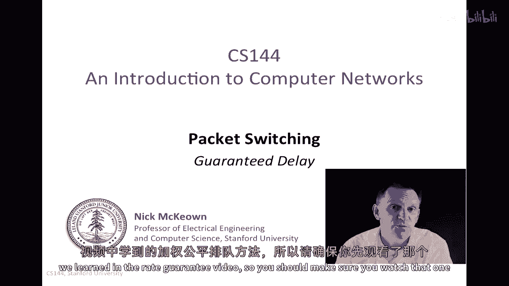

所以你应该先看那个视频，让我从给你一些关于延迟保证如何工作的直觉开始，所以记住我们的端到端延迟方程，它告诉我们从网络的一端到另一端的延迟，作为包化延迟的函数，那就是固定组件的包长度除以速率加上传播延迟。

这是链路的长度除以传播延迟，或光速加上队列延迟，前两个术语定义为网络的固定函数，它们取决于我们可以控制的事情，通常队列延迟不在我们的控制之下，所以如果我们想要提供端到端延迟保证。

那么我们就需要为队列提供延迟，通过网络路径中的每个路由器，好的，所以基本思想是如果我们知道q1、q2和q3的上限，那么我们知道从这个方程中整体上端到端延迟的上限，那么如何做到。

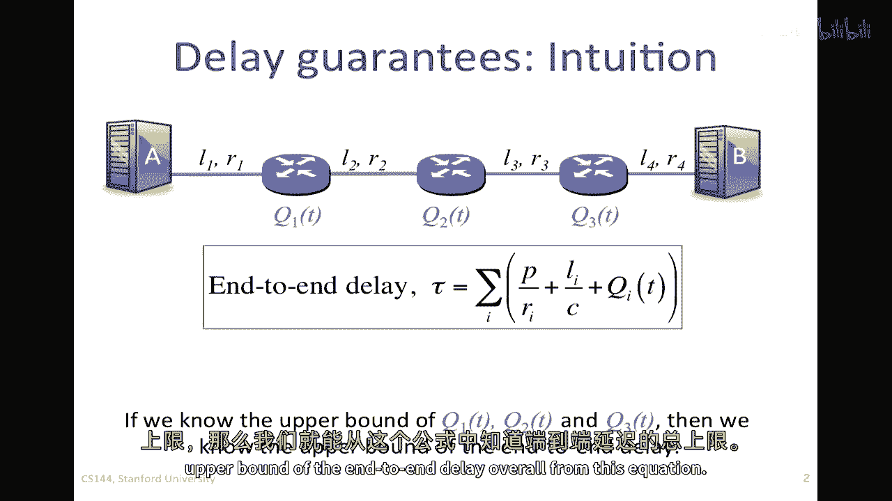

所以如果在路由器中，我知道一个包通过哪些队列，我知道缓冲器的大小，让我们说我正在看要通过这个队列的包，在这里，路由器内部，我知道包将要通过的缓冲器的大小，我知道缓冲器将以何种速率被服务。

然后我知道一个包通过这个路由器的最大延迟，因为WFQ（加权公平队列）我们在速率保证视频中看到的，给了我一个率，R1，然后我可以简单地说，这个路由器的延迟将被限制为，缓冲器大小除以R1，它达到了的速率。

所以，记住R1等于我给的第一个队列的权重除以所有权重的总和，乘以R，所以我可以控制R1，我可以选择B，因此我可以选择路由器的延迟，如何在实践中实现这个，让我们来看看。

我们可以通过已知的事物来控制包的延迟，让我们看一个例子。

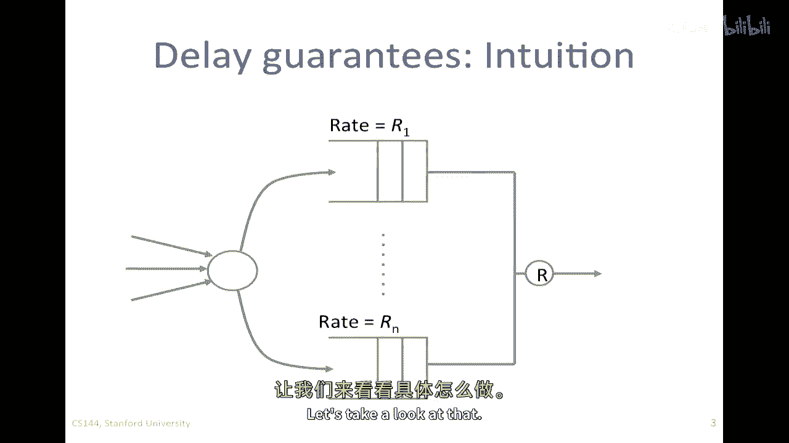

所以我们可以控制从网络中传输的包的延迟，我们已经知道如何控制q的服务速度，使用wfq和每个q的大小，这表明路由器的一个模型，我们在包到达时对其进行分类，所以这是到达的包，我将对它们进行分类。

我将决定它们属于哪个流量，然后我将将它们放入那个队列，所以如果他们进入了这里的另一个队列，那可能是可能的，这将以速率r1被服务，那么这个将是一个率r的n，然后他们会聚在一起，继续前往率r的出站线。

所以如果我能设置这个在正确的率，我可以设置缓冲区的大小，然后我可以控制延迟，到达路由器的任何打包包都将有一个有限的延迟，如果我们正确地使用我们的方程来添加所有延迟的组件。

然后我们可以根据我们所知使其在整个过程中工作，这适用于所有通过整个过程的包，但是这里有一个问题，如果一个数据包以这样的速度到达，以至于在这里的缓冲区溢出并掉入地下，换句话说。

只是因为到这个队列的到达过程，我们就会填满这个缓冲区，所以，这就是我们必须解决的问题，因为端到端的意义在于，延迟保证，如果数据包在路上被丢弃，那不是真正的延迟保证，所以我们需要找出如何。

如何防止这个缓冲区溢出，如果我们能做到这一点，那么我们就解决了我们的整体问题，那么如何确保没有包被丢弃。

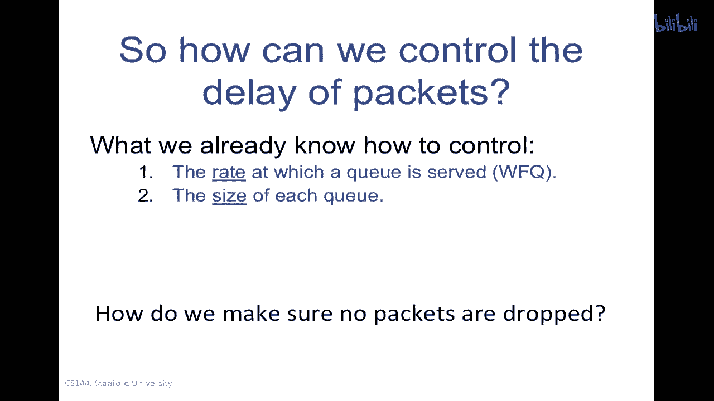

所以我们将聚焦于一个线索并查看这一点，我们将返回之前看到的东西，那就是我们对队列动态的简单确定性模型，所以你会记得对于这样的队列，我们可以将其建模为累积字节，所以累积位或字节，实际上，我会说比特。

因为它将使解释作为时间的函数更容易，所以这是时间演化，嗯，你记得我们说我们有累积到达过程，这可能看起来像这样，然后我们将有累积离开过程，这将是队列为空时的时间，我们将以固定的速率服务它，然后它会暂停。

直到有足够的累积，一些累积的，然后如此等等，然后它会暂停，因此，到这个点，速率稍微低于到达率，所以，我们有关于t的到达过程的一个样本，累积到达过程，在这里，我们有关于t的累积离开过程的d，你记得。

如果我们对通过这个队列的个别包的延迟感兴趣，或者在这种情况下，个别位，我们取水平距离，这是位到达的时间，这是位离开的时间，因为我们有一个fifo队列，然后，关于t的延迟d只是水平距离。

我们需要的缓冲器的最大尺寸，就是它们之间的最大水平距离，因为那是到达和离开的最大距离，所以，如果垂直距离增长得太大，增长到大于b，所以这里就是q(t) right，我们在一个时间点q(t)中拥有的量。

如果q(t)增长到等于或大于b，那么我们将有包被丢弃到地板上，我们如何确保这不会发生，这就是我们接下来要考虑的，正如我所说，如果我们能解决这个问题，那么我们就可以通过路由器提供所需的延迟保证。

我们处理的方式是，如下，我再次绘制这个，嗯，这个确定性队列模型，所以这是，嗯，这是我们的，我现在只专注于到达过程，所以这是一个累积到达过程，A(t)，它只需要是非递增的才能被，嗯，被认为是可能的。

我们将说在任何时间间隔内，在任何时间间隔内，让我们取一个时间间隔像这样，如果我们可以保证在时间间隔t内不超过b加上r一次，其中t是时间间隔，我们可以说在时间间隔t内不超过b加上r一次位到达。

然后缓冲器不可能溢出，所以这将适用于任何时间间隔，T，因为我们知道以率r在流失，在时间t后，会以率r的t离开，我们只需要确保我们没有积累超过b，在任何时间间隔内，所以如果我们将这个t设置为任何值。

只要我们从未违反这个，那么我们就可以确保我们从未溢出队列，换句话说，t的a，在时间t加上资本t减去占用或累计到达，当时间t小于或等于这里定义的表达式时，B加上r乘以t。

所以如果我们能确保这个保证得到满足，换句话说，这里定义的表达式得到满足，那么队列永远不会溢出，所以我们知道延迟是保证的因为我们以率r服务，我们已经给了到达过程a的t相当大的灵活性。

我们限制它以确保它必须符合这个要求，在这个时间内，不超过b加上r一个t，但我们已经给它在一些方面留出了灵活性，所以让我们更深入地看看这个。

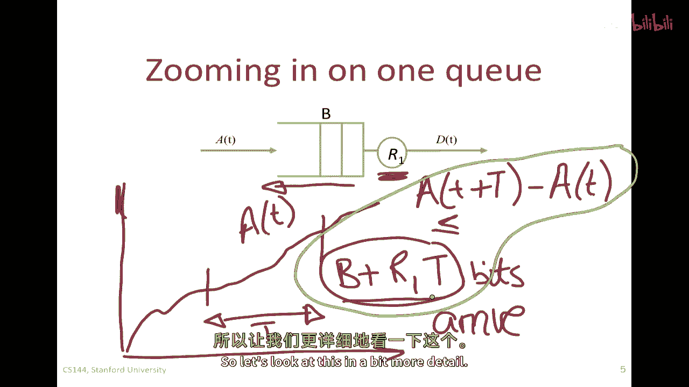

在更多的细节中，我们将限制交通，我们将使用一种相对知名的技术来执行此操作，有一种被称为sigma行调节的技术，我会告诉你什么是sigma调节，它基本上是一个想法，我只是我只是告诉你。

如果这个蓝色的曲折线在这里是我们的到达过程，我们的累积到达过程，A of t，我要说，在任何长度期间可以到达的位数，T被限制为加上sigma加上rt，所以这就是像我的b加上行一t方程一样。

现在我们可以这么想，在任何时间，我们可以画这个sigma加上行，Sigma plus rt由这条蓝色的线表示，我们可以从任何点开始，你可以看到，基本上在说，如果我们在任何一点的t上着陆。

未来的t必须在那条线以下，所以无论我们从哪里开始，无论我们滑动这个，它必须总是，t的a必须总是位于其下方，如果这是真的，那么这个方程就成立，我们称t的a是sigma rho调节的，你可以看到。

t的一部分有很大的灵活性，关于它如何适应，那就是它必须从不同的一点开始永远不会超过它，所以在我们的例子中，sigma等于b和rho等于r一，我之所以告诉你关于sigma行规制的事情。

是因为你在教科书中经常看到它被描述为sigma行规制，在我们的例子中，我只是恰巧使用b和r一为q。

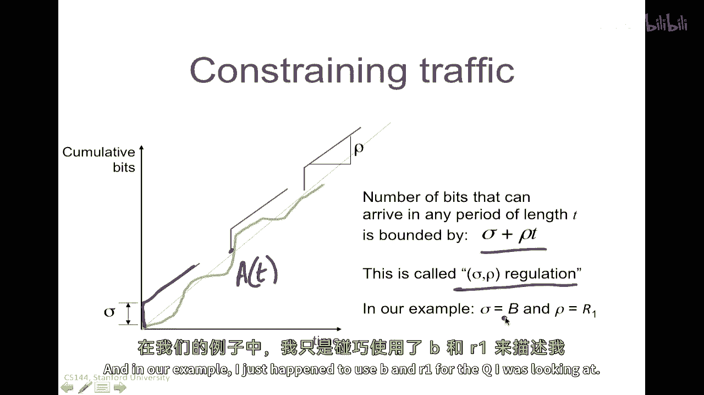

我正在研究，可以重复强调这一点，那么如果我有约束的sigma行到达率和最小服务率，所以这里的最小服务率是r one，这是队列被服务的速率，我在这里有一个累积到达过程，就是绿色的蓝色线。

然后这里有一个离开的过程，红色的线，我将约束t的一部分，总是低于这个sigma行线，sigma加rt线，记住，这个约束必须在所有时间内保持，无论我从哪里开始sigma加rot，所以如果我沿着它滑动。

例如，从这里开始，从这里开始，在所有那些情况下都必须是真实的，但如果我做那样，那么我知道t的a和t的d之间的距离小于，这个蓝色线和t的d之间的距离，因此，我可以同时限制bam max和d max。

这是q占用率的最大值，我需要永远不会溢出，并且d max是任何比特通过队列的最大延迟，因此，总结来说，为了没有包丢失，我需要b大于或等于sigma，如果我的服务率大于这一行。

那么延迟小于或等于b除以r one，所以我现在已经限制了延迟，基于我可以控制的事情，B和r仍然没有告诉我我怎么做这件事，它只告诉我如果我能限制一个t，然后这一切都会保持，所以我接下来要告诉你的是并描述。

是如果流量是我们要叫的漏斗约束，并且路由器使用加权公平队列，然后端到端延迟保证是可能的，那么这个漏斗约束是什么，嗯，原来漏斗是实现sigma o调节器的东西，因此，使这一切都能工作。

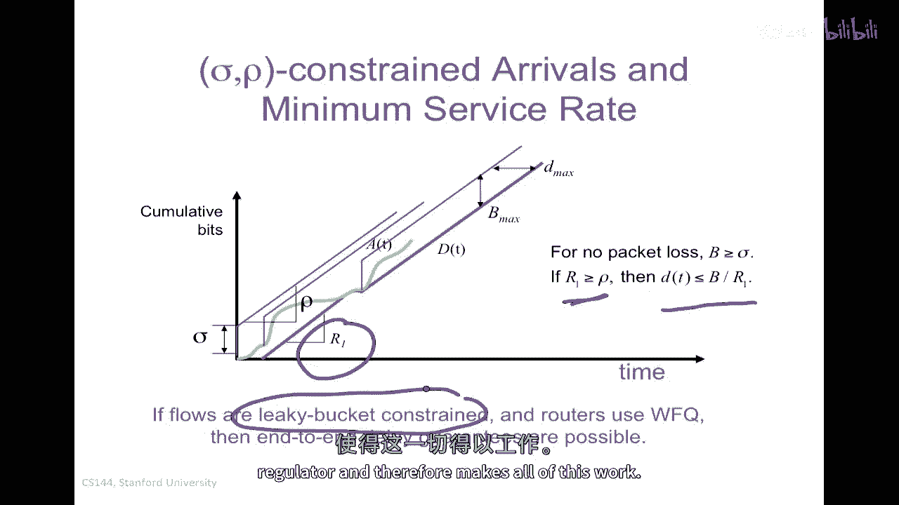

让我们来看看那个漏水的桶是什么，所以，漏水桶调节器看起来像这样，包将会到达，所以，我的包在这里到达，它们将进入包缓冲区，规则是，我可以发送，或者我可以从缓冲区中取出包。

只有在有足够的标记并且标记在这里被提供时，以特定的速率行，并且标记桶的大小是sigma，所以这里的标记只是调度机制，标记不会发送到网络上，这个标记桶只是持有和实现的一种方式，限制流量的调度机制。

所以这是我们在源端要做的事情，在发送包线以下的时候，我们将确保它们符合sigma行约束，使用漏斗桶调节器，它可以将它们发送到网络上，如果和只有标记桶中有足够的标记，所以它会积累一个包含爆发的速率行。

换句话说，在那个桶中它最多可以有sigma，然后它会发送一个包，如果存在足够的令牌允许发送大小为该包的包，所以如果令牌是以位为单位的，那么你需要有足够的令牌来代表你想要发送的包，一旦你发送它们。

然后你会消耗令牌，你需要等待更多的被放入，并且你可以看到如何，这将确保我们允许的最大爆发量为sigma，但在长期速率上，只有一条行，因此这将满足我们想要满足的约束，因此将它们全部放在一起。

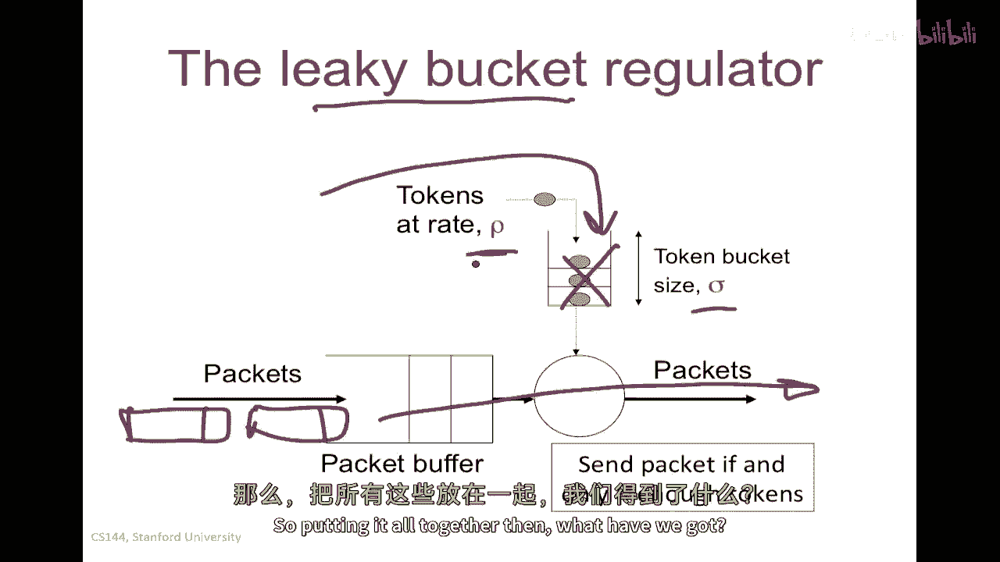

那么我们有什么，我们有一个受限于sigma的行的交通流量，所以这将是我们的受限于sigma的行的交通流量进入，这是从我们的漏水桶出来的，嗯在每个，每个路由器都将运行w f q加权队列。

为了确保我们对特定流获得服务率r1，并且缓冲区至少需要b大小，并且在每个地方，所以我们在这里会有r2和b，并且在路径上，我们将包并确保它们被放入正确的队列，那就是以那个速度被服务的。

所以我们称之为包分类，将其放入正确的队列，然后最终它会找到它的路，然后，我们可以使用我们的端到端延迟方程，为了计算路径上的总延迟，所以你可能想知道这些sigma和row的值如何被告诉路由器和源。

以及r one和b的值，以及r two和b的值如何被告诉路由器和源，所以有，实际上有一种协议用于设置这个，最初，这就是被称为rsvp或资源预留协议的东西，并且有一个rfc，它将告诉我们我们应该做什么。

这是第二句，二，零五，你可以在任何教科书中找到这个，你可以去查看rfc，或者在维基百科中查找它，你会找到这个的一个好描述，所以这就是我们首先如何将这些值填充到这些字段中的，它是如何从端到端实现的。

控制系统能够沿着路径安装这些值。

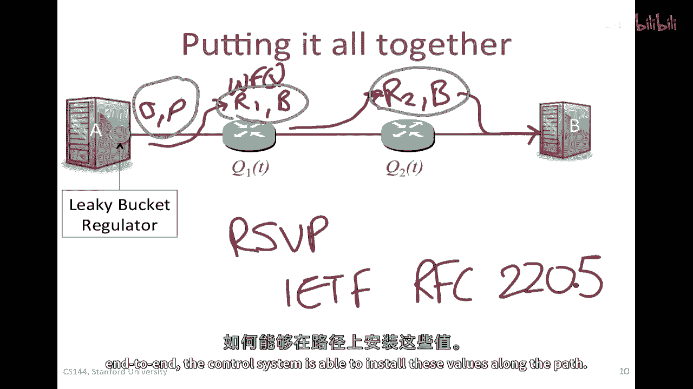

那么让我们来看看这个例子的实现方式，想象一下，在下图中我们想要，我们希望一个应用能够以每秒十兆比特的速度发送，并且端到端的延迟小于五毫秒，当它发送千字节的包时，让我们看看如何做到。

所以首先让我们计算固定的部分，因为对于端到端的固定部分我们无能为力，这将由打包延迟和传播延迟组成，所以让我们来看看打包延迟，端到端的第一次打包和延迟将很好，它是所有链接的打包延迟之和，所以。

在第一个链接上，我正在发送一千字节的包，所以，它们是一千倍，八位除以他们将在第一个链接上传输的速度，这是一，嗯，一吉比特每秒，所以，那是10的9次方，然后嗯，再加上哦，再加上我需要，嗯。

对于每秒一百兆比特的千字节数据包，也是一样的，这相当于十的八次方，然后我在这里也会有同样的东西，所以我只是乘以二，因为最后一个链接是一样的，然后我有了传播延迟，所有这些链路的传播延迟，这将是，嗯。

链路的长度，这是由速率除以的，所以我总共有一百二十公里，一百二十公里，所以那是十的十的三次方米，除以传播速度以速度，我假设这就是两的十的八次方米每秒，所以如果我将这些两个相加，我已经做了那个。

这出来是0。6965696965696966毫秒，所以我有一个固定的传播延迟为0。696569毫秒，因此，我需要路径上所有队列延迟的总和，不超过那个和5毫秒的差，所以那需要小于等于4。03，三零，毫秒。

好的，所以我们要记住这个数字，因为我要清除这个，然后我们将找出如何使这工作，所以让我们选择将延迟，那些是队列延迟均匀地，在两个路由器之间分配，实际上，我可以以任何方式做，我想要它会使数学更容易，如果我。

如果我均匀分配它，换句话说，它将是，嗯，大约两毫秒对于每个一个。

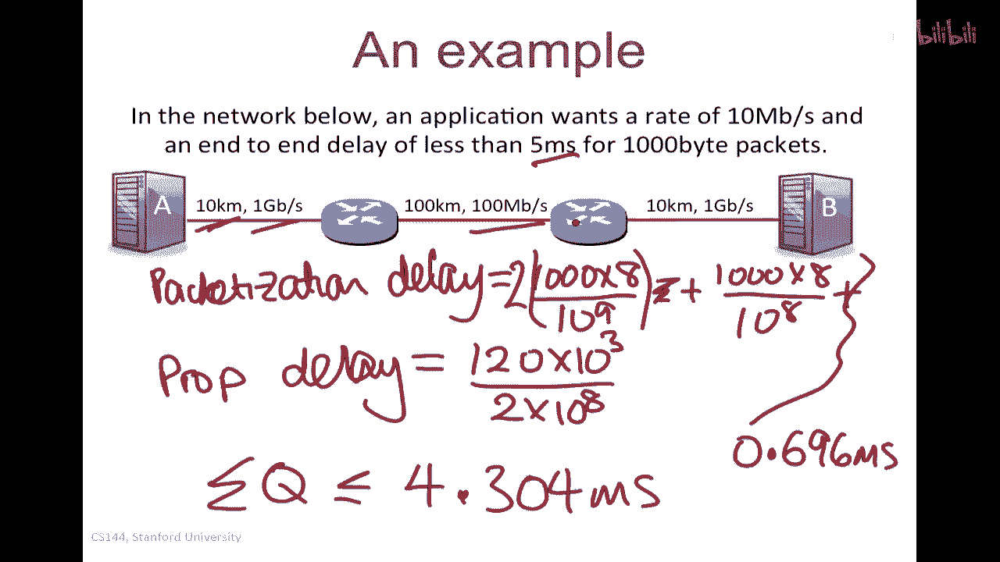

所以让我们清除那个，所以我将使它，所以通过这个延迟的延迟是，嗯小于或等于2。1，嗯，是什么，152毫秒，这里是一样的对吧，所以我只会画那个，那是相同的值，现在我知道流量的速率，它是10兆比特每秒。

所以我知道队列将被服务的速率，这将是10兆，10兆比特每秒，我正在试图找出b应该多大，缓冲区应该多大，所以缓冲区的大小应该是，每个缓冲区都需要足够大，这样我就不会丢失任何东西。

所以它必须大于每秒十兆比特，因为那就是它将被服务的速度，乘以，一个比特通过它的时间，嗯，我们已经知道那是两点，一五二毫秒，好的，因此，最终结果为两千，这是多少二十一千五百二十位，嗯。

这相当于两千六百九十字节，所以我大约有三包延迟的值，这基本上告诉我的是使用加权加权公平队列，我将以每秒十兆比特的速度为这些队列服务，我知道我需要这样做，以便系统满足每秒十兆比特的要求。

我会为每个路由器分配一个缓冲区，至少为两点，六九两千，那些路径上的每个字节都是六百九十字节，然后如果我把所有的延迟加起来，我的总体端到端延迟将小于或等于五毫秒。

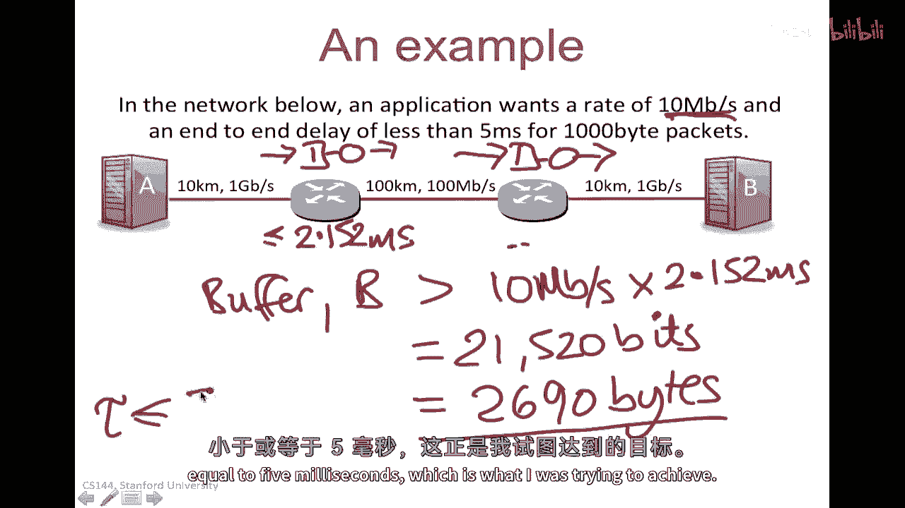

这就是我想要达到的目标，所以实际上就像我向你展示的那样，从技术上讲提供这种端到端延迟是可能的，但实际上很少有网络实际上控制端到端延迟，换句话说，这在实践中并不广泛使用，为什么那样呢。

结果发现让它正常运行并不容易，它需要所有玩家的协调，所有的网络运营商，沿途的路由器，在实际应用中，这并没有真正得到推广，在大多数网络中，过载和交通优先级的组合，因此。

对需要特殊处理的流量给予高优先级已经证明足够好了，在大多数情况下，我想要告诉你这个，因为如果你能理解这个加权公平队列机制的工作原理，以及我们如何提供端到端的延迟，保证你对包交换网络队列动力学的理解很深。

而且，这些想法在未来的一些网络中可能会被使用，所以对你们来说应该是有用的。

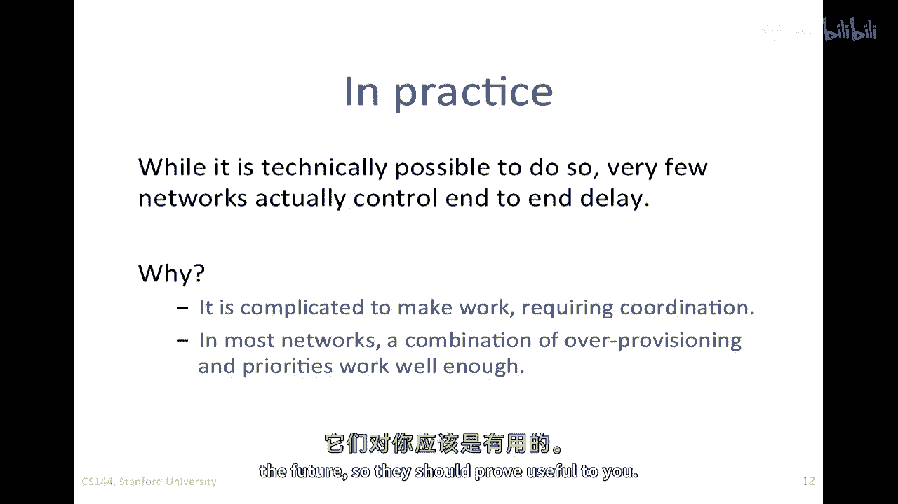

因此，总的来说，如果我们知道队列的大小和服务率，那么我们可以延迟，我们可以通过它来限制延迟。

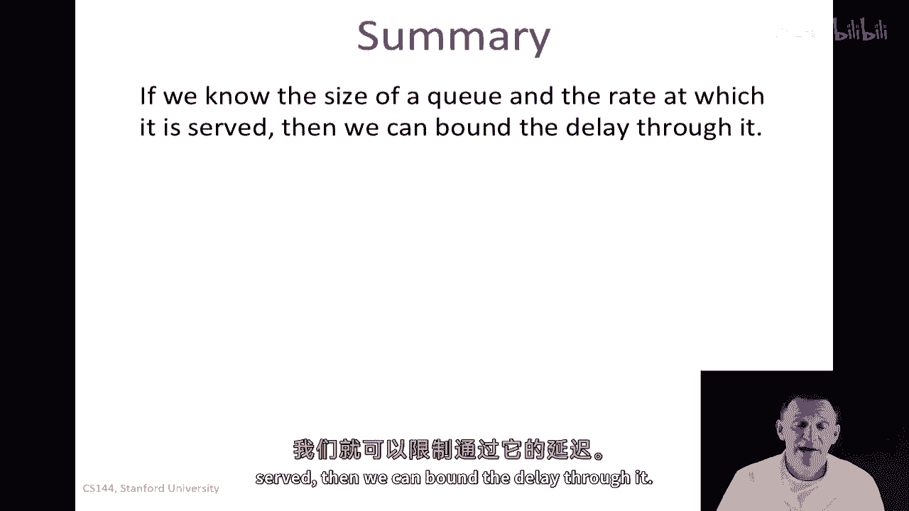

我们可以选择队列的大小，并使用加权公平队列。

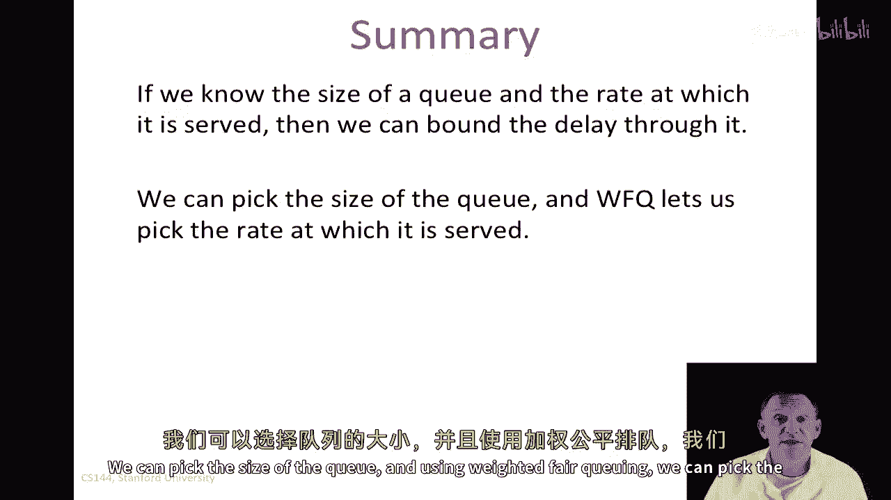

我们可以选择队列被服务的速率，因此我们只需要一种方法来防止沿途的包被丢弃，为此我们使用漏斗桶调节器，因此我们可以因此限制端到端的延迟。

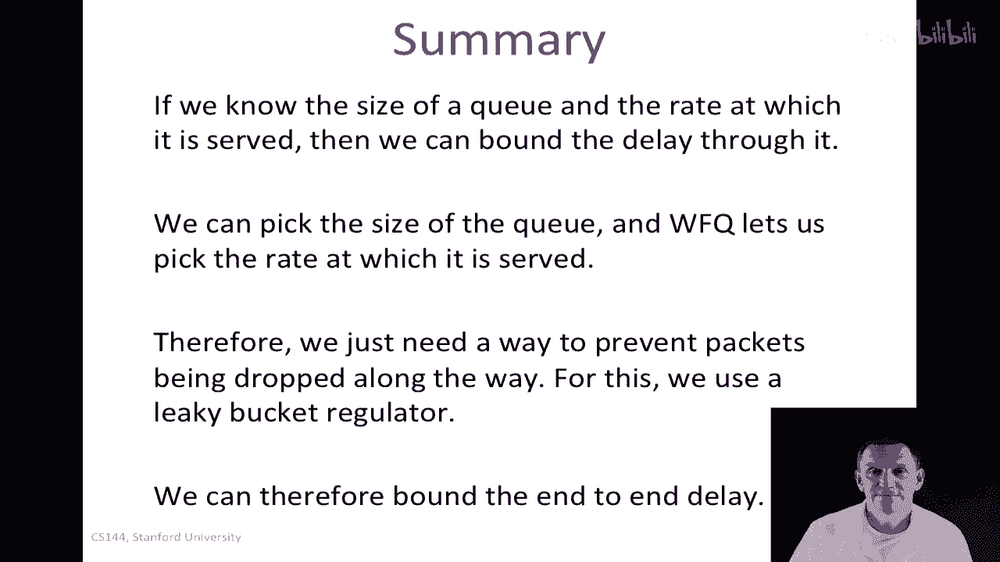