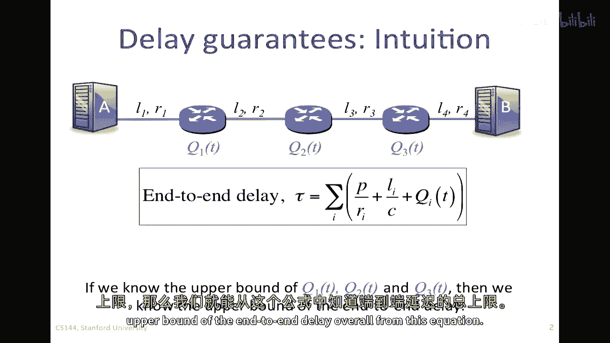
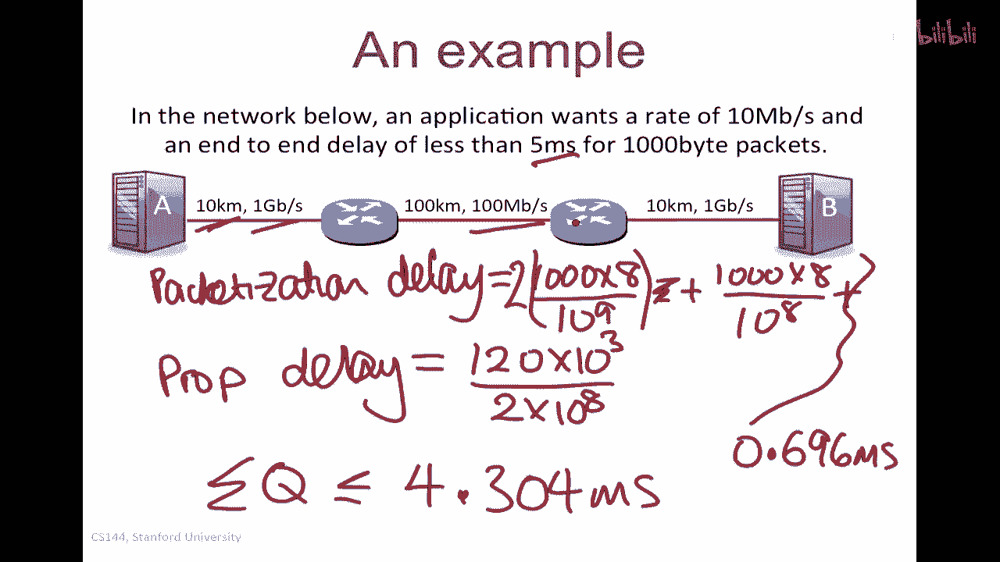
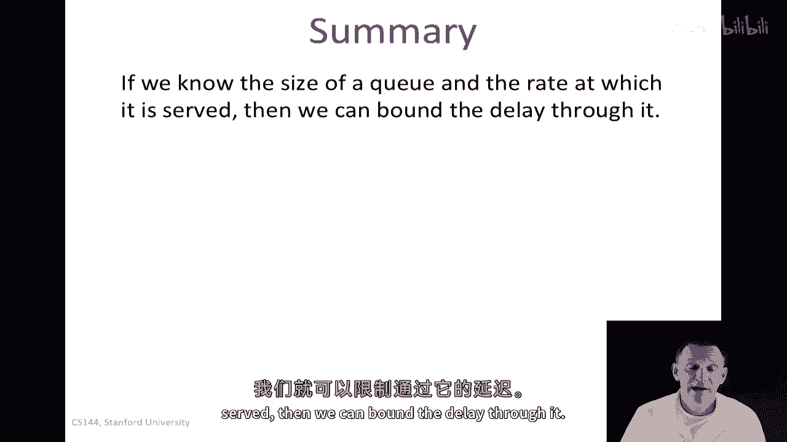

# 课程 P49：分组交换原理 - 延迟保证 🕒

在本节课中，我们将学习如何为分组交换网络提供端到端的延迟保证。我们将探讨如何控制队列延迟，并介绍实现这一目标的关键技术。

---

## 概述

在之前的课程中，我们了解到队列延迟是变化的。然而，通过特殊的技术，我们可以为数据包从网络一端到另一端的传输提供延迟保证。这些技术依赖于**加权公平队列**。

---

## 端到端延迟方程

首先，回顾端到端延迟方程。该方程描述了数据包从网络一端到另一端的延迟，它是以下分量的函数：

*   **包化延迟**：固定分量，等于包长度除以传输速率。
*   **传播延迟**：固定分量，等于链路长度除以光速。
*   **队列延迟**：可变分量，通常不受我们直接控制。

公式表示为：
`端到端延迟 = (包长度 / 速率) + (链路长度 / 光速) + 队列延迟`

为了提供端到端延迟保证，我们需要控制路径上每个路由器的队列延迟。

---

## 控制单个路由器的延迟

上一节我们介绍了端到端延迟的构成，本节中我们来看看如何控制单个路由器的队列延迟。

基本思想是：如果我们知道路径上每个队列延迟（q1, q2, q3...）的上限，那么整体端到端延迟也就有了上限。

在路由器内部，通过**加权公平队列**，我们可以为特定队列分配一个保证的服务速率 **R1**。如果我们同时知道该队列缓冲区的大小 **B**，那么数据包通过该路由器的最大延迟就被限制为 **B / R1**。

**核心概念**：
*   服务速率 **R1** 由 WFQ 权重决定：`R1 = (队列权重 / 所有权重之和) * 链路总速率 R`
*   最大队列延迟：`D_max ≤ B / R1`

因此，通过选择缓冲区大小 **B** 和利用 WFQ 控制服务速率 **R1**，我们可以控制单个路由器的延迟。

---

## 防止数据包丢失

仅仅控制延迟还不够。如果队列缓冲区溢出导致数据包被丢弃，就无法实现真正的“保证”。因此，我们必须确保缓冲区不会溢出。

以下是实现这一目标的关键思路：

我们使用一个简单的确定性队列模型来分析。累积到达过程 A(t) 和累积离开过程 D(t) 之间的垂直距离代表队列占用 Q(t)，水平距离代表延迟 d(t)。

为了防止溢出，我们需要确保在任何时间间隔 T 内，到达的比特数不超过 **B + R1 * T**。其中 B 是缓冲区大小，R1 是服务速率。

如果这个条件始终满足，那么队列永远不会溢出，且最大延迟 d_max 也受限于 B / R1。

---

## 流量整形：漏桶算法

那么，如何确保数据流满足“在任何时间间隔 T 内，到达量 ≤ B + R1 * T”这个条件呢？答案是通过**流量整形**。

一种广泛使用的技术是 **σ-ρ 调节**，其中 σ 代表允许的突发量（对应缓冲区大小 B），ρ 代表长期平均速率（对应服务速率 R1）。满足此约束的流量称为“σ-ρ 调节”流量。

在实践中，常用**漏桶算法**来实现 σ-ρ 调节。其工作原理如下：

1.  令牌以固定速率 **ρ** 生成，并存入一个容量为 **σ** 的令牌桶中。
2.  数据包到达时，必须从桶中取出等同于其大小的令牌才能被发送。
3.  如果令牌不足，数据包必须等待或缓存。

**漏桶机制**确保了输出流量符合 σ-ρ 约束，即长期速率不超过 ρ，且最大突发量不超过 σ。

---

## 端到端延迟保证系统

现在，我们将所有部分组合起来，构建一个完整的端到端延迟保证系统。

1.  **流量源端**：使用**漏桶调节器**对发出的流量进行整形，使其符合约定的 (σ, ρ) 参数。
2.  **网络路径上的每个路由器**：
    *   使用**加权公平队列**为该流量对应的队列分配保证的服务速率 **R_i**（需满足 R_i ≥ ρ）。
    *   为该队列配置足够大的缓冲区 **B_i**（需满足 B_i ≥ σ）。
3.  **延迟计算**：端到端总延迟是固定延迟（包化延迟+传播延迟）与所有路由器队列延迟上限之和。每个路由器的队列延迟上限为 **B_i / R_i**。

通过这种方式，只要流量源遵守约定，网络就能提供有上限的端到端延迟保证。像 **RSVP（资源预留协议）** 这样的协议就是用来在端到端之间协商和设置这些参数（σ, ρ, R_i, B_i）的。

---

## 实例分析

让我们通过一个例子来具体了解如何计算。

**目标**：一个应用希望以 10 Mbps 的速率发送 1 KB 的数据包，并要求端到端延迟小于 5 ms。

1.  **计算固定延迟**：
    *   包化延迟：根据链路速率分别计算 1 KB 数据包在每条链路上的传输时间，然后求和。
    *   传播延迟：总路径长度 (120 km) / 光速 (2e8 m/s)。
    *   假设计算出的总固定延迟为 0.97 ms。

2.  **分配队列延迟预算**：
    *   可用于队列的总延迟 = 5 ms - 0.97 ms = 4.03 ms。
    *   假设路径上有 2 个路由器，为简化，将延迟预算平均分配，每个路由器允许的最大队列延迟 **D_max** ≈ 2.015 ms。

3.  **计算路由器所需缓冲区大小 B**：
    *   已知服务速率 R1 = 10 Mbps，最大延迟 D_max = 2.015 ms。
    *   所需缓冲区大小 **B ≥ R1 * D_max** = 10e6 bps * 2.015e-3 s ≈ 20150 bits ≈ 2.46 KB。
    *   因此，每个路由器需要为该流量队列配置至少约 2.5 KB 的缓冲区。

通过以上设计和配置，可以满足端到端延迟小于 5 ms 的要求。

---

## 总结与现状

本节课中，我们一起学习了为分组交换网络提供延迟保证的原理：

1.  通过**加权公平队列**控制队列的服务速率。
2.  通过设置合适的**缓冲区大小**，并结合服务速率，可以限制单个队列的延迟。
3.  通过**漏桶调节器**对流量进行整形，防止其超过约定参数，从而避免缓冲区溢出和数据包丢失。
4.  将上述机制结合，并在整条路径上协调实施，即可提供有上限的**端到端延迟保证**。

需要指出的是，尽管这种理论是完备的，但在实际互联网中并未大规模部署。因为它需要全网设备（运营商、路由器）的协同工作，实施复杂。目前，互联网主要依靠**流量优先级**和**过载控制**的组合来为关键应用提供“足够好”的服务质量。

然而，理解这些原理对于深入掌握网络队列动力学至关重要，并且这些思想可能在未来的新型网络（如确定性网络）中得到应用。