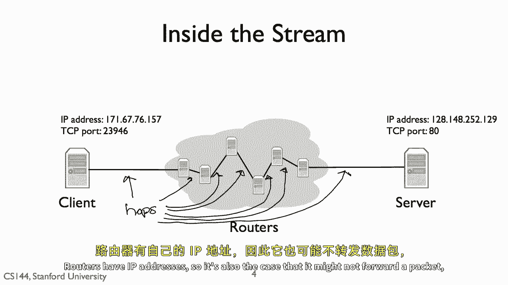
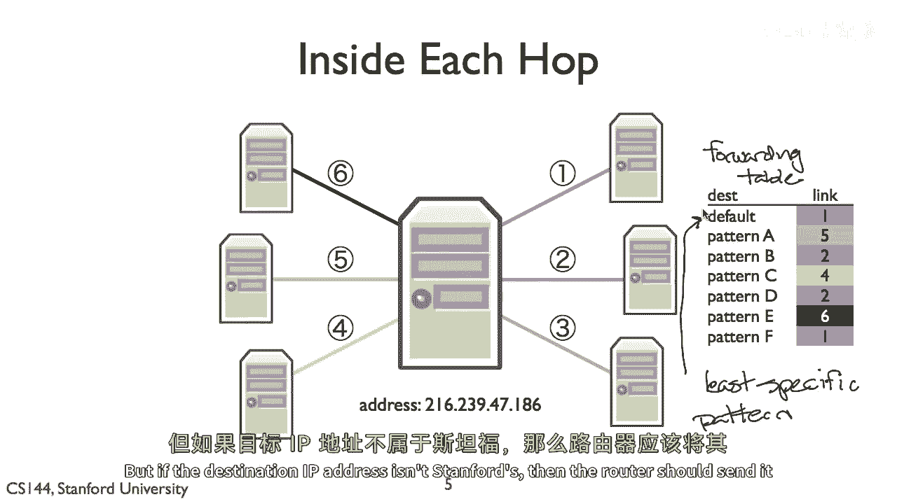
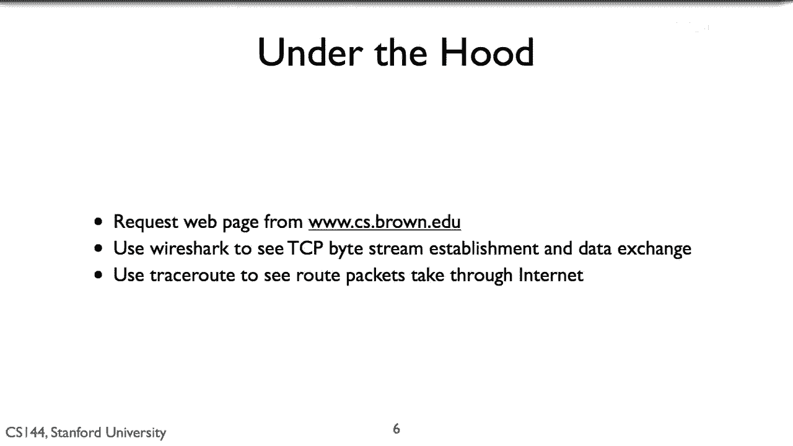
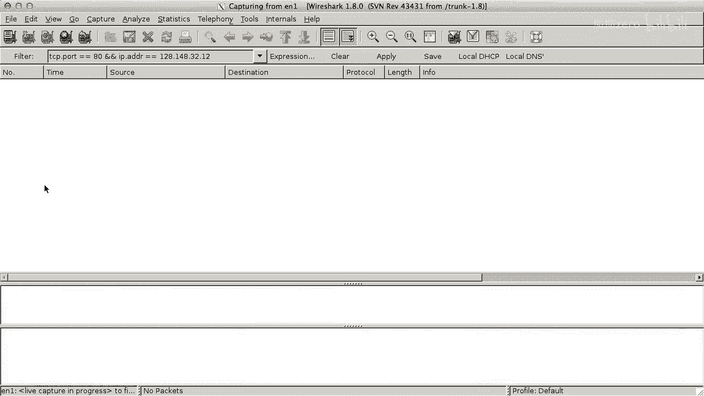

# P5：p4 1-4 A Day in the Life of a Packet - 加加zero - BV1qotgeXE8D

互联网的四层模型从应用层接收一个数据流，传输层将数据流分解为可靠的数据段，并将其送达应用，运行在另一台计算机上，传输层将这些段作为网络层包发送，网络层将这些包送达另一台计算机。

让我们看看这在实际中的样子，一个Web浏览器和服务器发送和接收的实际包，首先，让我们看看传输层，几乎所有的Web流量都是通过，TCP是传输控制协议，在其典型操作中，有一个客户端和一个服务器。

服务器监听连接请求以打开连接，客户端发出连接请求，服务器对此做出响应，我不会详细解释这是如何工作的，但事实证明，这种交换需要三个消息，被称为三步握手的东西，消息的第一步是当客户端向服务器发送同步消息时。

常常被称为罪，第二步是当服务器响应同步消息时，这也承认了客户端的同步，或一个同步和确认消息，常常被称为同步，第三步也是最后一步是当客户端响应确认服务器的消息时，同步，常常被称为一个动作。

所以常常将三个握手描述为同步，同步和确认，确认或同步动作，记住，网络层负责将数据包送达计算机，但是，传输层从网络层的角度来看，负责将数据送达应用程序，在同一台计算机上发送到不同应用的数据包看起来相同。

这意味着要向另一个程序打开tcp流，我们需要两个地址，第一个，是互联网协议地址，是网络层用于将数据包送达计算机的地址，第二个，TCP端口，告诉计算机软件将数据交付给哪些Web服务器。

通常运行在TCP端口八十，因此当我们连接到Web服务器时，我们将IP数据包发送到计算机，运行目的地IP地址为该计算机的Web服务器，那些IP数据包有TCP分段，目的地端口为八十的分段。

但那些IP数据包如何到达目的地，我没有直接线将我的客户连接到服务器，然而，我的客户连接到一个中间电脑，一个路由器，这个路由器本身连接到其他路由器，客户端和服务器之间的IP包需要经过多个跳转。

一个跳转是一个路由器之间的连接，因为我的客户在一个Wi-Fi网络中，第一个站点，第一个跳转是无线的到Wi-Fi接入点，接入点有一个有线连接到更广泛的互联网，所以，它为我的包开辟了道路。

我客户的数据包沿着这条有线跳点传输，路由器可以有许多连接它自身的链接，每当一个数据包到达，路由器将决定将其发送到其哪些链接上，路由器有IP地址，因此，也有可能它不会转发一个数据包。

而是将其交付给它自己的软件，例如，当你使用TCP登录路由器时，IP数据包目的地是路由器自身的IP地址，路由器如何做出这个决定，它通过被称为转发表的东西来实现，如图右所示，转发表由一组IP地址模式组成。

并对每个模式有一个链接用于转发，当包到达时，路由器检查哪个转发表条目的模式最匹配包，它将包沿着该条目的链接转发，一般意味着最具体的匹配最好，我将在关于最长前缀匹配的视频中更详细地描述匹配工作。

但在这个简单的例子中，让我们只考虑默认路由，表格上的第一个条目，默认路由是最不具体的路由，它匹配所有有效的IP地址，如果当一个数据包到达时，没有比默认路由更具体的路由，路由器将仅使用默认路由。

默认路由在边缘网络中尤其有用，例如，例如，你有斯坦福大学，并通过路由器连接到更大的互联网，你的路由器将为斯坦福网络的IP地址有许多具体路由，通过此链接将数据包发送到工程学校。

通过那个链路将数据包发送到图书馆，但是如果目的地IP地址在斯坦福的，那么路由器应该将其发送到更大的互联网。

所以现在让我们来看看网络中的一些IP数据包，我将从www dot brown请求一个网页，edu，并使用称为wireshark的工具来显示所有数据包。

我们将看到如何我的Web浏览器与布朗Web服务器建立TCP连接，使用SYN-SYN-ACK的三重握手，然后它开始发出HTTP GET请求，服务器对此做出响应。

一旦我们看到了我客户端与布朗大学web服务器的数据包交换，我会使用另一个工具叫做trace route，来观察这些数据包通过互联网的路径。

所以首先我会启动wire shark，因为我的电脑正在使用许多网络应用并发送大量的不同数据包，我会告诉wireshark只显示到布朗服务器的tcp分段，使用端口八十，这样我们只会看到我生成的web流量。

我还会告诉wire shark监听一个，那就是我mac给我的wi fi链路层的名称，正如你所见，我有许多链路层可用，但让我们只看一个。

因为这是我连接到互联网的方式。

我会打开我的网页浏览器并请求布朗大学计算机科学部门的网页。

这是我作为大学生的地方，所以我喜欢关注部门的新闻，在Wireshark中，加载此页面涉及发送和接收大量的包，Wireshark显示每个包的时间戳，源IP地址，目的地IP地址，使用其长度的协议是什么。

并进一步信息，让我们先看看这个第一个包，它是来自地址为一条的我的电脑，二点一六八，那是零点一零六，到地址为一二点八四八的棕色cs web服务器，三十，四十八，两点一二，它将连接到TCP端口八十。

服务器的超文本传输协议端口，我们可以从info列表中的hp字段看到，数据包是sim数据包，三步握手的第一步，看这些前三个数据包，第一个是从我电脑到Web服务器的sin。

第二个是从Web服务器回到我电脑的sin响应包，第三个是从我电脑回到Web服务器的响应，这是TCP/IP握手的三步，现在，两台电脑可以交换数据，你可以看到，第一个数据包是一个AC-to-PT请求。

我的电脑向Web服务器发送GET请求，对这个GET请求的响应是三个包，Wireshark在接收到第三个包时显示响应，如图所示，该包的信息是HTTP，一点一，二百OK，所以。

我们可以看到如何从我的电脑请求，来自布朗计算机科学服务器的Web页面创建一个TCP连接到握手的三步，三个TCP握手的三个IP数据包，然后，更多的数据包用于ATP请求和响应。

这就是网络从终端角度看起来样子，托管计算机，当他们在网络层交换数据包时，但网络层内部看起来什么样子，这些数据包需要经过多少跳才能看到这个，我将使用第二个工具。

traceroute trace route，显示数据包到目的地所经过的跳数，所以我们可以输入traceroute，访问www。cs。brown。edu以查看互联网上的路径，我会添加-dw标志。

它指定一个超时时间，超时时间为一秒，数据包首先跳转到我的无线路由器，第一个跳转的IP地址是1，92。1。68。0，点，零点一，正如你看到的那样，从下一个跳点，我在家，我有有线调制解调器。

并且我的互联网提供商是ast，之后数据包将再跳转到一个ip地址为，七十四点十四，那是零点三，下一个跳点是位于旧金山加利福尼亚州的路由器，并且在圣何塞sjc有多个路由器用于以上点net。

并且在圣何塞一用于三级点net，当圣何塞赢得了那个级别后，三点net，数据包穿越美国和纽约，它们在纽约的ebr csw ebr系列路由器中通过，然后跳转到十三号跳点到波士顿。

常常非常接近普罗维登斯或布朗斯，在oceandot之后，org，我们看到三个星，这表示有一个路由器不会告诉trace route关于自己，星辰是划出的轨迹，用来显示它等待回复的迹象，但是回复超时了。

在跳转二十处，我们看到了一个路由器和棕色的计算机科学部门，从那以后一切就被隐藏了，棕色的计算机科学部门不想让你能看到什么，它内部网络的其余部分看起来像什么，因为我们看不到路径以棕色的Web服务器结束。

让我们试试另一个，麻省理工学院的计算机科学与人工智能实验室看到销售。

我们可以看到，直到跳转十五处，数据包都走相同的路径到波士顿，棕色的路径通向海洋，热十五，当通往麻省理工学院的路径继续在第三层时，通往www dot ccc的路径在麻省理工学院 edu 上航行。

只有隐藏了两个路由器，第十三和第十九跳，我们可以看到www dot csamit edu，edu也被命名为akron sale at mit edu，并且在跳二十二次后。

从我的计算机发送的数据包到达其Web服务器，看时间值，我的数据包到达麻省理工学院Web服务器的时间，以及它返回给我并在那里往返的时间，往返时间低于九十毫秒，或不到眨眼的时间。

我们现在看到了一个数据包的生命，从应用层开始，客户端，Web请求，并几乎需要二十跳的互联网才能达到我为您的目的地，这是教这门课程最好的事情之一，我们所呈现的一切都是你和我每天互动的东西。

甚至在观看一个视频的空间内，很容易看到原理和想法在实际中的应用，并且只需要几个简单的工具。