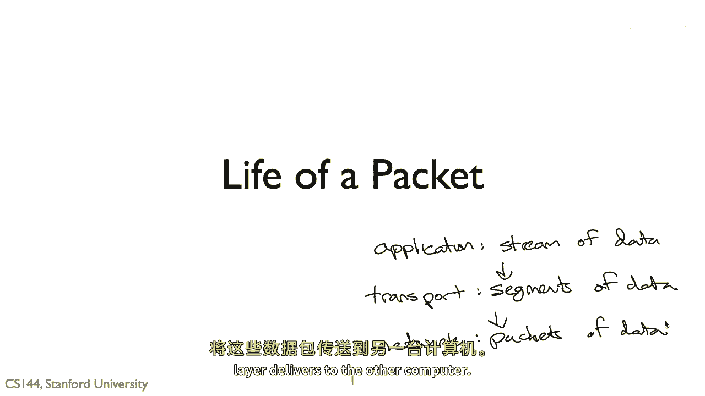
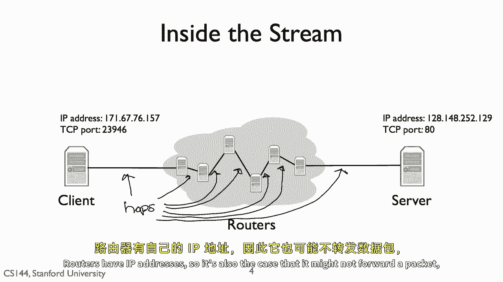
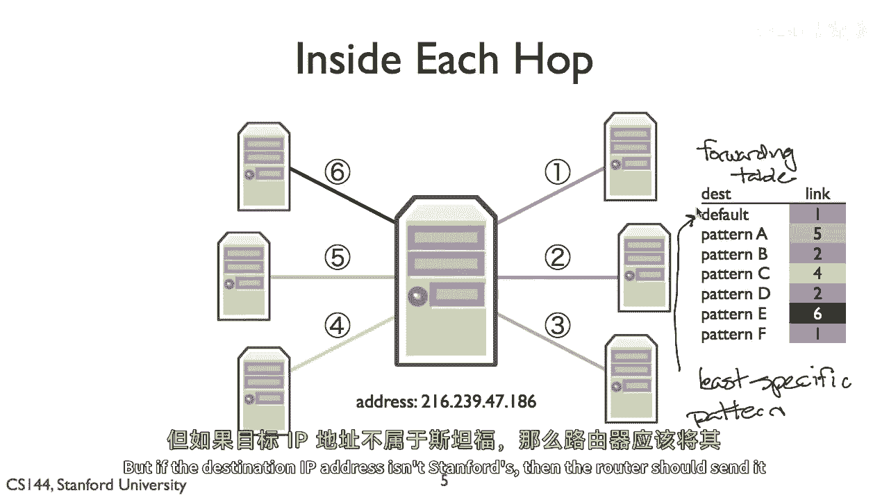
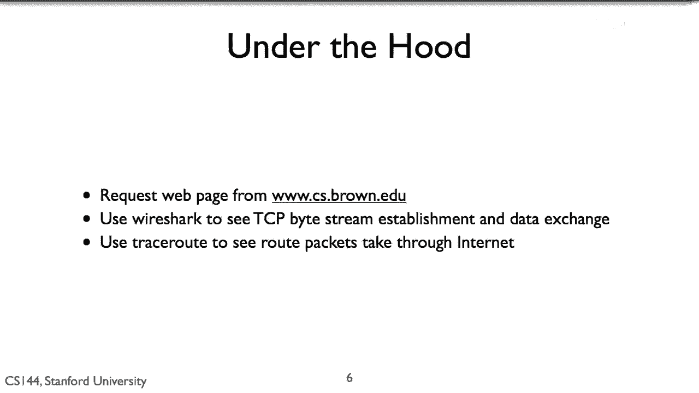
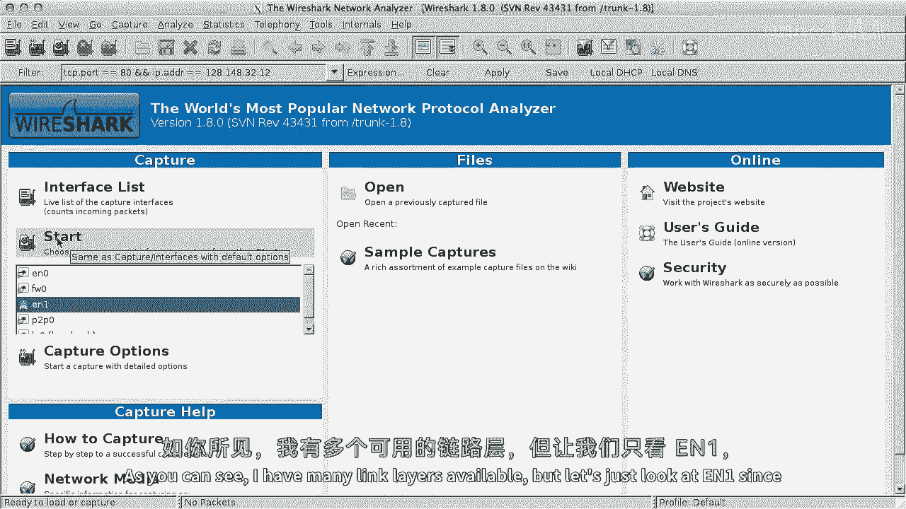
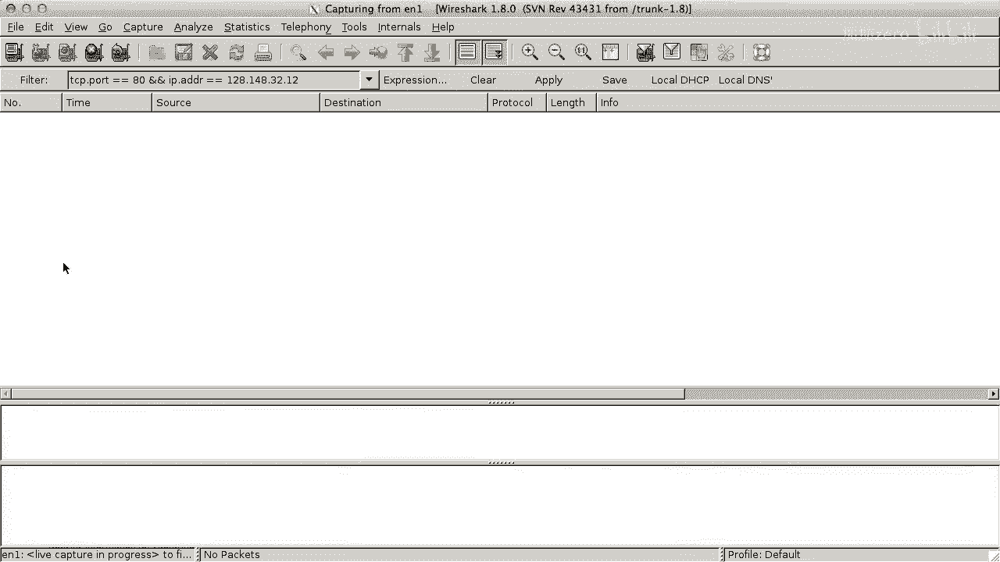
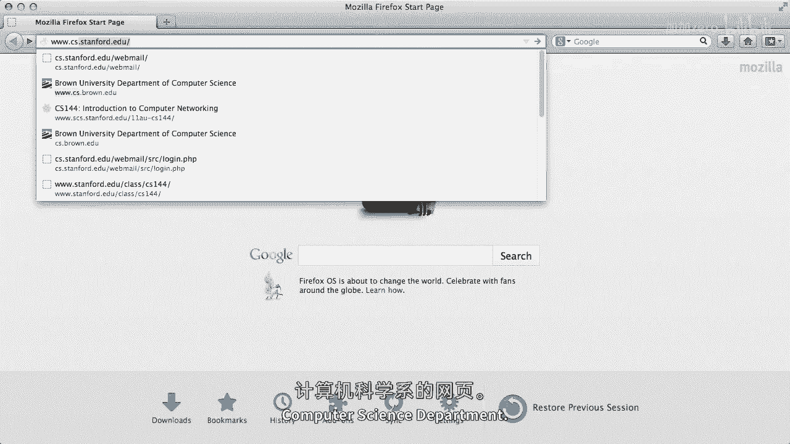
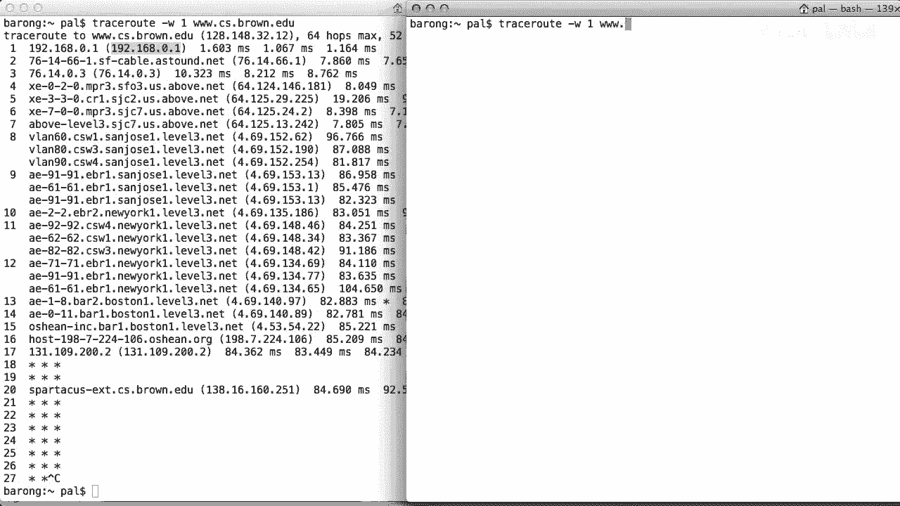

# 课程P5：数据包的一天 📦

在本节课中，我们将学习一个数据包在互联网中从发送到接收的完整旅程。我们将了解互联网四层模型如何协同工作，并观察数据包在实际网络中的传输路径。



---

## 互联网四层模型概述 🌐

上一节我们介绍了课程主题，本节中我们来看看数据包传输的理论基础。

互联网的四层模型从应用层接收一个数据流。传输层将数据流分解为可靠的数据段，并将其送达运行在另一台计算机上的应用。传输层将这些段作为网络层包发送。网络层负责将这些包送达另一台计算机。


---

## 传输层与TCP连接 🤝

上一节我们介绍了网络分层，本节中我们来看看传输层的具体工作。

让我们看看这在实际中的样子：一个Web浏览器和服务器发送和接收的实际包。首先，让我们看看传输层。几乎所有的Web流量都是通过TCP（传输控制协议）传输的。在其典型操作中，有一个客户端和一个服务器。

服务器监听连接请求以打开连接。客户端发出连接请求，服务器对此做出响应。这种交换需要三个消息，被称为“三步握手”。

以下是TCP三步握手的过程：
1.  **SYN**：客户端向服务器发送同步消息。
2.  **SYN-ACK**：服务器响应同步消息，同时也确认了客户端的同步。
3.  **ACK**：客户端响应以确认服务器的消息。

所以常常将三次握手描述为：SYN， SYN-ACK， ACK。

网络层负责将数据包送达计算机。但是，传输层负责将数据送达同一台计算机上的应用程序。这意味着要向另一个程序打开TCP流，我们需要两个地址。

以下是建立TCP连接所需的两个关键地址：
*   **IP地址**：网络层用于将数据包送达计算机的地址。
*   **TCP端口**：告诉计算机软件将数据交付给哪个应用程序（例如，Web服务器通常运行在TCP端口`80`）。



因此，当我们连接到Web服务器时，我们将IP数据包发送到运行Web服务器的计算机（目的地IP地址），并且这些IP数据包内的TCP分段的目的地端口为`80`。

---

## 网络层与路由器转发 🚦

上一节我们了解了如何建立端到端的连接，本节中我们来看看数据包在网络中是如何被转发的。

但那些IP数据包如何到达目的地？我没有直接线路将我的客户端连接到服务器。然而，我的客户端连接到一个中间电脑——一个路由器。这个路由器本身连接到其他路由器。客户端和服务器之间的IP包需要经过多个“跳转”。一个跳转是指路由器之间的连接。

因为我的客户端在一个Wi-Fi网络中，第一个站点（第一个跳转）是无线的，连接到Wi-Fi接入点。接入点通过有线连接到更广泛的互联网。所以，它为我的包开辟了道路。我客户端的数据包沿着这条有线跳点传输。

路由器可以有许多连接到它自身的链路。每当一个数据包到达，路由器将决定将其发送到它的哪个链路上。路由器自身也有IP地址，因此，也有可能它不会转发一个数据包，而是将其交付给它自己的软件（例如，当你登录路由器管理界面时）。




路由器如何做出这个决定？它通过一个被称为“转发表”的东西来实现，如图右所示。

以下是转发表的工作原理：
*   转发表由一组IP地址模式组成，并对每个模式指定一个用于转发的链路。
*   当数据包到达时，路由器检查哪个转发表条目的模式最匹配该数据包的目的IP地址。
*   路由器将数据包沿着该匹配条目指定的链路转发。

一般意味着最具体的匹配最好。但在这个简单的例子中，让我们只考虑“默认路由”（表格上的第一个条目）。默认路由是最不具体的路由，它匹配所有有效的IP地址。如果当一个数据包到达时，没有比默认路由更具体的路由，路由器将使用默认路由。

默认路由在边缘网络中尤其有用。例如，斯坦福大学通过路由器连接到更大的互联网。该路由器会为斯坦福内部的IP地址设置许多具体路由（如发送到工程学校、图书馆）。但是如果目的地IP地址不在斯坦福内部，那么路由器就会使用默认路由，将其发送到更大的互联网。




---

## 实战观察：使用Wireshark抓包 🔍



上一节我们介绍了路由原理，本节中我们通过工具来实际观察数据包的流动。



现在让我们来看看网络中的一些真实IP数据包。我将从 `www.brown.edu` 请求一个网页，并使用一个称为 **Wireshark** 的工具来显示所有数据包。



我们将看到我的Web浏览器如何与布朗大学的Web服务器建立TCP连接（使用SYN-SYN-ACK的三次握手），然后它开始发出HTTP GET请求，服务器对此做出响应。


首先，我会启动Wireshark。因为我的电脑正在使用许多网络应用并发送大量不同的数据包，我会告诉Wireshark只显示到布朗服务器的TCP分段（使用端口`80`），这样我们只会看到我生成的Web流量。我还会告诉Wireshark监听 `en0`（这是我的Mac的Wi-Fi链路层接口名称）。


然后，我会打开网页浏览器并请求布朗大学计算机科学部门的网页。


在Wireshark中，加载此页面涉及发送和接收大量的包。Wireshark显示每个包的时间戳、源IP地址、目的地IP地址、使用的协议及其长度等进一步信息。

让我们看看第一个包：
*   它来自我的电脑（IP: `192.168.0.106`），发往布朗的CS Web服务器（IP: `128.148.32.12`）。
*   它试图连接到TCP端口`80`（服务器的HTTP端口）。
*   从Info列可以看到，这个数据包是 **SYN** 包，即三步握手的第一步。

看前三个数据包：
1.  第一个是从我电脑到Web服务器的 **SYN**。
2.  第二个是从Web服务器回到我电脑的 **SYN-ACK** 响应包。
3.  第三个是从我电脑回到Web服务器的 **ACK** 响应。

这就是TCP三次握手的三个IP数据包。现在，两台电脑可以交换数据。你可以看到，紧接其后的数据包是一个 **HTTP GET请求**。对这个GET请求的响应是多个数据包，Wireshark在接收到足够数据时会将其识别并显示为“HTTP/1.1 200 OK”。


我们可以看到，从我的电脑请求布朗大学计算机科学服务器的网页，需要先通过三个IP数据包完成TCP三次握手，然后使用更多的数据包进行HTTP请求和响应。

---

## 实战观察：使用Traceroute追踪路径 🗺️

上一节我们看到了端点的数据交换，本节中我们来看看数据包在网络内部的路径。

这就是网络从终端（托管计算机）角度看起来的样子，当他们在网络层交换数据包时。但网络层内部看起来什么样子？这些数据包需要经过多少“跳”才能到达？为了看到这个，我将使用第二个工具：**traceroute**。

Traceroute 显示数据包到达目的地所经过的每一跳（路由器）。我们可以输入命令来查看路径。

```
traceroute -w 1 www.cs.brown.edu
```

数据包首先跳转到我的无线路由器（IP: `192.168.0.1`）。从下一个跳点开始，数据包进入我的互联网服务提供商（ISP）的网络。之后，数据包会经过多个位于旧金山、圣何塞等地的路由器。当路径接近目的地时，我们看到了位于波士顿附近的路由器。

在跳转13之后，我们看到三个星号（`*`）。这表示有一个路由器没有回复traceroute的探测包（可能是被配置为不响应）。在跳转20处，我们看到了一个属于布朗大学计算机科学部门的路由器。之后的路径就被隐藏了，因为布朗的内部网络不想对外部可见。




让我们试试追踪到麻省理工学院（MIT）实验室的路径：`traceroute -w 1 www.csail.mit.edu`。

我们可以看到，直到跳转15，数据包都走与去布朗大学相似的路径到波士顿。之后，通往MIT的路径继续在互联网骨干网中传输。最终，从我的计算机发送的数据包在约22跳后到达其Web服务器。观察时间值，往返时间低于90毫秒，非常快。

---

## 总结 📝

本节课中，我们一起学习了一个数据包的完整生命旅程。

我们从应用层的一个Web请求开始，看到了传输层如何通过TCP三次握手建立可靠连接，以及网络层如何利用IP地址和路由器的转发表，让数据包穿越互联网（可能多达20跳）到达目的地。

我们所呈现的一切都是日常网络互动的基础。通过Wireshark和Traceroute这样的简单工具，可以清晰地看到网络原理在实际中的应用，这正是学习网络课程的魅力所在。