# 计算机网络课程 P50：延迟保证示例分析 📊

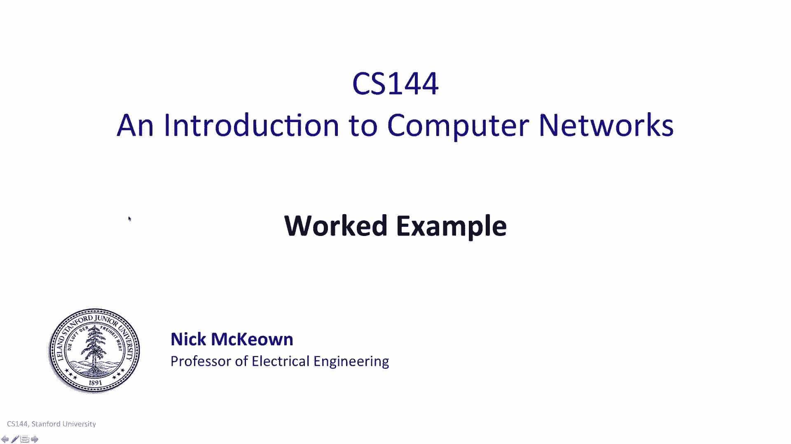

在本节课中，我们将通过一个具体的工作示例，学习如何分析和计算网络中的延迟保证。我们将分解总延迟的各个组成部分，并计算出在特定约束下，路由器所需的队列大小。

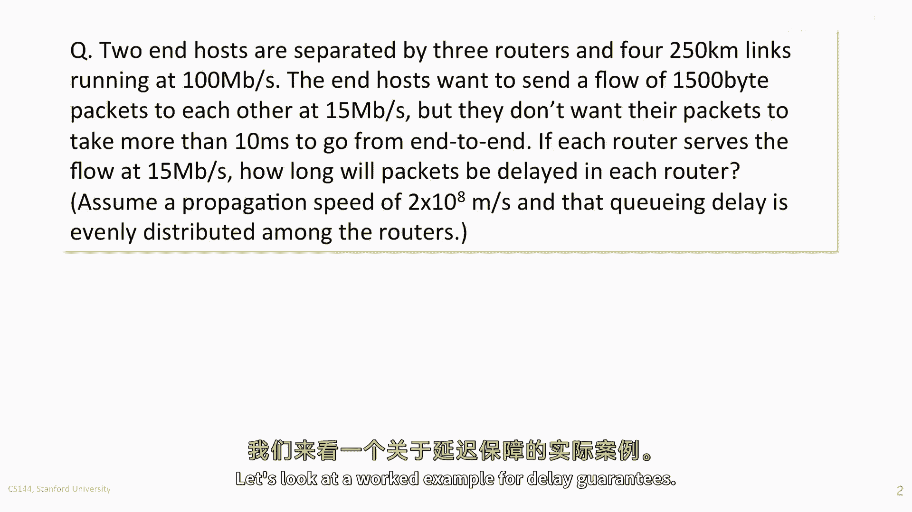

---

## 网络场景概述 🌐

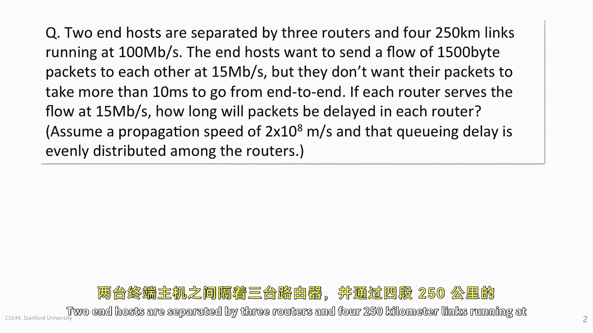

上一节我们介绍了延迟的基本概念，本节中我们来看看一个具体的计算示例。

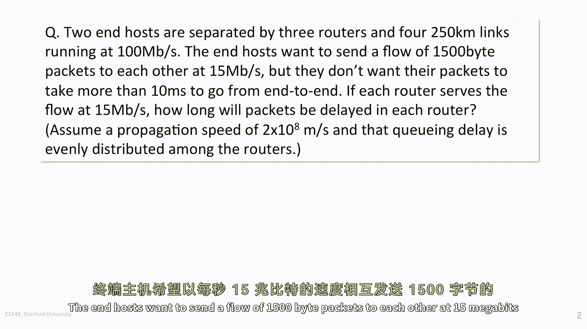

两个端主机被三个路由器分隔开，它们之间通过四条链路连接。以下是该网络场景的具体参数：

*   每条链路的长度为 **250公里**。
*   每条链路的传输速度为 **100 Mbps**。
*   端主机之间相互发送的流量，其数据包长度为 **1500字节**。
*   流量速率为 **15 Mbps**。
*   端主机要求端到端的总延迟不得超过 **10毫秒**。
*   每个路由器以 **15 Mbps** 的速率处理（服务）流量。
*   信号传播速度为 **2亿米/秒**。
*   总队列延迟在三个路由器中均匀分配。

## 延迟分解与计算 ⚙️

网络中的总延迟由固定延迟和队列延迟组成。固定延迟包括数据包化延迟和传播延迟，这两者与网络负载无关。接下来，我们将分别计算它们。

### 计算固定延迟

固定延迟是数据包化延迟与传播延迟的总和。

**1. 计算数据包化延迟**

数据包化延迟是指将一个完整的数据包推送到链路上所需的时间。其计算公式为：

`数据包化延迟 = 数据包大小 / 链路带宽`

对于单条链路：
*   数据包大小 = 1500 字节 × 8 位/字节 = 12,000 位
*   链路带宽 = 100 Mbps = 100 × 10^6 bps

因此，单个链路的传输延迟为：
`12,000 bits / 100,000,000 bps = 0.00012 秒 = 0.12 毫秒`

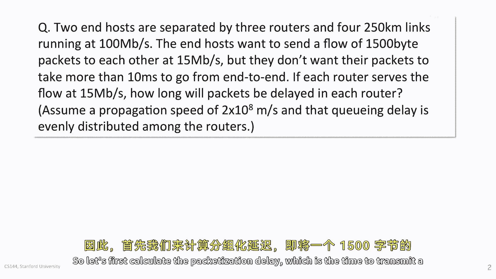

由于数据包需要依次经过全部4条链路，总的数据包化延迟为：
`0.12 毫秒 × 4 = 0.48 毫秒`

**2. 计算传播延迟**

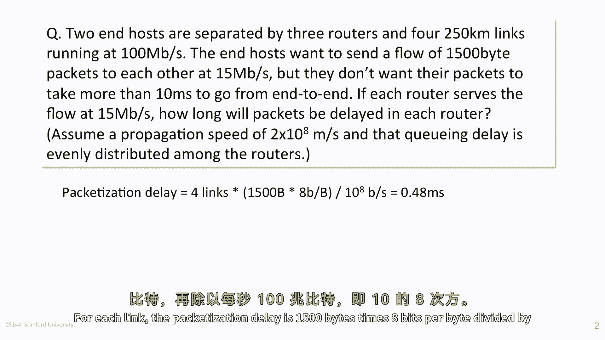

传播延迟是指一个比特在物理链路上传播所需的时间。其计算公式为：

`传播延迟 = 链路长度 / 传播速度`

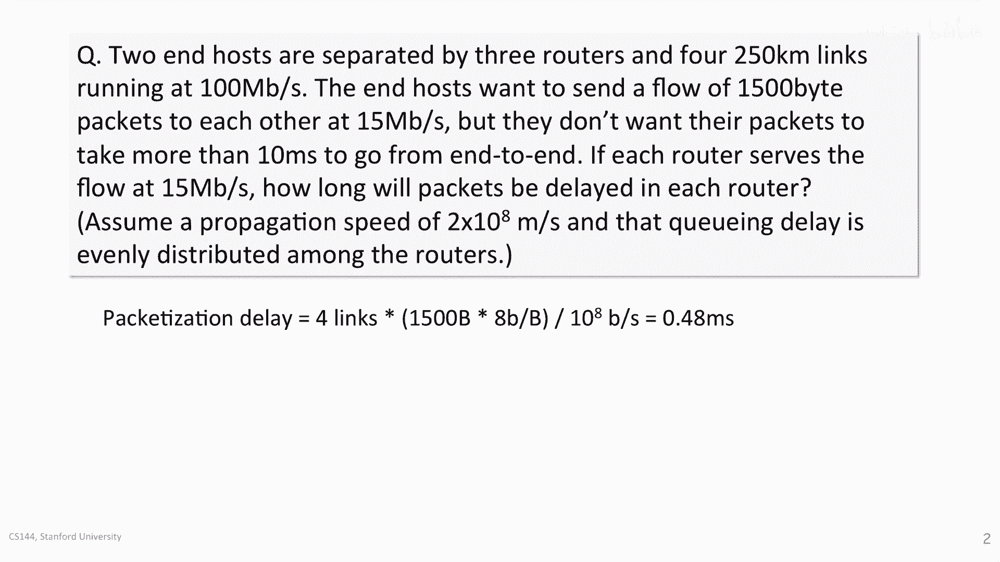

对于单条250公里的链路：
`250 km × 1000 m/km / 200,000,000 m/s = 0.00125 秒 = 1.25 毫秒`

数据需要经过全部4条链路，因此总的传播延迟为：
`1.25 毫秒 × 4 = 5 毫秒`

**3. 总固定延迟**

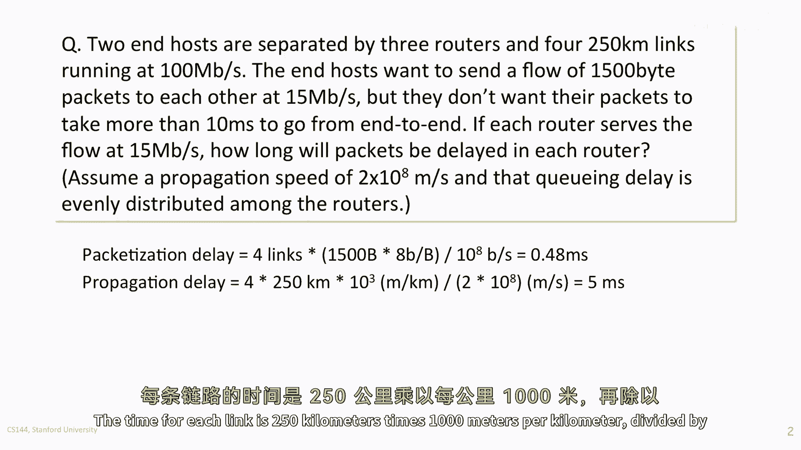

现在，我们可以得出总的固定延迟：
`总固定延迟 = 数据包化延迟 + 传播延迟 = 0.48 毫秒 + 5 毫秒 = 5.48 毫秒`

### 计算队列延迟

队列延迟是数据包在路由器缓冲区中等待被转发的时间。根据题目，总延迟不能超过10毫秒。

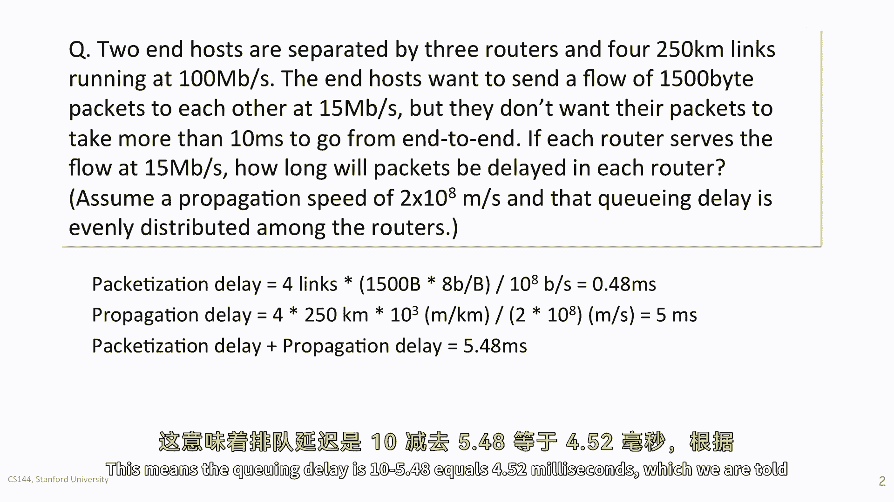

因此，允许的最大队列延迟为：
`最大队列延迟 = 总延迟上限 - 总固定延迟 = 10 毫秒 - 5.48 毫秒 = 4.52 毫秒`

题目假设队列延迟在三个路由器中均匀分配。所以，每个路由器允许的最大队列延迟为：
`每个路由器的队列延迟 = 4.52 毫秒 / 3 ≈ 1.507 毫秒`

## 计算路由器所需缓冲区大小 💾

在上一节我们计算出了每个路由器允许的队列延迟，本节中我们来看看如何根据这个延迟和流量速率，计算出路由器需要的最小缓冲区大小。

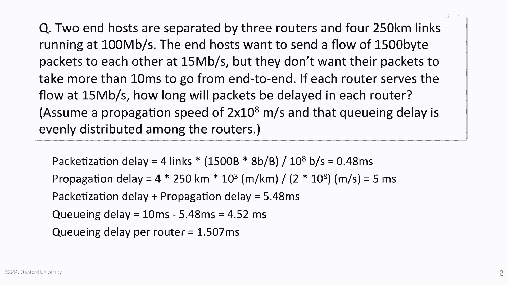

路由器需要存储足够的数据，以应对持续1.507毫秒的流量突发，同时其服务速率为15 Mbps。

所需缓冲区大小的计算公式为：
`缓冲区大小 = 队列延迟 × 服务速率`

代入数值：
`缓冲区大小 = 1.507 × 10^{-3} 秒 × 15 × 10^6 bps`

计算过程：
`1.507 × 10^{-3} × 15 × 10^6 = 1.507 × 15 × 10^3 = 22.605 × 10^3 = 22,605 位`

将位数转换为字节：
`22,605 位 / 8 位/字节 ≈ 2,825.6 字节`

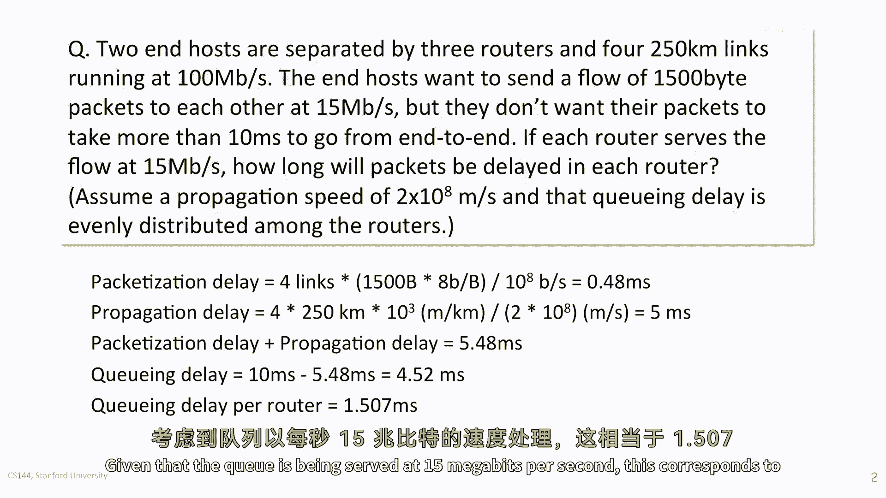

在实际网络设备中，缓冲区通常以数据包为单位进行分配。一个数据包是1500字节，因此，为了容纳约2826字节的数据，路由器至少需要准备 **2个数据包** 的缓冲区空间（即3000字节）。

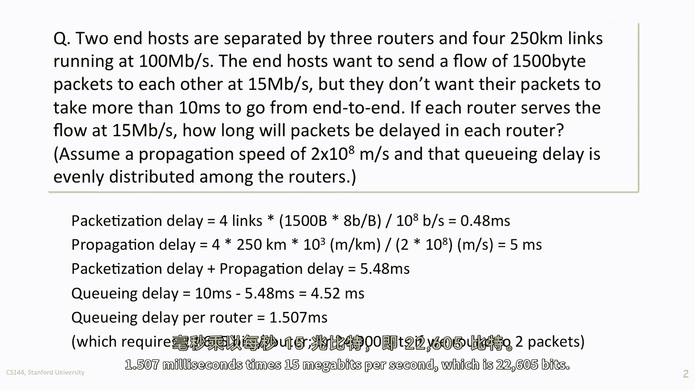

---

## 课程总结 📝

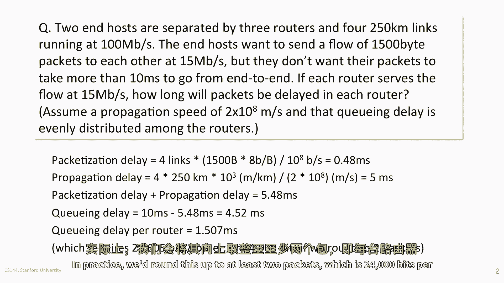

本节课中，我们一起学习了如何对一个具体的网络延迟保证问题进行分析和计算。我们首先将端到端总延迟分解为**数据包化延迟**、**传播延迟**和**队列延迟**。然后，我们逐步计算了固定延迟部分，并根据总延迟约束推导出允许的队列延迟。最后，我们利用队列延迟和服务速率，计算出了路由器所需的最小缓冲区大小。

通过这个例子，你可以掌握分析网络性能指标的基本方法，这对于理解服务质量（QoS）和网络设计至关重要。