# P51：p50 3-11 Packet Switching (recap) - 加加zero - BV1qotgeXE8D

在本单元中，你学习了很多关于分组交换的知识，这是一个紧张的单元。

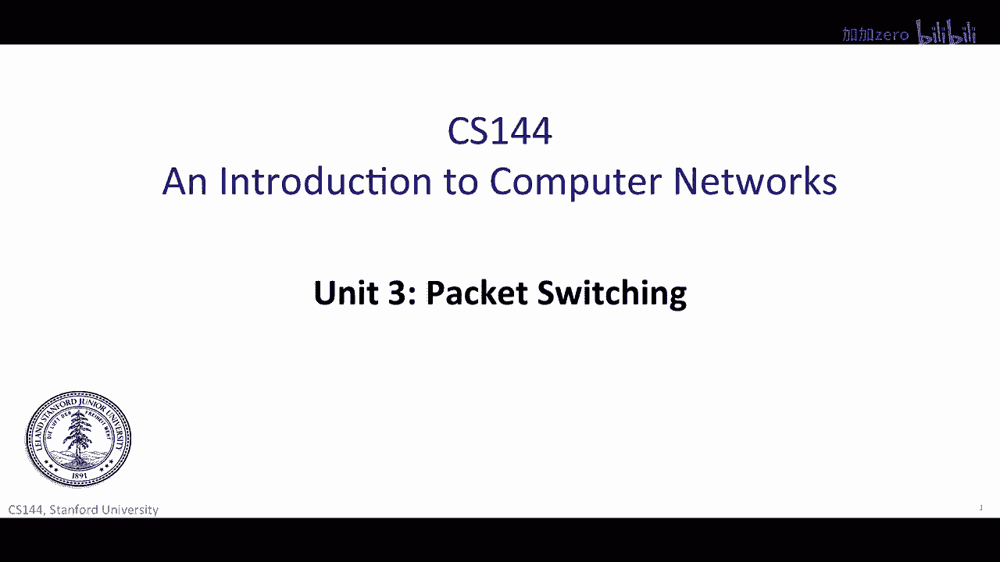

我们从对现代网络为什么，包括互联网是基于分组交换的基础的看起。

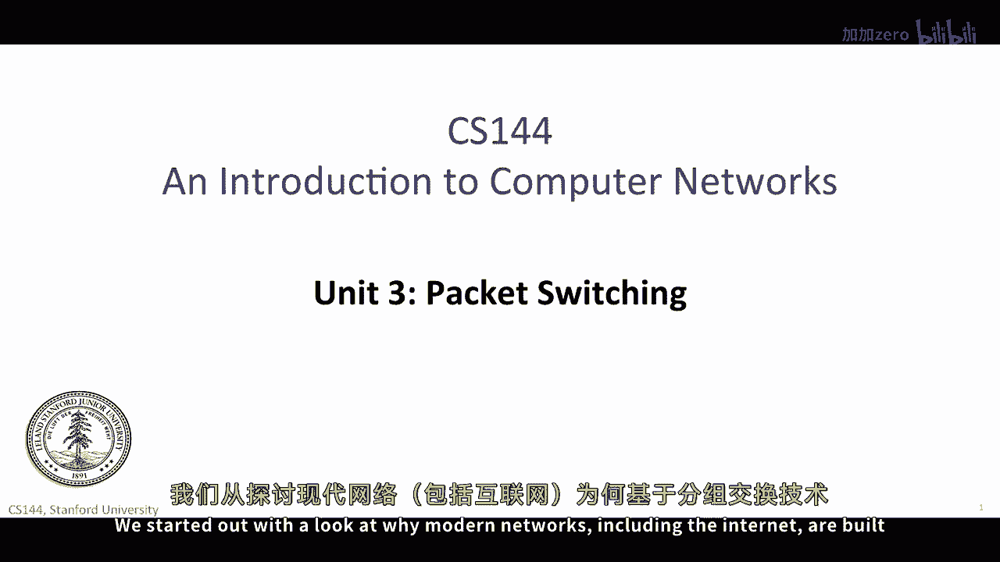

分组交换在理论上简单，因为在分组中，每个分组都是一个包含数据的独立单位。

它携带到达其目的地所需的所有信息。

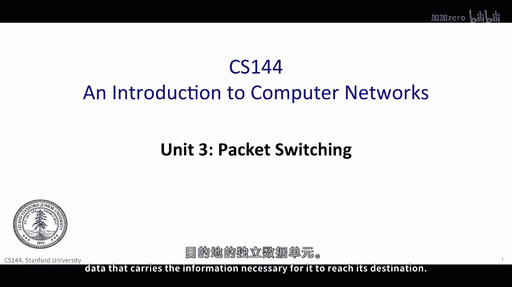

分组交换在效率上高效，因为它保持链路的忙碌。

每当有工作要做时，而不是为达到用户或应用程序保留专用容量。

分组交换有可能帮助网络快速从故障中恢复。

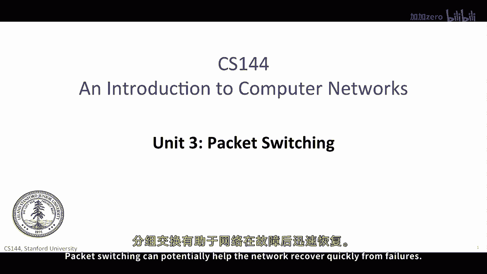

简单的转发范式，每个路由器中没有每个流量的状态。

使它更容易快速地在链路路由器故障后重新路由，我们深入研究了一些分组交换的一些后果，这使我们踏上了一段包括比您看到的数学更多的旅程，在这个课程的任何其他单位中。

分组交换动态，嗯，确定许多互联网的定时和执行特性。

因此，您真的需要对分组动态有很强的理解。

主要的数学思想并不复杂，而且现在掌握它们是值得的。

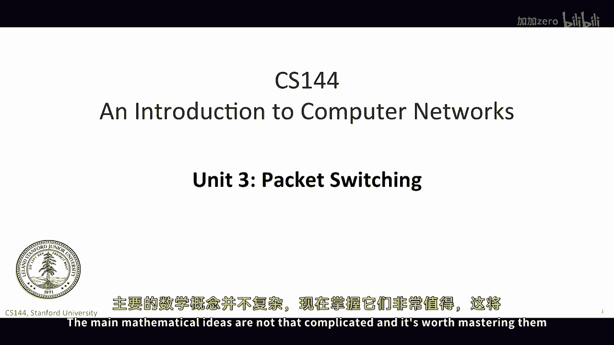

这样你就可以建立强大的直觉，你知道，你现在知道为什么在两个相同的源主机和目的主机之间传输的两个包可能会遇到不同的延迟。

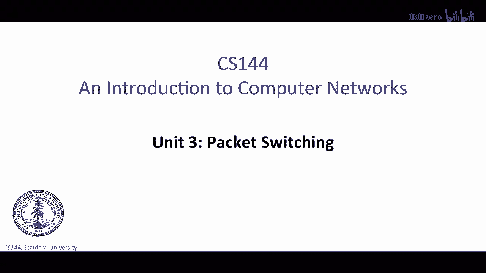

尽管它们在每个链路上花费的时间是一样的，这些包可能走不同的路径并在路由器中经历不同的队列延迟。

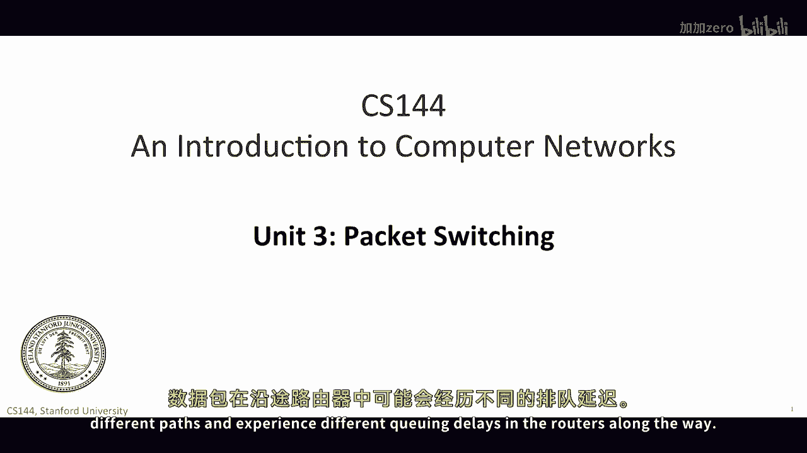

在路上，绝对至关重要，你需要完全理解数据包延迟的主要三个组成部分。

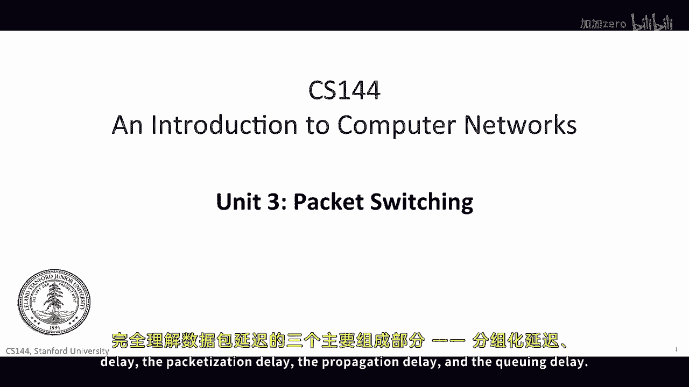

数据包化延迟，传播延迟和队列延迟，并且你理解导致它们的物理过程。

你应该养成草图习惯，并且使用我教给你的简单确定性队列模型。

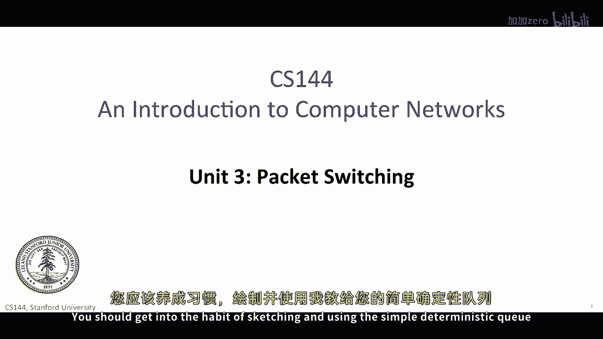

它是一个简单的几何构造，并且它让你可视化正在发生的事情，它告诉我们路由器为什么有缓冲区，并让我们思考它们应该多大，它告诉我们流媒体应用需要播放缓冲区，为了给用户提供平滑的聆听或观看体验。

我们将使用相同的方法，当我们研究流量控制时。

最后我们使用了简单的确定性模型来学习网络如何超越简单的。

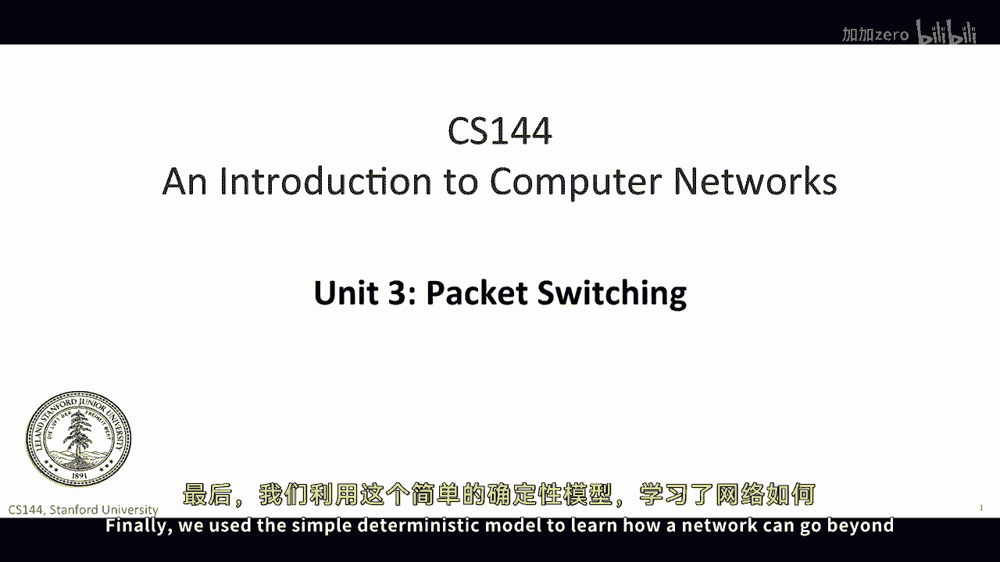

首先来先服务数据包交付。

分组交换网络可以保证每个流接收的速率，甚至限制了数据包从网络一端到另一端的延迟。

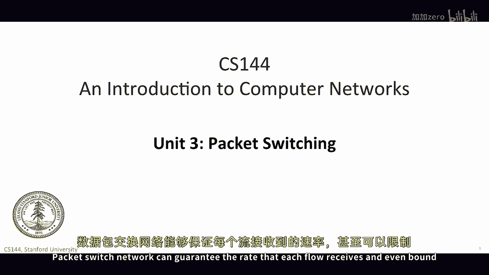

这需要一些仔细的思考。

不要害怕如果需要很长时间才能掌握，嗯，随着他们工作，有，在第一部分有一些困难的概念。

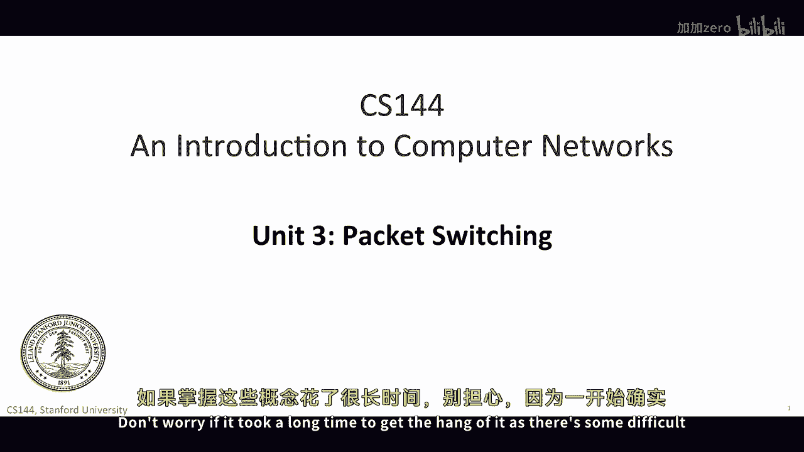

但它们很重要，如果你能理解分组交换网络如何提供速率和延迟保证。

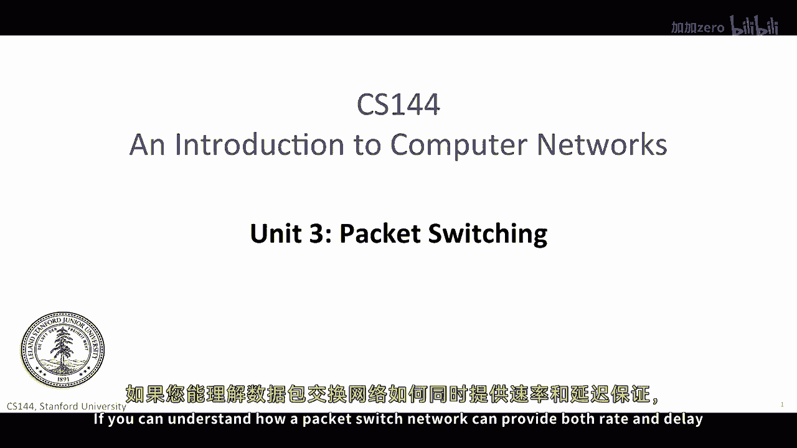

那么你就对分组交换的工作有了深入的理解。

你在这个单元中学到了很多，首先，队列延迟和端到端延迟，你学到的，一个包从源主机到目的主机旅行的时间由三个组件决定，首先，我们必须在每个链路上传输包，反过来，写作所需的时间。

在每个链路上包的大小由写作所需的时间决定，每个位乘以包的位数，我们称这个为打包延迟，秒，位必须通过电缆向下传播，或者通过空气传播到链路的另一端，传播延迟由传播速度决定，这接近光速，并且是位旅行的距离。

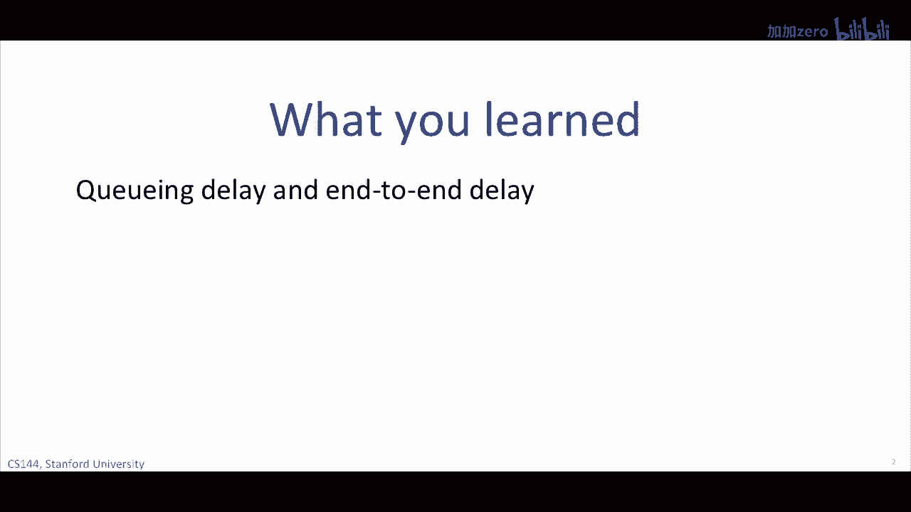

确保你明白传播延迟和分组延迟之间的差异。

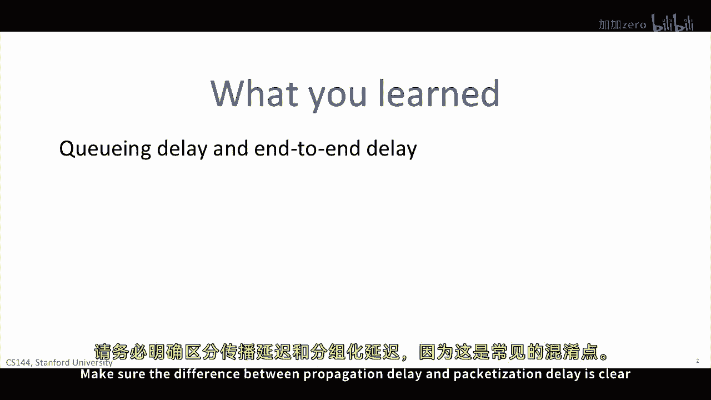

因为它是导致混淆的常见原因，第三，端到端延迟有一个可变的部分，一个队列延迟。

因为互联网使用分组交换，路由器必须具有缓冲器来在交通拥堵时持有包。

因此，队列延迟取决于网络当前有多忙，当我们研究无线，你将看到无线链路增加了延迟的变异性，由于无线链接嘈杂，所以数据包经常需要重新传输，而且它们实际上可以有变化的包分组延迟，实时流媒体应用如skype。

Youtube，和netflix需要向我们的耳朵和眼睛持续提供实时语音和视频，尽管网络在不可预测的时间交付数据包。

所有流媒体应用都使用播放缓冲区来平滑出包延迟的各种变化。

所以他们可以向用户播放视频和音频，而不必暂停和等待中间新的数据。

你学会了如何设计一个播放缓冲区。

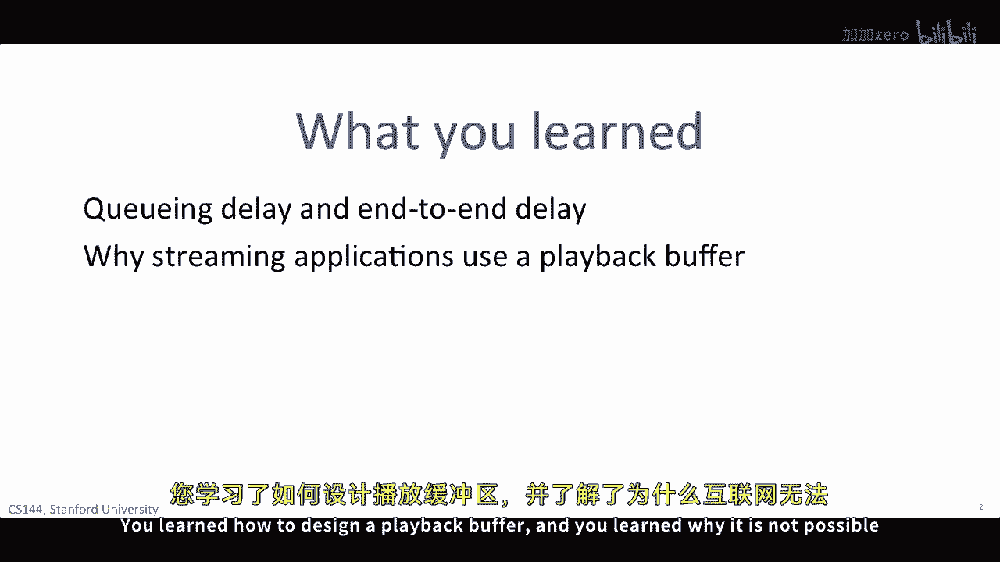

你学会了互联网为什么无法完全避免暂停，在播放包中可以经历较大的延迟，导致播放缓冲区枯竭。

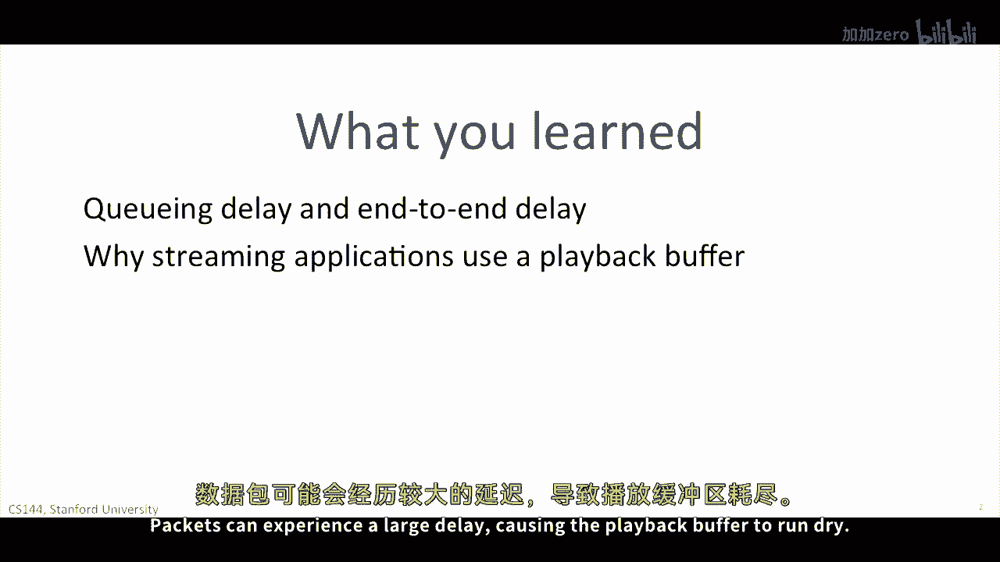

如果你完全理解播放是如何设计的。

那么你对互联网上的包动态有很好的理解，路由器中的排队是一个复杂的主题，单独来看。

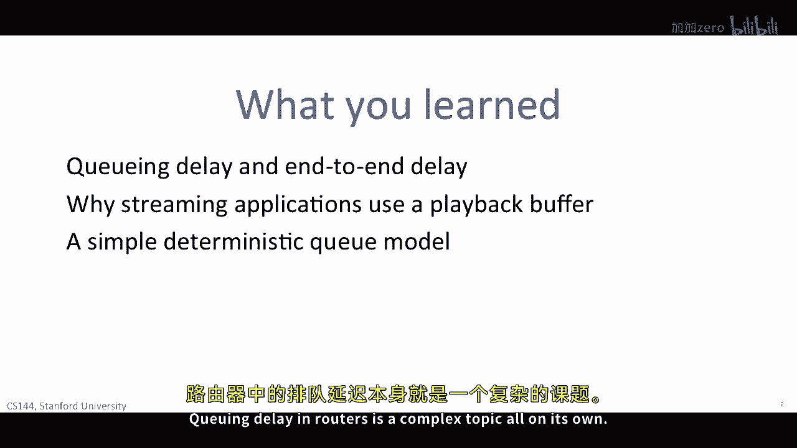

队列理论的少数部分非常数学丰富，你可以通过参加课程和阅读许多书籍来了解这个主题。

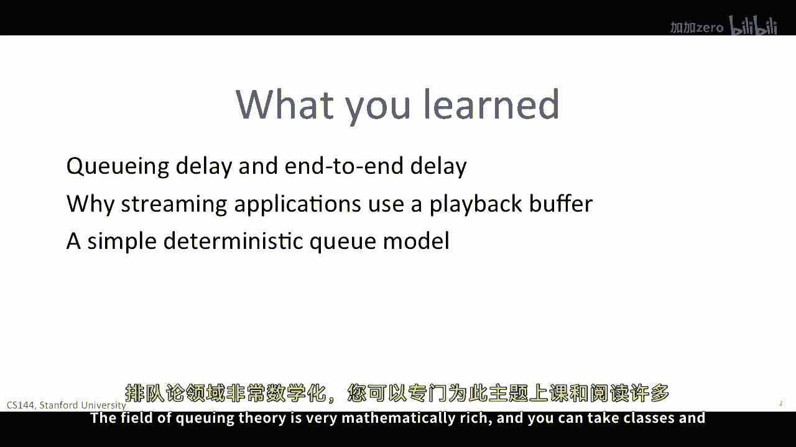

一般来说，复杂随机到达过程的线索是复杂生物的，由一系列路由器队列组成的网络，来自不同应用程序的随机用户的许多计算流是很难理解的，分析封闭形式。

但我们在这里的目标远不如此，我们希望你能够对线索的演变有一些直觉，并熟悉他们的动态，就像机场安检的四句，路由器队列持有已经到达但尚未离开的包，如果我们可以跟踪到达和离开的时间。

那么我们就可以知道队列的深度，以及一个到达的包需要等待的时间。

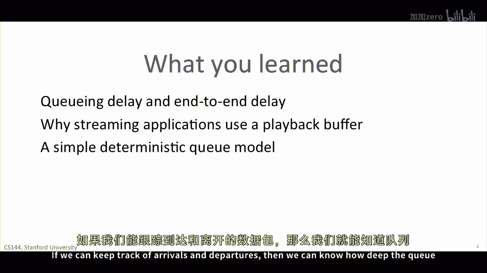

确定性队列模型是对队列中包的几何表示，让我们可视化队列随时间的演变。

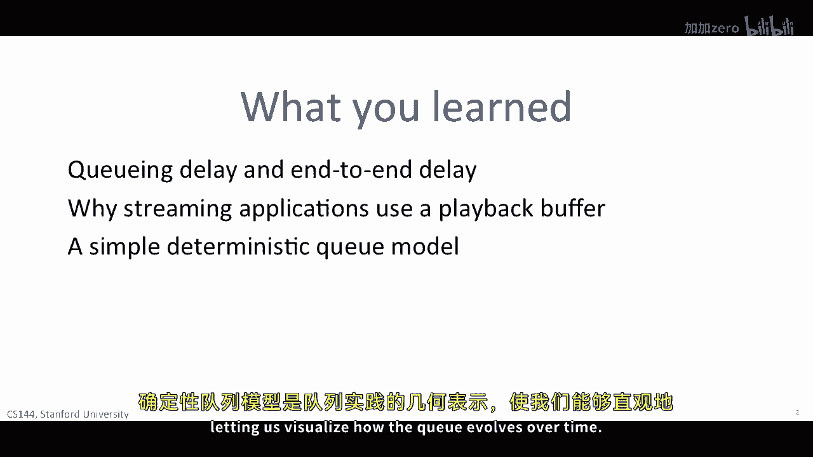

使用几何模型来帮助你建立直觉是很好的习惯。

关于数学如何工作。

确定性q模型帮助我们理解速率保证。

有时候我们想要一个特定的包流接收到一个特定的容量比例。

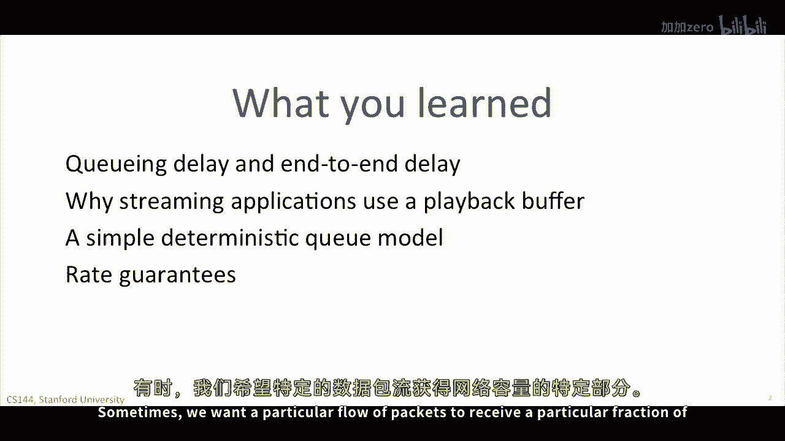

例如，斯坦福可能对att有一个合同，确保其流量。

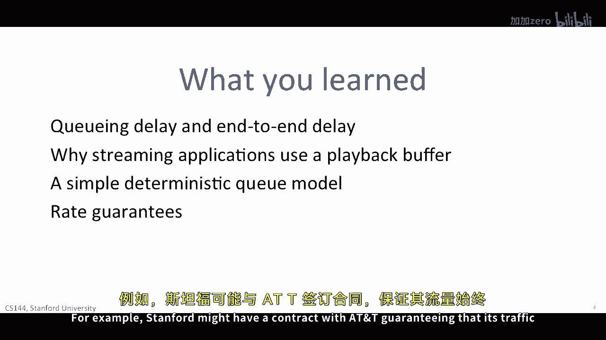

始终能够通过链路接收至少十吉比特每秒的服务，将这个附加到at t，这很容易做到，我们只需将其与一个十吉比特每秒的，链接at t，也可以保证这一点，通过在路由器中将所有斯坦福包放入队列中。

确保他们有十吉比特每秒的服务，这可以在非常聚合的流量中完成。

就像斯坦福的所有包一样，或者在单独的应用程序中完成，我们可能会问康卡斯特，提供至少每秒一兆比特来流媒体我们的Netflix视频，你学会了如何以最小速率服务每个q和a路由器，如果所有包都是相同的长度。

这将是微不足道的，但是不同的包有不同的长度，因此我们需要考虑每个包的长度，这就是加权队列在哪里发挥作用的地方，它告诉我们在路由器队列中如何正确地服务包，以便考虑单个包的长度。

这个想法可以扩展来提供延迟保证。

现在我们知道如何控制队列的服务速度。

我们可以控制包在队列中的最大延迟，它仅仅是队列的长度，除以所有我们需要做的就是限制队列的长度，所以我们可以限制延迟，最后你学会了包是如何交换和转发的，正如你看到的那样。

以太网交换机和互联网路由器的工作方式非常相似，当一个数据包到达。

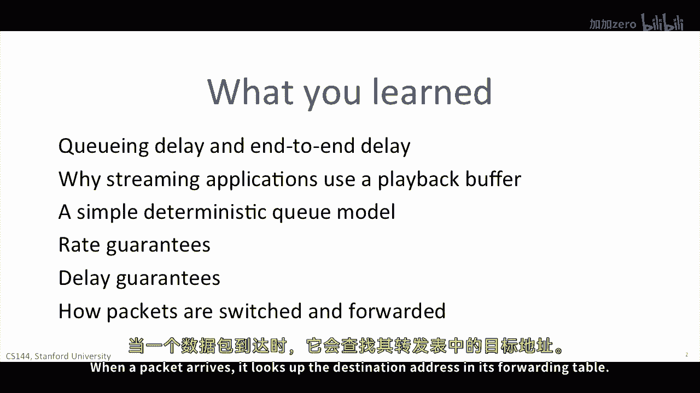

它会在转发表中查找目的地地址，如果找到地址，它将数据包转发到目的地。

并将其存储在缓冲区中，如果出站链路目前正在忙碌，互联网路由器，以太网交换机和互联网路由器在用于地址和如何组织转发表方面有所不同。

以及它们如何组织转发表，并且，当然，互联网路由器会减少ttl字段以防止循环。

但从高层次来看，数据包交换机大致以相同的方式工作。

你在这个单元中学到的东西将帮助你在许多方面。

一是你可以理解网络的描述，链接的速度和长度。

以及数据包的长度，然后你可以计算数据包从源到目的地的固定部分延迟。

你可以通过绘制队列来可视化可变的队列延迟。

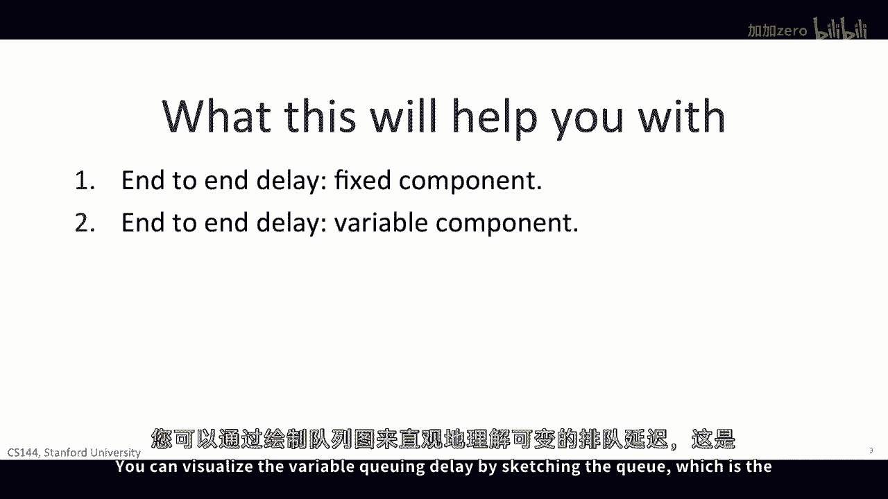

这是网络中可变端到端延迟最常见的原因。

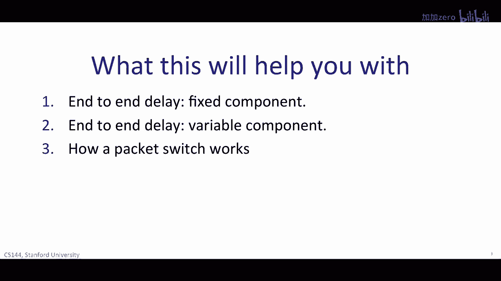

你可以解释数据包交换器的工作原理，例如，以太网交换机或互联网路由器。

你可以设计一个实时应用的播放缓冲区。

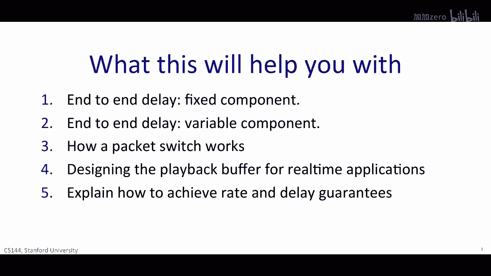

并且你可以解释一个通过数据包交换器的流量如何传输，网络可以以最小速率交付。

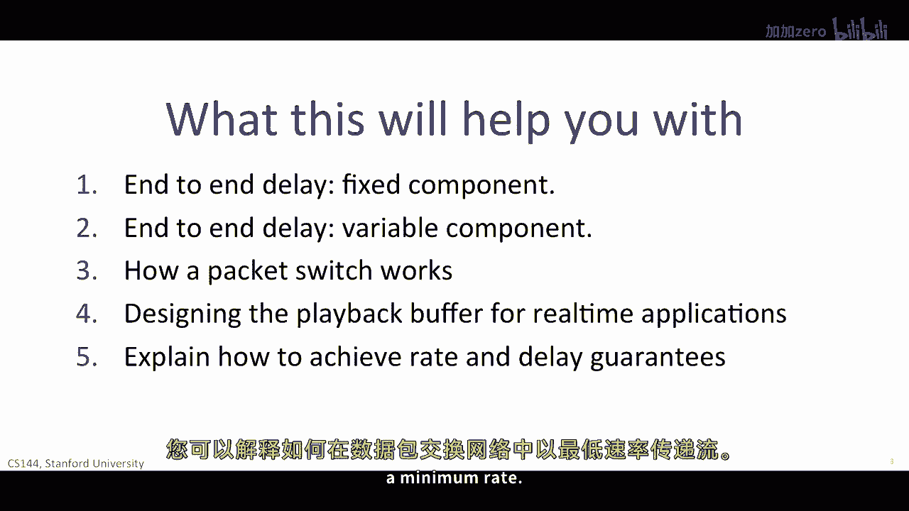

